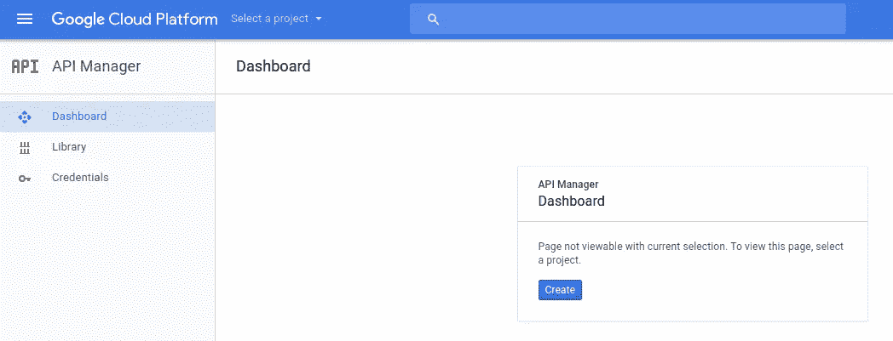
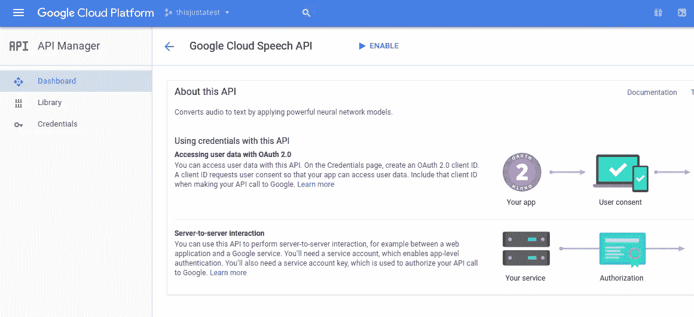
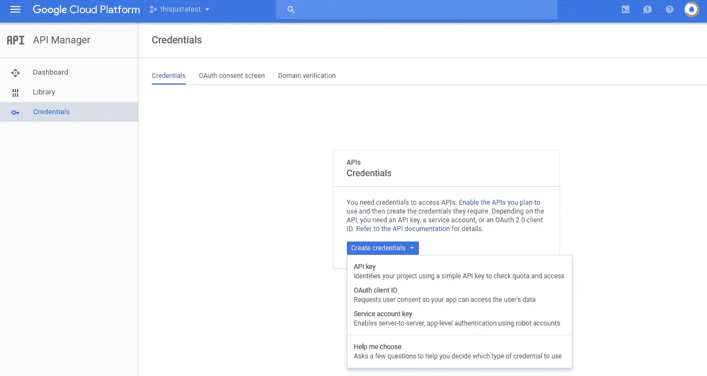
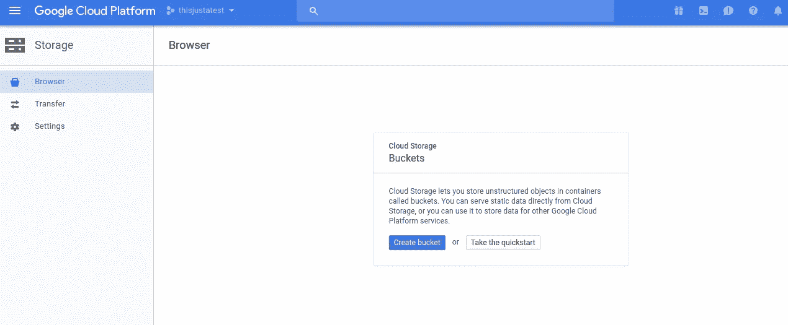
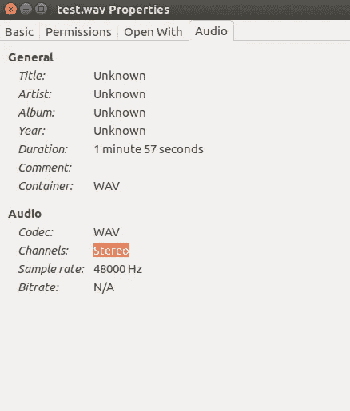
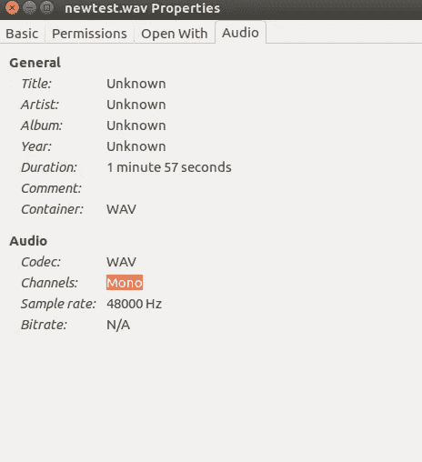
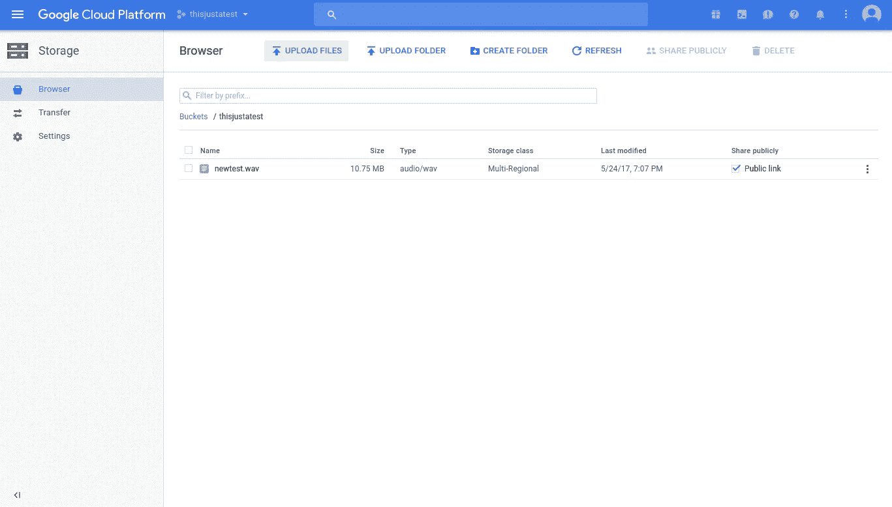
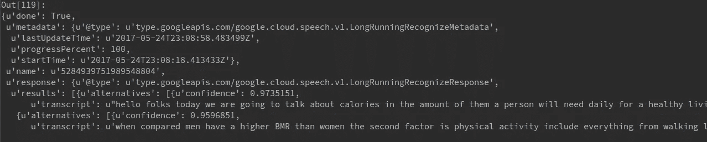

# 教程:Python 中的异步语音识别

> 原文：<https://towardsdatascience.com/tutorial-asynchronous-speech-recognition-in-python-b1215d501c64?source=collection_archive---------0----------------------->

## 一个(相当)简单的技术，用于使用 Google 有点儿有点儿令人困惑的语音识别 API

让我们面对它:它很难与谷歌的机器学习模型竞争。该公司拥有如此多的数据，以至于在准确性和质量方面彻底击败了竞争对手。不幸的是，谷歌在为其 API 提供易于理解和最新的文档方面做得不够好，这使得初级和中级程序员很难入门。

我最近在尝试使用其语音识别 API 转录大约 1，200 条新闻广播时遇到了这个问题。因为 Google 最近改变了它的云 API，所以我在网上找到的很多例子都不是很有帮助。甚至当我更新了[云 SDK](https://cloud.google.com/sdk/docs/) 的时候，我仍然在尝试运行他们的样本代码时遇到了问题。

一种替代方法是使用 [SpeechRecognition 库](https://pypi.python.org/pypi/SpeechRecognition/)，但是据我所知，它只适用于同步请求，同步请求的持续时间被限制在一分钟以内。也许一个更好的程序员可以在使用谷歌的 Python API 的同时找到解决方案，但是你被我卡住了。:)

要完成本教程，您需要以下工具:

*   **Python 2.7**
*   **一个谷歌账户**
*   [**Sox**](http://sox.sourceforge.net/)
*   **一个 wav 文件**(此处下载

## 激活云服务

前往[谷歌云主页](https://cloud.google.com/)并注册免费试用。只要注册，你就可以获得 300 美元的免费积分。

**1)创建一个“项目”来存储你的凭证和账单信息**



**2)启用谷歌语音 API，按照提示激活计费。不要担心，在您升级到付费帐户之前，不会向您收费。**



3)创建一个 API 密匙并保存起来以备后用。



**4)创建一个云存储“桶”。这是我们将要存放我们想要转录的文件的地方。不幸的是，为了使用异步服务，你不得不在谷歌存储器上托管文件。**



## 安装 Sox

下一步是在我们的机器上安装 Sox。Sox 是一个非常容易使用的命令行工具，用于操作音频文件。

如果您使用的是 **Mac** ，您可以通过在终端中运行以下命令来使用 Homebrew 安装 Sox 及其依赖项:

```
brew install sox
```

如果你使用的是 **Ubuntu** ，你可以从终端运行以下命令:

```
sudo apt-get install libasound2-plugins libasound2-python libsox-fmt-all
sudo apt-get install sox
```

## 将音频转换为单声道

现在我们已经安装了 Sox，我们可以开始设置 Python 脚本了。因为 Google 的语音识别 API 只接受单通道音频，我们可能需要使用 Sox 来转换我们的文件。您可以通过查看计算机上的文件属性来进行检查:



如果您的文件已经是单声道的，您可以跳过这一步。如果没有，我们可以使用 Sox 很容易地将其从 Python 转换过来。

*   **1)导入子进程库以访问我们的可执行程序**

```
import subprocess
```

*   **2)编写并运行 Sox 命令来编写一个只有一个通道的新文件。**

```
filename = "test/test.wav"
newfilename = "test/newtest.wav"
command = ['sox', filename, '-c', '1', newfilename] 
subprocess.Popen(command)
```

*   **3)验证我们新转换的文件是否正确。**



## 上传转换后的文件

随着我们的音频转换为单声道，我们需要做的就是将新的音频上传到谷歌存储，然后我们就可以开始我们的 Python 脚本了。虽然这可能是您希望使用 Google Storage API 模块以编程方式完成的事情，但这超出了本教程的范围。

相反，我们将只使用我们之前使用的基于 web 的 GUI。您需要选中“公开共享”选项，如图所示。请记住，这将对整个世界开放，直到您将其从 Google Storage 中删除或更改权限。



**1)导入请求库，用于向 Google 的 API 和 json 库发出请求，以解析响应。**

```
import requests
import json
```

**2)定义我们在发出请求时将使用的 URL。您需要用您之前制作的 API 密钥来填充空白。**

```
url = "https://speech.googleapis.com/v1/speech:longrunningrecognize?key=YOURAPIKEYHERE"
```

3)为我们的 JSON 请求创建参数。这些只是我们可以指定的几个可能的参数。你可以在这里 **查看其他** [**。**](https://cloud.google.com/speech/docs/async-recognize#speech-async-recognize-gcs-protocol)

```
payload = {
    "config": {
      "encoding": "LINEAR16",
      "sample_rate_hertz": 48000,
      "language_code": "en-US" },
    "audio": {
        "uri": "gs://BUCKETNAMEHERE/FILENAMEHERE.wav" }
}
```

发送请求并保存响应。

```
r = requests.post(url, data=json.dumps(payload))
```

**响应应该包括一个数字标记，我们将使用它来访问我们的转录结果。输出将类似于这样:**

```
Out[1]: {u'name': u'5284939751989548804'}
```

我们可以这样保存令牌:

```
json_resp = r.json()
token_resp = json_resp['name']
```

检索结果(你需要等待几秒钟)。

```
url = "https://speech.googleapis.com/v1/operations/" + str(token_resp) + "?key=YOURAPIKEYHERE"
content_response = requests.get(url)
content_json = content_response.json()
```

**输出应该是这样的:**



## 瞧啊。

您已经准备好为自己的项目构建语音识别管道。如果您有任何问题(或更可能的建议)，请不要犹豫，发表评论。