# 教程:R 中的数据争论和映射

> 原文：<https://towardsdatascience.com/tutorial-data-wrangling-and-mapping-in-r-ec828acc8073?source=collection_archive---------2----------------------->

## 揭露了推动布鲁克林中产阶级化的房东

我想我以前说过…但是我喜欢地图。几乎每个人都在使用它们，这使得地图成为一种惊人的即时交流大量数据的方式，而不用担心淹没你的观众。

我最喜欢的处理空间数据的工具之一是 r。除了非常适合处理数据之外，其广泛的用户基础意味着有许多软件包可以使定制地图制作变得超级快速和简单。

本教程旨在提供一个使用 R 操作和映射数据的粗略的端到端示例。目标是创建一幅地图，展示纽约布鲁克林区住宅建筑所有权的集中情况。

除了最近发布的[制图](https://cran.r-project.org/web/packages/cartography/index.html)包之外，我们还将使用来自纽约市 OpenData 门户网站的一些数据集。

要完成本教程，您需要以下工具:

*   [R](https://cran.r-project.org/)
*   [**R Studio**](https://www.rstudio.com/) **或任何其他 IDE**

## 设置环境和下载数据

**1)克隆 GitHub 库**

```
[git clone https://github.com/spnichol/mapping_tutorial.git](https://github.com/spnichol/mapping_tutorial.git)
cd mapping_tutorial
```

**2)创建一个新的 R 脚本并设置你的工作目录**

```
setwd("/home/you/mapping_tutorial")
```

**3)安装软件包并加载前两个数据集**

```
install.packages(c("cartography", "rgdal", "sp"))

#ownership registrations 
owners <- read.csv("data/owners.csv")

#building data 
bldgs <- read.csv("data/bldg.csv")
```

第一个文件是[多处住所登记](https://data.cityofnewyork.us/Housing-Development/Multiple-Dwelling-Registrations/tesw-yqqr)，一个有三个或更多单元的住宅建筑的登记。第二个是[注册联系人](https://data.cityofnewyork.us/Housing-Development/Registration-Contacts/feu5-w2e2)，包含以前文件中与建筑物所有者相关的信息。

# 探索数据

我们这个项目的目标是了解布鲁克林建筑所有权的集中情况。因此，一个自然的起点是所有权文件。

让我们看几个记录来了解一下我们的情况。

```
head(owners)
```

您的输出应该如下所示:

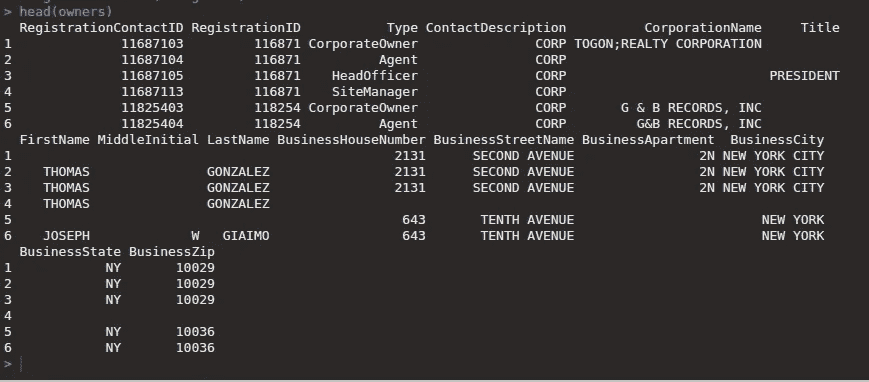

看起来我们有两个 ID 变量: **RegistrationContactID** 和 **RegistrationID** 。第一个是指该行中列出的个人/公司，而第二个是指该个人/实体进行的特定建筑登记。

我们还有 **CorporationName** 栏，可以提供一些关于谁拥有什么的信息。让我们对 **RegistrationContactID** 和 **CorporationName** 使用`aggregate`函数。

```
owner_count <- aggregate(RegistrationID ~ RegistrationContactID, data=owners, FUN=length)
names(owner_count) <- c("RegistrationContactID", "Building_Count")
head(owner_count)
nrow(owner_count[owner_count$Building_Count > 2 ,])
```

您的输出应该如下所示:

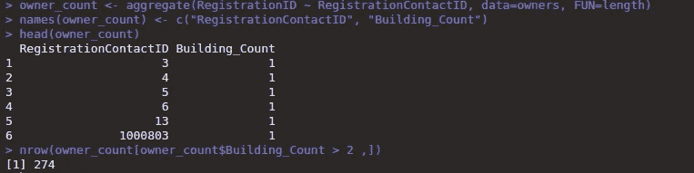

现在，我们有了一个列，其中包含每个唯一的 **RegistrationContactID** 以及与之对应的建筑数量。除了一些看起来很奇怪的 id(只是杂乱的数据)，有点奇怪的是，我们只有 274 个拥有两栋以上建筑的业主。让我们试试**公司名称**。

```
owner_count <- aggregate(org_agg <- aggregate(RegistrationID ~ CorporationName, data=owners, FUN=length)
names(org_agg) <- c("CorporationName", "Building_Count")
head(org_agg)
nrow(org_agg[org_agg$Building_Count > 2 ,])
```

输出:

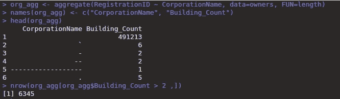

呀。建筑数量要好得多，但这些是一些令人讨厌的错别字。让我们通过删除所有非字母数字字符，然后设置子集以仅保留非空行来修复它们。

```
org_agg$CorporationName<- gsub("[^[:alnum:][:blank:]]", "", org_agg$CorporationName)
org_agg <- org_agg[org_agg$CorporationName !="" ,]
head(org_agg)
nrow(org_agg[org_agg$Building_Count > 2 ,])
```

输出:

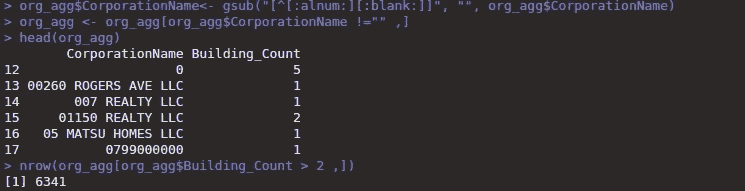

嗯嗯。公司名称看起来好一点，但我仍然不相信拥有两栋以上建筑的业主数量。这个数据集包括整个纽约市。这个城市有很多建筑，有很多房东。会不会是同一个房东或者管理公司用不同的名字/id 登记了不同的楼栋？

如果我们看看他们的邮寄地址呢？让我们假设一个用不同名字注册的房东仍然想只在一个办公室接收他/她的邮件。我们可以通过合并 BusinessHouseNumber 和 BusinessStreetName 列来创建一个新变量，并再次运行我们的聚合。

```
owners$RealID <- paste(owners$BusinessHouseNumber, owners$BusinessStreetName, sep=" ")
real_agg <- aggregate(RegistrationID ~ RealID, data=owners, FUN=length)
names(real_agg) <- c("RealID", "Building_Count")
nrow(real_agg[real_agg$Building_Count > 2 ,])
```

是的——这更有道理。我们不能 100%确定其中的一些实际上不是共享同一个邮件地址的不同房东，但是我认为我们可以假设这不是本教程的情况。

然而，有一个问题。如果您还没有注意到，许多**注册 id**包括多个联系人，每个联系人的**类型**的值都不同。在我们开始过滤它们之前，让我们先了解一下值的范围。

```
summary(owners$Type)
```

这是我们得到的结果:

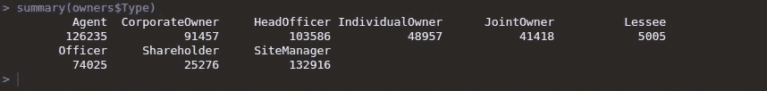

现在我们*可以*对数据帧进行子集化，只保留与所有者相关的角色类型。但这可能会导致一些问题，因为所有者不需要成为这类注册的“联系人”。

相反，让我们删除重复的 **RegistrationID** 并重新运行我们的`aggregate`函数。

```
owners <- owners[! duplicated(owners$RegistrationID) ,]
real_agg <- aggregate(RegistrationID ~ RealID, data=owners, FUN=length)
names(real_agg) <- c("RealID", "Building_Count")
nrow(real_agg[real_agg$Building_Count > 2 ,])
```

看起来，在删除重复的注册 id 后，我们有大约 5000 名拥有两栋以上建筑物的业主。

在我们进入教程的下一步之前，让我们将 Building_Count 列与主 owners 数据帧结合起来。我们可以用一个简单的`merge`来做这件事。

```
owners <- merge(x=owners, y=real_agg, by="RealID")
```

# 组合数据帧

既然我们有了如何定义建筑物所有权的策略，我们需要将最近更新的所有者数据框架与建筑物数据集合并。这将为我们提供教程的制图部分所需的 GIS 信息。

**1)探索建筑数据框架的变量**

```
head(bldgs)
```

我的输出如下所示:

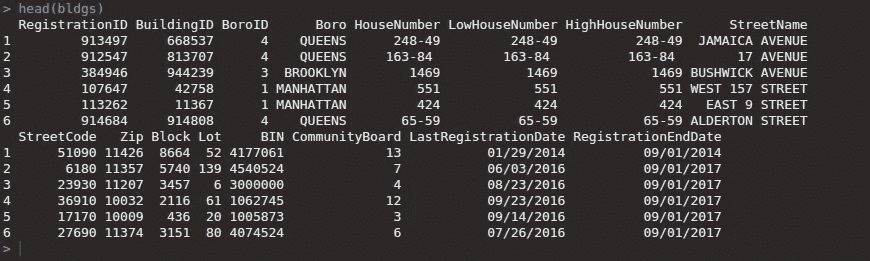

很好，看起来两个数据集共享了**注册 ID** 变量。这意味着该数据帧中的每个条目对应于所有者数据帧中的一个注册 ID。我们可以使用这个列作为`merge`函数的 ID。

**2)注册 ID 合并**

```
bldg_counts<- merge(x=bldgs, y=owners, by="RegistrationID")
```

合并成功了，但是我们丢失了几行。令人恼火的是，事实证明某些类型的属性被允许使用相同的注册 ID，即使它们有不同的地址。这在数据文档中有更详细的解释。

# 探索空间变量

现在是有趣的事情。我们需要弄清楚我们可以使用什么样的 GIS 变量来汇总和绘制这些信息。让我们再来看看我们最近合并的数据框架。

```
bldg_counts<- merge(x=bldgs, y=owners, by="RegistrationID")
```

输出:

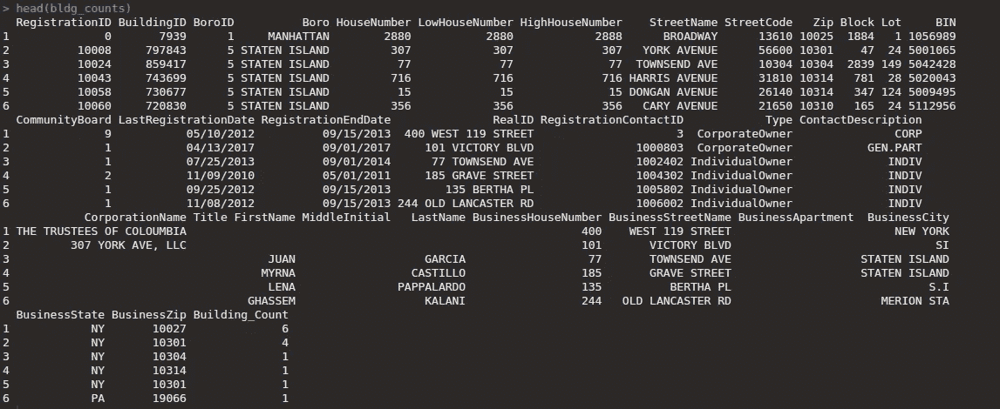

看起来我们有两个地理变量的选择。第一个是建筑物地址，可以通过组合**门牌号**和**街道名称**列得到。然而，为了绘制这些信息，我们必须首先对地址进行地理编码。工作太多。

我们还有**块**和**批次**变量。纽约市的街区编号是唯一的，这意味着我们可以汇总每个街区的建筑数量，因为房东拥有不止一栋建筑。该城市还提供带有块级多边形的形状文件，允许我们绘制数据。然而，布鲁克林有成千上万个街区，每个街区只有少数几栋建筑，所以这可能不会太有意义。

事实上，这些变量中没有一个能提供我们真正需要的。相反，我们来介绍一个新的数据集:冥王星。[冥王星数据集](https://www1.nyc.gov/site/planning/data-maps/open-data/dwn-pluto-mappluto.page)是纽约市建筑统计的圣杯，包括从纬度和经度到财产价值的一切。

**1)读入 PLUTO CSV 文件并探索变量**

```
pluto_bk <- read.csv("data/pluto.csv")
names(pluto_bk)
```

输出:

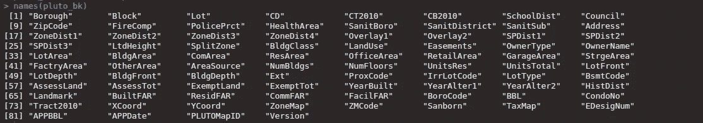

明白我的意思了吗？让我们只保留相关的列。

**2)删除不必要的列**

```
pluto_bk <- pluto_bk[, c(4, 5, 6, 58,71, 73, 74, 75)]
```

我们只剩下以下几列:

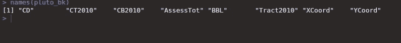

现在我们有很多选择。我选择使用 Census tract，由 CT2010 和 Tract2010 变量以不同的形式表示。这似乎是一个很好的汇总水平，因为布鲁克林大约有 750 个人口普查区。此外，人口普查局提供区域级形状文件，使绘制地图变得轻而易举。

我们需要将这些信息与我们之前创建的建筑列表合并。不幸的是，PLUTO 没有我们之前使用的 RegistrationID 变量。相反，他们使用更常见的 BBL，代表“自治市、街区、地段”

我们的建筑物数据没有 **BBL** 变量，但是我们可以通过组合区、建筑物和地段列来创建一个变量。然而，首先，我们将使用`sprintf`函数填充我们的**块**和**块**变量。

填充向小于特定位数的值添加额外的零。这使得我们最终的 BBL 长度为十位数，而不管组成它的组件的值。

我们还将借此机会对我们的建筑数据框架进行子集划分，仅包括布鲁克林的房产。我们使用`3`的 **BoroID** 来实现这一点。

**3)在建筑物数据框中创建 BBL 变量**

```
#subset dataframe for just Brooklyn 
bldg_counts  <- bldg_counts [bldg_counts $BoroID == 3 ,]#create new columns with padded values 
bldg_counts ["New_Block"] <- lapply(bldg_counts ["Block"], function(x) sprintf("%05d", x))
bldg_counts ["New_Lot"] <- lapply(bldg_counts ["Lot"], function(x) sprintf("%04d", x))#use paste function to combine everything into one variable 
bldg_counts ["BBL"] <- as.numeric(paste(bldg_counts $BoroID, bldg_counts $New_Block, bldg_counts $New_Lot, sep=""))
```

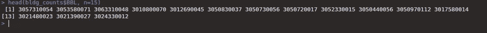

我觉得不错。让我们继续把这个数据帧和冥王星的数据合并。我们想要的只是每栋建筑的普查区域，因此我们可以相应地进行分组。

**4)将区域信息与建筑物数据集合并**

```
names(pluto_bk)
pluto_bk <- pluto_bk[, c(5, 2)]
nrow(bldg_counts)bldg_counts <- merge(x=bldg_counts, y=pluto_bk1, by="BBL")
nrow(bldg_counts)
```

我们丢失了几百行数据，不管是什么原因，它们都不在 PLUTO 数据集中。

关于 **BBL** s 的一个重要旁注:这个值实际上不是唯一的标识符——一些**地段**有不止一个建筑。这没什么大不了的，因为我们需要从冥王星数据帧中提取的只是人口普查区域，这对于位于同一地块上的建筑来说是一样的。

如果我们想要更精确，我们可以通过结合 **BBL** 和每栋建筑的街道号来创建一个唯一的 ID 变量。

**5)按普查地区汇总**

```
#aggregate by census tract 
multiple <- bldg_counts[bldg_counts$Building_Count > 2 ,]
tract_counts <- aggregate(Building_Count ~ CT2010, data=multiple, FUN=length )
names(tract_counts)[1] <- "CTLabel"
nrow(tract_counts)
length(unique(pluto_bk$CT2010))
```

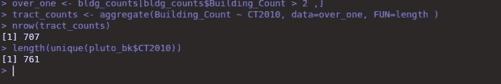

首先映入我眼帘的是，我们丢失了一些人口普查地图。解释很简单。虽然该区总共有 761 块土地，但其中一些要么 1)非常小，要么 2)几乎全部是平房，不需要在该市登记。由于这些地块没有“多层建筑”房东，它们不会出现在汇总列表中。

好吧。我们有每个普查区域的数据框架和“多层建筑”业主拥有的房产数量。数量少得惊人，但话说回来，人口普查区实际上并没有那么大。我们来绘制地图吧！

# 绘图

R 中任何映射项目的第一步都是读入我们的 shapefile。我们将在本教程中使用的 shapefile 来自纽约市规划局。虽然人口普查局通常是 shapefiles 的首选资源，但纽约市规划部的版本已经裁剪了水域，因此更加简洁。

**1)加载形状文件**

```
bk_shape <- readOGR(dsn = "shapefiles", layer = "nyct2010")
head(bk_shape@data)
```

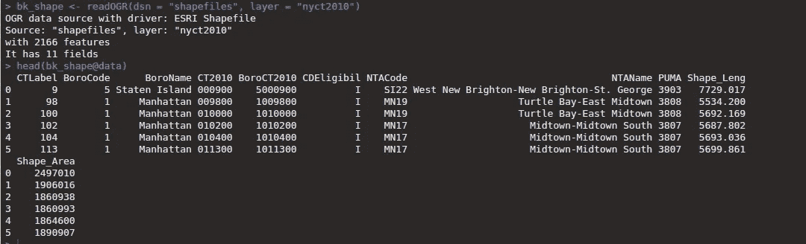

我们可以看到这个 shapefile 实际上有 2166 个不同的人口普查区域，因为它包括了所有的行政区。我们还可以看到，它有数据绑定到多边形，使其成为一个空间多边形数据帧(SPDF)。除了关于面本身的信息之外，该数据还包括人口普查区域标签。我们希望将数据绑定到 SPDF，但首先我们需要解决一些问题。

子集 SPDF
给 R 中的 SPDF 设置子集简单得荒谬。你可以像一个普通的数据帧那样做。

```
#remember "3" is the BoroCode for Brooklyn 
bk_shape <- bk_shape[bk_shape@data$BoroCode == "3" ,]
head(bk_shape@data)
```

**3)将我们的数据与 SPDF** 合并

在 R 中向多边形添加数据也很容易。在这种情况下，我们只需要确保 ID 变量有相同的名称，就可以了。

```
bk_shape <- merge(bk_shape, tract_counts, by="CTLabel")
```

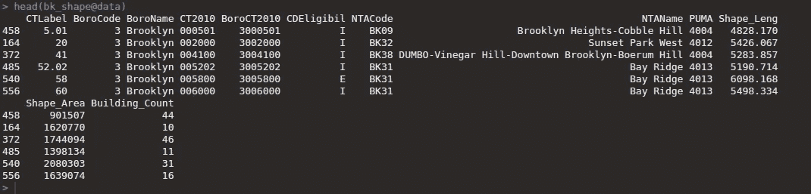

好了，您可以看到，我们现在已经将数据绑定到了 SPDF，并准备好开始绘制地图。

**4)绘制底图**
这就是制图包的用武之地。为了开始绘制我们的地图，我们需要首先绘制地图的“范围”(即它将占据的空间区域)，然后是陆地。

```
plot(bk_shape, border = NA, col = NA, bg = "#A6CAE0")
plot(bk_shape, col  = "#E3DEBF", border=NA, add=TRUE)
```

它应该是这样的:


**5)添加边界线**
现在我们要添加第三层，这将是人口普查区域的边界。

```
plot(bk_shape, col = "grey60",border = "white", lwd=0.4, add=TRUE)
```

现在你应该有这个:


**6)选择调色板**
制图包中有很多漂亮的预制调色板。我选择了简单的绿色，但你可以在第 4 页的这里看看其他的[。我也选择使用 8 种不同的颜色，尽管这总是取决于你所使用的数据的分布。](https://cran.r-project.org/web/packages/cartography/cartography.pdf)

```
cols <- carto.pal(pal1 = "green.pal" ,n1 = 8)
```

**7)添加 choropleth 层**
这个包有很多不同的显示数据的特性，但是我们将坚持使用一个简单的 choropleth 地图。

```
choroLayer(spdf = bk_shape, 
           df = bk_shape@data, 
           var = "Building_Count", 
           breaks = c(0, 10, 30, 50, 70, 90, 110, 150), 
           col = cols, 
           border = "grey40", 
           lwd = 0.5, 
           legend.pos = "left",
           legend.title.txt = "Number of Buildings", 
           legend.values.rnd = 10,
           add = TRUE)
```

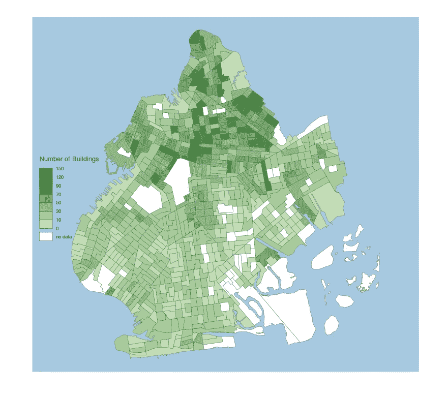

嘣。事实证明这很好，因为这非常符合我多年来与布鲁克林房东打交道的经验。深绿色区域也与经历了最大中产阶级化的区域非常接近。

我为布鲁克林公共图书馆制作的许多地图看起来非常相似，尤其是在观察中产阶级化前后收入和租金的变化时。

添加布局层
我们可以通过创建一个布局层来给地图添加一点元数据。

```
layoutLayer(title = "Census Tracts by Building Ownership Concentration", 
            author = "Pres Nichols",  
            sources = "Source: NYC OpenData", 
            scale = NULL, 
            col = NA, 
            coltitle = "black", 
            frame = FALSE,  
            bg = NA)
```

# 结论

有一个重要的方面我没有考虑到:如果地图上的北部地区，拥有更集中的所有权，只是总共有更多的建筑呢？

如果你正在学习这篇教程，我会让你自己去发现并报告你的发现！

注意:那些不熟悉布鲁克林地理的人可能会对地图上的白色区域有点担心。看起来比实际情况更糟。这是因为最大的白色区域(展望公园、格林伍德公墓和洛克威)实际上没有人居住。如果他们仍然困扰你，你可以随时给无人居住的地区一个不同的颜色。