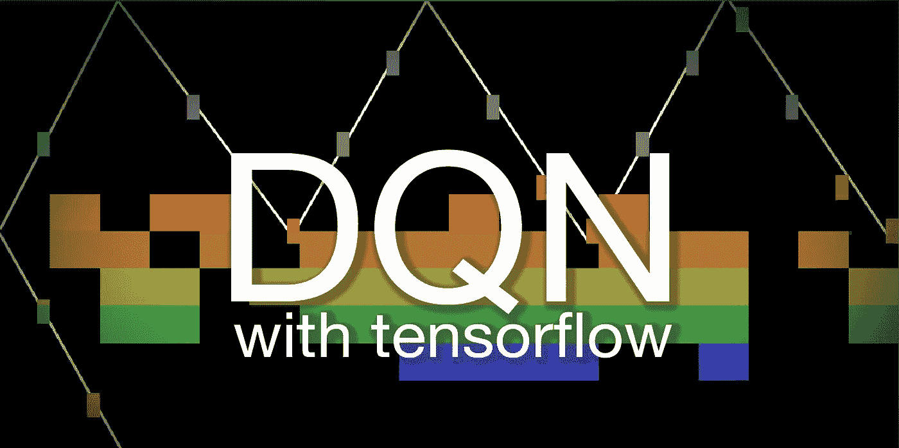
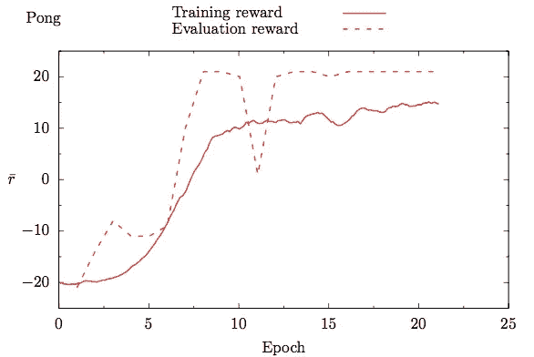
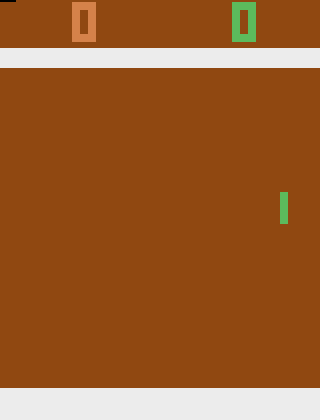
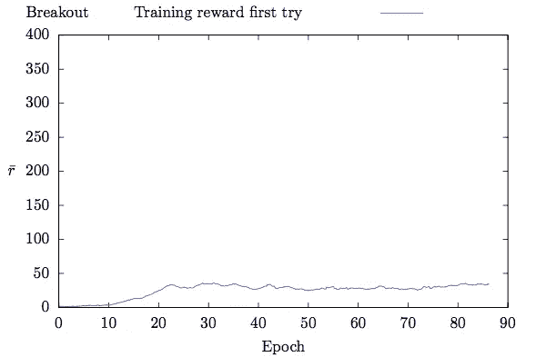
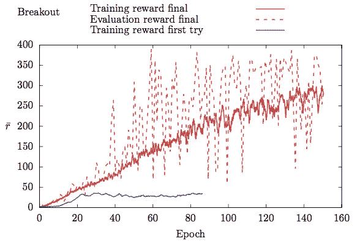
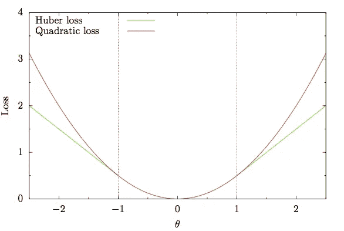
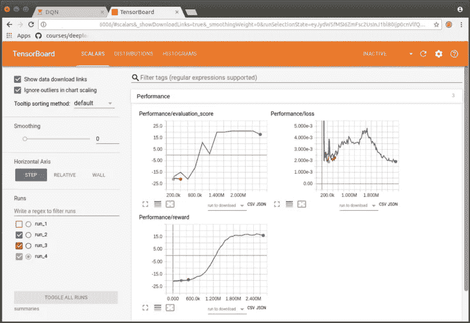
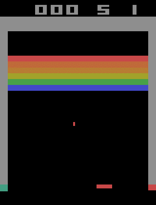

# 如何匹配《突围》中 DeepMind 的深度 Q-Learning 评分

> 原文：<https://towardsdatascience.com/tutorial-double-deep-q-learning-with-dueling-network-architectures-4c1b3fb7f756?source=collection_archive---------0----------------------->

如果你和我一样对深度 Q 学习着迷，但从来没有时间去理解或实现它，这是给你的:在一个 Jupyter 笔记本中，我将 1)简要解释强化学习与监督学习的不同，2)讨论深度 Q 网络(DQN)背后的理论，告诉你在哪里可以找到论文中相应的解释及其含义，以及 3)如何在 python 和 tensorflow 中实现使其工作所需的组件。

2013 年，一家名为 DeepMind 的伦敦初创公司发表了一篇名为[的开创性论文，在 arXiv 上用深度强化学习](https://arxiv.org/abs/1312.5602)玩雅达利:作者提出了一种名为 Deep Q-Learning 的强化学习变体，它能够成功学习不同雅达利 2600 游戏的控制策略，只接收屏幕像素作为输入，并在游戏分数变化时获得奖励。在某些游戏中，代理甚至超越了人类专家玩家！这是一个惊人的结果，因为以前的“人工智能”通常局限于一个单一的游戏，例如国际象棋，而在这种情况下，在街机学习环境中的游戏的类型和内容变化很大，但不需要调整体系结构、学习算法或超参数。

难怪 DeepMind 被谷歌以 5 亿美元收购。该公司自此成为推进深度学习研究的领先机构之一，后来讨论 DQN 的[文章](https://www.nature.com/articles/nature14236/)发表在 *Nature* 上。

现在，五年后，甚至有了更先进的强化学习算法，但在我看来，深度 Q 学习仍然是一种非常令人印象深刻的方法，非常值得研究(更重要的是开始工作)。

我第一次观看 DeepMind 的视频[时，我正在攻读理论天体物理学博士学位的第一年，视频显示一名 DQN 代理人正在学习玩游戏 Breakout，并发现它可以在墙后反弹，从而允许球击中砖块。我很快就被迷住了，并向自己承诺，一旦我有时间，我会努力重现这个结果。](https://www.youtube.com/watch?v=TmPfTpjtdgg)

现在，两年后，我实现了 DQN，学到了很多关于神经网络和强化学习的知识，因此决定写一个有希望的全面教程，介绍如何让它为像我一样着迷于深度学习的其他人工作。

深度 Q 学习需要几个组件来工作，如代理可以探索和学习的环境，Atari 游戏帧的预处理，两个卷积神经网络，探索-开发困境(e-greedy)的答案，更新神经网络参数的规则，错误剪辑和称为重放存储器的缓冲区，过去的游戏转换存储在该缓冲区中，并在学习时从中提取。

我详细描述了各个组件，紧接着是它们的实现。如果您想了解更多信息，请继续阅读笔记本:

 [## fg91/深度 Q 学习

### Deep-Q-Learning - Tensorflow 用决斗网络实现 Deepmind 的双重深度 Q-Learning

github.com](https://github.com/fg91/Deep-Q-Learning/blob/master/DQN.ipynb) 

在这里，我现在将描述我使用笔记本进行的实验，更重要的是我在进行这些实验时发现的小细节，这些小细节被证明对 DQN 的良好工作至关重要:几个线程讨论了与 DeepMind 报告的分数匹配的问题(见[这里](https://github.com/dennybritz/reinforcement-learning/issues/30)、这里[这里](https://groups.google.com/forum/#!topic/deep-q-learning/JV384mQcylo)和[这里](https://eject.com.au/sodeepdude/replicating-the-atari-playing-paper-from-deep-mind/))，我最初也在与类似的问题进行斗争。

## 让我们开始吧:乓

我用环境 [Pong](https://gym.openai.com/envs/Pong-v0/) 开始了我的实验，因为对于一个 DQN 代理来说，学习起来相对容易和快速，因为它很简单:代理控制一个可以上下移动的球拍，目标是以一种对手无法触及的方式击球。一旦一名玩家得分达到 21 分，游戏就结束了。

After 30 minutes of training

笔记本中的实现在每个时期后创建一个 gif，这允许您观察代理学习。我个人从不厌倦看网络的进步，想到人类仅仅通过*看着它们*就知道如何让机器学会玩这些游戏，我感到惊讶。

在训练开始时，DQN 代理只执行随机动作，因此得到大约-20 的奖励(这意味着它无望地输了)。经过 30 到 45 分钟的训练，代理人已经学会了击球，并能够获得第一个分数。

实线示出了训练奖励(在过去 100 集内平均的训练集分数)，虚线示出了评估分数(在 10，000 帧贪婪游戏之后的平均集分数)。一个时期相当于 50，000 次参数更新或 200，000 帧。

Training and evaluation reward for the environment Pong

DQN winning like a boss

评价分数很快达到最大值+21。由于在训练期间使用退火ε的 e-greedy 策略，训练分数保持较低。在左边的 gif 中，所有的分数都以几乎完全相同的方式计分，这意味着代理发现了一个几乎理想的策略。我很想看到两个 DQN 特工学会对战，但目前，OpenAi 的健身房不支持多人 Pong。

## 下一个:突破

让我们来看看 [Breakout](https://gym.openai.com/envs/Breakout-v0/) ，视频中显示的环境最初让我在看到代理人在屏幕旁边挖了一个[隧道，让球通过在墙后反弹击中砖块后，想自己实现 DQN。](https://www.youtube.com/watch?v=TmPfTpjtdgg)

在《自然》杂志论文 [Mnih 等人 2015](https://www.nature.com/articles/nature14236/) 中，DeepMind 报告了《突围》的评估分数为 317。我连夜在笔记本上运行，希望得到类似的结果。在 Pong 取得初步成功后，第二天早上我兴奋地醒来检查代理的改进，却发现奖励在 35 左右达到了一个平台期，没有任何进一步的改进。这里报道了关于 DQN 和突围的同样问题(没有给出问题的最终答案): [DQN 解决方案的结果在大约 35 奖励时达到峰值](https://github.com/dennybritz/reinforcement-learning/issues/30)。

在线课程的问题(这是我非常喜欢的，不要误会我的意思)是，一切都倾向于立即工作，只有当事情没有按计划进行，你需要找出原因时，事情才会变得真正令人兴奋(当然有时也会令人沮丧)。

Breakout, first try

通过降低学习率，我得到的奖励达到了 50 左右，但仍然只有 DeepMind 报告的 15%左右。

在接下来的几个星期里，我继续有时对代码进行改进，通宵或更长时间地进行实验，并逐渐达到接近 300 的训练分数和大约 400 的最高评估分数。

Breakout, first vs last try

[王等 2016](https://arxiv.org/abs/1511.06581) 报道突围得分 418.5(双人)和 345.3(决斗)分(表 2)。我在我的实验过程中看到的最好的评估集的分数是 421(如本文开头所示)。如果您想亲自尝试，可以克隆存储库并运行笔记本。网络的各个参数都包括在内，因为我使用确定性环境(BreakoutDeterministic-v4)训练了 Breakout，所以您应该会得到相同的分数。

## 实现这一改进需要哪些调整？

1.  **使用正确的初始化器**！DQN 使用 Relu 激活函数，右初始值为 [**何等 2015** 方程 10](https://arxiv.org/pdf/1502.01852v1.pdf) ( [点击此处详解](https://www.youtube.com/watch?v=s2coXdufOzE&t=157s))。在 tensorflow 中使用`tf.variance_scaling_initializer`和`scale = 2`。
2.  确保您正在以[正确的频率](https://github.com/spragunr/deep_q_rl/blob/master/deep_q_rl/launcher.py#L155)更新目标网络:论文称，目标网络更新频率*以参数更新*的数量来衡量(每四帧发生一次，参见 [Mnih et al. 2015](https://www.nature.com/articles/nature14236/) 中的扩展数据表 1)，而在 DeepMind 代码中，它以代理看到的动作选择/帧的数量来衡量。我们来看看 DeepMind 的代码:[这里](https://github.com/deepmind/dqn/blob/9d9b1d13a2b491d6ebd4d046740c511c662bbe0f/run_gpu#L31)你可以看到默认情况下`update_freq=4`和`target_q=10000`(第 14 行和第 31 行)。[此处](https://github.com/deepmind/dqn/blob/9d9b1d13a2b491d6ebd4d046740c511c662bbe0f/dqn/NeuralQLearner.lua#L342)可以看到，默认情况下，参数更新每 4 步发生一次(`self.numSteps%self.update_freq==0`)，而[此处](https://github.com/deepmind/dqn/blob/9d9b1d13a2b491d6ebd4d046740c511c662bbe0f/dqn/NeuralQLearner.lua#L356)目标网络每 10.000 步更新一次(`self.numSteps%self.target_q==1`)——因此，目标网络更新频率是在`numSteps`中测量的，而不是在参数更新中测量的。
3.  确保您的代理实际上正在尝试学习与 DeepMind 论文中相同的任务！
    我发现，当一个生命丢失时，将终端状态传递给重放记忆(如 DeepMind 所做的)会产生巨大的差异。这是有道理的，因为失去一条生命没有负面的回报，否则代理人不会“注意到失去一条生命是不好的”。
    DeepMind 在 Breakout 中使用了四个动作的最小集合( [xitari](https://github.com/deepmind/xitari/blob/master/games/supported/Breakout.cpp#L88-L91) )，OpenAi gym 的 Breakout 的几个版本有六个动作。额外的动作可以彻底改变代理试图学习的任务的难度！ *Breakout-v4* 和*Breakout deterministic-v4*环境有四个动作(与`env.unwrapped.get_action_meanings()`核对)。
4.  使用 Huber 损失函数( [Mnih et al. 2013](https://arxiv.org/abs/1312.5602) 称之为误差削波)来避免爆炸梯度。如果超过某个阈值，渐变会被修剪到该阈值。注意，与二次损失函数相比，下图中绿色曲线的导数对于 x > 1(或 x<1)没有增加(或减少)。

Error clipping to avoid exploding gradients

随意玩笔记本。如果你投资 GPU 时间来优化超参数以获得更好的性能，或者如果你尝试在其他游戏中使用它，请在评论中给我写信，我会很高兴知道。

如果你想自己训练网络，在笔记本的第一个单元格中设置`TRAIN`到`True`。

考虑让你的电脑可以远程访问，我在这篇博文中描述了这一点:[远程访问你的深度学习站，并设置局域网唤醒](https://medium.com/@fabiograetz/accessing-your-deep-learning-station-remotely-and-setting-up-wake-on-lan-1e708c50fdd8)。您可以使用`jupyter-nbconvert --to script DQN.ipynb`将笔记本转换为 python 脚本，然后在我在这里描述的 tmux 会话中运行它:[tmux 中的 jupyter 和 tensor board](https://medium.com/@fabiograetz/jupyter-and-tensorboard-in-tmux-5e5d202a4fb6)。这样做的好处是，您可以从 tmux 会话中分离并远程重新连接到它，以便检查代理的进度或对代码进行更改，无论您在哪里。

Summaries in tensorboard

如果你想使用 tensorboard 来监控网络的改进，在激活相应虚拟环境的终端中输入`tensorboard --logdir=summaries`。打开浏览器，进入 [http://localhost:6006](http://localhost:6006/) 。这也可以远程操作。

我发现 DQN 开始工作很费劲。有许多小细节要做好，否则效果不好。除此之外，实验经常不得不通宵运行(至少)，这意味着如果只有一个 GPU，调试和改进会很慢。

尽管如此，在我看来这是值得的，因为我学到了很多关于神经网络和强化学习的知识，特别是通过调试和改进。看看下面的 gif:在某一点上，代理开始直接瞄准两侧挖隧道，并从上面撞上石块——这正是两年前 DeepMind 的视频中引起我注意的东西，也是我想要复制的东西。

Observe how the agent starts to dig a tunnel at the side :)

因此，我鼓励你尝试自己从头实现 DQN，必要时看看我的代码进行比较，找出我是如何实现不同组件的。当你需要澄清或提示时，请随时给我留言，我很乐意帮忙。

玩得开心:)

法比奥（男名）