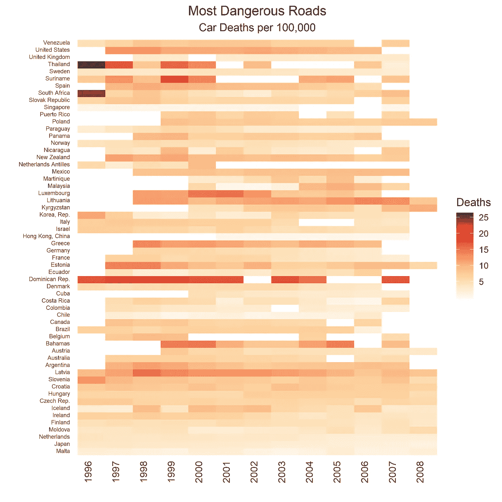

# 教程:泰国的 ggplot2 热图和交通死亡

> 原文：<https://towardsdatascience.com/tutorial-ggplot2-heatmaps-and-traffic-deaths-in-thailand-d5134908d77e?source=collection_archive---------10----------------------->


Photo by [Dan Freeman](https://unsplash.com/@danfreemanphoto?utm_source=medium&utm_medium=referral) on [Unsplash](https://unsplash.com?utm_source=medium&utm_medium=referral)

在本教程中，我们将根据每 100，000 名居民的交通死亡人数，绘制一张驾车最危险国家的热图。我们将使用 R 和 ggplot2 来可视化我们的结果。

## 在泰国开车真的有那么危险吗？

人们常说在泰国开车很危险。任何坐在狭窄的ตุ๊กตุ๊ก后座上的人都会明白我在说什么。交通执法的缺失以及出租车和小型货车司机的疯狂驾驶肯定无助于改善泰国作为一个道路危险国家的形象。但是我们来看看数据是否支持这种印象。

为了进行调查，我们将使用来自世卫组织和欧睿信息咨询公司的数据。如上所述，他们跟踪了 1985 年至 2008 年每 100，000 名居民的道路死亡人数，但对于许多国家来说，某些年份的数据缺失。为了保住泰国，我不得不牺牲，增加了很多缺失的价值观。

顺便说一下，我强烈推荐 Gapminder 组织的创始人写的《T2 真相》一书。不管是谁，让我们言归正传。

## 清理并读入数据

你可以在下面看到很多数据丢失了。

```
library(tidyverse)
library(RColorBrewer)
df **<-** readxl**::**read_xlsx('cars.xlsx')
colnames(df)[1] **<-** 'country'
head(glimpse(df))## Observations: 148
## Variables: 25
## $ country  <chr> "Albania", "Argentina", "Armenia", "Australia", "Aust...
## $ `1985.0` <dbl> NA, NA, NA, NA, NA, NA, NA, NA, NA, NA, NA, NA, NA, N...

## # A tibble: 6 x 25
##   country   `1985.0` `1986.0` `1987.0` `1988.0` `1989.0` `1990.0` `1991.0`
##   <chr>        <dbl>    <dbl>    <dbl>    <dbl>    <dbl>    <dbl>    <dbl>
## 1 Albania         NA       NA       NA       NA       NA       NA       NA
## 2 Argentina       NA       NA       NA       NA       NA       NA       NA
## 3 Armenia         NA       NA       NA       NA       NA       NA       NA
## 4 Australia       NA       NA       NA       NA       NA       NA       NA
## 5 Austria         NA       NA       NA       NA       NA       NA       NA
## 6 Azerbaij~       NA       NA       NA       NA       NA       NA       NA
```

## 哪些数据缺失？

为了找出哪个国家缺少的数据最多，我们可以使用下面的命令来计算每行的 NAs。稍后当我们使用这个专栏过滤热图的结果时，这将会派上用场。如果我们愿意，我们也可以使用百分比缺失阈值。我们暂时保持简单。

```
df **<-** df**%>%**
  mutate(na_count **=** rowSums(**is.na**(.)))
head(cbind(df**$**country, df**$**na_count))##      [,1]         [,2]
## [1,] "Albania"    "23"
## [2,] "Argentina"  "13"
## [3,] "Armenia"    "23"
## [4,] "Australia"  "14"
## [5,] "Austria"    "14"
## [6,] "Azerbaijan" "23"
```

## 为我们的热图创建自定义调色板

让我们使用 colorRampPalette 函数为热图渐变创建 25 个级别的“橙色/红色”。为什么是二十五？我们可以从 glimpse()函数中看到，死亡人数的最高值在十万分之二十五左右。请注意，通常我们只能使用 9 种颜色的“OrRd”调色板，但是 colorRampPalette()允许我们将其扩展到任何数量。如果你做大量的可视化工作，这是一个非常有用的功能。

```
my_pal **<-** colorRampPalette(brewer.pal(11, "OrRd"))(25)## Warning in brewer.pal(11, "OrRd"): n too large, allowed maximum for palette OrRd is 9
## Returning the palette you asked for with that many colorsmy_pal##  [1] "#FFF7EC" "#FEF2E0" "#FEEDD4" "#FEE8C8" "#FDE1BA" "#FDDAAC" "#FDD49E"
##  [8] "#FDCB95" "#FDC38C" "#FDBB84" "#FCAB75" "#FC9C67" "#FC8D59" "#F77F53"
## [15] "#F3724D" "#EF6548" "#E7533A" "#DF412C" "#D7301F" "#CB2014" "#BF100A"
## [22] "#B30000" "#A10000" "#900000" "#7F0000"
```

# 现在我们准备绘制我们的热图

一个关键特征是，我们基本上是对包含少于 18 个 NA 值的国家进行子集划分。还要注意，我们将 scale_fill_gradientn 的颜色参数设置为我们之前创建的自定义颜色渐变。此外，我们设置 na.value='white ',以便绘图与白色背景融为一体。

如果您以前没有制作过热图，请记住，如果您使用 gather()函数将数据帧转换为长格式，效果会更好。

```
df**%>%**
  filter(na_count **<** 18)**%>%**
  select(1, 13**:**25)**%>%**
  gather(**-**country, key**=**'year', value**=**'deaths')**%>%**
  mutate(year **=** as.factor(**as.integer**(year)))**%>%**
  ggplot(aes(reorder(country,deaths), year, fill**=**deaths))**+**
  geom_tile()**+**
  coord_flip()**+**
  scale_fill_gradientn(colors **=** my_pal, na.value **=** 'white')**+**
  theme(plot.subtitle **=** element_text(hjust **=** 0.5), 
    plot.caption **=** element_text(vjust **=** 1), 
    axis.ticks **=** element_line(linetype **=** "blank"), 
    panel.grid.major **=** element_line(colour **=** **NA**, 
        linetype **=** "blank"), panel.grid.minor **=** element_line(linetype **=** "blank"), 
    axis.text **=** element_text(vjust **=** 0.25), 
    axis.text.x **=** element_text(size **=** 10, 
        vjust **=** 0, angle **=** 90),
    axis.text.y **=** element_text(size **=** 6),
    panel.background **=** element_rect(fill **=** **NA**),
    plot.title **=** element_text(hjust **=** 0.5))**+**
    labs(x**=**'', y**=**'', title**=**'Most Dangerous Roads', subtitle**=**'Car Deaths per 100,000',
         fill**=**'Deaths')
```



# 结果:坏的

所以看起来泰国确实是相对危险的驾车之地。1996 年，在这里列出的 58 个国家中，他们的死亡率最高。看起来驾驶在 2000 年代变得更安全了，但有很多数据缺失，所以很难确定。

有趣的是，多米尼加共和国、拉脱维亚、爱沙尼亚、立陶宛、卢森堡和冰岛(在某些年份)在司机安全方面表现不佳。美国和新西兰也做得不太好。我猜冰岛的高死亡率是由于某些年份的恶劣天气。就卢森堡而言，通过谷歌搜索，我发现它确实是欧洲人均交通死亡率最高的国家之一。那里有许多狭窄多风的道路吗？糟糕的司机？天气不好？

# 结果:好

从积极的一面来看，马耳他、新加坡、摩尔多瓦、智利、哥伦比亚、英国、瑞典和厄瓜多尔对司机来说似乎特别安全。

*原载于 2018 年 7 月 29 日*[*https://greenet 09 . github . io*](https://greenet09.github.io/datasophy/2018/07/29/heatmaps.html)*。*