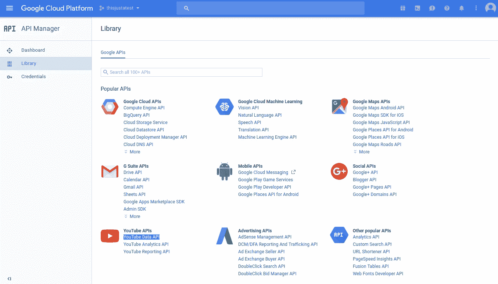
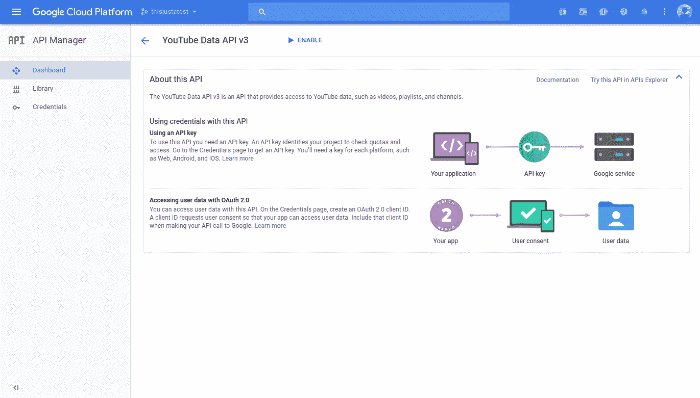
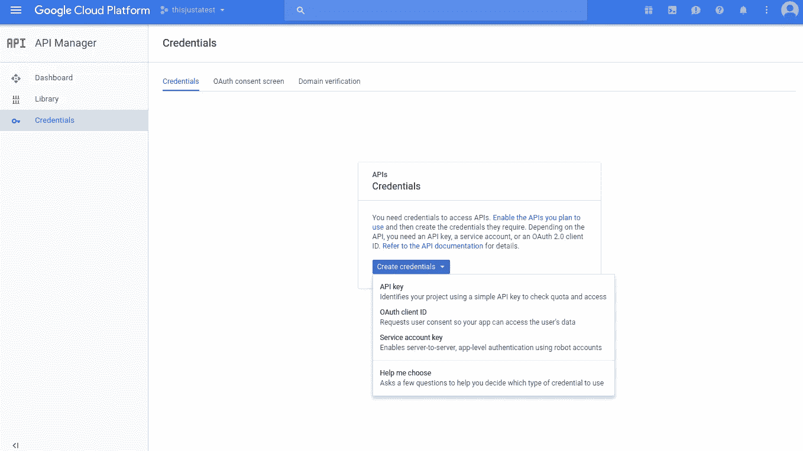
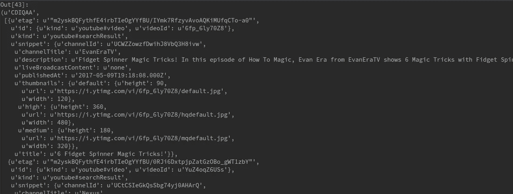
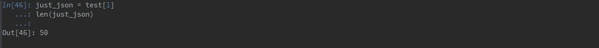
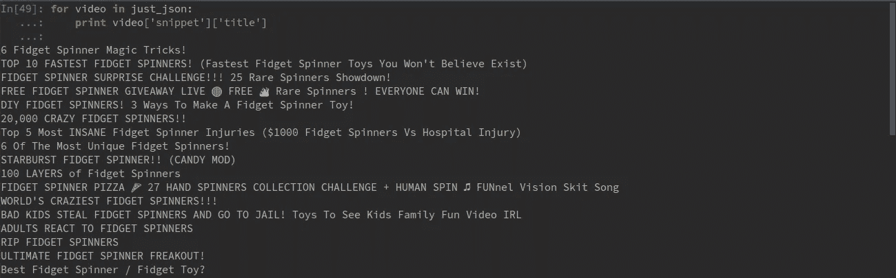
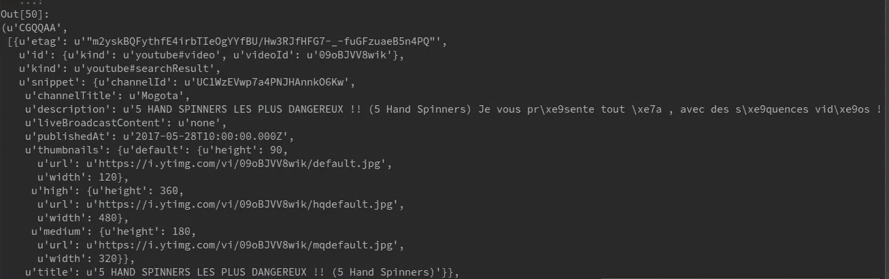
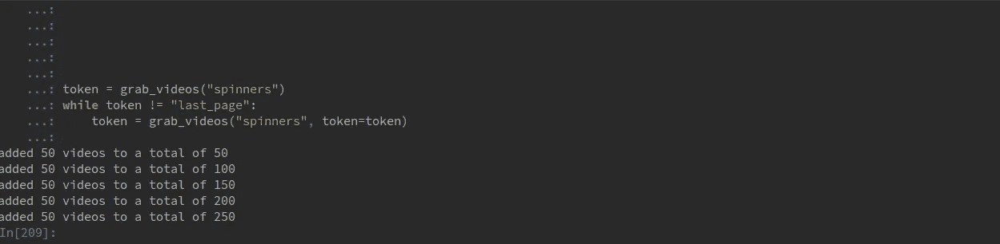

# 第 1 部分:将 YouTube 的 Python API 用于数据科学

> 原文：<https://towardsdatascience.com/tutorial-using-youtubes-annoying-data-api-in-python-part-1-9618beb0e7ea?source=collection_archive---------0----------------------->

## 搜索 YouTube 庞大目录的简单技巧


上周，我写了一篇使用谷歌语音识别 API 的[快速指南](http://truediggs.com/presdev/google_tutorial.html)，我将其描述为“有点-有点-真的令人困惑。”你猜怎么着？他们的 YouTube 数据 API 也不是非常清晰。

如果你是一个有几十年经验的编程专家，你可能现在就可以停止阅读了。然而，如果你是一个中级或自学的程序员(像我一样)，这个指南应该可以帮助你快速使用 YouTube 进行数据科学研究。

出于时间和整体可读性的考虑，我决定将本教程分成多个部分。在第一部分中，除了进行简单的关键字查询之外，我们将重点关注 API 库的安装和认证。

接下来的部分将关注其他类型的任务，比如评论收集、地理查询和使用频道。

要完成本教程，您需要以下工具:

*   **Python 2.7**
*   **一个谷歌账户**

# 入门指南

**1)克隆 GitHub 库**

```
git clone [https://github.com/spnichol/youtube_tutorial.git](https://github.com/spnichol/youtube_tutorial.git)
cd youtube_tutorial
```

**2)安装 YouTube 官方 Python 客户端库**

```
pip install --upgrade google-api-python-client
```

**3)激活 YouTube API**

**注意:**为了完成这一步，您需要创建一个“项目”。如果你不确定如何做到这一点，查看我的[语音识别教程](http://truediggs.com/google_tutorial.html)作为快速指南。

前往[谷歌云控制台](https://console.cloud.google.com/)，点击左上角的汉堡菜单，选择“API 管理器”。


从 YouTube APIs 中选择“YouTube 数据 API”。



单击“启用”



从左侧导航面板中单击“凭据”，然后选择“创建凭据”您需要从下拉列表中选择 **API 键**。您应该会看到一条带有字母数字 API 密钥的消息，上面写着“API 密钥已创建”。复制并保存在一个安全的地方！



Click "Enable"

# 设置我们的 Python 脚本

在代码编辑器中打开 youtube_videos.py。这是 YouTube 的[样本代码](https://developers.google.com/youtube/v3/code_samples/python#search_by_keyword)的大规模修改版本。

将第五行的 **DEVELOPER_KEY** 变量替换为我们之前创建的 API 密钥，并保存文件。

```
DEVELOPER_KEY = "REPLACETHISWITHYOURKEY_GOTIT?" 
```

酷，酷，酷。我们准备开始编写代码来进行关键字查询。继续创建一个新的 python 脚本，并将其保存在相同的目录中。

# 设置我们的 Python 脚本

我们希望能够使用保存 API 密钥的 youtube_search.py 文件中的函数。一种方法是将该目录附加到我们的 Python 路径中。

**1)将目录追加到 Python 路径**

```
import sys
sys.path.append("/home/your_name/youtube_tutorial/")
```

**2)导入** `**youtube_search**` **功能**

既然我们已经设置了路径，我们可以用一个简单的 import 语句从 youtube_videos.py 文件中引入`youtube_search`函数。

```
from youtube_videos.py import youtube_search
```

让我们也导入 **json** 库，因为它在解析 API 的 json 输出时会派上用场。

```
import json
```

太好了。我们已经准备好使用我们的 **youtube_search** 功能来尝试快速关键字搜索。

**4)测试出** `**youtube_search**` **功能。**

假设我们喜欢坐立不安的纺纱工(我们不喜欢)，我们想看看 YouTube 上有什么关于他们的视频。

```
test = youtube_search("spinners")
test
```

您的输出应该如下所示:



我们的`youtube_search`的输出是一个 len = 2 的元组。第一项是一些奇怪的六字符字符串。第二项是一堆 JSON。让我们暂时忽略这个奇怪的六字符字符串，只选择 JSON。

```
just_json = test[1]
len(just_json)
```

现在你应该有这个:



现在我们可以看到我们有一个 len = 50 的 JSON 对象。每个条目都是一个 YouTube 视频，包含该视频的详细信息，如 ID、标题、发布日期、缩略图 URL、持续时间等。

假设我们想要获得一个视频的标题，我们可以很容易地用 JSON 库循环并解析它。

```
for video in just_json:
    print video['snippet']['title']
```

这给了我们:



坐立不安旋转披萨？啊？

好的，继续。现在，我们早些时候发现我们的输出由 50 个不同的视频组成。这很好，当然，关于 spinners 的视频比我想看的要多，但是，这不可能是全部，对吗？

没错。如果我们想要超过 50 个视频，这是我们在一个请求中可以得到的最大值，我们必须要求另一轮 50 个。我们可以通过使用我们前面看到的奇怪的六字符字符串来做到这一点…也称为令牌。

如果我们在下一次请求时发送令牌，YouTube 将知道它停止的位置，并向我们发送接下来的 50 个最相关的结果。让我们试试。

```
token = test[0]
youtube_search("spinners", token=token)
```

现在我们有:



太棒了。五十多个关于纺纱工的视频。另外，如果你注意到了，我们得到了另一个令牌。如果我们想继续下去，我们只需用这个令牌冲洗并重复。

显然这样做真的很糟糕。相反，我们可以编写一个函数来稍微自动化这个过程。

# 自动化流程

1.  实例化一个字典来存储结果

在我们写函数之前，让我们用我们想要保存的变量名实例化一个字典。

```
video_dict = {'youID':[], 'title':[], 'pub_date':[]}
```

**2)定义我们的功能**

我们可以将我们的函数命名为 **grab_videos** ，并添加两个参数。第一个是关键字，第二个是令牌的可选参数。

```
def grab_videos(keyword, token=None):
```

**3)添加** `**youtube_search**` **并保存我们的变量**

就像之前一样，我们将使用`youtube_search`函数进行简单的搜索，并分别保存我们的令牌和 JSON 结果。

```
res = youtube_search(keyword)
token = res[0]
videos = res[1]
```

**4)循环遍历结果，追加到字典&返回标记**

```
for vid in videos:
  video_dict['youID'].append(vid['id']['videoId'])
  video_dict['title'].append(vid['snippet']['title'])
  video_dict['pub_date'].append(vid['snippet']['publishedAt'])
**print** "added " + str(len(videos)) + " videos to a total of " + str(len(video_dict['youID']))return token 
```

我还在这里添加了一个小的 print 语句，用于在每次调用该函数时更新我们收集的视频数量。

最后，我们返回令牌，这样我们可以在下次调用函数时使用它。

**5)用 while 语句调用函数**

既然我们已经编写了函数，我们可以编写几行简短的代码来使它工作。

首先，我们将使用我们的关键字调用函数，将结果保存到变量**令牌**。

然后，我们可以使用 while 语句来检查函数是否返回了一个有效的令牌(即有更多的结果)或者我们是否已经遍历了所有内容。如果它看到“last_page”，就会停止代码的执行。

```
token = grab_videos("spinners")
**while** token != "last_page":
    token = grab_videos("spinners", token=token)
```

输出应该如下所示:



# 结论

好了，现在你至少部分准备好开始在 YouTube 上收集你自己的数据了。

如果这篇文章有帮助，请通过电子邮件或在评论区告诉我。如果没有，我会从事一些其他的爱好！请继续收看第二和第三部分。