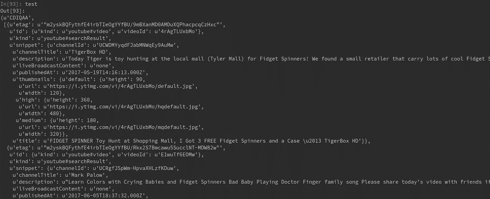
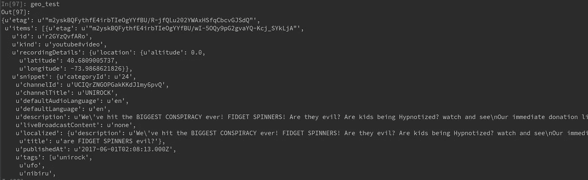
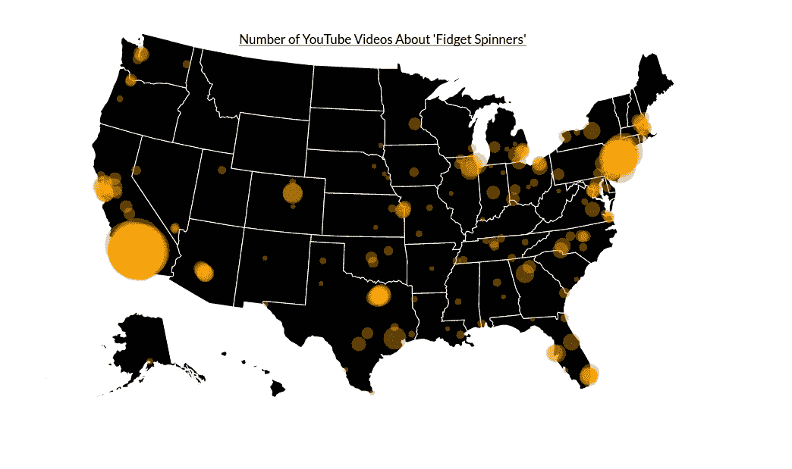

# 第 2 部分:将 YouTube 的 Python API 用于数据科学

> 原文：<https://towardsdatascience.com/tutorial-using-youtubes-python-api-for-data-science-part-2-8905f72b5b1a?source=collection_archive---------3----------------------->

## 执行基于位置的视频查询

在[第 1 部分](https://medium.com/towards-data-science/tutorial-using-youtubes-annoying-data-api-in-python-part-1-9618beb0e7ea)中，我们为 Python 设置了 YouTube API，并学习了如何对视频进行简单的关键字查询。现在，我们想更进一步。

关键字查询对于探索性分析来说是很棒的，但是它们太宽泛了，不能对我们正在研究的主题做出任何有意义的结论。相反，让我们尝试一项新技术:**地理查询**。

## 地理查询

当在数据分析或数据科学中使用任何类型的社交媒体时，我们不仅关注“是什么”——识别有趣现象的存在——还关注“在哪里”——发现我们数据行为的地理差异。

例如，我们在教程的第 1 部分中看到，显然有一个现象需要研究:人们确实录制并上传了关于坐立不安者的 YouTube 视频(可悲的是)。

但是如果有一些我们没有考虑到的地理差异呢？如果美国东海岸的人比西海岸的人更热衷于坐立不安旋转者的粉丝会怎么样？

使用 YouTube API 的 location-radius 查询参数，我们可以很容易地研究这个研究问题。这是一个*附加的*查询，将返回与我们指定的参数相匹配的视频的纬度和经度。

然而，在我们开始之前，指出位置半径参数的一个主要缺点是很重要的:不是所有的 YouTube 视频都有位置信息。事实上，我敢说大多数人都不知道——这是一个可选功能，用户可以选择激活它。

记住这一点，让我们开始吧！

**1)克隆 GitHub 库**

```
git clone [https://github.com/spnichol/youtube_tutorial.git](https://github.com/spnichol/youtube_tutorial.git)
cd mapping_tutorial
```

如果您已经完成了本教程的前一部分，您可以跳过这一步，只需将新代码添加到现有文件中。

**2)修改** `**youtube_search**` **功能**

为了执行基于位置的搜索，我们需要向位于 **youtube_videos.py** 文件中的`youtube_search`函数添加一些额外的参数。这些参数是**位置**和**位置-半径**。

**位置**参数是我们半径中心的纬度和经度，作为字符串传递。例如，如果我们想要搜索位于纽约市 25 公里范围内的 spinners 的视频，那么**位置**参数的值将是“40.730610，-73.935242”。

**位置-半径**参数，正如你可能已经猜到的，是半径的大小，以英里或公里为单位(最大为 1000 公里)。在上面的例子中，传递给这个参数的值应该是“25km”。

首先，让我们将这些作为可选参数添加到`youtube_search`函数中。

```
def youtube_search(q, max_results=50, order="relevance", token=None, location=None, location_radius=None):
```

现在我们可以将参数添加到包含在 YouTube Python 库中的`youtube.search().list()`方法中。

```
def youtube_search(q, max_results=50, order="relevance", token=None, location=None, location_radius=None):
  search_response = youtube.search().list(
    q=q,
    type="video",
    pageToken=token,
    order = order,
    part="id,snippet",
    maxResults=max_results,
   ** location=location,
    locationRadius=location_radius**

  ).execute()
```

不幸的是，将这些参数添加到函数中实际上不会给我们提供位置信息。它只保证`youtube_search`函数返回的视频落在我们指定的半径范围内。烦人…我知道。

**3)创建** `**geo_query**` **功能**

为了得到好东西，我们需要使用*另一个*T4，但是这次我们将为`part`参数传递**记录详细信息**和**统计信息**。我们还需要运行我们的`build`函数，让 API 知道我们是谁。

为了简单起见，让我们用一个叫做`geo_query`的独立函数来做这件事。

```
def geo_query(video_id):
    youtube = build(YOUTUBE_API_SERVICE_NAME, YOUTUBE_API_VERSION, developerKey=DEVELOPER_KEY)

    video_response = youtube.videos().list(
        id=video_id,
        part='snippet, recordingDetails, statistics'

    ).execute()

    return video_response
```

要运行这个函数，我们向它传递一个视频 ID，它应该返回视频的纬度和经度，以及关于文件的其他有用的详细信息。让我们试一试。

**4)测试我们的** `**geo_query**` **功能**

继续创建一个新的 Python 文件，我们将在其中编写本教程的其余代码。

我们可以从导入我们的库开始，设置工作目录并测试我们对`youtube_search`函数所做的修改。

让我们执行我在上面使用的纽约市示例查询。

```
import sys
sys.path.append('/home/you/youtube_tutorial/')
from youtube_videos import youtube_search
import pandas as pd
import json

test = youtube_search("spinners", location="40.730610, -73.935242", location_radius="50km")
```

您的输出应该与之前的教程没有任何不同——一个带有 **nextPageToken** 的元组和我们查询的 JSON 结果。



现在我们可以真正测试我们的`geo_query`函数了。从上面的 JSON 结果中随机选择一个 **videoId** ，并将其用作函数的参数。

```
geo_test = geo_query('r2GYzQvfARo')
```

输出应该是这样的:



Seriously?

酷毙了。如你所见，我们的结果包含了大量的信息，包括纬度和经度。

我们可以从初始查询开始遍历 **videoIds** ，并将它们的纬度和经度存储在一个 dictionary 对象中。

```
location_dict = {"youID":[], "lat":[], "lon":[]}
for video in test[1]:
    location_dict['youID'].append((video['id']['videoId']))
    geo = geo_query(video['id']['videoId'])
    location_dict['lat'].append(geo['items'][0]['recordingDetails']['location']['latitude'])
    location_dict['lon'].append(geo['items'][0]['recordingDetails']['location']['longitude'])
```

## 结论

现在，您可以开始在未来的数据挖掘项目中整合位置半径功能了。

如果你想了解一个项目可能会是什么样子，看看下面的地图。互动 D3 版本可在[我的网站](http://www.spndev.com/youtube_tutorial_part2.html)上获得。我通过对美国 200 个最大的城市进行半径为 25 公里的“旋转”地理查询来收集这张地图的数据

每个城市的总数反映了该半径范围内上传的独特视频的数量。我对这些数字如此之小感到有点惊讶…但话说回来，我在现实生活中从未见过坐立不安的人。

感谢阅读！



Check out the interactive D3 version on [my site](http://www.spndev.com/youtube_tutorial_part2.html).