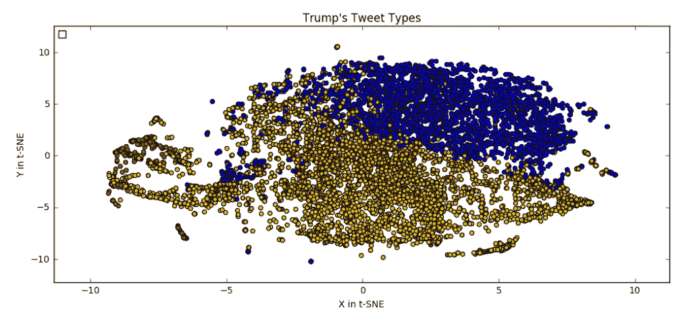
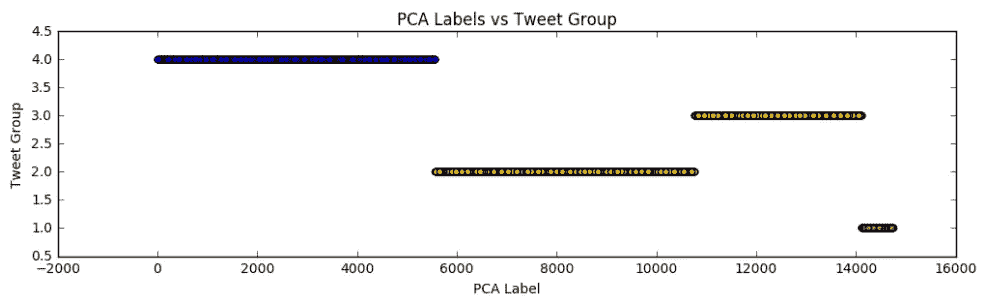

# 像特朗普一样用 One2Seq 模型发推特

> 原文：<https://towardsdatascience.com/tweet-like-trump-with-a-one2seq-model-cb1461f9d54c?source=collection_archive---------0----------------------->

在本文中，我将向您介绍我的项目的大部分内容，我创建了一个一对一的模型，可以生成类似于 Trump 的推文。实际模型与我在我的[“如何构建你的第一个聊天机器人”](https://medium.com/@Currie32/how-to-build-your-first-chatbot-c84495d4622d)文章中构建的模型非常相似。这个模型的两个关键区别是输入和不包括注意力。注意力被排除在外，因为它没有显著提高生成的推文的质量。创建输入的步骤将是本文的重点。作为预览，我们将遵循以下路径:

*   清理特朗普的推文。
*   使用预先训练的单词向量创建单词向量( [GloVe — Twitter 200d](https://nlp.stanford.edu/projects/glove/)) )。
*   平均一条推文的词向量的维度。
*   使用主成分分析将维数减少到 1。
*   根据主成分分析值对推文进行排序。
*   通过文字的质量来限制推文。

我真正喜欢这个模型的地方是，我希望你也会喜欢，我们如何使用这样一个简单的输入，一个值，来生成一条推文。此外，从我们如何创建输入数据，我们将能够在某种程度上控制我们生成的推文的风格。

为了设定你的期望，这里有几个你可以用这个模型创建的推文的例子:

*   谢谢你亚利桑那！# makamericagreatagain # trump 2016
*   必须阻止希拉里
*   记得出来投票！#杂志#特朗普 2016

*注意:我将从我的代码中删除注释，以帮助保持简短。如果你想看评论和我的完整代码，请访问这个项目的* [*GitHub 页面*](https://github.com/Currie32/Tweet-Like-Trump) *。*

我们开始吧！

这个项目的数据来自 Kaggle 上的数据集，它包含了 7375 条推文。我们需要做的第一件事是清理我们的推文。

```
def clean_tweet(tweet):
    tweet = tweet.lower()
    tweet = re.sub(r'https?:\/\/.*[\r\n]*', '', tweet, flags=re.MULTILINE)
    tweet = re.sub(r'[_"\-;%()|.,+&=*%]', '', tweet)
    tweet = re.sub(r'\.', ' . ', tweet)
    tweet = re.sub(r'\!', ' !', tweet)
    tweet = re.sub(r'\?', ' ?', tweet)
    tweet = re.sub(r'\,', ' ,', tweet)
    tweet = re.sub(r':', ' : ', tweet)
    tweet = re.sub(r'#', ' # ', tweet)
    tweet = re.sub(r'@', ' @ ', tweet)
    tweet = re.sub(r'd .c .', 'd.c.', tweet)
    tweet = re.sub(r'u .s .', 'd.c.', tweet)
    tweet = re.sub(r' amp ', ' and ', tweet)
    tweet = re.sub(r'pm', ' pm ', tweet)
    tweet = re.sub(r'news', ' news ', tweet)
    tweet = re.sub(r' . . . ', ' ', tweet)
    tweet = re.sub(r' .  .  . ', ' ', tweet)
    tweet = re.sub(r' ! ! ', ' ! ', tweet)
    tweet = re.sub(r'&amp', 'and', tweet)
    return tweet
```

这段代码将删除任何链接和无用的字符，并重新格式化文本，以便我们可以最大限度地利用 [GloVe 的预训练单词向量](https://nlp.stanford.edu/projects/glove/)。例如，所有的标签都与文本分开。这是因为 GloVe 没有针对 hashtagged 单词的预训练单词向量，所以如果我们想要利用这些预训练向量，我们需要进行这种分离。

*注意:我们将使用 GloVe 的 Twitter 矢量。*

以下是一些干净的推文示例:

*   今天，我们向所有曾在我们的军队中服役的人表达最深切的感谢
*   rt @ ivankatrump:投票给我父亲竞选美国总统真是一个超现实的时刻！发出你的声音并投票！#选择 2
*   晚上 9 : 45 看投票结果#选举之夜#杂志

为了生成单词向量，我们首先需要从 GloVe 的单词向量中创建一个嵌入索引。

```
embeddings_index = {}
with open('/Users/Dave/Desktop/Programming/glove.twitter.27B/
           glove.twitter.27B.200d.txt', encoding='utf-8') as f:
    for line in f:
        values = line.split(' ')
        word = values[0]
        embedding = np.asarray(values[1:], dtype='float32')
        embeddings_index[word] = embedding
```

在这个文件中有 1，193，514 个单词嵌入，每个嵌入有 200 个维度。

我们将使用这个嵌入指数为每条推文创建一个“平均”嵌入。为此，我们将从“空”嵌入开始(所有 200 个值[对于 200 个维度]将为 0)。如果 tweet 中的一个单词在索引中，它的嵌入将被添加到“空”嵌入中。如果 tweet 中的一个单词不在索引中，那么“空”嵌入中将不会添加任何内容。在考虑了推文中的每个单词后，我们将根据推文中的单词数对每个维度进行平均。这些平均维度将为每条推文创建我们的“平均”嵌入。

以下是相关的代码:

```
embedding_dim = 200 embed_tweets = [] # Contains the 'average' embedding for each tweetfor tweet in clean_tweets:
    avg_embed = np.zeros(embedding_dim) 
    for word in tweet.split():
        embed = embeddings_index.get(word)
        if embed is not None:
            avg_embed += embed 
    embed_tweets.append(avg_embed/len(tweet.split()))
```

为了创建这些 *tweet 嵌入，*我们可以使用其他方法，比如 Word2Vec。Word2Vec 的好处是不会有任何空嵌入，但考虑到我们正在处理的数据量，只有 7375 条推文，我认为利用 GloVe 更大的数据集会更好。你很快就会看到，使用手套效果很好。

我们的下一步是将数据的维度从 200 减少到 1。我们将 reduction 设置为 1，以简化和组织我们的输入数据，并使其易于生成我们想要的 tweet 类型，例如。如果我们想要一条有更多标签或者只有文字的推文。

正如你可能已经预料到的，我们将使用 PCA(主成分分析)来降低数据的维度。

```
pca = PCA(n_components=1, random_state = 2)
pca_tweets = pca.fit_transform(embed_tweets)
```

现在，我们的每条推文都有一个 PCA 值，我们将从最小值到最大值对它们进行排序，这样类似的推文将更加接近。

```
pca_tweets_list = [] # Contains the pca values
for tweet in pca_tweets:
    pca_tweets_list.append(tweet[0])order = np.array(pca_tweets_list).argsort()
pca_labels = order.argsort()
pca_labels *= 2 
```

我们将我们的`pca_labels`乘以 2，以便更简单地生成新的推文。虽然我们不会使用所有的 tweet 来训练我们的模型，但是所有的训练 tweet 都是偶数。为了确保生成新的 tweet，你需要做的就是使用一个奇数作为输入。这个生成的 tweet 应该类似于训练数据中的 tweet，其值接近您的输入值。

为了了解 Trump 发布的推文的类型，我们将使用 KMeans 将推文分组。`pca_tweets`将是我们对 KMeans 的输入，在使用 3-10 个聚类检查该函数的结果后，我认为 4 个聚类最好地将 Trump 的推文分成不同的组。

```
kmeans = KMeans(n_clusters=4, max_iter = 1000, n_init = 20, random_state=2).fit(pca_tweets)
labels = kmeans.labels_
```

每组包含以下数量的推文:

1(红色):315，2(橙色):2600，3(黄色):1674，4(蓝色):2782



推文由它们的 KMeans 标签着色，但是输入到 TSNE 的数据是`embed_tweets`。这张图表明，你可以将推文分成一些合理的不同类别。它并不完美，如果你愿意，你可以为自己创造一些情节，但我认为这是最好的结果。

接下来，我们可以看看 PCA 标签与 tweet 组相比有多好。



I’d make this graph bigger, but Medium won’t let me

正如所料，鉴于 tweet 组是使用 PCA 数据创建的，我们可以看到四个明显的组。这也提供了一个很好的可视化来比较不同大小的推文组，并可以帮助您在想要生成推文时选择推文类型。

在我的 iPython 笔记本中，我会更详细地介绍每个组中的单词和推文，但为了给你一个示例，这里是每个组的一些推文:

```
Group # 1 - short tweets with hashtags
#1: # electionday 
#2: rt  @ donaldjtrumpjr :  thanks new hampshire ! !
    # nh  # newhampshire  # maga 
#3:  # draintheswamp !

Group # 2 - long tweets that are retweeted
#1: rt  @ ivankatrump :  such a surreal moment to vote for my father 
    for president of the united states ! make your voice heard and 
    vote !  # election2
#2: rt  @ erictrump :  join my family in this incredible movement to  
    # makeamericagreatagain ! now it is up to you ! please  # vote 
    for america ! https : 
#3: rt  @ donaldjtrumpjr :  final push ! eric and i doing dozens of 
    radio interviews we can win this thing ! get out and vote !  # 
    maga  # electionday ht

Group # 3 - typically involve a data/time/location
#1: watching the returns at 9 : 45 pm # electionnight  # maga 
#2: monday  11/7/2016 
    scranton pennsylvania at 5 : 30 pm 
    grand rapids michigan at 11 pm  
#3: rt  @ ivankatrump :  thank you new hampshire !  

Group # 4 - longer tweet, mostly just text
#1: today we express our deepest gratitude to all those who have  
    served in our armed forces  # thankavet 
#2: busy day planned in new york will soon be making some very 
    important decisions on the people who will be running our 
    government !
#3: love the fact that the small groups of protesters last night 
    have passion for our great country we will all come together and 
    be proud !
```

为了帮助模型生成最佳推文，我们将通过一些措施来限制我们的训练数据。我们要做的第一件事是建立一个词汇到整数(vocab_to_int)字典和 int_to_vocab 字典，其中只包括在特朗普的推文中出现 10 次或更多次的单词。为什么是 10？我对此没有任何“硬”的理由，但这将有助于我们生成的推文听起来更像特朗普的典型推文，而且这将有助于模型更好地理解每个单词的意思，因为它会看到至少 10 次。如果阈值只是 2 或 3，模型将很难理解和使用很少出现的单词。

```
threshold = 10vocab_to_int = {}value = 0
for word, count in word_counts.items():
    if count >= threshold:
        vocab_to_int[word] = value
        value += 1int_to_vocab = {}
for word, value in vocab_to_int.items():
    int_to_vocab[value] = word
```

接下来，我们将限制我们将使用的推文的长度。在训练数据中，我选择了 25 作为 tweet 的最大长度。选择该值是因为它是模型仍能很好学习的最大长度。再长一点，模型就很难学习推文，再短一点，我们就会进一步限制我们的训练数据。

我们还将设置一个<unk>限制。<unk>是一个标记，用于表示不包括在我们的训练词汇中的单词。如果一条推文中出现多个<unk>令牌，则该推文将不会用于训练模型。我尝试将<unk>限制增加到 2，但这导致<unk>在生成的 tweets 中出现太频繁。</unk></unk></unk></unk></unk>

```
max_tweet_length = 25
min_tweet_length = 1
unk_limit = 1short_tweets = []
short_labels = []for i in range(len(int_tweets)):
    unk_count = 0
    if len(int_tweets[i]) <= max_tweet_length and \
       len(int_tweets[i]) >= min_tweet_length:
        if len(int_tweets[i]) == 1:
            if int_tweets[i][0] != vocab_to_int['<UNK>']:
                short_tweets.append(int_tweets[i])
                short_labels.append(pca_labels[i])
        else:
            for word in int_tweets[i]:
                if word == vocab_to_int['<UNK>']:
                    unk_count += 1
            if unk_count <= unk_limit:
                short_tweets.append(int_tweets[i])
                short_labels.append(pca_labels[i])
```

作为为模型准备数据的最后一步，我们将按长度对推文进行排序。这样做将有助于我们的模型训练得更快，因为早期的批次将包含更短的推文。每批中的推文需要具有相同的长度，因此通过对推文进行排序，将避免长推文与短推文一起被批量处理。

```
sorted_tweets = []
sorted_labels = []for length in range(1,max_tweet_length+1):
    for i in range(len(short_tweets)):
        if length == len(short_tweets[i]):
            sorted_tweets.append(short_tweets[i])
            sorted_labels.append([short_labels[i]])
```

这就是创建我们的训练数据！这需要做一些工作，但是可以说你的输入数据是模型中最重要的部分。没有好的训练数据，模型将无法生成好的输出。

本文的最后一部分是如何生成推文。有两种不同的方法可以使用。

## 选项 1:找一条类似的推文

通过这种方法，你可以输入与最相似的推文匹配的单词或短语。

```
create_tweet = "I need your help to make america great again! #maga"create_tweet = clean_tweet(create_tweet)create_tweet_vect = vectorize_tweet(create_tweet)create_tweet_pca = pca.transform(create_tweet_vect)similar_tweet = min(pca_tweets_list, 
                    key=lambda x:abs(x-create_tweet_pca))for tweet in enumerate(pca_tweets_list):
    if tweet[1] == similar_tweet:
        print("Most similar tweet:", pca_labels[tweet[0]])
        break
```

*   在`create_tweet`中，输入您想要匹配的任何文本。
*   这条推文将被清理，然后使用与我们进行“平均”嵌入时输入数据相同的方法转换为向量。
*   推文的“平均”嵌入将被用于找到其 PCA 值。这个值将与最接近的 tweet 匹配。
*   匹配的 tweet 的 PCA 值将用于查找其 PCA 标签。这个标签是模型的输入。

如果你对这条最接近的推文的内容感到好奇，那么下面是给你的代码！

```
tweet_type = 3464closest_type = min(short_labels, key=lambda x:abs(x-tweet_type))
words = []
for tweet in enumerate(short_labels):
    if tweet[1] == closest_type:
        for num in short_tweets[tweet[0]]:
            words.append(int_to_vocab[num])
print(" ".join(words))
```

`tweet_type`可以认为是 PCA 标签。该值将与用于训练模型的最接近的标签相匹配。将打印出与最近标签相关的文本。

作为这种方法局限性的一个例子，我用了这样一句话“我需要你们的帮助，让美国再次伟大！#maga "作为我的`create_tweet`，返回的`tweet_type`和文字是:3464，“希拉里是有史以来竞选美国总统最腐败的人# draintheswamp”。

这些文本差别很大，但是它们的结构是相似的，多个普通的单词和一个标签。我同意这是第四组风格的推文的模式。

## 选项 2:输入一个值

这是更简单的选择，包含了更多的随机性。你需要做的就是选择一个`tweet_type`，我建议你参考推文组的范围来控制推文的风格。您还可以通过设置 sequence_length 的值来控制您想要生成的 tweet 的长度，但我将其设置为随机整数，因为我喜欢危险地生活。

```
tweet_type = 3464checkpoint = "./best_model.ckpt"loaded_graph = tf.Graph()
with tf.Session(graph=loaded_graph) as sess:
    loader = tf.train.import_meta_graph(checkpoint + '.meta')
    loader.restore(sess, checkpoint) input_data = loaded_graph.get_tensor_by_name('input:0')
    logits = loaded_graph.get_tensor_by_name('logits:0')
    sequence_length = 
        loaded_graph.get_tensor_by_name('sequence_length:0')
    keep_prob = loaded_graph.get_tensor_by_name('keep_prob:0')tweet_logits = sess.run(logits, 
                        {input_data: [[tweet_type]], 
                         sequence_length: np.random.randint(3,15),
                         keep_prob: 1.0})[0]# Remove the padding from the tweet
pad = vocab_to_int["<PAD>"]print('Tweet')
print('  Word Ids: {}'.format(
         [i for i in np.argmax(tweet_logits, 1) if i != pad]))
print('  Tweet: {}'.format(" ".join([int_to_vocab[i] for i in 
                          np.argmax(tweet_logits, 1) if i != pad])))
```

这个项目到此为止！我希望你喜欢了解它，如果你想看到整个过程，那么就去我的 [GitHub](https://github.com/Currie32/Tweet-Like-Trump) 吧。如果您有任何问题、意见或建议，请在下面发表。

如果你对扩展这项工作感兴趣，我的一个想法是对生成的推文提供更大的控制。我认为如果我们可以在输入数据中包含一个关键字(或多个单词)会很好。这应该有助于我们控制我们想要生成的推文的风格和上下文。

感谢阅读！