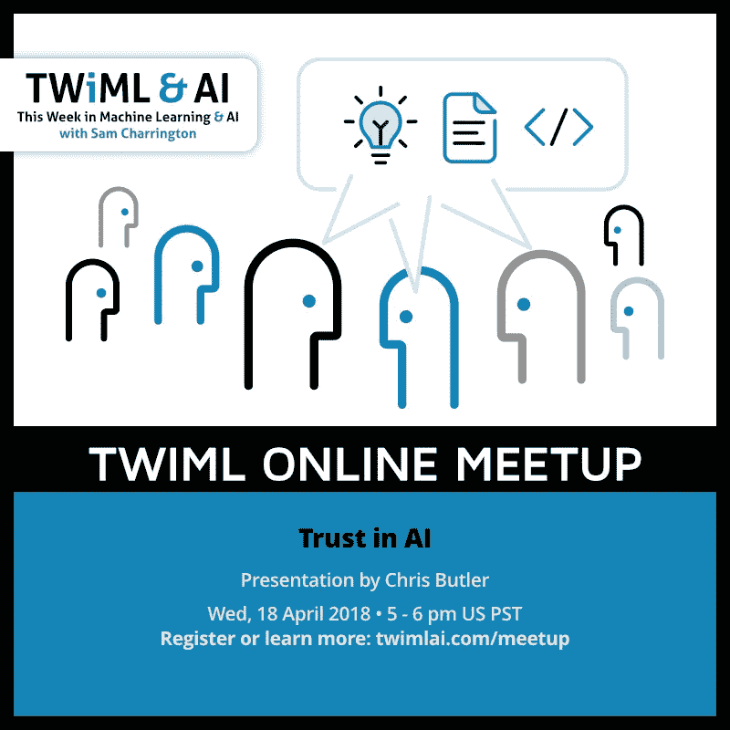

# 你需要人类对人工智能的适当信任

> 原文：<https://towardsdatascience.com/twiml-ai-meetup-trust-and-ai-86c32f91a0e0?source=collection_archive---------4----------------------->

## TWiML & AI meetup talk:信任人工智能

我很高兴能在 TWiML 人工智能会议上发表关于人工智能信任的演讲。这个话题的核心是人类如何使用机器，以及他们如何将机器融入他们的团队。正如我们将看到的，这是一个非常重要但难以理解的话题。

> “信任促进合作行为”

为了开始讨论，我们回顾了关于信任和自动化主题的四篇论文:

*   [对心智模型的一些观察](https://dl.acm.org/citation.cfm?id=58097) (1987)
*   [人类和自动化:使用、误用、废弃、滥用](http://web.mit.edu/16.459/www/parasuraman.pdf) (1997)
*   [紧急疏散场景中机器人的过度信任](https://www.cc.gatech.edu/~alanwags/pubs/Robinette-HRI-2016.pdf) (2016)
*   [自动化中的信任:整合影响信任因素的经验证据](http://journals.sagepub.com/doi/abs/10.1177/0018720814547570) (2015)

所有这些论文的关键在于，它们讨论了过多(误用)和过少(不用)之间的信任平衡。有许多因素可以增加信任度，但是我们应该总是构建具有最大信任度的系统吗？

在回顾了论文之后，我们开始深入研究在将人和机器结合起来时应该考虑的问题。这不是人在回路中(HITL)对人在回路外(OOTL)的人工智能。事物的本来面目也不一样。

说到 HITL，它不再仅仅是一个人和一台机器。它是与智能生态系统一起工作的人类组织。我们需要了解他们如何最好地合作。

如果你认为任何系统对人类来说都是真正的 OOTL，那么你就没有正确设定系统的边界。总有人类以某种方式参与其中。即使只是你的客户受到影响。你需要将他们纳入你的考虑范围。

在考虑信任时，责任是一个重要因素。当事情确实出错时，谁需要对此负责？

That is my exit!

如果上面的[车是一辆自动驾驶汽车，从技术上讲它没有发生事故，但它确实需要](https://www.reddit.com/r/gifs/comments/8ah55w/thats_our_exit/?st=JFPIUNF3&sh=0307bed7)[对它的所作所为负责](https://link.springer.com/article/10.1007/BF02639315)、[而不是其他人类卡车司机](https://papers.ssrn.com/sol3/papers.cfm?abstract_id=2757236)。

如何为您的应用程序确定合适的信任度？这可以在不投入月复一月的数据清理和模型训练时间的情况下完成。你可以用[非编码原型来做，就像我们在各种项目中做的那样](https://uxdesign.cc/testing-ai-concepts-in-user-research-b742a9a92e55)。

最后，有太多的因素影响信任，你需要用真实的人来测试系统，了解他们需要什么。机器不会取代人类的目的。

# 资源

幻灯片:

 [## TWiML & AI:信任与人工智能

### 信任与爱克里斯巴特勒@ philosophie.is @克里斯博特·https://goo.gl/m1PaVi

docs.google.com](https://docs.google.com/presentation/d/e/2PACX-1vTa6ebnvjGk1agTlztTFK4oJCM28UrkWbYuxzS_5Y5-atyYWxER4uA9N3l7X1dIVl_xb4mOqBox6pPx/pub?start=false&loop=false&delayms=3000) 

其他参考:

*   [谷歌的高绩效团队和信任](https://hbr.org/2017/08/high-performing-teams-need-psychological-safety-heres-how-to-create-it)
*   [TWiML & AI 播客#110 与 Ayanna Howard](https://twimlai.com/twiml-talk-110-trust-human-robot-ai-interactions-ayanna-howard/)
*   [急救机器人视频](https://www.youtube.com/watch?v=frr6cVBQPXQ)
*   [为什么部队不信任无人机](https://www.foreignaffairs.com/articles/united-states/2017-12-20/why-troops-dont-trust-drones)
*   [机械战警(2014)](https://en.wikipedia.org/wiki/RoboCop_(2014_film))
*   [安慰剂按钮(假恒温器)](https://99percentinvisible.org/article/user-illusion-everyday-placebo-buttons-create-semblance-control/)
*   [控制偏差的错觉](https://en.wikipedia.org/wiki/Illusion_of_control)
*   [回路中的机器接近](https://medium.com/@ChenhaoTan/human-centered-machine-learning-a-machine-in-the-loop-approach-ed024db34fe7)
*   [人在回路中的机器学习:来自 StitchFix 的教训](https://medium.com/kaizen-data/machine-learning-with-humans-in-the-loop-lessons-from-stitchfix-300672904f80)
*   [星球大战社交网络](http://evelinag.com/blog/2015/12-15-star-wars-social-network)
*   那是我们的出口！
*   [道德崩溃区](https://papers.ssrn.com/sol3/papers.cfm?abstract_id=2757236)
*   [计算机化社会中的问责制](https://link.springer.com/article/10.1007/BF02639315)
*   [WoZ 方式:实现实时远程交互原型&在路上车辆中观察](https://dl.acm.org/citation.cfm?id=3023271)
*   康奈尔大学的温迪·朱
*   [在用户研究中测试人工智能概念](https://uxdesign.cc/testing-ai-concepts-in-user-research-b742a9a92e55)
*   [机器的移情映射](https://uxdesign.cc/robots-need-love-too-empathy-mapping-for-ai-59585ad3548d)
*   [混淆映射](/robots-are-wrong-too-confusion-mapping-for-the-worst-case-2e01b7e19936)

# 关于克里斯·巴特勒

我帮助团队理解他们应该用以人工智能为中心的解决方案解决的真正的商业问题。我们工作的团队通常被要求用他们拥有的数据“做一些有趣的事情”。我们通过偶发事件相关性帮助他们避免局部极值，并专注于解决巨大的业务问题。我的背景包括在微软、KAYAK 和 Waze 等公司超过 18 年的产品和业务开发经验。在 Philosophie，我创造了像[机器移情映射](https://uxdesign.cc/robots-need-love-too-empathy-mapping-for-ai-59585ad3548d)和[困惑映射](/robots-are-wrong-too-confusion-mapping-for-the-worst-case-2e01b7e19936)这样的技术，以在构建人工智能产品时创建跨团队对齐。如果你想了解更多或者通过[邮箱](mailto:chrisbutler@philosophie.is)、 [LinkedIn](https://www.linkedin.com/in/chrisbu/) 联系，或者访问[http://philosophie.is/human-centered-ai](http://philosophie.is/human-centered-ai)。