# Twitter 广告

> 原文：<https://towardsdatascience.com/twitter-advertising-1d497d066fef?source=collection_archive---------4----------------------->


# 介绍

这是我在大会数据科学沉浸式项目中的顶点项目的非技术性报告。顶点计划是指参加该计划时所学一切的高潮。我选择对 Twitter 数据执行自然语言处理(NLP ),以便协助广告活动。这个项目更多地面向广告商、市场营销和任何想要扩展他们的客户关系平台以与他们的追随者交流的公司。

# 目标

通过推文的 NLP，公司可以衡量人们对他们产品的感受。我的目标之一是创建一个模型，对一条信息是否具有积极或消极的情感价值进行分类。这种分类的一部分是过滤掉那些正面/负面的推文，看看问题源自哪里。一个公司可以直接联系那些对他们的产品有问题的顾客，同时奖励那些忠诚于这个品牌的顾客。

# 数据

出于介绍的目的，所有的工作都是用 python 编写的，使用了几个库。这些库包括 Numpy、Pandas、Matplotlib、Scikit Learn 和 Keras。通过使用 Twitter API，tweets 被挖掘和收集。推文以压缩的 JSON 格式返回。如下例所示，信息是嵌套的，通常难以阅读。


通过一个自动化的过程，某些特征被选中，数据被保存到一个熊猫数据框架中。

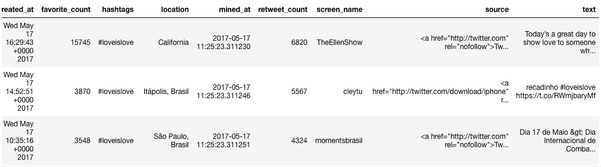

本项目中使用了以下功能:

*   创建时间:创建推文的时间戳。
*   收藏次数:这条推文被“收藏”的总次数
*   标签:与 tweet 相关联的标签。
*   位置:用户声明的位置。
*   挖掘时间:tweet 被挖掘的时间戳。
*   转发次数:这条推文被“转发”的总次数。
*   屏幕名称:用户的屏幕名称。
*   来源:推文的来源(即:设备)。
*   文本:推文的文本。
*   字数:一条推文中的总字数。
*   tweet Length:tweet 的字符长度。

返回的数据不干净。我说它不干净是因为为了让我处理数据，我需要一种特定的格式。有许多函数是为处理这个过程而编写的。我清理数据的过程如下:

*   使用位置变量提取 tweet 的坐标。如果没有，我将它设置为加州旧金山。为什么是 SF？因为 Twitter 总部位于旧金山。
*   created_at 和 mined_at 变量被转换为 datetime 对象以执行与时间相关的函数。
*   hashtags 变量在开头接收' # '，空格被删除。这是为了让所有的标签保持相同的格式。
*   源变量删除了 html 代码。
*   文本变量移除了超链接，移除了“@”提及，单词被标记化。示例:

[*#* ***纹身 sForShawn***](https://twitter.com/hashtag/TattoosForShawn?src=hash) *我是* ***思维*** *点歌* ***耳机*** *，然后那根线就是歌迷们歌唱生活的声波聚会*[*@ Shawn Mendes*](https://twitter.com/ShawnMendes)

变成了:‘纹身 sforshawn’，‘思考’，‘耳机’，‘电线’，‘声音’，‘海浪’，‘粉丝’，‘唱歌’，‘生活’，‘派对’

下图显示了数据清理后数据帧的外观:

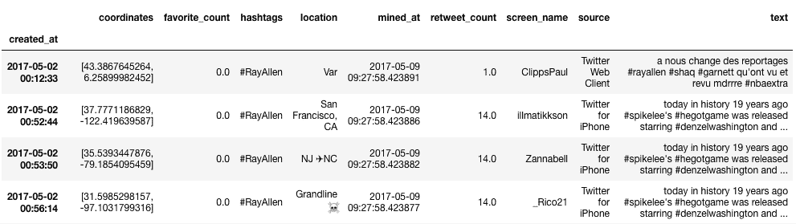

# 特征工程

除了从 twitter 中挖掘出来的特性，还有其他一些特性是为了更好地理解数据而创建的。VADER(用于情感推理的效价感知词典)库包括情感强度分析器，该分析器是确定给定推文的情感值的基础。这是一个基于规则的情绪分析工具，专门针对社交媒体中表达的情绪。给定一条消息，分析器返回可测量的值:

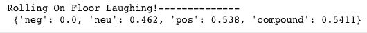

*   消极情绪
*   neu:中性情绪
*   积极情绪
*   复合:复合(即综合得分)

Nodebox 英语语言学图书馆允许通过回归意象词典进行心理内容分析。RID 对文本中主要、次要和情感过程思想进行评分。这是一个有趣的包，因为它开辟了一种查看信息的新方式。

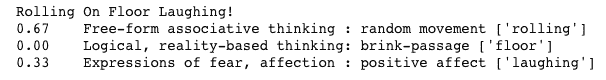

*   初级:涉及梦和幻想的自由形式联想思维
*   二级:逻辑性强，以现实为基础，注重解决问题
*   情绪:恐惧、悲伤、憎恨、喜爱等的表达。

# 探索数据

探索性数据分析(EDA)是一种分析数据集以总结其主要特征的方法。我选择从两个不同的角度来看这些数据。第一种是对收集到的所有公共信息进行更全面的概述。第二个通过更具体的观点，好像我是一个对我的信息感兴趣的公司。我们先来看一个大概的看法。

我选择查看每个特性，并查看数据的整体视图。time_created 变量显示，大多数推文是在下午发送的，然后是在午夜之后的几个小时。请注意，这些时间是以太平洋标准时间为基准的。标签聚集了挖掘过程中讨论的主要话题。

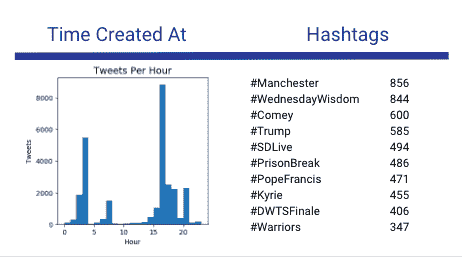

收集的推文主要集中在美国，因为情感库是在英语语言上训练的。这也是看外国字符时的编码问题。如果没有命名城市，加利福尼亚州旧金山是默认城市，因此在其他位置中很突出。许多用户在他们的个人资料中没有位置，在他们的推文中也没有。Twitter 的总部在旧金山市中心，所以推文是从那里发出的。

sources 变量显示 twitter 的移动使用占据了首位。前三名依次是 iPhone、Android 和 Twitter 网络客户端。web 客户端指的是通过 web 浏览器在桌面上使用 twitter，以及在移动设备上使用 web 浏览器。

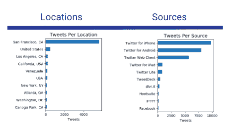

在将推文分成各自的情绪值后，我决定看看字数分布。负面和正面推文的字数分布峰值都是每条推文 15 个字。中性的推文大多在 10 个字及以下。

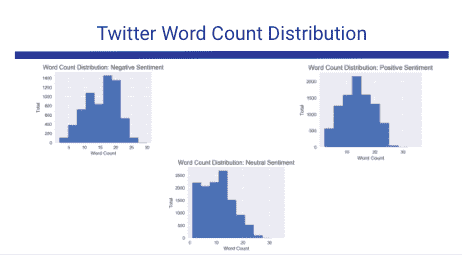

对于 VADER 情绪分析，我将着眼于复合值。下图中的复合金额是 VADER 情绪分析的聚合值。复合值的范围从-1 到 1；消极情绪，到中性情绪，到积极情绪。大多数推文被评为中性。我认为这是因为 VADER 情绪分析器没有对 2017 年的新词进行训练，即:fleek。

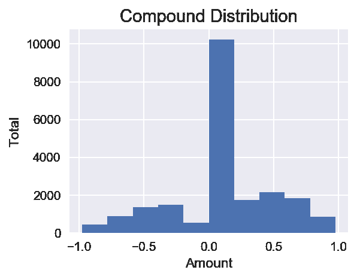

# #万豪

在对数据进行总体概述后，我想看看与万豪品牌相关的具体推文。获取数据的过程与之前相同，只是我将标签“#Marriott”传递给一个搜索参数，因此只返回与该标签相关的信息。

我想看的第一件事是#万豪在世界上的什么地方被谈论。使用坐标变量，我可以在地图上画出推文的来源。

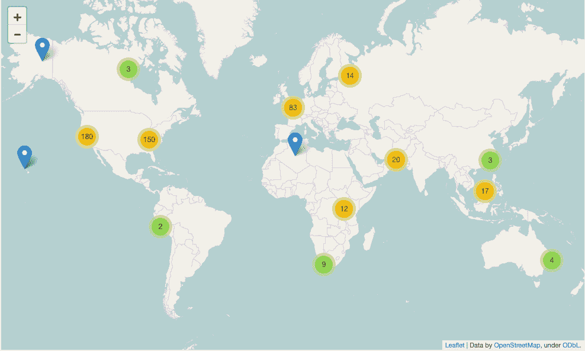

通过观察一段时间内的情绪值，我能够衡量与万豪相关的正面或负面推文的数量。大多数推文都是对万豪的正面评价，只有少数是负面评价。

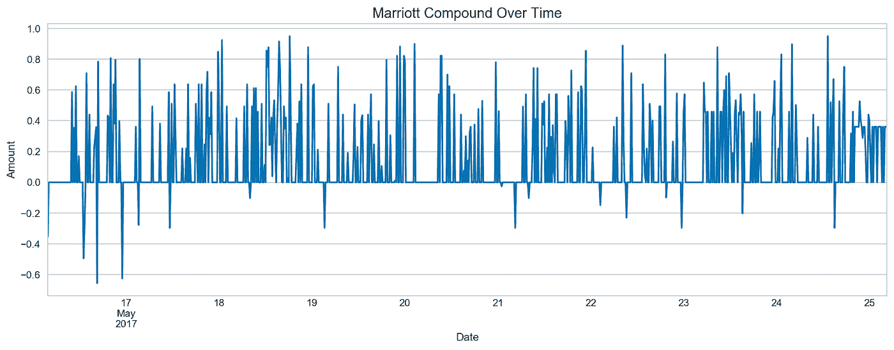

一条复合得分高达 0.951 的推文示例:


一条复合得分为-0.6551 的推文示例:


作为万豪的员工，我能够联系有问题的客户，并提供某种解决方案。同样的道理也适用于奖励评论最好的酒店。

# 数据建模

VADER 情感分析器是对推文情感价值进行分类的基础。我想看看我是否能利用课堂上学到的模型对推文进行分类。在继续之前，我需要将文本数据转换成 python 可以理解的格式。我用 word2vec 从单词中创建向量。在 word2vec 中，使用了单词的分布式表示。取一个有几百维(比如 300 维)的向量。每个单词都由这些元素的权重分布来表示。因此，向量中的元素和单词之间不是一对一的映射，而是单词的表示分布在向量中的所有元素上，向量中的每个元素都有助于许多单词的定义。单词“dog”的 300 维向量示例:

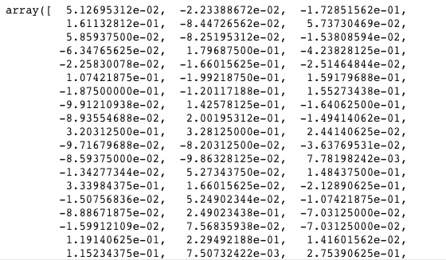

```
# creates a vector given a sentence/tweet
# takes a list of words, and array size of w2v vector
# tokens == a list of words (the tokenized tweet)
# size == the dimensional size of the vectorsize = 300def buildWordVector(tokens, size):
    vec = np.zeros(size).reshape((1, size))
    count = 0.
    for word in tokens:
        try:
            vec+= w2v[word].reshape((1,size))
            count += 1.
        except BaseException: # handling the case where the token is not
            try:
                continue

    if count != 0:
        # get centroid of sentence
        vec /= count
    return vec
```

一旦每个单词都被矢量化，下一步就是创建推文本身的矢量。tweet 中的每个单词向量相加在一起，除以 tweet 中的单词总数，这为 tweet 创建了一个向量，它是相加向量的质心。这是我遇到的强大的东西。通过创建这些向量，您可以执行矩阵数学运算并找到新的模式。可以对这些向量执行余弦相似性，这使你能够看到相似的推文/词以及最相反的推文/词。一旦用户的推文被矢量化，就可以用同样的步骤为用户创建向量。

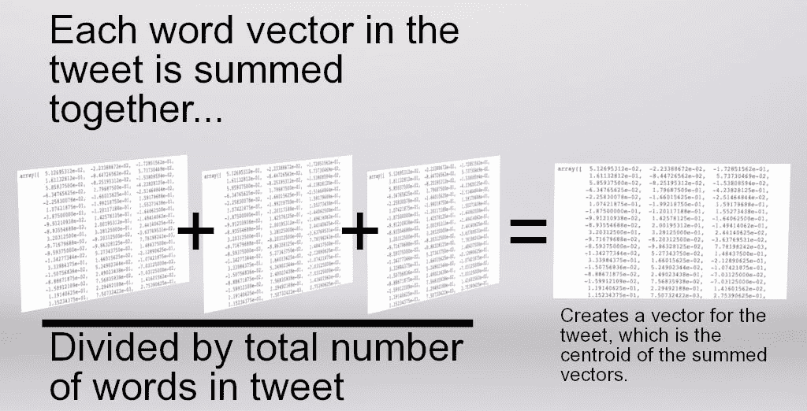

作为参考，有三类被分类:消极，中立和积极。数据被分成 85/15 的比例，用于训练和测试数据。我的基本估计是多项式逻辑回归。我正在查看更具体的回忆分数，因为回忆是“结果有多完整”。高召回率意味着算法返回了大部分相关结果。如你所见，中性分类高于其他分类。

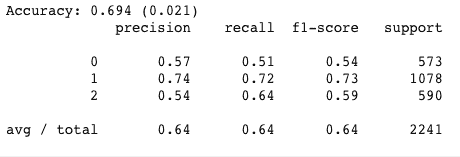

额外树分类器是尝试的第二个模型。“额外树”分类器，也称为“极度随机化树”分类器，是随机森林的变体。与随机森林不同，在每一步都使用整个样本，并随机选取决策边界，而不是最佳边界。还是那句话，中性分类高于其余。负面分类的表现很糟糕。

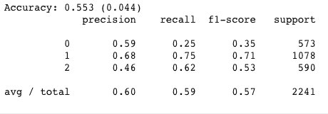

我最后一次分类的尝试是用神经网络来完成。Keras 是用 Python 编写的开源神经网络库。我对 Keras 的第一次尝试是创建一个又深又宽的神经网络。它有 5 个致密层，分别含有 500、800、1000、300 和 3 个神经元。以及设置为 0.1、0.5、0.2、0.2 和 0.2 的每个密集层之前的下降层。前四层的激活是“relu”，最后一层是“softmax”。

```
# in order for keras to accurately multi-classify, must convert from # 1 column to 3 columns
y_train = keras.utils.np_utils.to_categorical(y_train,       num_classes=3)
y_test = keras.utils.np_utils.to_categorical(y_test, num_classes=3)# MULTI-CLASSIFICATION
# Evaluating with a Keras NN# fix random seed for reproducibility
seed = 7
np.random.seed(seed)from keras.constraints import maxnorm# Keras neural network deep and wide.
model_keras = Sequential()
model_keras.add(Dropout(0.1, input_shape=(train_vecs_w2v.shape[1],)))
model_keras.add(Dense(500, activation=’relu’, kernel_constraint=maxnorm(1)))
model_keras.add(Dropout(0.5))
model_keras.add(Dense(800, activation=’relu’, kernel_constraint=maxnorm(1)))
model_keras.add(Dropout(0.2))
model_keras.add(Dense(1000, activation=’relu’, kernel_constraint=maxnorm(1)))
model_keras.add(Dropout(0.2))
model_keras.add(Dense(300, activation=’relu’, kernel_constraint=maxnorm(1)))
model_keras.add(Dropout(0.2))
model_keras.add(Dense(3, activation=’softmax’))epochs = 20model_keras.compile(loss=’categorical_crossentropy’,
 optimizer=’adam’,
 metrics=[‘accuracy’])history = model_keras.fit(train_vecs_w2v, y_train, epochs=epochs, validation_data=(test_vecs_w2v, y_test), batch_size=32, verbose=2)score = model_keras.evaluate(test_vecs_w2v, y_test, batch_size=128, verbose=0)print ‘Evaluated score on test data:’, score[1]# summarize history for accuracy
plt.figure(num=None, figsize=(8, 6), dpi=100, facecolor=’w’, edgecolor=’k’)
plt.plot(history.history[‘acc’])
plt.plot(history.history[‘val_acc’], c=’r’, ls=’dashed’)
plt.title(‘model accuracy’)
plt.ylabel(‘accuracy’)
plt.xlabel(‘epoch’)
plt.legend([‘train’, ‘test’], loc=’upper left’)
plt.hlines(y=score[1], xmin=0, xmax=epochs)
plt.show()# summarize history for loss
plt.figure(num=None, figsize=(8, 6), dpi=100, facecolor=’w’, edgecolor=’k’)
plt.plot(history.history[‘loss’])
plt.plot(history.history[‘val_loss’], c=’r’, ls=’dashed’)
plt.title(‘model loss’)
plt.ylabel(‘loss’)
plt.xlabel(‘epoch’)
plt.legend([‘train’, ‘test’], loc=’upper left’)
plt.show()
```

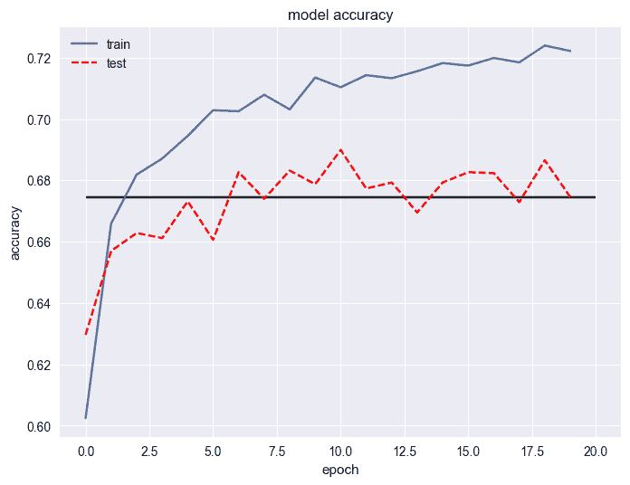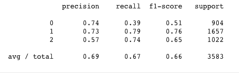

所有的分类模型似乎都有一个模式。负面分类总是比其余的低。再看数据，负面情绪值的推文大概占整个数据集的 20%。中性的占 44%，积极的占 33%。下一步是将所有推文限制在相同的数据量。我决定从每个班级随机抽取 4000 个数据点。该数据然后被放入 70/30 的训练测试分割中；70%的数据用于训练，30%用于测试。我的下一步是尝试短而浅的神经网络设置。三个致密层，分别为 32、16 和 3 个神经元。每个密集层之前的三个下降层设置为 0.1、0.3 和 0.2。纪元已更改为 50，批次大小已更改为 2048。

```
# df is the pandas dataframe object which contains all the clean data# Function to create targets based on compound score
def get_targets(row):
    if row < 0:
        return 0
    elif row == 0:
        return 1
    else:
        return 2# Creating the targets based of the compound value
df['target'] = df['compound'].map(lambda x: get_targets(x))
neg = df[df.target == 0]
neu = df[df.target == 1]
pos = df[df.target == 2]# Randomly sampling tweets to a limit of 4000 each
neg_sampled = neg.sample(4000)
neu_sampled = neu.sample(4000)
pos_sampled = pos.sample(4000)# concating all sampled datasets together
df_test = pd.concat([neg_sampled, neu_sampled, pos_sampled])
df_test.shape# Creating training/testing data, 70/30 split
X_train, X_test, y_train, y_test = train_test_split(df_test.token_text, df_test.target, train_size=0.7)# For every tweet, creating a word vector array for tweet
X_train = np.concatenate([buildWordVector(z, num_features) for z in X_train])
X_train = scale(X_train)X_test = np.concatenate([buildWordVector(z, num_features) for z in X_test])
X_test = scale(X_test)# in order for keras to accurately multi-classify, must convert from 1 column to 3 columns
y_train = keras.utils.np_utils.to_categorical(y_train, num_classes=3)
y_test = keras.utils.np_utils.to_categorical(y_test, num_classes=3)# MULTI-CLASSIFICATION
# Evaluating with a Keras NN# fix random seed for reproducibility
seed = 7
np.random.seed(seed)leng = X_train.shape[1]
X_train = X_train.reshape(X_train.shape[0], 1, leng)
X_test = X_test.reshape(X_test.shape[0], 1, leng)# Keras neural network short and shallow
model_keras = Sequential()
model_keras.add(Dropout(0.1, input_shape=(X_train.shape[1],)))
model_keras.add(Dense(32, activation=’relu’, kernel_constraint=maxnorm(1)))
model_keras.add(Dropout(0.3))
model_keras.add(Dense(16, activation=’relu’, kernel_constraint=maxnorm(1)))
model_keras.add(Dropout(0.2))
model_keras.add(Dense(3, activation=’softmax’))# SGD Parameters
learning_rate = 0.01
decay_rate = learning_rate / epochs
momentum = .95
sgd = SGD(lr=learning_rate, momentum=momentum, decay=decay_rate, nesterov=True)model_keras.compile(loss=’categorical_crossentropy’,
 optimizer=’adam’,
 metrics=[‘accuracy’])# Model parameters
epochs = 50
batch = 2048history = model_keras.fit(X_train, y_train, 
 validation_data=(X_test, y_test), 
 epochs=epochs, 
 batch_size=batch, 
 verbose=0)score = model_keras.evaluate(X_test, y_test, 
 batch_size=batch, verbose=0)print ‘Evaluated score on test data:’, score[1]# summarize history for accuracy
plt.figure(num=None, figsize=(8, 6), dpi=100, facecolor=’w’, edgecolor=’k’)
plt.plot(history.history[‘acc’])
plt.plot(history.history[‘val_acc’], c=’r’, ls=’dashed’)
plt.title(‘model accuracy’)
plt.ylabel(‘accuracy’)
plt.xlabel(‘epoch’)
plt.legend([‘train’, ‘test’], loc=’upper left’)
plt.hlines(y=score[1], xmin=0, xmax=epochs)
plt.show()# summarize history for loss
plt.figure(num=None, figsize=(8, 6), dpi=100, facecolor=’w’, edgecolor=’k’)
plt.plot(history.history[‘loss’])
plt.plot(history.history[‘val_loss’], c=’r’, ls=’dashed’)
plt.title(‘model loss’)
plt.ylabel(‘loss’)
plt.xlabel(‘epoch’)
plt.legend([‘train’, ‘test’], loc=’upper left’)
plt.show()
```

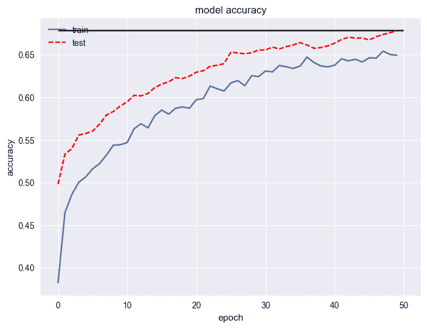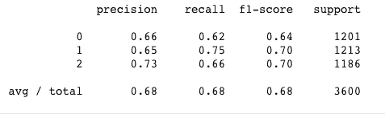

使用 Keras 分类器的试验比以前的模型表现得更好。从回忆分数来看，负数看起来没有以前那么糟糕了。即使每个情感值都有 4000 个数据点，也可能是中性类有更多独特的词。进一步的测试将尝试添加一个 LSTM 层，以便添加一个记忆层，以及一个卷积层，以便找到隐藏的模式。

# 结论

获得更好的分类器分数所需的数据必须是特定的。它不可能是随机的推文。从字面上看，最负面的词和最正面的词都要被搜索和收集。这样做之后，我相信这个分类器会像 VADER 情感分析一样出色。