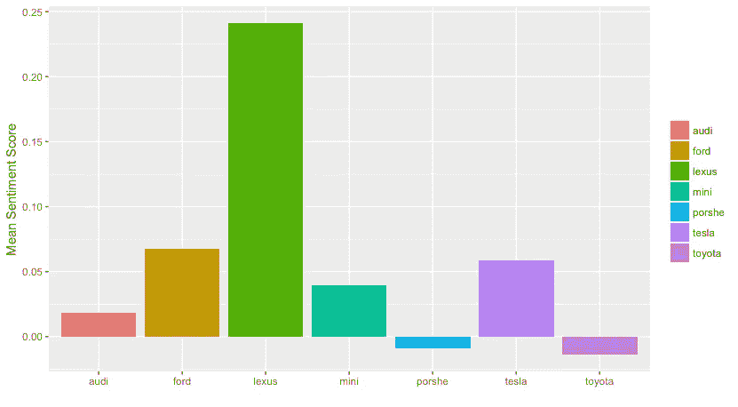
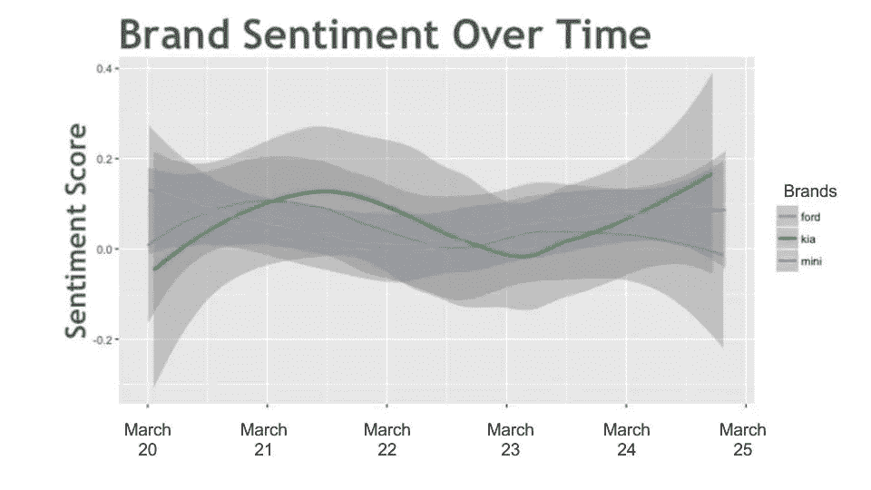

# 汽车品牌的推特情感分析

> 原文：<https://towardsdatascience.com/twitter-sentiment-analysis-on-car-brands-c13d449eb9fc?source=collection_archive---------2----------------------->

Twitter 数据是一个丰富的来源，可以用来获取任何可以想象的话题的信息。这些数据可用于不同的用例，例如寻找与特定关键字相关的趋势、测量品牌情感以及收集关于新产品和服务的反馈。

在这篇文章中，我将从 twitter 中提取各种汽车品牌的数据。然后，我们将应用情感分析来了解在最近一段时间内，人们对不同汽车品牌的正面/负面看法。情感分析是确定一条内容是正面的、负面的还是中性的过程。这也被称为意见挖掘，得出一个发言者的意见或态度。这项技术的一个常见用例是发现人们对某个特定话题的感受。在我们的例子中，我们使用最近推文中的文字来发现人们对不同汽车品牌的感受。

我发现这篇[文章](http://adilmoujahid.com/posts/2014/07/twitter-analytics/)和这段[视频](https://pythonprogramming.net/twitter-api-streaming-tweets-python-tutorial/?completed=/mysql-live-database-example-streaming-data/)有助于弄清楚如何从 twitter api 中提取、过滤和处理数据。

```
#Import the necessary methods from tweepy library
from tweepy import Stream
from tweepy import OAuthHandler
from tweepy.streaming import StreamListener
import time#Variables that contain the user credentials to access Twitter API
#(Note: replace with your own values from [https://apps.twitter.com/](https://apps.twitter.com/))
consumer_key="consumer key"
consumer_secret="consumer secret"
author_token="author token"
author_secret="author secret"class listener(StreamListener):#This is a basic listener that just prints received tweets
def on_data(self, data):
   try:
     #writing data to file
     saveFile = open('tweetDBcars.csv','a')
     saveFile.write(data)
     saveFile.close()
     return(True)
   except BaseException, e:
     print 'failed ondata,',str(e)
     time.sleep(5)def on_error(self, status):
        print statusauth = OAuthHandler(consumer_key, consumer_secret)
auth.set_access_token(author_token, author_secret)twitterStream = Stream(auth, listener())# getting tweets that have any of these words
twitterStream.filter(track=['car' 
 'chevy','ford','toyota',
    'acura','kia','audi',
    'chrystler','dodge','ferrari'
    'fiat','buick','cadillac','chevrolet',
    'bmw','honda','jeep','lexus','mazda',
    'mini','nissan','tesla''volvo','saab','porshe'])
```

我让这个脚本运行了 6 天，累积了大约 115，000 条推文。Twitter api 在类似于 python 字典的 json 数据结构中为我们提供了关于每条 tweet 的大量数据。我们对 tweet 本身的内容感兴趣，可以通过键[“text”]访问它。

在处理大型数据集时，在 try/except 子句中捕获 tweet = json.loads(line)语句非常重要。尽管从 Twitter api 返回的数据通常是干净的，但可能会有错误，如果遇到一行坏数据，您希望避免破坏脚本。try/except 子句允许脚本跳过一行坏数据，继续处理剩余的 tweets。

```
tweets_data_path = 'twitDBcars.csv'tweets_data = []
tweets_file = open(tweets_data_path, "r")
for line in tweets_file:
    try:
        tweet = json.loads(line)
        tweets_data.append(tweet)
    except:
        continue
```

现在我们用微博创建一个熊猫数据框架

```
tweets = pd.DataFrame()index = 0
for num, line in enumerate(tweets_data):
  try:
     print num,line['text']
     tweets.loc[index,'text'] = line['text']
     index = index + 1 
 except:
     print num, "line not parsed"
     continue
```

为了提取关于特定品牌的推文，我们将每条推文中的单词与我们感兴趣的每个品牌的名称进行比较。如果我们找到了我们正在寻找的品牌，我们会在数据框中的新列“品牌名称”中对其进行跟踪。

```
def brand_in_tweet(brand, tweet):
    brand = brand.lower()
    tweet = tweet.lower()
    match = re.search(brand, tweet)
    if match:
        print 'Match Found'
        return brand
    else:
        print 'Match not found'
        return 'none'
```

下一步是评估每条推文的情绪。有几种方法可以进行情感分析。

从业者最常描述的有两种方法:

*   一种方法是收集一堆推文，让人们给它们贴上积极或消极的标签。然后使用已标记的数据集来训练算法，如朴素贝叶斯或随机森林。然后，训练好的模型可以用于新的数据，以估计情绪。
*   第二种方法是使用词典，我们将推文中的单词与词典中的单词(或 n-grams)进行比较，以对每个单词的积极/消极情绪进行评分。然后，我们将每条推文的单词分数相加，得出推文的情感分数。

在本帖中，我们将通过使用 TextBlob 包来使用第二种方法。我们使用 TextBlob 的极性方法来查找每条推文的情感得分，并将其记录在 dataframe 中的新列“sentscore”中。(关于 TextBlob 如何计算情感得分的更多详细信息，请点击查看[。)](http://textblob.readthedocs.io/en/latest/advanced_usage.html#sentiment-analyzers)

```
from textblob import TextBlobfor index, row in tweets.iterrows():
    temp = TextBlob(row['text'])
    tweets.loc[index,'sentscore'] = temp.sentiment.polarity
```

我喜欢使用 ggplot 进行数据可视化，因为它强大而灵活，所以我将把数据帧写入一个 csv 文件，该文件可以导入到 r。

```
 for column in tweets.columns:
    for idx in tweets[column].index:
        x = tweets.get_value(idx,column)
        try:
            x = unicode(x.encode('utf-8','ignore'),errors ='ignore')          
            if type(x) == unicode:
                unicode(str(x),errors='ignore')
            else: 
                df.set_value(idx,column,x)
        except Exception:
            print 'encoding error: {0} {1}'.format(idx,column)
            tweets.set_value(idx,column,'')
            continue
tweets.to_csv('tweets_export.csv')
```

让我们读取 R 中的数据，并直观地检查这些数据

```
df_tweets = read.csv("tweets_export.csv")#let us look at the mean of sentiment scores for all brands
data_brand = df_tweets %>%
   group_by(brand) %>%
   summarise(mean_sentiment_score = mean(sentscore))ggplot(data=data_brand, aes(x=brand, y=mean_sentiment_score))+
  geom_bar(stat = "identity", aes(fill = brand))
```



我们注意到雷克萨斯的正面喜好度最高，丰田的负面喜好度最高。假设我们代理的客户是一家汽车经销商，他们想决定增加对哪些品牌的投资，这种从经销商身边的人那里收集的信息可能非常有用。

现在让我们更仔细地研究 3 个品牌:

```
#We subset the data for the brands ford, mini and kia to drill down into the variance of their sentiment over timedata_week <- df_tweets[df_tweets$brand %in% c("ford","mini","kia"),]ggplot(aes(x = day, y = sentscore), data = data_week) + 
  geom_smooth(aes(colour = brand))
```



随着时间的推移，起亚的正面喜好度有所上升，而福特的正面喜好度有所下降。假设我们是一家咨询公司，福特是我们的客户之一，我们需要进一步挖掘细节，以了解为什么积极情绪正在减少。

这是非常初步的分析。为了实现情感分析的高准确度，需要考虑几个因素，例如语言、领域、人口、年龄、俚语、词汇分析等。脸书和 AOL 面临的一些挑战和采取的方法分别在[这里](https://www.youtube.com/watch?v=y3ZTKFZ-1QQ)和[这里](https://vimeo.com/24005684)讨论。我希望在不久的将来进一步研究这一分析。

同一主题的其他重要资源:

1.  [用 twitter 分析大数据](https://blogs.ischool.berkeley.edu/i290-abdt-s12/) —来自伯克利分校的视频和幻灯片——由来自 twitter 的员工演示的讲座。
2.  [分析推文中表情符号的情感](http://districtdatalabs.silvrback.com/modern-methods-for-sentiment-analysis)
3.  [如何构建 twitter 情感分析器](https://www.ravikiranj.net/posts/2012/code/how-build-twitter-sentiment-analyzer/)
4.  [用 python 挖掘 twitter 数据](https://marcobonzanini.com/2015/03/02/mining-twitter-data-with-python-part-1/)(图书)
5.  twitter 用户对薄荷烟的看法:内容和情感分析(研究论文)

我的其他项目很少在[这里](https://deepthimo.github.io/)