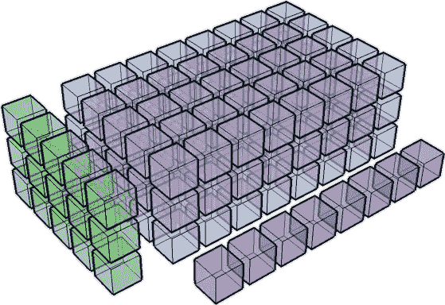
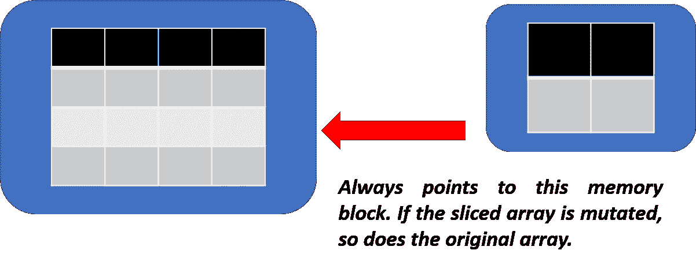

# Python NumPy 的两个很酷的特性:通过切片和广播进行变异

> 原文：<https://towardsdatascience.com/two-cool-features-of-python-numpy-mutating-by-slicing-and-broadcasting-3b0b86e8b4c7?source=collection_archive---------1----------------------->



## [NumPy](http://www.numpy.org/) 是纯金。它快速、易学、功能丰富，因此是 Python 世界中几乎所有流行科学包的核心(包括 [SciPy](https://www.scipy.org/) 和 [Pandas](http://pandas.pydata.org/) ，这两个包在数据科学和统计建模领域应用最广泛)。在本文中，让我们简要讨论 NumPy 的两个有趣的特性，即。*切片突变*和*播*。

# 切片突变

事实证明，如果使用 NumPy 的简单切片/索引来创建子数组，子数组实际上指向主数组。简单地说，内存中的图表看起来像，



因此，如果切片数组被更改，它也会影响父数组。这可能是一个有用的特性，可以将所需的链传播到食物链的上游，但有时也可能是一个麻烦，因为您需要保持主数据集不变，并且只对子集进行更改。在这些情况下，您必须显式调用 *np.array 方法*来定义切片数组，而不仅仅是通过索引来切片。下面的代码说明了这一点，

## 说明性代码

```
mat = np.array([[11,12,13],[21,22,23],[31,32,33]])
print("Original matrix")
print(mat)
**mat_slice = mat[:2,:2] # *Simple indexing***
print ("\nSliced matrix")
print(mat_slice)
print ("\nChange the sliced matrix")
mat_slice[0,0] = 1000
print (mat_slice)
print("\nBut the original matrix? WHOA! It got changed too!")
print(mat)
```

结果看起来像是，

```
Original matrix
[[11 12 13]
 [21 22 23]
 [31 32 33]]

Sliced matrix
[[11 12]
 [21 22]]

Change the sliced matrix
[[**1000**   12]
 [  21   22]]

But the original matrix? WHOA! **It got changed** too!
[[**1000**   12   13]
 [  21   22   23]
 [  31   32   33]]
```

为了阻止这种事情发生，这是你应该做的，

```
# Little different way to create a copy of the sliced matrix
print ("\nDoing it again little differently now...\n")
mat = np.array([[11,12,13],[21,22,23],[31,32,33]])
print("Original matrix")
print(mat)
**mat_slice = np.array(mat[:2,:2]) *# Notice the np.array method***
print ("\nSliced matrix")
print(mat_slice)
print ("\nChange the sliced matrix")
mat_slice[0,0] = 1000
print (mat_slice)
print("\nBut the original matrix? NO CHANGE this time:)")
print(mat)
```

现在，子矩阵中的任何变化都不会改变原始矩阵，

```
Original matrix
[[11 12 13]
 [21 22 23]
 [31 32 33]]

Sliced matrix
[[11 12]
 [21 22]]

Change the sliced matrix
[[**1000**   12]
 [  21   22]]

But the original matrix? **NO CHANGE** this time:)
[[**11** 12 13]
 [21 22 23]
 [31 32 33]]
```

# 广播

NumPy 操作通常是在逐个元素的基础上对数组对进行的。在一般情况下，两个数组必须具有完全相同的形状(或者对于矩阵乘法，内部维度必须一致)。

当数组的形状满足某些约束 时，NumPy 的 ***广播规则放松了这个约束。当操作两个数组时，NumPy 按元素比较它们的形状。它从尾部维度开始，向前推进。在以下情况下，二维是兼容的***

*   **它们相等，或者**
*   **其中一个是 1**

如果不满足这些条件，就会抛出一个*value error:frames not aligned*异常，表明数组具有不兼容的形状。结果数组的大小是沿着输入数组的每个维度的最大大小。

更多详情请查阅:[https://docs . scipy . org/doc/numpy-1 . 10 . 1/user/basics . broadcasting . html](https://docs.scipy.org/doc/numpy-1.10.1/user/basics.broadcasting.html)。

> *下面的代码块按部就班地说明了这个想法，*

*用零初始化“开始”矩阵*

```
start = np.zeros((4,3))
print(start)[[ 0\.  0\.  0.]
 [ 0\.  0\.  0.]
 [ 0\.  0\.  0.]
 [ 0\.  0\.  0.]]
```

创建一个行矩阵(向量)，

```
# create a rank 1 ndarray with 3 values
add_rows = np.array([1, 0, 2])
print(add_rows)[1 0 2]
```

将零矩阵(4x3)与(1x3)向量相加。自动地，1×3 向量被复制 4 次以使*匹配零矩阵*的行尺寸，并且这些值被添加到 4×3 矩阵中。

```
y = start + add_rows  # add to each row of 'start'
print(y)[[ 1\.  0\.  2.]
 [ 1\.  0\.  2.]
 [ 1\.  0\.  2.]
 [ 1\.  0\.  2.]]
```

创建列矩阵(向量)，

```
# create an ndarray which is 4 x 1 to broadcast across columns
add_cols = np.array([[0,1,2,3]])
add_cols = add_cols.T
print(add_cols)[[0]
 [1]
 [2]
 [3]]
```

将零矩阵(4x3)与(4x1)向量相加。自动地，4x1 向量被复制 3 次以使*匹配零矩阵*的列维度，并且这些值被添加到 4x3 矩阵中。

```
# add to each column of 'start' using broadcasting
y = start + add_cols 
print(y)[[ 0\.  0\.  0.]
 [ 1\.  1\.  1.]
 [ 2\.  2\.  2.]
 [ 3\.  3\.  3.]]
```

最后，标量被视为 1x1 矩阵，并精确复制到加法矩阵的大小以执行运算。

```
# this will just broadcast in both dimensions
add_scalar = np.array([100])  
print(start+add_scalar)[[ 100\.  100\.  100.]
 [ 100\.  100\.  100.]
 [ 100\.  100\.  100.]
 [ 100\.  100\.  100.]]
```

当您使用 NumPy 数组为像[梯度下降](http://ufldl.stanford.edu/tutorial/supervised/OptimizationStochasticGradientDescent/)这样的算法编写矢量化代码时，广播的效用得到了最好的实现。**吴恩达** [**花了一个全视频讲座**](https://www.coursera.org/learn/neural-networks-deep-learning/lecture/uBuTv/broadcasting-in-python) **在他新的深度学习课程中用 Python 解释广播的概念。**它使得深度神经网络的前向和反向传播算法的实现相对无痛。

你也可以看看这个关于广播功能演示的视频…

**Numpy Broadcasting explanation video**

如有问题或想法分享，请联系作者[**tirthajyoti【AT】Gmail . com**](mailto:tirthajyoti@gmail.com)。你也可以查看作者的 [**GitHub 知识库**](https://github.com/tirthajyoti) 中其他有趣的 Python、R 或 MATLAB 代码片段和机器学习资源。也可以[在 LinkedIn 上关注我](https://www.linkedin.com/in/tirthajyoti-sarkar-2127aa7/)。