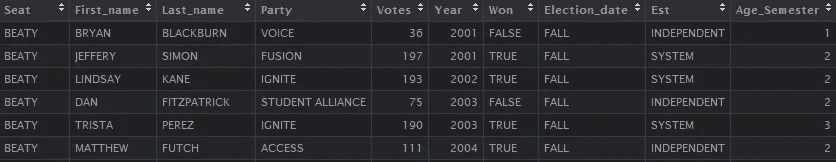
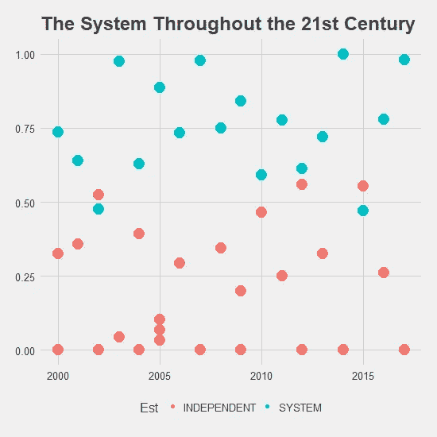
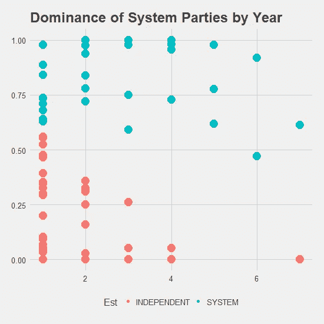
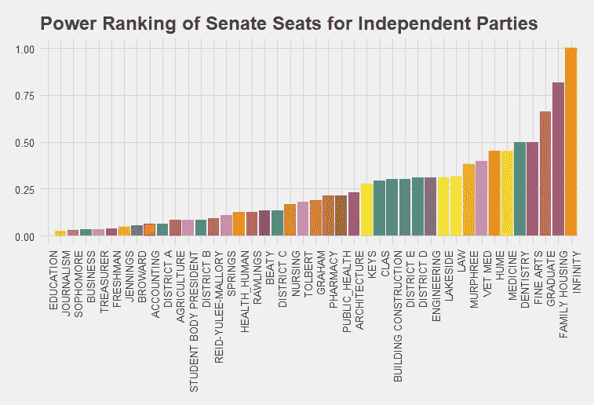
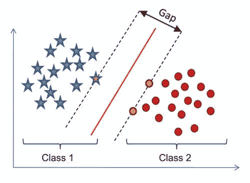
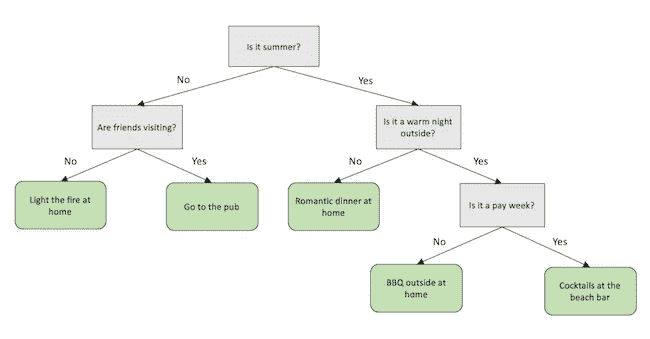
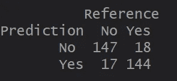
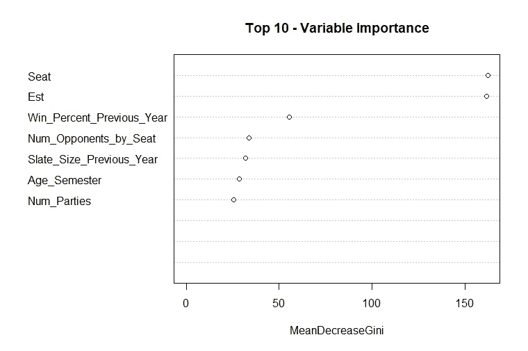

# 佛罗里达大学学生政府选举二十年:使用机器学习获得更深刻的见解

> 原文：<https://towardsdatascience.com/two-decades-of-uf-student-government-elections-using-machine-learning-for-deeper-insights-c137c0586466?source=collection_archive---------7----------------------->

三年前，我上了一堂统计学课，这门课涉及回归技术，除了统计学，我什么都不想。像班上的大多数人一样，我发现统计学很无聊、乏味，在我的日常生活中毫无用处。

怀着一丝希望，我问我的教授，我是否可以在我们刚刚被分配的回归项目中调用 audible，并尝试预测学生会选举的结果。从那以后，随着我在数据科学职业生涯中的进步，我从越来越学术和技术的角度零星地参与了这个项目。

这篇文章的其余部分将包含我的发现，我的失败，它们背后的数据，以及如何自己尝试这种类型的工作的说明。希望在我今年 12 月毕业后，其他学生可以利用这些数据，创建更好的模型和更有趣的见解。

# 数据

对于任何参与过地方选举的人来说，这并不奇怪，但是选举结果却保存在不同格式的几乎无法阅读的 pdf 文件中。通过 pdf 到文本转换器和手抄结果的结合，创造了整个 21 世纪 SG 选举的历史。

关于数据需要注意一些事情(在我的 [github](https://github.com/tylerjrichards/UF_SG/tree/master/Data) 上找到)。“Est”代表建立，我也称之为系统。该系统已经在学术上得到广泛研究，最突出的工作来自大卫·布拉德肖，他在 2013 年写了一篇关于它的论文。他(恰当地)将这一体系定义为“一个令人惊讶的复杂的赞助和讨价还价体系”，即“佛罗里达大学希腊社区的绝大多数和校园内几个最著名的非希腊学生组织的联盟，其中许多组织代表特定的少数群体，通常被称为“社区”。这些社区主要由亚裔美国学生联合会(AASU)、西班牙裔学生联合会(HSA)和黑人学生联合会(BSU)组成。学生政府的职位在希腊各学院之间进行交易，并给予社区的杰出成员，以创造多样性和包容性的外观。该系统在整个 20 世纪 70 年代和 80 年代在佛罗里达大学掌权，以确保除了上层阶级的白人男性，尤其是当时正在整合佛罗里达大学的有色人种，任何人都不能获得校园中重要和有声望的职位。你可以在这里或阅读更多关于系统[的信息，甚至可以在这里](http://www.alligator.org/opinion/columns/uf-student-leadership-controlled-by-system/article_c0bf10f8-9858-11e3-af86-0019bb2963f4.html)观看一个关于它的视频[，但这个项目的主旨是通过一个统计镜头来探索 SG。](https://www.facebook.com/notmysystem/videos/581658718652929/)

# 通过探索性数据分析的独立机会

探索性数据分析(或 EDA)在技术上是“分析数据的过程，解释这些过程的结果的技术，以及规划数据收集以使其分析更容易的方法”，这只是“对数据提出问题”的一种更长的说法

数据库完成后，我的第一个问题是“这个系统在 21 世纪的主导地位如何？”系统党赢得了每一次总统选举，除了两次，一次是在 2004 年与贾迈勒·索维尔，另一次是在 2015 年与约瑟林·帕德隆-拉辛斯，但更细致的分析可能吗？我看了一下参议院，并绘制了自 2000 年以来春季选举的胜率，发现独立政党平均只赢得了他们竞选的 21.5%的选票，而系统政党赢得了令人震惊的 81.5%的选票(T3)。这是因为有些年份有多个独立政党，而有些年份则有无竞争的选举。

这张图显示了不同时间的差异。

Winning percentage over the years

事实证明，除了几场选举，这个系统已经成功赢得了绝大多数的选举。有鉴于此，独立政党什么时候表现得好？下面是一张成功聚会的图表，按机构、聚会时间(聚会在校园里有多长时间)分类。

Winning percentage by age of party

独立党派在 T4 的第一个学期和第二个学期表现最好，随着年龄的增长，他们的表现越来越差。随着时间的推移，建制派似乎也变得越来越差，但下降速度要慢得多。

很明显，当权派会赢(在很大程度上是因为贿赂有职位的学生和[酒精](http://www.gainesville.com/news/20100303/recording-details-unite-partys-plans-to-get-uf-students-to-vote)，以及[扣留](http://www.gainesville.com/news/20100303/recording-details-unite-partys-plans-to-get-uf-students-to-vote) [食物](https://thetab.com/us/florida/2017/09/27/sorority-withholding-food-members-vote-2017-sg-election-6523)直到他们投票)。那么独立党派如何才能获胜呢？显然，一个答案是在校园的第一个学期集中精力进行选举，那时的投票率平均要高得多。但另一个潜在的努力是针对个别参议院席位。

SG 选举分为秋季和春季选举，秋季参议员按地理区域(宿舍或邮政编码)选举，春季参议员按学院(工程、商业)或年级(大一、大二)选举。就像在全国选举中一样，有些席位选举系统候选人的比率远远高于已经相当高的平均比率，即使经过一段时间。例如，在 A 区(校园东面的区域，包括所有的女生联谊会和附近的公寓楼)，**几乎从来没有一个席位是由非体制或独立党派赢得的**。根据年份的不同，A 区控制着参议院的大约 5% 到 10% 的席位。

也有倾向独立投票的席位。下面是独立党派的席位胜率图，给出了一个(伪)权力排名。在收集数据时，无穷大的样本大小是 1，平均值肯定是失真的。除此之外，独立党派赢得 50%以上的席位只有两个，家庭住房和毕业。

# **选举建模**

在选举建模领域，学者和媒体机构经常使用所谓的基本面来预测选举结果。大卫·拜勒目前正在为 2018 年 11 月的参议院模型工作，他比我更好地定义了基本面，他说

> “基本面基本上涵盖了直接投票之外的一切——总统的批准，……该州过去的选举结果，候选人的信息。”

这基本上是我们所拥有的数据。当处理这样的问题时，我想到了两种主要的方法。

## 支持向量机

首先，我想创建一个算法，如果数据被投射到二维空间，将能够创建一个超平面(在二维空间，这看起来像一条线。在我们的例子中，它作为一个多维平面存在，具有与数据相同的维数，将每次选举(给定年份、政党年龄、以前的选举结果、候选人数量等)分为两类，即获胜和失败。在数据科学中，我们称之为线性分类器。这项工作有很多潜在的算法，从 K-Nearest Neighbors 到 Perceptron，K-Nearest Neighbors 可以在训练集中找到 K 个最近的点，并允许每个点对预测进行投票，Perceptron 可以根据获得的每个新数据更新算法的权重。我最终选择了 SVM(支持向量机)分类器，因为我从理论上认为，有大量的选举很容易预测，而有少量的选举要困难得多。这让我想到了 SVM 分类器，因为 SVM 在线性分类器中最大化了相近案例之间的间隔。如果最后一段对你来说没有意义，那 100%没关系，因为一些聪明的人制作了一个图表，使这更容易理解。

有相当多的线可以将这两个类别分开，但是 SVM 找到了最大化这两个类别之间差距的线，这正是我们想要的。

在对数据进行大规模清理之后，我使用了 [caret 包](http://caret.r-forge.r-project.org)(用于预测建模/机器学习/统计分析，无论你喜欢怎么称呼它)来实现 SVM 算法。结果呢？回溯测试的准确率约为 80%。附上混淆矩阵(顶行是预测，第一列是实际结果。因此，这可以理解为“对于 SVM 预测参议员将会失败的选举，它得到了 130 个正确和 34 个不正确”)。

这个在 2018 年春季选举前创建的算法预测，Inspire(独立党)将赢得研究生参议院席位，并将输掉所有其他竞争性选举。在这种情况下，它预测了一个行政门票清扫和一个 **38/50** 参议院系统崩溃。事实证明这几乎是真的，Inspire 赢得了研究生院、牙科和美术院的席位，失去了所有其他竞争席位。参议院的总结果是 **36/50** 加上行政人员的票数，大约是 **96%** 准确。还不错！然而，我们得到的精确度超出了 95%的置信区间(精确度在 76%和 84%之间)，这可能是 2018 年选举中有第三个政党(尽管相当无组织和草率)而不是通常的两个政党的作用。有一点也是肯定的，政党数量的增加对独立政党赢得的参议院席位数量有显著的影响，对 2018 年春季的选举有影响。

## 随机森林

我想尝试的第二种方法是使用决策树(到目前为止，我最喜欢的决策树可以在这里找到)。同样，决策树有几十种不同的实现和评分机制，包括经典的分类和算法树，以及像 Boosted 树和 Random Forest 这样的集合树(可以在这里找到一篇很好的背景实现文章)。从图形上看，决策树是这样的。

What should I do with my night? A analysis with decision trees

这是一个相当简单，但非常有用的方法。一个更健壮的模型被称为随机森林，它将大量决策树与随机选择的变量相结合，并使用一组(可能相当糟糕)预测算法来创建一个新模型(这被称为集成学习)。我认为这个模型会表现得更好，因为决策树通常是我对选举的看法。候选人在商学院竞选吗？他们在系统中运行吗？那么他们很可能会赢。

实施后，我们得到了这个混淆矩阵，它转化为 89%的准确率，远远高于 SVM 方法。

随机森林算法的另一个好处是，由于它选择不同变量的方式，我们可以推导出每个变量的重要性(注意:X 轴上的 MeanDecreaseGini 是衡量类别杂质的一种方式。基尼系数的平均降幅越高，意味着该变量越重要)。

不出所料，影响最大的两个变量是席位和候选人是否是体制的一部分。考虑到这一点，仍然有人说这个系统不存在，因为它似乎能很好地预测选举结果，这确实显得很愚蠢。

在 2018 年春季选举中使用随机森林方法，随机森林在 SVM 分类器上的表现完全相同(96%)，但在测试数据上的准确率更高，为 89%。尽管如此，我还是决定在推特上发布一个略有改动的预测，说我认为 Inspire 将与工程学和 CLAS 一起赢得毕业生奖。不出所料，人类的表现远不如算法，工程和 CLAS 都受到了影响。吸取教训。

## 结论:事实证明机器学习是可行的

在整个项目中，我一直着迷于了解联合阵线选举的可预测性，即使是通过前美国参议员兼佛罗里达州州长鲍勃·格雷厄姆描述的选举

> "在州和联邦政治中，我从未遇到过像佛罗里达大学那样咄咄逼人的活动."

我最初的目标是预测选举结果，在理解了数据并尝试了几次之后，我对结果非常满意。同样，数据和脚本都是[公开的](https://github.com/tylerjrichards/UF_SG)，我随时可以回答关于数据科学、用友 SG、它们的交集或者具体这个项目的问题。通过[电子邮件](mailto:tylerjrichards@gmail.com)联系我，或者在[推特](https://twitter.com/tylerjrichards?lang=en)上找到我。

最后一点，我试图用所有领域的专业知识创建这些模型，但没有对系统如何积极地使佛罗里达大学成为一个更糟糕的地方发表意见，并且没有任何好的理由让任何人参与到 20 世纪 70 年代的活遗迹中。但我确信我的偏见会渗透进来。

我想公开感谢 William Ferra，他在该项目的数据收集和清理部分发挥了不可估量的作用。如果没有他，这个项目是不可能的，或者至少要花更长的时间。