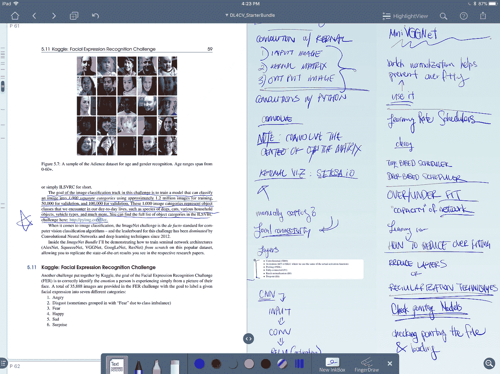
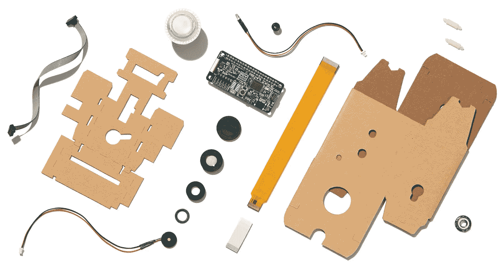
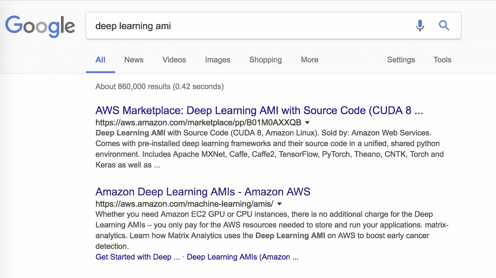
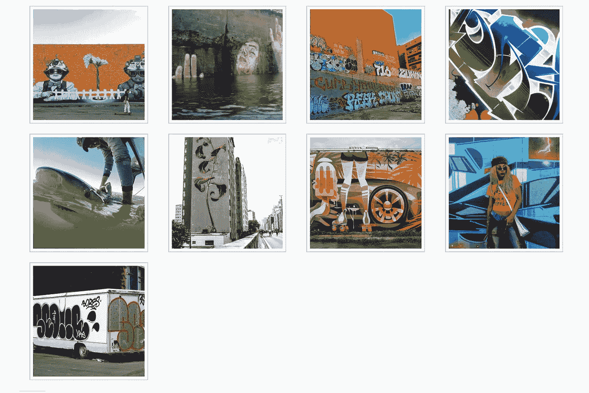
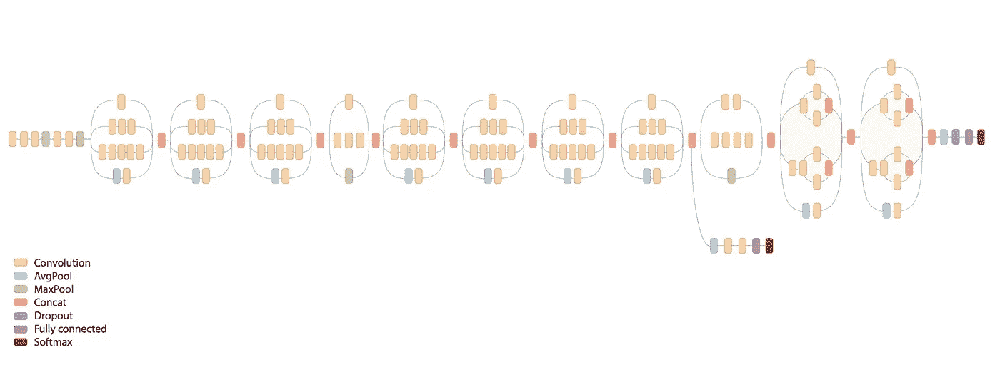
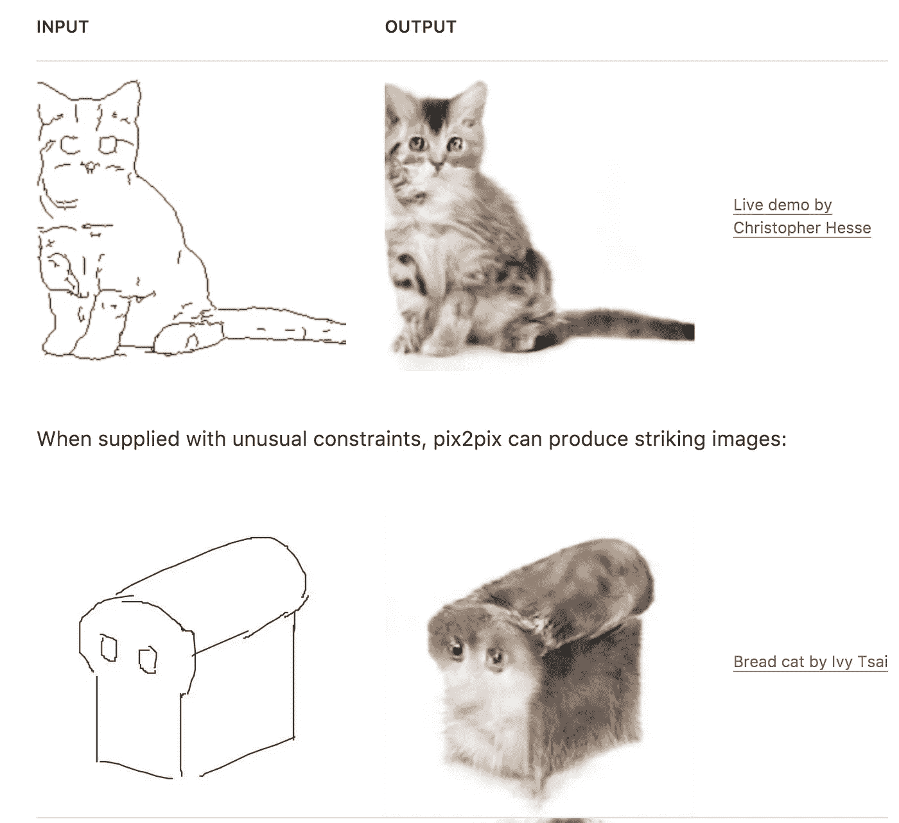

# 两个月探索深度学习和计算机视觉

> 原文：<https://towardsdatascience.com/two-months-exploring-deep-learning-and-computer-vision-3dcc84b2457f?source=collection_archive---------5----------------------->

I’ve been reading/note taking is using an iPad Pro and LiquidText

我决定熟悉计算机视觉和机器学习技术。作为一名 web 开发人员，我发现这个不断发展的领域令人兴奋，但是我没有任何使用这些技术的相关经验。我将开始为期两年的旅程来探索这个领域。如果你还没有读过，你可以在这里看到第 1 部分:[从 webdev 到计算机视觉和地理](/my-next-two-years-de448d3141a)。

—

I️最终通过探索 I️拥有的任何激发自己学习的机会来让自己动起来。我最初并没有停留在研究机器学习上，但我想回到对某个主题感到兴奋的状态。I️通过参加为期一天的加密货币学术会议开始了我的研究，到下午会议开始时，我意识到机器学习和计算机视觉对我来说更有意思。

## 入门指南

大约在一本关于深度学习和计算机视觉交叉领域的伟大著作出版的时候，I️启动了我的探索。来自 PyImageSearch.com 的作者[Adrian rose Brock](https://www.pyimagesearch.com/deep-learning-computer-vision-python-book/)汇编了一部关于计算机视觉和深度学习的高级思想和低级应用的三卷巨著。在探索深度学习的过程中，I️遇到了对线性回归、朴素贝叶斯应用(I️现在意识到，I️已经听到这个名字有很多不同的发音)、随机森林/决策树学习以及所有其他我正在屠杀的东西的无数解释。

I️花了几周时间阅读这本书，并感觉 I️可以将我迄今为止阅读的所有不同的博客帖子与一系列数学概念、抽象概念和实际编程应用联系起来。[我快速通读了这本书](https://www.pyimagesearch.com/deep-learning-computer-vision-python-book/)，并且对如何将这个领域作为一个整体有了更好的理解。我最大的收获是得出了这样的结论:I️想要巩固我自己的工具和硬件，以构建计算机视觉软件。

## 硬件实现

I️受到启发，得到了一台 Raspberry Pi 和 RPI 相机，I️可以用它来分析视频流。我一点也不知道设置树莓酱会花很长时间。最初，I️希望简单地启动并运行一个视频流，然后在我的电脑上处理视频。I️努力让树莓 Pi 操作系统工作起来。然后，一旦 I️意识到什么是错的，I️不小心安装了错误的图像驱动程序，并意外地安装了冲突的软件。I️最初认为这个过程会充满对相机图像的处理，结果却变成了一场耗时数小时的调试噩梦。

到目前为止，I️已经意识到这是机器学习的一个重要开始，而计算机视觉的“东西”是关于调试的。

第一步。得到一个想法。
第二步。开始寻找做这件事的工具。
第三步。安装所需的软件。
第四步。淹没在冲突和意外的包版本问题中。

[https://aiyprojects.withgoogle.com/vision#list-of-materials](https://aiyprojects.withgoogle.com/vision#list-of-materials)

树莓派背后我最初的灵感是建立一个简单的设备，有一个摄像头和 GPS 信号的想法。这个想法是基于对未来有多少车辆，自动驾驶或车队车辆，将需要许多摄像头进行导航的思考。无论是出于保险目的还是为了基本功能，I️设想将会有大量的视频素材被创建和使用。在这个过程中，将会有大量的媒体储存库闲置不用，成为了解世界的丰富数据源。

I️最终探索了树莓派的计算机视觉能力，但从未像我希望的那样成功地获得任何有趣的工作。I️发现有许多更便宜的类似树莓派的设备，它们在比全尺寸树莓派更小的 PCB 板上同时具有互连性和相机功能。后来，I️意识到，与其走硬件路线，I️还不如用一部旧 iPhone，开发一些软件。

我在探索深度学习的硬件组件方面的短暂尝试让我意识到，我应该尽可能坚持软件。当软件部分没有解决时，包含一个新的变量只会增加复杂性。

## 开源工具

在寻找机器学习资源的第一个月，我发现了许多开源工具，它们使启动和运行变得非常容易。我知道方科技公司提供了许多专有服务，但我不确定他们如何与开源软件竞争。可以作为 SAAS 工具使用的图像识别和 OCR 工具来自 IBM、Google、Amazon 和 Microsoft，非常容易使用。令我惊讶的是，有很好的开源替代方案值得配置，以避免不必要的服务依赖。

例如，几年前，我推出了一个 iOS 应用程序，用来收集和分享涂鸦照片。我从带有地理标签的公开 API 中检索图片，比如 Instagram 和 Flickr。利用这些来源，我使用基本特征，如标签和位置数据，来区分图像是否真的是涂鸦。最初，我开始每周拉几千张照片，很快就增加到一个月几十万张。我很快注意到，我索引的许多图像不是涂鸦，而是对我试图培养的社区具有破坏性的图像。我无法阻止人们自拍的低质量照片或对工作不安全的糟糕标记的图像加载到人们的订阅源中。因此，我决定关闭整个项目。

#graffiti results on instagram

现在，有了机器学习服务和用于对象检测和裸体检测的开源实现，我可以推出自己的服务，轻松检查每张被索引的照片。以前，如果我支付一项服务来进行质量检查，我会在 API 费用上花费数百美元，如果不是数千美元的话。相反，我现在可以从一些“数据科学”AWS 盒子下载一个 AMI，并创建自己的 API 来检查不想要的图像内容。这对我来说遥不可及，甚至就在两年前。

## 概观

在很高的层面上，在经历这个过程之前，我觉得自己理论上理解了大部分的物体识别和机器学习过程。在开始将我一直在消费的所有机器学习内容之间的点连接起来的过程之后，我觉得我对我需要学习的概念更加清楚了。例如，我不仅仅知道线性代数对机器学习很重要，我现在理解了问题如何被分解成多维数组/矩阵，并被大量处理以寻找仅在理论上可表示的模式。之前，我知道在特性之间有一些抽象，以及它们如何被表示为可以在一系列评估项目之间进行比较的数字。现在，我更清楚地理解了在机器学习的背景下，维度是如何通过纯粹的事实来表示的，即有许多因素直接或间接相互关联。特征检测和评估的多维方面的矩阵数学对我来说仍然是一个谜，但是我能够理解高层次的概念。

The previously illegible network architecture graphs are now seemingly approachable.

具体来说，阅读 Adrian Rosebrock 的书给了我解读机器学习算法的盒线图的洞察力。深度学习网络架构的崩溃现在有些可以理解了。我还熟悉常用于测试各种图像识别模型的数据集(MNIST、CIFAR-10 和 ImageNet)，以及图像识别模型之间的差异(如 VGG-16、Inception 等)。

## 时机——公共资金

我认为现在学习机器学习和计算机视觉很重要的一个原因与我从[这本书](https://www.pyimagesearch.com/deep-learning-computer-vision-python-book/)中学到的一个概念有关:政府在研究方面投入大量资金的领域将会有巨大的创新。目前，除了分配给特定机器学习相关项目的特定资金外，还有数亿美元以赠款和奖学金的形式花费在研究项目上。

Example of pix2pix algorithm applied to “cat-ness”. [https://distill.pub/2017/aia/](https://distill.pub/2017/aia/)

除了政府支出，来自私人机构的公开研究似乎也在增长。目前存在的研究形式，来自大型科技公司和公共基金会，正在推动整个机器学习领域。我个人从未见过像 distill.pub 这样的出版物和 OpenAI foundation 这样的集体形式的私人机构资助的公共项目如此集中。他们所做的工作是无与伦比的。

## 可行的任务

回顾我一直在阅读的材料，我意识到我的记忆力已经开始衰退了。从现在开始，我要做更多的行动导向的阅读。我现在有一个装有 GPU 的盒子，所以我觉得在训练模型和处理数据集方面没有任何限制。

最近，我参加了一个由 Carto 主办的关于空间数据科学的大型会议。在那里，我非常清楚地意识到我在空间数据科学领域有多少知识。在会议之前，我只是把整个领域称为“地图定位数据的东西”。

我会继续努力在网上结识有相似兴趣的不同的人。我已经能够对我找到的住在纽约并写了与我当前搜索相关的中型帖子的人这样做了。最近，在探索如何构建一个 GPU 盒子时，我得以与一位机器学习探索伙伴共进早餐。

到一月中旬，我希望熟悉围绕涂鸦图像训练模型的技术框架。我认为至少，我希望有一组要处理的图像，将图像关联到的标签，以及对照已训练的标签交叉检查未索引图像的过程。

感谢 Jihii Jolly 纠正我的语法。