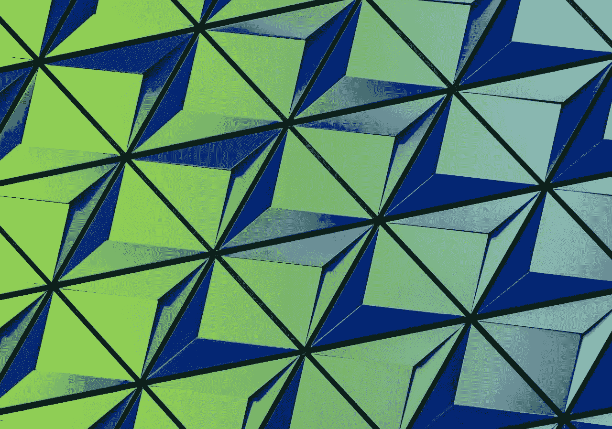
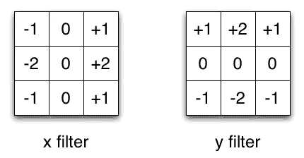

# 深度学习中不同类型卷积的介绍

> 原文：<https://towardsdatascience.com/types-of-convolutions-in-deep-learning-717013397f4d?source=collection_archive---------0----------------------->

让我给你一个快速概述不同类型的卷积和他们的好处。为了简单起见，我只关注 2D 卷积。

# 回旋

首先，我们需要就定义卷积层的几个参数达成一致。

2D convolution using a kernel size of 3, stride of 1 and padding

*   **内核大小**:内核大小定义卷积的视野。2D 的常见选择是 3，即 3x3 像素。
*   **步幅**:步幅定义了内核遍历图像时的步长。虽然其默认值通常为 1，但我们可以使用步幅 2 对图像进行缩减采样，类似于 MaxPooling。
*   **填充**:填充定义如何处理样本的边框。(一半)填充卷积将保持空间输出维度等于输入维度，而如果内核大于 1，未填充卷积将裁剪掉一些边界。
*   **输入&输出通道**:卷积层取一定数量的输入通道(I)，计算出特定数量的输出通道(O)。这种层所需的参数可以通过 I*O*K 来计算，其中 K 等于内核中值的数量。

# 扩张的回旋

(又名 atrous 卷积)

2D convolution using a 3 kernel with a dilation rate of 2 and no padding

膨胀卷积为卷积层引入了另一个参数，称为**膨胀率**。这定义了内核中值之间的间距。膨胀率为 2 的 3×3 内核将具有与 5×5 内核相同的视野，同时仅使用 9 个参数。想象一下，取一个 5x5 的内核，每隔一行删除一列。

这以相同的计算成本提供了更宽的视野。膨胀卷积在实时分割领域特别流行。如果你需要一个宽广的视野并且不能负担多重卷积或者更大的内核，使用它们。

# 转置卷积

(又名去卷积或分数步长卷积)

有些资料来源使用反卷积这个名称，这是不恰当的，因为它不是反卷积。更糟糕的是，反进化确实存在，但它们在深度学习领域并不常见。实际的反卷积反转了卷积的过程。设想将一幅图像输入到一个卷积层中。现在拿出输出，把它扔进一个黑盒子里，你的原始图像又出来了。这个黑盒做反卷积。这是卷积层的数学逆运算。

转置卷积有些类似，因为它产生的空间分辨率与假设的反卷积图层相同。然而，对这些值执行的实际数学运算是不同的。转置卷积层执行常规卷积，但恢复其空间变换。

2D convolution with no padding, stride of 2 and kernel of 3

在这一点上你应该很困惑，所以让我们看一个具体的例子。一个 5x5 的图像被送入卷积层。步幅被设置为 2，填充被停用，并且内核是 3x3。这会产生一个 2x2 的图像。

如果我们想逆转这个过程，我们需要逆向数学运算，这样我们输入的每个像素就产生 9 个值。之后，我们以步长 2 遍历输出图像。这将是一个反卷积。

Transposed 2D convolution with no padding, stride of 2 and kernel of 3

转置卷积不会这样做。唯一的共同点是，它保证输出也将是 5x5 图像，同时仍执行正常的卷积运算。为了实现这一点，我们需要对输入进行一些花哨的填充。

正如你现在所能想象的，这一步不会逆转上面的过程。至少不考虑数值。

它仅仅从以前重建空间分辨率并执行卷积。这可能不是数学上的逆运算，但对于编码器-解码器架构来说，它仍然非常有用。这样，我们可以将图像的放大与卷积结合起来，而不是进行两个独立的过程。

# 可分卷积

在可分离卷积中，我们可以将核操作分成多个步骤。让我们将一个卷积表示为 **y = conv(x，k)** 其中 **y** 为输出图像， **x** 为输入图像， **k** 为内核。简单。接下来，我们假设 k 可以通过: **k = k1.dot(k2)** 来计算。这将使它成为一个可分离的卷积，因为我们可以通过对 k1 和 k2 进行 2 次 1D 卷积来得到相同的结果，而不是对 k 进行 2D 卷积。

Sobel X and Y filters

以图像处理中常用的 Sobel 核为例。通过将 vector [1，0，-1]和[1，2，1].T 相乘，可以得到相同的内核。在执行相同的操作时，这将需要 6 个而不是 9 个参数。上面的例子显示了所谓的**空间可分卷积**，据我所知，它没有用于深度学习。

*编辑:实际上，人们可以通过堆叠 1xN 和 Nx1 内核层来创建非常类似于空间可分离卷积的东西。这是最近在一个叫做*[*EffNet*](https://arxiv.org/abs/1801.06434v1)*的架构中使用的，显示出有希望的结果。*

在神经网络中，我们通常使用一种叫做**深度方向可分离卷积的东西。**这将在保持通道分离的同时执行空间卷积，然后执行深度卷积。在我看来，用一个例子最能理解。

假设我们在 16 个输入通道和 32 个输出通道上有一个 3×3 卷积层。具体发生的情况是，32 个 3×3 内核遍历 16 个通道中的每一个，从而产生 512(16×32)个特征图。接下来，我们通过将每个输入通道相加来合并 1 个特征图。因为我们可以这样做 32 次，我们得到了我们想要的 32 个输出通道。

对于同一个例子中的深度方向可分离卷积，我们遍历 16 个通道，每个通道具有 1 个 3×3 内核，给我们 16 个特征图。现在，在合并任何东西之前，我们用 32 个 1x1 卷积遍历这 16 个特征图，然后开始将它们加在一起。这导致 656 (16x3x3 + 16x32x1x1)个参数，而不是上面的 4608 (16x32x3x3)个参数。

该示例是深度方向可分离卷积的具体实现，其中所谓的**深度乘数**是 1。这是迄今为止此类层最常见的设置。

我们这样做是因为假设空间和深度信息可以分离。从例外模型的表现来看，这个理论似乎是可行的。深度方向可分离卷积也用于移动设备，因为它们有效地使用参数。

# 有问题吗？

这就结束了我们通过不同类型的回旋的小旅行。我希望这有助于对这件事有一个简要的了解。如果你还有任何问题，请发表评论，并查看[GitHub 页面获取更多卷积动画。](https://github.com/vdumoulin/conv_arithmetic)