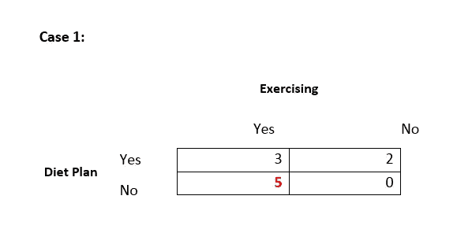
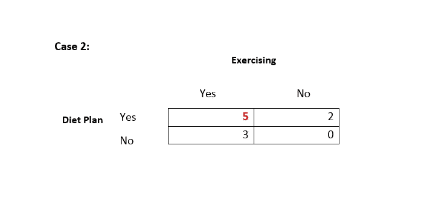
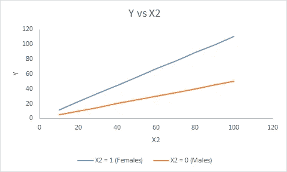

# 市场组合建模中交互效应的类型

> 原文：<https://towardsdatascience.com/types-of-interaction-effects-in-market-mix-modeling-mmm-95247f3de36e?source=collection_archive---------6----------------------->

Source: [Pixabay](https://pixabay.com/)

在这篇文章中，我想谈谈在市场组合模型中变量之间的各种类型的相互影响。

这篇文章是我在 MMM 上写的系列文章的延续。关于 MMM 的前三篇文章可以在[这里](/market-mix-modeling-mmm-101-3d094df976f9)、[这里](/market-mix-modeling-101-part-2-95c5e147c8a3)和[这里](https://medium.com/@ridhima.kumar0203/market-mix-modeling-101-elasticity-e881f1df5c8b)找到

## 那么，回归中的交互作用效应是什么呢？

[交互效应是两个或多个自变量对至少一个因变量的同时效应，其中它们的联合效应显著大于(或显著小于)各部分的总和。](http://methods.sagepub.com/reference/encyclopedia-of-survey-research-methods/n226.xml)它有助于理解两个或多个自变量如何协同工作来影响因变量。

首先理解两个组成部分很重要——主效应和交互效应。

**主要效果:**

主效应是单个自变量对因变量的影响——忽略所有其他自变量的影响。

**交互效果:**

如上所述，两个或多个自变量对至少一个因变量的同时效应，其中它们的联合效应明显大于(或明显小于)各部分的总和。

我将把这篇文章限制在讨论两个变量之间的相互作用。

**交互效果可以在两者之间:**

**I.** **分类变量**

**二。** **连续变量**

**三。** **一个分类变量和一个连续变量**

对于每一种情况，解释都会略有不同。

## **1。分类变量之间:**

想象有人在努力减肥。减肥可能是锻炼或遵循饮食计划的结果，也可能是两者协同作用的结果。

以上数字表示以千克为单位的重量损失。

以上结果说明了什么？

结果表明，单独锻炼比节食计划更有效，体重减轻了 5 公斤

**二。**与锻炼和节食计划同时进行的情况(你的节食计划不起作用)相比，只有锻炼才能减轻更多体重

以上结果说明了什么？

这表明，当运动和饮食计划一起实施时，体重下降更高。所以，我们可以说，锻炼和饮食计划之间存在着相互作用。

## **2。**连续变量间的

**让我们来看一个显示主效应和交互效应分量的回归方程。**

****Y =β0+β1 * X1+β2 * X2+β3 * X1 x2****

**上述等式解释如下:**

**i. β1 是当 X2 等于 0 时 X1 对 Y 的影响，即当 X2 等于 0 时，X1 增加一个单位导致 Y 增加β1 个单位。**

**二。类似地，当 X1 等于 0 时，β2 是 X2 对 Y 的影响，即当 X1 等于 0 时，X2 增加一个单位导致 Y 增加β2 个单位。**

**三。在 X1 和 X2 都不为零的情况下，X1 对 Y 的影响取决于 X2，而 X2 对 Y 的影响取决于 X1。**

**为了更清楚，让我们用另一种格式重写上面的等式。**

****Y =β0+(β1+β3 * X2)X1+β2 * X2****

*****=>Y =β0+β1 * X1+(β2+β3 * X1)X2*****

**=> (β1 + β3* X2)是 X1 对 Y 的影响，它取决于 X2 的值**

**=> (β2 + β3* X1)是 X2 对 Y 的影响，它取决于 X1 的值**

**请注意，本文是针对用于市场组合建模的输入/变量而写的。上述概念是 MMM 的一种可能情况，其中输入值可能为零。**

**对于输入变量不能为零的情况，采取一些其他措施。一个例子可以是一个模型，其中一个人的体重被认为是一个回归变量。一个人的体重不能为零:)**

## ****3。** **一个连续变量和一个分类变量****

**一个分类变量和一个连续变量之间的相互作用类似于两个连续变量。**

**让我们回到我们的回归方程:**

*****Y =β0+β1 * X1+β2 * X2+β3 * X1 x2*****

**其中 X1 是分类变量，比如说(女性= 1，男性= 0)**

**X2 =连续变量**

*   ****当 X1 = 0 时，Y = β0 + β2*X2****

**= > X2 增加一个单位将导致男性 Y 增加β2 个单位**

*   ****当 X1 = 1 时，Y = β0 + β1 + (β2 + β3)*X2****

**= >女性在 X2 增加一个单位将导致 Y 增加β2 + β3 个单位**

**X2 对 Y 的影响女性高于男性(请参考下图 1)**

****

**Figure 1**

## ****MMM 中交互的解释:****

## ****1。两个分类变量:****

**让我们来看两个分类变量——季节性和一些产品的推出。**

**假设季节性和产品投放都与销售有积极的关系。季节性和以个人身份推出产品会带来销售。如果他们之间有互动效应，这可能会增加销售额。**

*****Y = β0 + β1*季节性+β2 *产品投放+ β3*季节性*产品投放*****

*****=>Y =β0+β1+β2+β3*****

*****其中季节性和产品投放= 1*****

**如果没有相互作用，Y = β0 + β1 + β2**

## ****2。两个连续变量:****

**MMM 中两个连续变量之间相互作用的例子可以是电视广告和数字广告一起对销售的影响。**

**因此，当存在交互项时，电视广告对销售的影响取决于数字广告，而数字广告对销售的影响取决于电视广告。**

*****Y = β0 + β1*电视广告+β2 *数字广告+ β3*电视广告*数字广告- >正向互动术语*****

**如果交互项为正，那么这两个变量的联合效应是协同的，因为它会导致额外的销售。建议这两种类型的广告应该同时进行，以获得更高的销售额。**

*****Y = β0 + β1*电视广告+β2 *数字广告- β3*电视广告*数字广告- >负面互动术语*****

**如果交互项是负的，那么交互组件会拿走一部分销售额，从而降低总销售额。在这种情况下，建议不要同时开展这两项活动，因为这会影响销售。(您的活动在客户中制造混乱:P)**

**请注意，这两种投入的主要影响是积极的，但综合影响具有负的β值，导致总销售额减少。**

## ****3。一个连续变量和一个分类变量****

**其中 X1 是分类变量，比如季节性(如果有季节性，则为 1，否则为 0)**

**X2 =连续变量:电视广告**

**Y =销售额**

**销售受到季节性和电视广告的影响，当它们一起作用时。**

****Y =β0+β1 *季节性+ β2*电视广告+ β3*电视广告*季节性****

**在这种情况下，当季节性因素存在时，则:**

****Y =β0+β1+β2 *电视广告+ β3*电视广告****

*****=>Y =β0+β1+(β2+β3)*电视广告*****

**电视和季节性之间的相互作用导致了额外的销售。**

**这是一篇关于变量间交互作用的简介。互动效应本身就是一个巨大的话题。还有更多微妙之处。**

**请继续关注 MMM 上的更多文章…..**

****参考:****

** [## 相互影响

### 对于不知情的人来说，调查似乎是一种容易设计和进行的研究，但是当学生和…

methods.sagepub.com](http://methods.sagepub.com/reference/encyclopedia-of-survey-research-methods/n226.xml) 

如果你喜欢我的文章，给它一些掌声，或者更好地与你的朋友或同事分享。

页（page 的缩写）最近，很多人问我是否做市场组合建模/营销分析方面的咨询。

答案是肯定的。您可以将您的咨询问题发布到[https://www.arymalabs.com/](https://www.arymalabs.com/)

你也可以在 [LinkedIn](https://www.linkedin.com/in/ridhima-kumar7/) 上联系我

【www.ridhimakumar.com】版权所有 2018 [**版权所有**](http://www.ridhimakumar.com) **版权所有。****