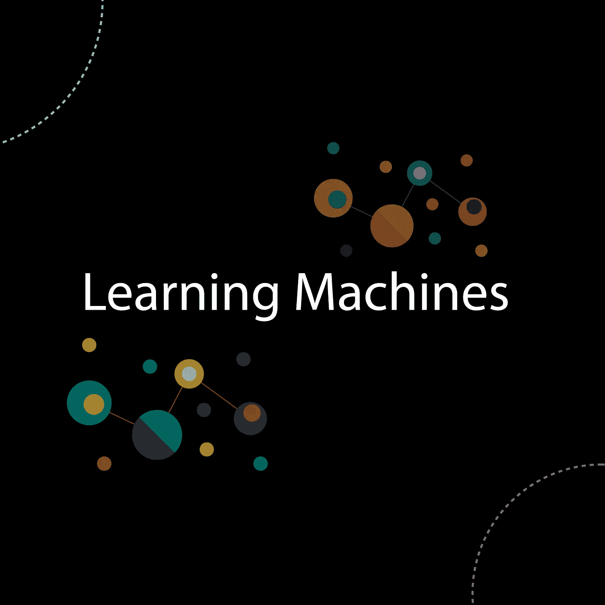
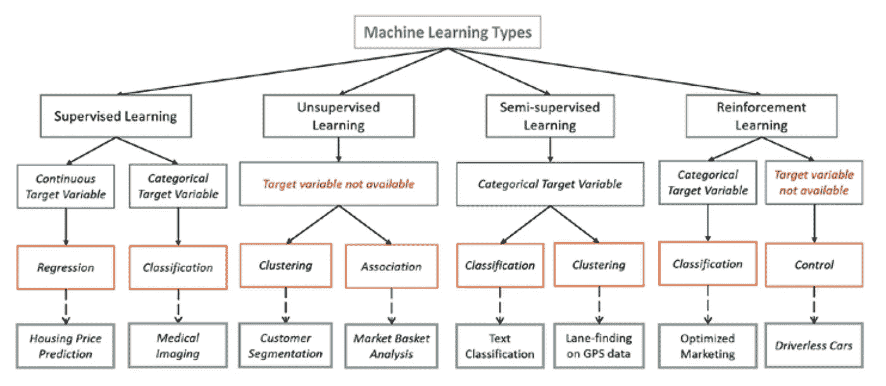

# 你应该知道的机器学习算法的类型

> 原文：<https://towardsdatascience.com/types-of-machine-learning-algorithms-you-should-know-953a08248861?source=collection_archive---------0----------------------->

应我的朋友 Richaldo 的要求，在这篇文章中，我将解释机器学习算法的类型以及何时应该使用它们。我特别认为，了解机器学习算法的类型就像了解人工智能的全貌，以及该领域正在做的所有事情的目标是什么，并让你处于更好的位置来分解一个真正的问题并设计一个机器学习系统。

本帖中经常使用的术语:

*   **标记数据**:由一组*训练示例组成的数据，*其中每个示例是由输入和期望输出值组成的*对*(也称为*监控信号、标签等*
*   **分类:**目标是预测离散值，例如{1，0}、{True，False}、{spam，not spam}。
*   **回归:**目标是预测连续值，例如房价。

# 机器学习算法的类型

如何定义机器学习算法的类型有一些变化，但通常它们可以根据它们的目的分成几类，主要类别如下:

*   **监督学习**
*   **无监督学习**
*   **半监督学习**
*   **强化学习**

# 监督学习

*   我喜欢用函数逼近的概念来考虑监督学习，基本上我们训练一个算法，在过程的最后，我们选择最好地描述输入数据的函数，对于给定的 X，它对 y (X -> y)做出最好的估计。大多数时候，我们无法找出总是做出正确预测的真正函数，其他原因是算法依赖于人类关于计算机应该如何学习的假设，这种假设引入了偏差，偏差是我将在另一篇文章中解释的主题。
*   在这里，人类专家充当教师，我们向计算机提供包含输入/预测的训练数据，我们向它显示正确的答案(输出),计算机应该能够从这些数据中学习模式。
*   监督学习算法试图*对目标预测输出和输入特征*之间的关系和依赖性进行建模，这样我们就可以根据它从以前的数据集中学习到的那些关系来预测新数据的输出值。

## 起草

*   预测模型
*   我们已经标记了数据
*   监督学习问题的主要类型包括回归和分类问题

# 常用算法列表

*   最近邻
*   朴素贝叶斯
*   决策树
*   线性回归
*   支持向量机(SVM)
*   神经网络

# 无监督学习

*   用未标记的数据训练计算机。
*   这里根本没有老师，实际上计算机在学习了数据模式后可能会教你新的东西，这些算法在人类专家不知道在数据中寻找什么的情况下特别有用。
*   是机器学习算法家族，主要用于*模式检测*和*描述性建模*。然而，*这里没有输出类别或标签*，算法可以基于它们来尝试对关系进行建模。这些算法尝试对输入数据使用技术来*挖掘规则*、*检测模式*，以及*汇总和分组数据点*，这些数据点有助于获得有意义的见解并向用户更好地描述数据。

## 起草

*   描述性模型
*   无监督学习算法的主要类型包括*聚类算法和关联规则学习算法。*

## 常用算法列表

*   k-均值聚类，关联规则

# 半监督学习

在前两种类型中，要么数据集中的所有观察值都没有标签，要么所有观察值都有标签。半监督学习介于这两者之间。在许多实际情况下，标记的成本相当高，因为这需要熟练的人类专家来做。因此，在大多数观察值中没有标签但在少数观察值中存在标签的情况下，半监督算法是建模的最佳候选。这些方法利用了这样的思想，即使未标记数据的组成员是未知的，该数据也携带关于组参数的重要信息。

# 强化学习

方法的目的是利用从与环境的相互作用中收集的观察结果来采取行动，使回报最大化或风险最小化。强化学习算法(称为代理)以迭代的方式不断地从环境中学习。在这个过程中，代理从它的环境经验中学习，直到它探索所有可能的状态。

**R** 强化学习是*机器学习*的一种，因此也是*人工智能*的一个分支。它允许机器和软件代理自动确定特定上下文中的理想行为，以最大化其性能。需要简单的奖励反馈让代理学习它的行为；这就是所谓的强化信号。

这里有许多不同的算法来解决这个问题。事实上，强化学习是由特定类型的问题定义的，其所有解决方案都被归类为强化学习算法。在这个问题中，一个代理应该根据他当前的状态来决定最佳的行动。当这个步骤被重复时，这个问题被称为*马尔可夫决策过程*。

为了产生智能程序(也称为代理)，强化学习经历以下步骤:

1.  代理观察输入状态。
2.  决策功能用于使代理执行一个动作。
3.  行动完成后，行动者从环境中获得奖励或强化。
4.  存储关于奖励的状态-动作对信息。

## 常用算法列表

*   q 学习
*   时差
*   深层敌对网络

## 使用案例:

*强化学习算法*的一些应用是计算机玩的棋盘游戏(象棋、围棋)、机器人手和无人驾驶汽车。

# 最终注释

有可能使用不同的标准来分类机器学习算法的类型，但我认为使用学习任务是很好的，以可视化 ML 的大画面，我相信根据你的问题和你手中的数据，你可以很容易地决定你将使用监督，无监督或强化学习。在接下来的文章中，我会给出更多关于每种机器学习算法的例子。

下面这张来自 en.proft.me 的图片或许能帮到你。

# 进一步阅读

*   [**机器学习算法之旅**](http://machinelearningmastery.com/a-tour-of-machine-learning-algorithms/)
*   [**机器学习算法精要(附 Python 和 R 代码)**](http://www.analyticsvidhya.com/blog/2015/08/common-machine-learning-algorithms/)
*   [**有监督和无监督的学习算法有什么区别？**](https://www.quora.com/What-is-the-difference-between-supervised-and-unsupervised-learning-algorithms)
*   ****(这个很好玩，解释得很好)****

**让我知道你对此的想法，如果你有你想看的主题的建议，请联系我们。**

## **最后做的事**

**如果你喜欢这些作品，请留下你的掌声👏推荐这篇文章，让其他人也能看到。**