# 优步司机调度优化

> 原文：<https://towardsdatascience.com/uber-driver-schedule-optimization-62879ea41658?source=collection_archive---------5----------------------->

这个模型实现和图形可以在我的 [Github 库](https://github.com/Ivan-Zhou/Uber_Driver_Schedule_Optimization)中找到。

此外，非常感谢我的团队成员 Deep Prasad、Emily Xu 和 Sharlene Peng 为这个项目做出的贡献。

# 第 1 部分:导言

优步的关键价值主张之一是为他们的司机合作伙伴提供调度灵活性。根据 Beneson Strategy Group 的一份报告，73%的司机更喜欢有一份可以让他们选择时间表的工作。司机可以利用这种灵活性，在可用时间内最大化他们的预期收入。为此，优步提供了客户需求热图，使司机能够瞄准高需求区域，提供更高的出行概率，从而获得更高的预期收入。

然而，没有现成的方法来确定从特定位置开始的行程是否值得为该行程花费时间。例如，由于交通而花费较长时间但需求较高的行程可能会导致总行程较少，价值较低。另一方面，需求较少但持续快速的旅行可能更有价值。因此，平衡某个位置的需求和从该位置出发的行程所需时间最符合驾驶员的利益。

**为了解决这一缺口，我们试图使用混合整数规划(MIP)创建一个调度优化模型。**

# 第 2 部分:数据收集

两个数据集用于确定**需求**和**行程持续时间**。因为优步的需求数据不可用，所以 DC 出租车载客数据被用作需求的替代数据。持续时间由优步运动数据集确定。

## DC 出租车数据-需求

数据集来自 DC 开放数据中心。它描述了以坐标表示的特定位置的单个出租车行程。从 1 月到 3 月，该数据集包含 10，843 个不同位置的总共 5，546，786 次拾取。

为了将数据离散化并缩小问题的规模，我们需要将皮卡分类到高需求区域。首先，计算每个位置的取货数量。然后，为了定义区域，我们选择了提货次数最多的前 100 个位置(见图 1–1 ),因为它们占提货总数的 30%。MATLAB 的 kmeans 函数用于将计数聚类成 5 个区域质心(见图 1–2)。基于到其他四个区域的最小欧几里德距离计算每个区域的半径。


*Table 1: High-Demand Region Parameters*

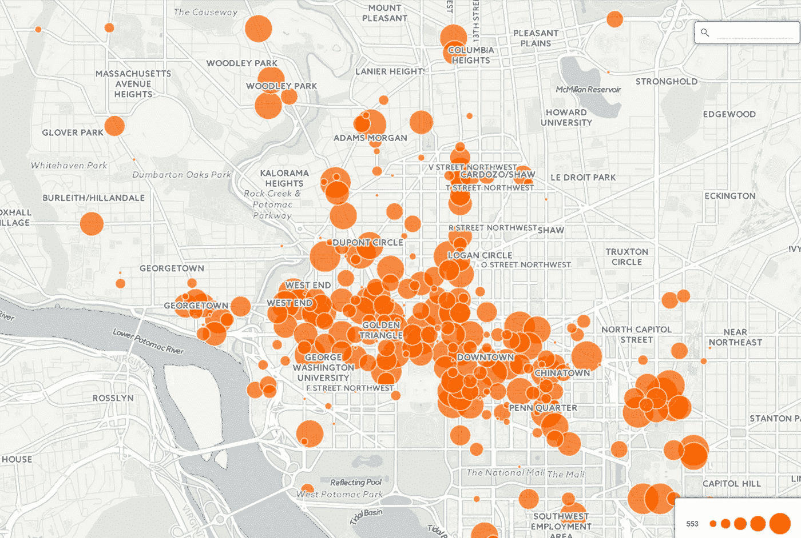

*Figure 1–1: Taxicab Pickups in D.C.*

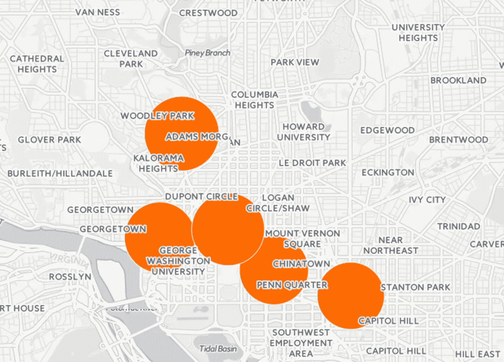

*Figure 1–2: High Demand Pickup Regions in D.C.*

由于我们只比较区域内的行程，因此接货计数被过滤为只包括从五个区域之一始发且目的地与始发地在同一区域内的行程。然后对一天中的时间、一周中的日期和地区的计数进行平均和汇总。下面是一个经过清理的离散化数据集的示例。

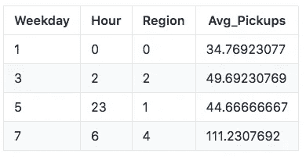

*Table 2: Sample of Demand Data (cleaned) used for Model*

## 优步移动数据—行程持续时间

该数据集来自优步的“优步运动”倡议(见附录 A)。它描述了每个始发地-目的地区域对的平均、最小和最大行程持续时间。优步运动的区域小于之前确定的五个高需求区域。为了使这两个数据集具有可比性，对起点-目的地对进行了过滤，以仅包括完全落在五个区域之一内的区域，并且这些区域的目的地与起点在同一区域内(见图 2)。然后计算五个区域中每个区域的平均、最小和最大旅行持续时间。与需求数据类似，这些值是按一天中的时间、一周中的日期和地区聚合的。数据集的样本可以在下面找到。

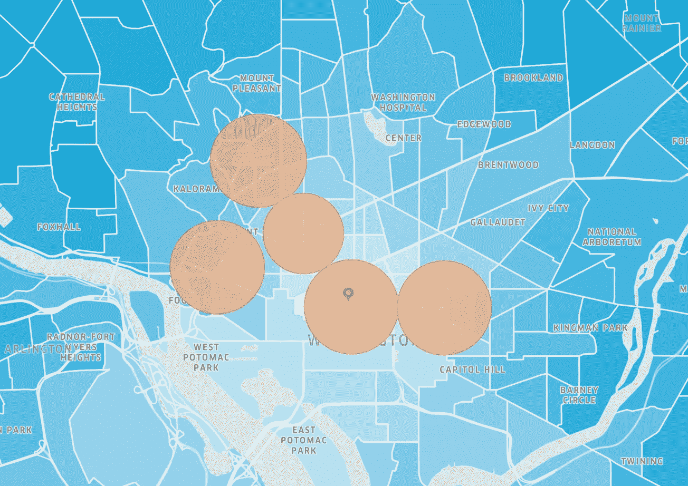

*Figure 2: High Demand regions over-laid over Uber Regions*

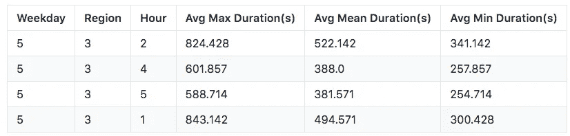

*Table: Sample of Trip Duration Data (cleaned) used for the model*

# 第 3 部分:方法

使用需求和行程持续时间数据，开发了一个混合整数规划模型来为驾驶员找到最佳驾驶计划。MIP 是线性优化程序，一旦得到一个解，其中一些变量可以是整数，而另一些则不可以。

最著名的 MIP 和我们的类似:T2 背包问题。在我们的例子中，背包的容量代表了优步司机为他们的日程安排分配的“总时间”。我们希望最大化预期收入。开发了以下 MIP:

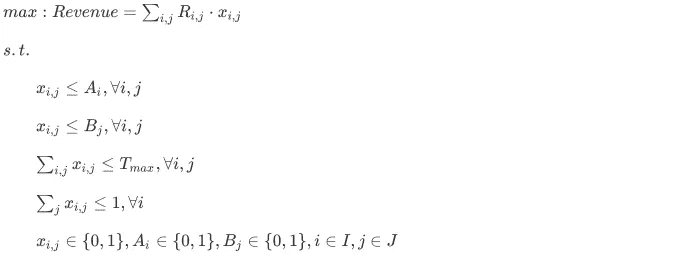

# 目标函数

该模型的目标函数是使司机在一周的工作时间内获得的收入最大化。这是通过最大化每个推荐区域 j 和时间段 I 的预期收入之和来实现的。预期收入项 R_{ij}的计算公式如下:

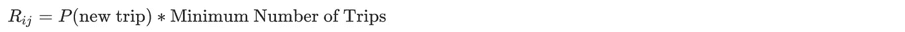

其中我们假设新出行的概率均匀分布在 0.5 和 1 之间，因为这 5 个区域是基于高需求选择的。基于这一假设，可以使用需求来分配概率(见附录 B)。

通过使用每组区域 j 和时间段 I 中可能的最小行程次数，找到了最坏情况下给定时间的行程次数。因为时间段被细分为 2 小时时间段，所以最小行程次数可以近似为:


# 决策变量和参数

模型中的决策变量为`X_{ij}`，其中 I 和 j 分别表示对应的时间和区域。`X_{ij}`是布尔变量，其中 1 表示选择了时间 I 的区域 j。模型中使用了以下参数:

*   R_{ij} —时间 I 期间驾驶员在区域 j 可获得的预期收入
*   _{i} —布尔变量，用于指示驱动程序在块 I 期间是否可用
*   B_{j} —布尔变量，表示驱动器是否能够在区域 j 中工作
*   T_{max} —驾驶员一周可以工作的最大小时数

# 限制

优步因其日程安排的灵活性而具有吸引力。优步司机可以随时随地工作。为了准确地模拟灵活性，MIP 受到以下限制:

*   约束条件 1 和 2 确保生成的最佳排班不包括驾驶员不愿意工作的区域或他们不可用的时间。
*   在约束 1 中，A _ { i } =表示驾驶员可以在时间段 I 驾驶，否则为 0。
*   在约束 2 中，B _ { j } =表示驾驶员愿意在区域 j 中驾驶，否则为 0。
*   常数 Tmax 确保排班的总小时数不会超过驾驶员每周愿意工作的最大小时数。
*   约束条件 4 确保每个时间段只推荐一个区域。
*   约束 5 确保决策变量 X_{ij}和参数 A_{i}和 B_{j}是二进制的。

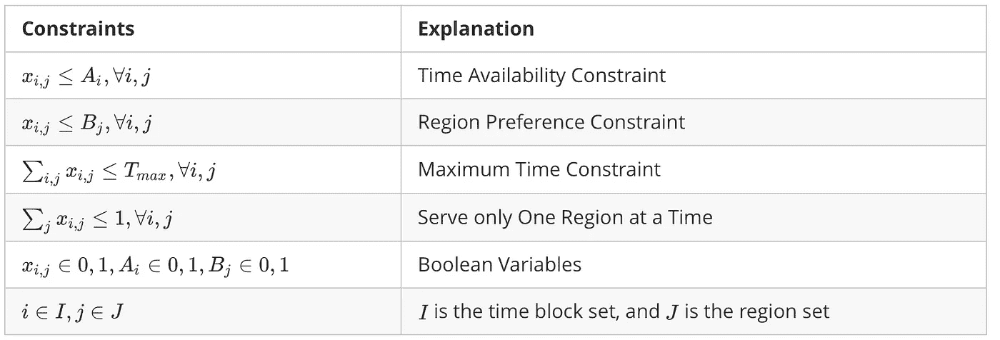

# MATLAB 实现

为了实际实现该模型，在 MATLAB 中编写了一个中央程序，该程序准备 MIP 并使用 intlinprog 函数求解它。中央程序需要 6 个参数，每个参数对应于上面列出的决策变量。该问题必须为 intlinprog 公式化，它解决以下形式的问题:

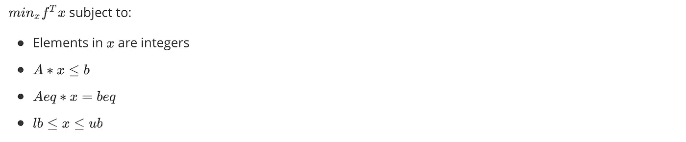

代码可以在 [Launch_IP.m](https://github.com/Ivan-Zhou/Uber_Driver_Schedule_Optimization/blob/master/Launch_IP.m) 和 [Solve_IP.m](https://github.com/Ivan-Zhou/Uber_Driver_Schedule_Optimization/blob/master/Solve_IP.m) 中找到

## MATLAB:数据提取方法

首先，从`Taxi Pickup Data`和`Uber Movement Data`提取的两个数据集在工作日、小时和地区上被连接。数据集的每一行代表给定地区在给定工作日给定小时的交通状况。使用`readtable()`函数提取所需的子集数据。

## MATLAB:约束

使用这些数据，通过分三步构建 A 和 b 矩阵，为 intlinprog 制定了约束条件。第一步创建维度为`1 x n`的向量 A1，b1，表示优步司机愿意工作的小时数。第二步构建矩阵 A2、b2，确保不会同时推荐两个区域。最后，A1 被附加到 A2，b1 被附加到 b2，以形成最终的矩阵 A 和 b。

第二个约束要求推荐的区域在驾驶员愿意前往的区域内。如果驾驶员不愿意在特定区域驾驶，则在创建约束矩阵之前，该区域的所有持续时间、交通和约束参数将被移除。因此，没有必要将区域偏好纳入约束矩阵。该模型还假设从一个区域到下一个区域的时间可以忽略不计。在时间段`i`期间，驾驶员可能预期在区域 B，但是对于时间段`i+1`，驾驶员在 12 英里之外的区域 C。在区域之间旅行的时间成本可以在未来的迭代中实现。

## MATLAB:目标函数

为了表示目标函数，建立两个向量并相乘。第一个向量表示在时间 I 期间在当前区域获得客户的概率，第二个向量表示时间段`i`中的估计行程数。使用以下代码行找到最终的目标函数:

```
f = transpose(P_new_customer.*Min_Trips).*avg_revenue_trip;
```

其中`avg_revenue_trip`根据 2014 年优步研究得出的每小时收入中值和每小时出行信息，约为 12 美元。

现在，使用适当的公式，可以通过`intlinprog()`用构建的 A、b 和 f 向量找到最优解。上限和下限分别设置为 1 和 0。

# 第 4 部分:结果

该模型能够在给定一个驾驶员的指定参数的情况下生成周计划。例如:

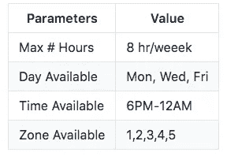

*Model Inputs — Driver’s Availability*

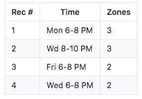

*Model Outputs — Ranked Recommendation to the Driver*

为了评估模型性能，考虑了两个指标:**模型性能**和**优化**。具体来说，该团队想知道当最大工作时间(Tmax)、时间段和区域的数量增加时，收入和计算时间会受到怎样的影响。

## 模型性能

为了确保稳定的结果，该模型对于每个实例运行 500 次，并且记录平均目标值和计算时间。为避免偏差，每个实例的时间段和区域都是随机选择的。发现**计算时间随着时间段数量的增加而增加，但随着最大小时数的增加而减少**(见附录 C)。

## 最佳性

随着可用时间段的数量在 1-42 之间变化，最佳收入在 450-545 美元/周之间变化(见图 3)。可用时间段数量的增加代表了驾驶员对我们定义的时间段的调度灵活性的增加。**这种正相关关系表明，司机的时间安排越灵活，他们期望获得的收入就越多**。


*Figure 3: Optimal Revenue/Week Increases as Driver Availability Increases*

只有当包含多个区域时，可用区域数量的增加才会导致收入的增加，这表明更多的可用区域不会对收入产生重大影响(参见附录 C)。

# 第五部分:讨论

随着可用时间段数量的增加，收入增加有两个潜在的原因。

首先，是“偶然收入”。这意味着收入的增加是由于服务时间的多样性增加，平均而言，在更多的高收入产生时间内驾驶的结果。

或者，人们可以简单地赚更多的钱，因为他们开车更频繁了。为了确定原因，团队绘制了每周最大工作时间增加时的收入图(见图 4)。增加最大工作时间似乎显著增加了司机的收入，这表明一个人驾驶的时间段对收入的影响远不如他们驾驶的频率大。

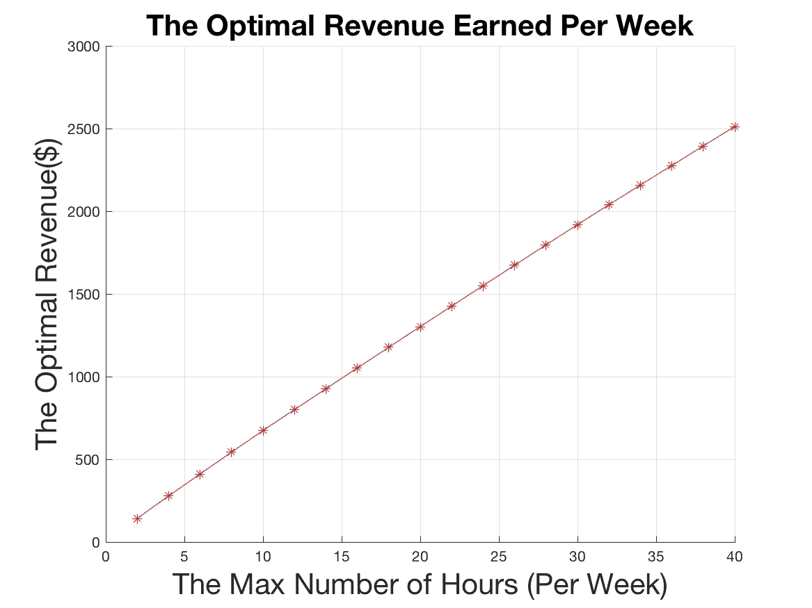

此外，通过比较预期收益和实际收益，验证了模型的有效性。根据众包信息，一名优步司机每周工作 30 小时，每周收入约为 772 美元。根据我们的模型，最佳最坏情况下的预期收入约为 1900 美元。这明显更高，表明我们的模型是对当前驾驶员驾驶模式的显著改进。

# 延长

该模型的结果有直观的意义，并显示了更广泛的应用潜力。可以将该模型推广到任何城市，而不仅仅是华盛顿。该团队还希望将“竞争”组件纳入该模型。如果几个司机同时被推荐到同一个地区，竞争将会增加，每个司机得到一次旅行的可能性会降低。根据团队建立的公式，这明显降低了预期收入，并且会将最佳解决方案错误地呈现为“最佳”。一个更先进的模型将能够平衡它在给定地区和时间给出的建议数量，并“重新安排”司机，以平衡某个地区有建议的司机数量。

# 第六部分:结论

基于 MIP 模型的结果和解释，该团队能够宣称它在预期收入方面为优步驱动程序带来了有意义的价值。模型规定的时间段数与司机的预期收入之间存在正相关关系。为了增加他们的收入，司机应该在尽可能多的时间段可用。现在，司机通过做出数据驱动的决策，而不是使用试探法来选择“最佳”位置为客户服务，从而比其他司机更胜一筹。有了模型规定的可行和方便的时间表，司机们现在可以把他们的工作想象成一个具有竞争优势的有利可图的行业。

# 第 7 部分:参考

[1]优步新闻编辑室，“BSG 报告:驱动者路线图”。【在线】。可用:[https://news room . Uber . com/WP-content/uploads/2015/01/BSG _ 优步 _Report.pdf](https://newsroom.uber.com/wp-content/uploads/2015/01/BSG_Uber_Report.pdf) 。[访问时间:2017 年 4 月 16 日]。

[2]Opendata.dc.gov，“出租车旅行”。【在线】。可用:【http://opendata.dc.gov/datasets?q=taxi】T2。[访问时间:2017 年 4 月 16 日]。

[3]Movement.uber.com，“优步运动:让我们找到更聪明的前进方式”，2017 年。【在线】。可用:【https://movement.uber.com/cities】T4。[访问时间:2017 年 4 月 16 日]。

[4] J. Hall 和 A. Krueger，“优步在美国的司机伙伴的劳动力市场分析”，2017 年。【在线】。可用:[https://time dot com . files . WordPress . com/2015/01/Uber _ driver-partners _ hall _ kreuger _ 2015 . pdf](https://timedotcom.files.wordpress.com/2015/01/uber_driver-partners_hall_kreuger_2015.pdf)。[访问时间:2017 年 4 月 16 日]。

[5]我和优步一起开车，《家——我和优步一起开车》，2017。【在线】。可用:[http://www.idrivewithuber.com](http://www.idrivewithuber.com)。[访问时间:2017 年 4 月 16 日]。

# 第八部分问答

> 为什么是 matlab？

更多的是个人喜好。Matlab 在解决优化问题方面非常专业(也很快)，就像这种情况下的 MIP 模型，我熟悉它的语法。Python 确实有几个 MIP 的库，但是我不熟悉。项目中的数据处理和分析主要是用 Python 实现的。从技术上讲，用 Python 可以完成从处理到优化的整个循环。

> 如果所有的司机都遵循“最优解”，会发生什么

随着越来越多的司机采用这种“工具”，竞争优势将逐渐消失。在一个边缘案例中，如果我们达到了一个均衡，在这个均衡中，所有需求水平相同的区域的拥挤状态都是相同的，那么这个工具将变得无用。然而，这在现实中永远不会发生，至少现在是这样，所以总有一些改进的空间。

这只是概念层面。我希望看到我们能够在现实中实现这种智能和优化的资源配置。

# 附录

# 附录 A

以下是团队访问优步旅行持续时间数据时必须使用的优步移动接口。因为界面限制团队必须手动选择时间段和位置，所以团队必须缩小所选位置的范围。

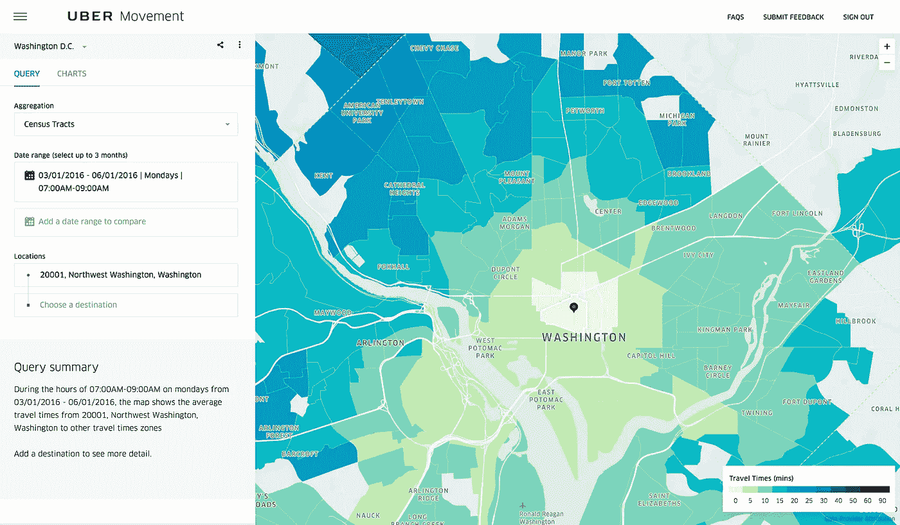

# 附录 B

以下是在 MATLAB 中实现的公式，用于计算新行程的概率:


*   P_{min}和 P_{max}是用于计算新出行概率的均匀分布的下限和上限(在我们的例子中，为 0.5 和 1)
*   D_{min}和 D_{max}是该区域和时间段的最大和最小拾取计数。

# 附录 C

以下是补充图表，描述了给定变化参数的计算时间和目标函数的分析。

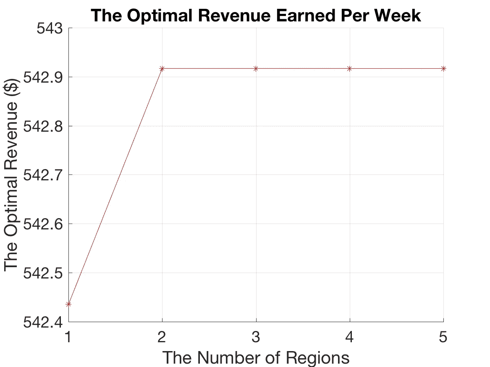

*Increase in revenue with more regions leveling off after two regions*

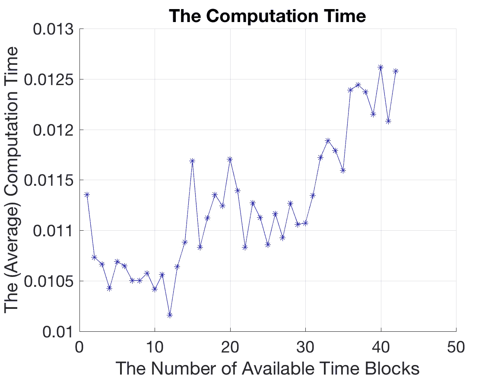

*Increasing computation time with more time blocks*

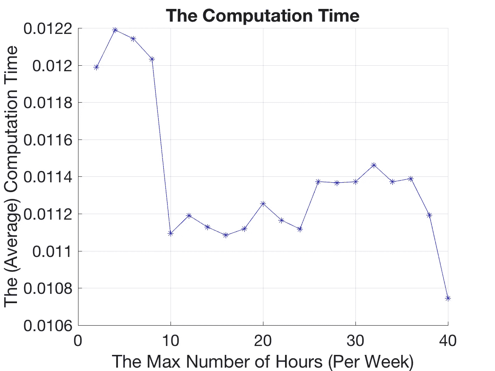

*Decreasing computation time with higher T_{max}*

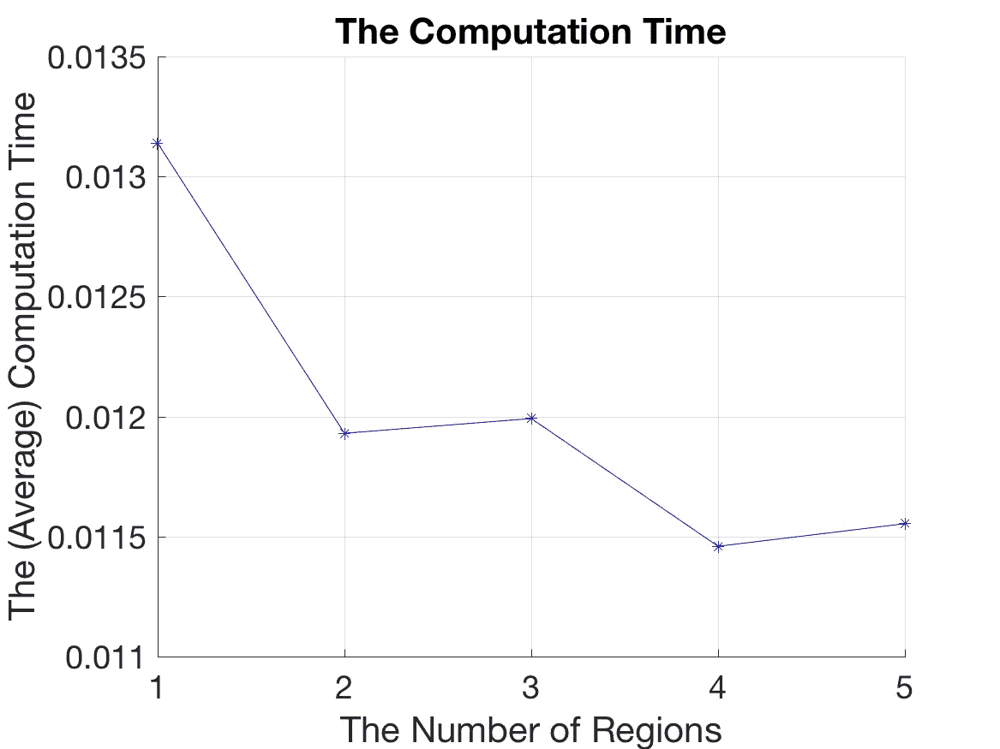

*Decreasing computation time with more regions*