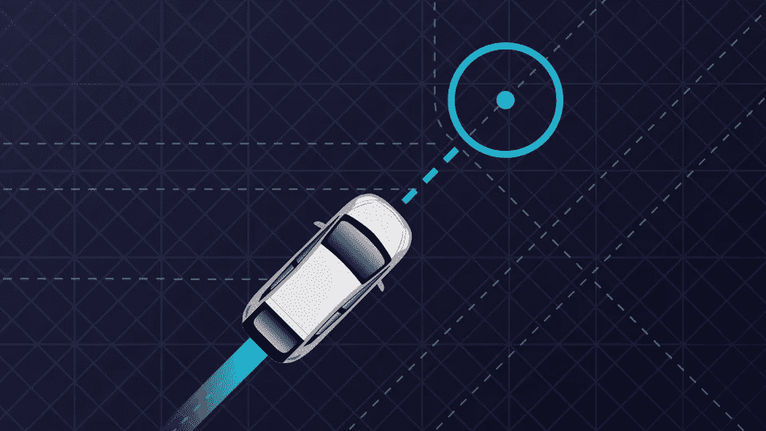
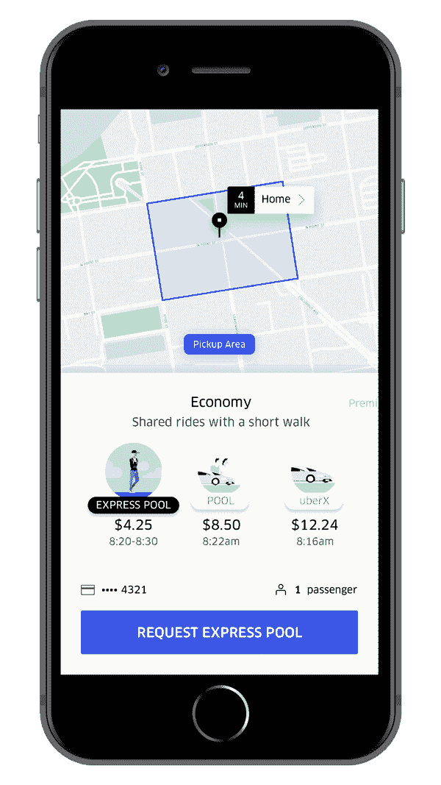
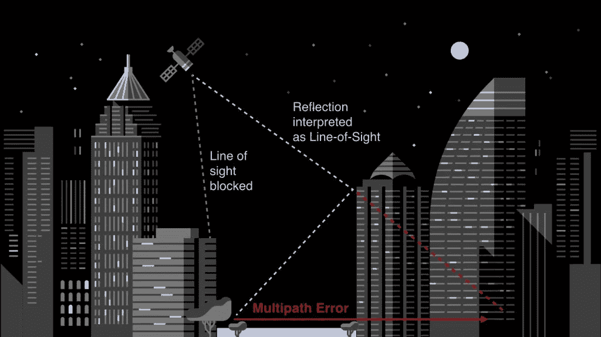
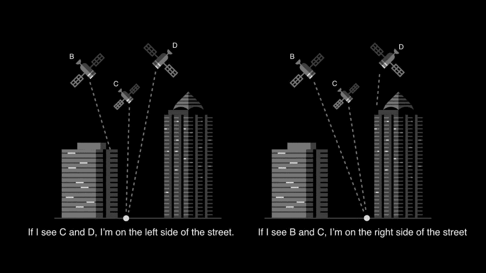

# 优步地图技术讲座

> 原文：<https://towardsdatascience.com/uber-maps-tech-talk-8df91c300f80?source=collection_archive---------5----------------------->

[Pic Credit](https://rideshareapps.com/uber-fare-estimator/)

除非你是出于某种神秘或其他原因远离科技生活的人，否则你一定非常习惯我所说的地图对话——“你能分享位置吗？”，“地图显示路上交通繁忙！”等等。数字和网络地图服务是一个随着时间和技术不断发展和完善的领域。虽然其中一个原因是技术和计算的进步，但另一个主要原因是这是一个非常具有挑战性且尚未解决的问题。这就是有趣的地方，也是这个优步地图技术演讲非常有趣的地方。

在我们今天进行的两次信息丰富的谈话之前，有一个关于优步·班加罗工程团队中从事技术工作的女性的视频，还有一个为答对的人准备的奖品。如果你想知道，不，我没有赢过！首先发言的是地图团队的产品经理 Ankit。在几个月前的一次早期演讲中，演讲者解释了用户打开优步应用程序到旅程结束之间发生的事件和操作的数量。定位骑手和驾驶员并提供准确的导航路线对于平稳的骑行非常重要。Ankit 带我们经历了每一步，从估计用户位置开始，搜索地点和地址，计算费用和预计到达时间。当用户打开应用程序时，首先需要的是他/她的位置。这涉及到许多需要考虑的特征，比如用户是在室内还是室外，用户是否在地面以上的某个建筑中，或者其他类似的场景。这是通过使用 GPS、位置预测模型和 WiFi 指纹识别来实现的。所有这些都是为了让那个小蓝点出现在优步地图的正确位置上！

为了便于搜索放置地点或地址，应该考虑许多因素。该地图可以使用用户的历史数据(如果有的话)，显示具有准确位置的热门地点，显示附近的优步游乐设施的快照等。当涉及到 Uber Eats 时，还有其他不同的情况需要考虑。下一步是票价计算，必须非常准确。估计行程时间、行程距离、通行费的存在、当前用户位置周围优步乘车的供应以及当前乘车的需求都是估计费用的决定因素。如果这听起来很复杂，那么想想不同类型的乘车会有什么不同——UberGo、UberPool 和最近的 ExpressPool。虽然 UberPool 和 ExpressPool 都允许拼车，但 ExpressPool 从最近的上车点提供乘车服务，乘客可以步行到该地点。这不仅有助于骑车人到达一个可以乘坐的地方，而且也更便宜。

[Pic Credit](https://www.uber.com/newsroom/expresspool/)

每一步都建立在前一步的基础上，并增加了一些复杂性。ETA 预测是下一步，对于不同的乘坐模式是不同的。对于 UberGo/UberPool，只有一个司机到达骑手的预计到达时间。在快速拼车的情况下，还应考虑骑车人到达上车点所需的时间。ETA 计算几乎没有挑战。如果交通发生不可预见的变化怎么办？还是突然的路障？如果司机的网络不稳定怎么办？前两个导致 ETA 的重新计算。为了处理不稳定的网络，缓存的路径在驾驶员端被重用。因此，即使司机失去连接，也有办法让地图在没有连接的情况下工作。一旦驾驶开始，后台会不断优化路线，帮助驾驶员选择最佳路线到达目的地。骑手和所选路线的历史路线记录都用于此目的。在结束演讲之前，Ankit 透露了优步的多式联运计划，该计划适应使用不同模式的乘坐，不仅包括四轮车，还包括自行车、滑板车等。(以防你不知道，优步正在投资滑板车租赁初创公司 Lime，这家公司也有谷歌的支持)

"在座有多少人研究过地图？"Gaurang Khetan 开始讲话时问道。很少有人举手。因此，如果你想做一些有挑战性的、有趣的、对流行产品有直接影响的事情，那么地图就是你的了。是什么使它成为如此困难和具有挑战性的问题？地图和收集的数据一样好，好的数据很难得到。有不同的来源可以获取开发地图所需的数据，其中包括多家供应商。随着物理世界的不断变化，地图需要不断更新和改进。世界上不同的国家有不同的分配地址的惯例和结构。此外，很难衡量地图和路线的正确性。跟随数字地图时迷路并不罕见。除了所有这些原因，用于最佳路线和基于地理的搜索的算法需要非常快速、高效和可扩展。

地图数据来自不同的图层、不同的来源，包括多种类型，如道路网络、商业地点、地址、物理空间(如商场和建筑)以及自然特征(如湖泊)。数据量不仅巨大，而且非常多样化。这使得使用地图进行全球展示成为一个永无止境的过程。另一个问题是，“我们如何为一个没有地图数据的国家或地方建立地图数据？”你应该花几分钟思考一下，然后自己回答。邮政数据、政府数据、GPS 跟踪、多个供应商、手动驾驶和路线、卫星视图、众包等是收集/创建地图数据的一些方式。多少数据才够？随着城市化的发展和技术的扩展，城市的位置必须被很好地绘制，路线必须被完全理解，对吗？虽然这在某种程度上可能是真的，但有一个问题是城市地区特有的——城市峡谷。

[Pic Credit](https://eng.uber.com/rethinking-gps/)

在市区或高楼林立的地方，卫星信号在直接到达 GPS 接收器之前可能会受到阻碍。如果有高层建筑在卫星的视线范围内，就会发生这种情况。简而言之，GPS 使用许多围绕地球轨道运行的卫星(30 颗或更多),并传输 GPS 接收器用于位置识别的信号。这些信号会被传播路径上的建筑物阻挡或反射。当这种情况发生时，会导致位置信息出错。这种误差从几米到 50 米或更大不等。上面的图像就是这样一个例子。

[Pic Credit](https://eng.uber.com/rethinking-gps/)

为了克服这个问题，优步地图使用信噪比(SNR)。如果卫星的 SNR 值较低，这意味着没有到相应卫星的直接视线，并且位置信息会有一些误差。当它很高时，必须有一个清晰的卫星视线，因此位置信息将是准确的。在上图中，我们可以看到左侧的点在卫星 C 和 D 的视线范围内，但不在卫星 B 的视线范围内。同样，右侧的点在卫星 B 和 C 的直接视线范围内，但不在卫星 D 的视线范围内。此信息非常有用，同样可用于确定该位置位于道路的左侧还是右侧。

很明显，在地图方面，有太多的东西需要了解、学习、尝试和改进，而这正是优步正在做的事情。它不仅仅使用谷歌地图和 GPS 提供的原始信息。地图是优步大学的一个活跃的研究领域，他们正在不断完善它。作为一个例子来了解优步如何使位置信息更好，见下面的原始 GPS 提供的位置信息(红色的)和优步的改进 GPS(蓝色)的比较。虽然改进后的 GPS 提供了更好的导航，但原始的 GPS 却无处不在。

这是我今年参加的第三次优步科技讲座，这些讲座非常有趣。虽然众所周知，地图和图表不容易解决问题，而且还在不断改进，但了解这么多关于一个非常依赖这些领域的公司目前如何在这些领域工作和研究的信息真的很好。会谈结束后，我们还愉快地进行了交流。演讲者和其他几个目前在优步工作的人加入了我们，帮助我们解答问题和疑惑。感谢优步组织了这次技术讲座。

> 顺便说一句，他们的办公室很酷！！

这是我写的关于我参加的第一次优步科技演讲的博客的链接

> 如果你喜欢到目前为止在这篇文章中读到的内容，并且想了解优步发生的一切，我推荐你查看[这个来自优步的](https://eng.uber.com/)博客，并且在 Twitter 上关注 [@ubereng](https://twitter.com/UberEng) ，他们在 Twitter 上发布了关于他们最近的研究工作和开源工具的消息。
> 
> 感谢阅读！！！

*连接:*[*LinkedIn*](https://www.linkedin.com/in/avinash-kappa/)*，*[*Twitter*](http://twitter.com/avinashso13)*和我的* [*博客*](https://theimgclist.github.io/) *。*