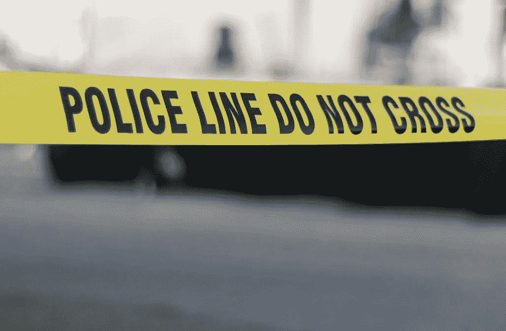
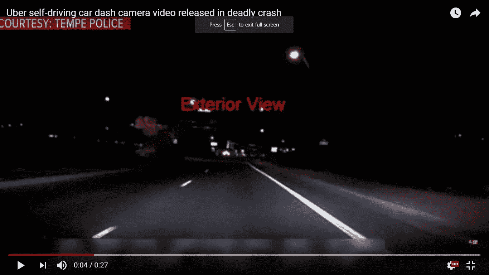
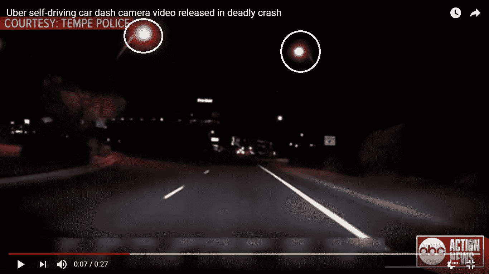
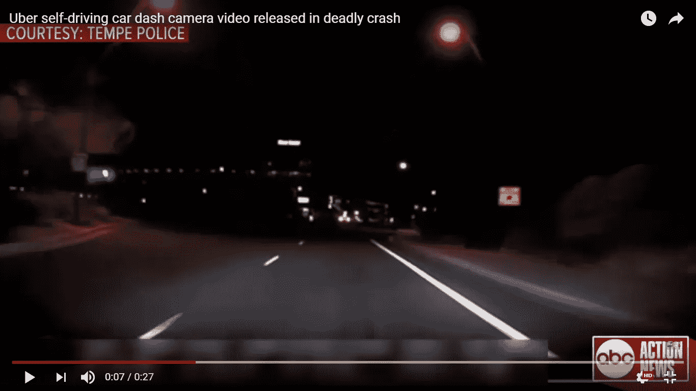
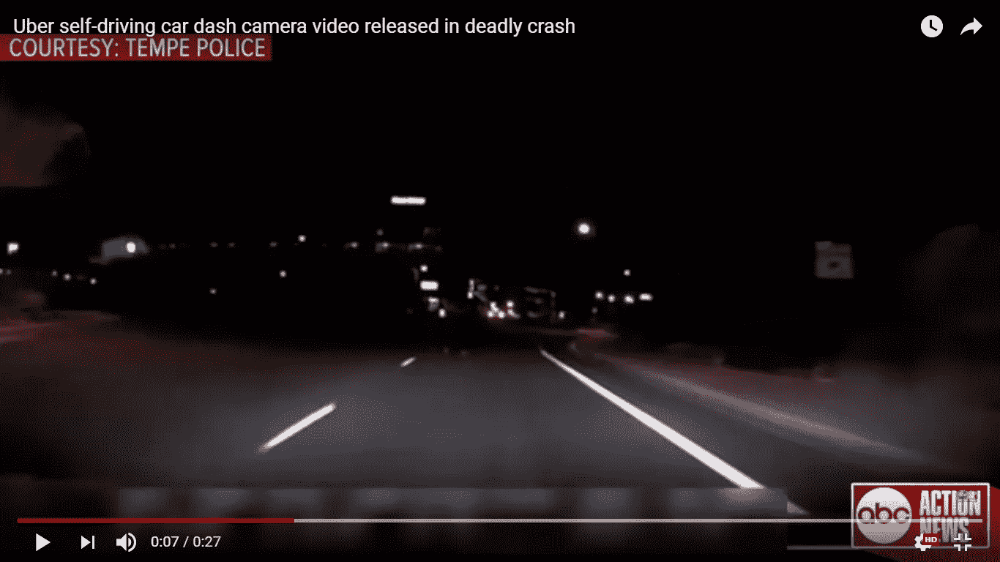
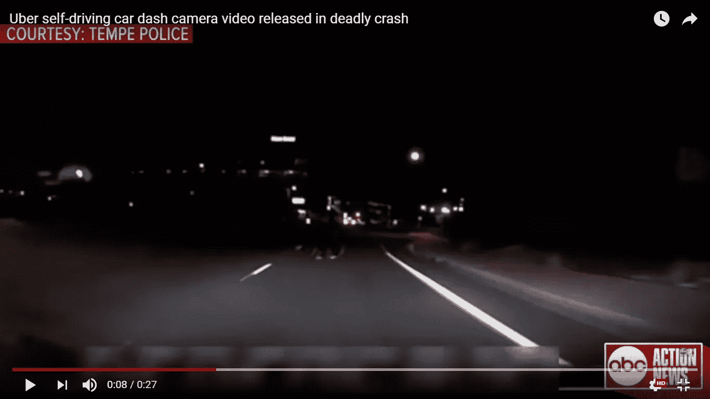
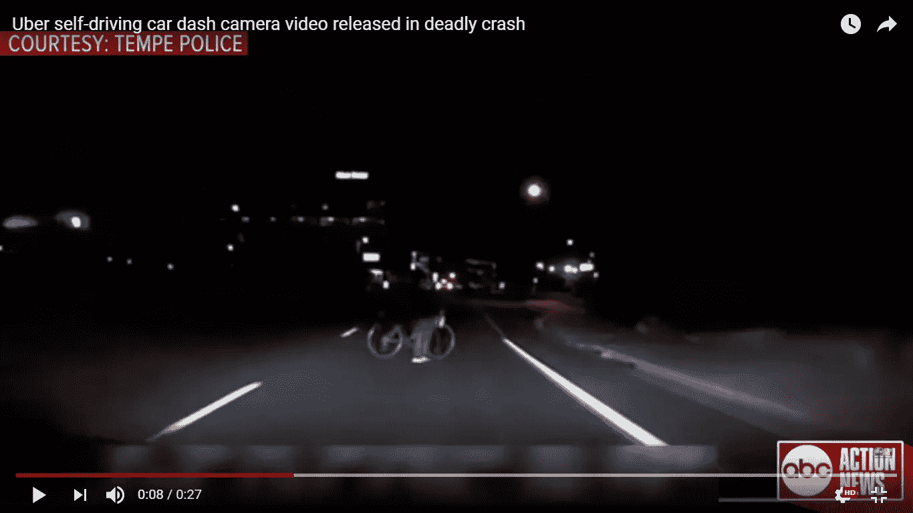
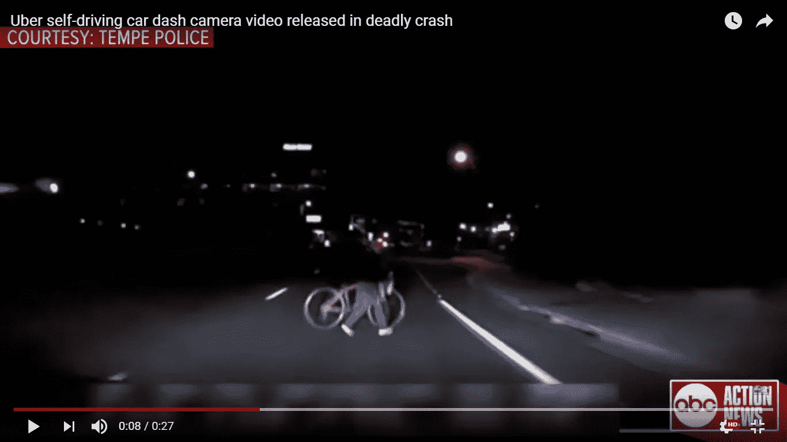

# 优步的自主车祸调查

> 原文：<https://towardsdatascience.com/ubers-autonomous-car-accident-investigation-57fcc88cb6e7?source=collection_archive---------7----------------------->

3 月 19 日，一个故事震惊了自动驾驶汽车行业，当时优步的一辆自动驾驶汽车在亚利桑那州坦佩撞倒了一名女子。这是被自动驾驶汽车撞上后的第一起死亡事件。这严重地对自动驾驶汽车提供的安全功能的所有说法产生了严重的怀疑。3 月 23 日，Tempe 警方发布了一段事故视频，这让许多事情都成了问题。完整视频可以在 youtube [这里](https://www.youtube.com/watch?v=8IqpUK5teGM)观看。

Image Source ([https://www.aol.com/article/news/2018/03/19/woman-dies-in-arizona-after-being-hit-by-uber-self-driving-car/23389700/](https://www.aol.com/article/news/2018/03/19/woman-dies-in-arizona-after-being-hit-by-uber-self-driving-car/23389700/))

## **分析 Dashcam 视频**

完整视频可点击查看[。(来源-美国广播公司行动新闻)。让我们看一下从仪表板上捕捉到的第一张图像，以分析我们获得的所有信息。](https://www.youtube.com/watch?v=8IqpUK5teGM)

5 seconds before collision.

这里有几点需要注意-:
1。车道线清晰可见。
2。远处的路上有车，还有一些建筑物的灯光。
3。路上有路灯！
4。用肉眼，除了远处的汽车什么也看不见。

撇开这些细节-
1。**汽车以每小时 38 英里的速度行驶，限速 45 英里。(** [**来源**](http://www.dailymail.co.uk/news/article-5532129/Uber-pilot-devastated-self-driving-car-killing-pedestrian.html?ito=social-facebook) **)** 2。汽车在近光灯上行驶。

2 seconds before the collision

跳跃到 0.07，碰撞前 2 秒，可以观察到在左侧和右侧，我们有路灯，所以有足够的光线，但在左侧也有道路的黑色部分。

Left Street Light Passes by in the next frame of the same second

我们仍然处于第七秒，仍然没有任何行人的迹象，看着左边的路灯在这一帧中经过。

还在第 7 秒，两个灯都过去了。现在，这是我们第一次看到行人的脚步。

碰撞前 1 秒，从仪表板摄像头可以清楚地看到行人或有障碍物。

嗯，我们在第八秒，现在我们也可以看到行人和自行车的下半部分。

现在，这个女人和她的自行车清晰可见。但是那辆车减速了，甚至试图减速了吗？不要！再次需要注意的重要一点是，这位女士穿着黑色衬衫/夹克。但是自行车或者那个女人的白鞋子呢？

我有意跳过了第 9 帧的图像。即使在第 9 秒，赛车也没有减速！那就奇怪了！！

# 相机不是问题

确实，在撞击前 50 到 60 帧的时候，有人观察到了这个女人，但是机器仍然无法捕捉和减速！但这里的重点不是关于相机，它很暗，相机可能会错过这一点，而且上半部分是黑色的，也可能会错过这一点。自行车甚至完全看不见。现在主要问题来了。**激光雷达怎么了？激光雷达是自动驾驶汽车使用的最昂贵的设备之一，它没有反应！！任何人都可以争辩雷达可能会错过一些信息，但激光雷达不会。激光雷达把那个女人当成噪音了吗？嗯，看起来只有这个，如果是这样，我们肯定有一个用例要处理。**这里还有一点需要思考，那就是这个女人甚至一秒钟都没有意识到车的存在！****

激光雷达没有工作，好吧，我们对雷达没有期望，但是它也没有工作。即使发现了自行车，照相机也坏了。这是不可接受的，需要进行详细的调查，需要了解激光雷达把这个女人当成了什么，为什么相机的输入被丢弃了。所有传感器和技术的融合失败了 3 秒钟，这是非常令人惊讶的！！还有，视频素材不够！

谁有错的问题仍然存在。**司机有错吗？**从内饰视图中可以清楚地看到，在碰撞发生前，驾驶员正在向下看。在任何这种情况下控制汽车是她的责任，但我相信即使是一个正常的司机也无法避免事故，这就是我们制造自动驾驶汽车的确切原因，以避免司机的错误。现场非常黑暗，不幸的是，这个女人在错误的时间出现在了错误的地点。如果她能从一个街灯足够亮的地方穿过去，她可能会得救。但是现在问题来了，我们有分析过的录像，但是谁有错呢？优步，女人，技术？

好吧，现在有一件事非常清楚，自动驾驶汽车行业需要严格的测试来重新赢得人们的信任。此外，需要像我们在空难调查中那样对此类事件进行详细的调查，并且应该在各个参与者之间分享，以提高这个行业的安全标准。

请随意分享你的观点。