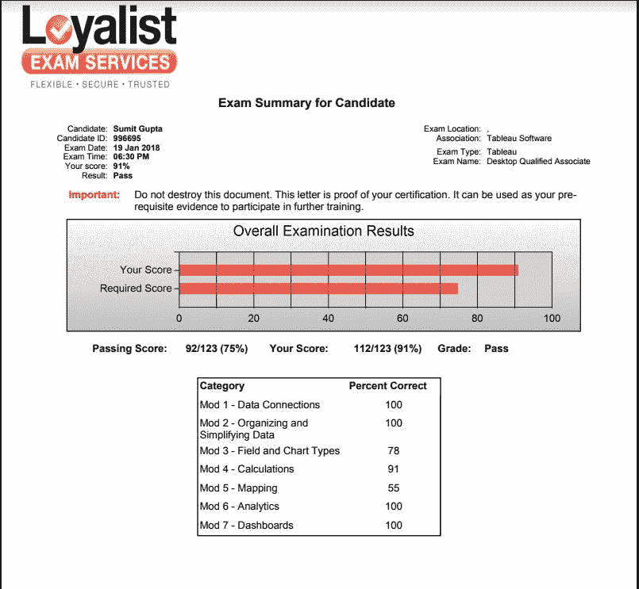

# Tableau 认证终极指南

> 原文：<https://towardsdatascience.com/ultimate-guide-to-getting-certified-in-tableau-5bd2df7d0c7d?source=collection_archive---------3----------------------->

作为一个 tableau 的忠实支持者，一个认为 tableau 是商业智能和可视化领域最好的产品的人，我很自然地想办法提高我的 Tableau 知识，这样我就可以随时成为任何 Tableau 相关查询的联系人。在提高知识的同时，你会有一个两难的时刻，如果你现在就去争取一个更公开的认可，而不仅仅局限于你的“工作认可”，或者你应该坚持只与工作相关的认可。

虽然工作认可总是好的，并且是我们非常努力工作的事情，但获得证书使我们能够在社区中被听到，并有助于围绕数据科学、分析和 BI 进行建设性的讨论。从对整体形象的增值角度来看，证书并不是普遍得到认可的，因为如果你与 10 位经理谈论“他们在审查/选择求职面试简历时是否重视证书”，很肯定你会得到 5 个肯定，5 个否定。因此，学生和入门级的专业人士经常处于进退两难的境地，但考虑到我对画面的热爱，我不在其中😊。

自从我加入锡拉丘兹大学的 iSchool 以来，我一直在考虑获得 tableau 的认证，以及大多数招聘职位如何要求一个人知道至少一种标准的 BI 工具，无论是 Tableau、Microstrategy、PowerBI 还是其他工具。BI 工具上的所有这些招聘信息、讲座和博客点燃了我继续学习的好奇心，我决定要在 Tableau 获得认证。我在 2016 年 9 月决定了这一点，但由于时间表和事件的顺序，我未能将此事置于其他承诺之上。但最后，我在去年(2017 年)感恩节假期后恢复活力后做了这件事，并预订了日期。如果你已经犹豫了一段时间，不知道这样做的价值以及你是否会有时间，你应该只预订考试的日期。如果你不预订日期，你永远不会有时间！简单。

**是什么启发我写了一篇关于 Tableau 证书的博客？**

互联网上有大量的博客和资源，经过上个月的搜索，我觉得，我拥有的资源帮助我在考试中获得了超过 90%的分数。可以肯定的是，下面的资源不会让你获得 Tableau 认证，但也会帮助你成长为 Tableau 开发人员。

在我们深入研究计划以及如何从可用的免费/付费资源中学习之前，让我们先为从未听说过 Tableau 认证的人谈谈内务管理。

这里我们讨论的是 Tableau 桌面认证，请注意，Tableau 也是 Tableau 服务器认证，但这是另一天。

即使在 Tableau 桌面认证套件中，我们也根据您对该工具的理解和专业水平提供了几个选项。

**1) Tableau 桌面合格助理(TDQA)**

*   推荐给具有至少 5 个月使用该工具的实践经验的人，以及了解 SQL 基础知识并理解数据库、连接和标准数据分析术语的人(即使您以前没有 Tableau 的经验，但愿意学习，您也可以获得认证)。
*   费用:250 美元(不幸的是，没有学生折扣)
*   时间限制:2 小时(额外 30 分钟用于设置和调查)
*   问题数量:36
*   问题的划分:70 次动手/30 次基于工具本身的理论
*   及格分数:75%(注:每道题根据难度高低权重不同，动手更有价值)
*   Tableau 考试指南:[下载 Tableau 考试指南](http://mkt.tableau.com/files/DesktopCP_ExamGuide.pdf)

**2) Tableau 桌面认证专家:**

*   推荐给有丰富 Tableau 桌面经验的人。建议有 9 个月以上的经验。与 TDQA 不同，该证书包括动手操作、书面回答和在 Tableau 桌面中构建/保存解决方案
*   成本:600 美元(同样没有折扣)
*   时间限制:3 小时(同样，额外的 30-45 分钟用于设置和调查)
*   通过和评分:根据详细的评分标准手动评分

**备考:**

该博客安全地假设您从未使用过 Tableau 或者对该工具的访问权限有限。如果您是一名学生，并且没有访问该工具的权限， [tableau 为学生提供一年的免费桌面工具访问权限。](https://www.tableau.com/academic/students)对于非学生和专业人士， [tableau 提供 14 天的试用期](https://www.tableau.com/products/trial)这可能不够。但在博文的最后，我会分享免费获得 6 个月 Tableau 桌面访问的方法。继续读！

**开始准备:**

建议您做的第一件事是浏览 [Tableau 桌面证书指南](http://mkt.tableau.com/files/DesktopQA_ExamGuide.pdf)中的每个单词。pdf 做得非常好，列出了证书的知识，考试中测量的详细技能，并为您提供了样本问题和解决方案，以验证您对所要求技能的理解。对于该指南对于掌握证书的重要性，我怎么强调都不为过。实际上，在我准备的时候，我每周都会浏览 pdf 文档，并在我有绝对信心的技能和仍然需要改进的技能上打勾。一旦你复习完考试指南，就该记下你缺乏必要知识的地方，并开始复习。

我已经尝试将资源分为**初级**和**高级**级别，以便在正确的时间访问正确的资源。

**初学者资源:**

1) [**Tableau 学习**](https://www.tableau.com/learn/training) **:** 话不多说至于 Tableau 官网的免费培训对我备考有多大帮助。如果你看过考试指南，你会知道技能测试部分已经被分成数据连接，分别组织&简化数据 Tableau Learning 以类似的方式很好地组织了他们的培训。浏览 Tableau Desktop 下的所有视频两次，是的，两次，因为仅仅浏览一次是不够的，当你像我一样重新观看时，你会在观看时学到更多的技巧和诀窍，并提高你对该工具的理解。

**费用:**免费

2)[**【Tableau 10 A-Z 初学者】Kirill Eramenko**](https://www.udemy.com/tableau10)**:**Kirill Eramenko 的初学者课程不是很适合专注于 Tableau 证书，如 Tableau Learning 和 Lukas Halim 的初学者 Tableau(描述如下)，但该课程很好地介绍了 Tableau 10 的所有功能，该课程最好的部分是它很实用。一旦你完成了这个课程，你将从一个专业人士的角度学习 tableau，而不是作为一个仅仅是为了获得认证而学习 tableau 的学生。

通常需要 199.99 美元，但你总能在 Udemy online 上获得 90-95 折的优惠券，其中之一就是“JNY1202”

3)[**Lukas Halim**](https://www.udemy.com/tableau-accelerate-your-career-and-get-certified/)**:**与 Kirill 的课程不同，本课程是专门为获得 Tableau 桌面认证而设计的。视频讲座充其量也就相当一般，我不会责怪 Lukas，因为课程的主要重点是让学生获得认证，而不是成为 Tableau 专家。本课程的好处是它非常紧密地遵循考试指南中的“技能衡量”部分，这允许您遵循考试的结构，并对所问的技能/问题更加自信。

课程中最精彩的部分？

Tableau 桌面资格助理考试的小测验和两个完整长度的模拟测试。我将在高级部分谈论考试，因为如果你还不熟悉这个工具本身，谈论模拟考试是没有意义的。

**费用:**与上面的建议类似，你可以用“JNY1202”这样的代码花 10-12 美元就能进入课程

4) [安迪是数据学校的主教练，负责在 tableau 和 alteryx 上培训超过 1000 名个人。他是 Tableau 禅师，也是一个了不起的老师。在这段视频中，Andy 和他的 tableau/data school 学生团队分享了他们参加 Tableau QA 考试的经历，并单独谈论了技能部分，分享了一些如何快速学习这些技能的技巧&以及在考试中会遇到什么。我不得不说，这是一个相当不错的长达一小时的视频。](https://www.youtube.com/watch?v=G68yjtYgwqg)

**花费:**你 1 个小时的时间

5) [**Tableau 知识库**](https://onlinehelp.tableau.com/current/pro/desktop/en-us/gettingstarted_overview.html?tocpath=Get%20Started%7C_____0) **:** 虽然没有遵循这些建议的特定格式，但我过去常常只是将“衡量技能”中的一行复制粘贴到谷歌上，然后阅读 Tableau 知识库上的文章。考虑到考试包含 30%的理论问题/权重，我们可以使用互联网搜索答案，阅读 Tableau 知识库是一个很好的培养习惯。

成本:免费

初学者部分到此为止。如果你遵循先完成 Tableau 学习，然后转到 Kirill 的 Tableau 10 A-Z，然后转到 Lukas Halim 的课程的模式，你现在应该足够自信，能够尝试 Tableau QA 考试指南中 50-60%以上的问题。

**高级资源:**

一旦您尝试了 Tableau QA 指南中的问题，就该进入高级部分了，这些部分将涵盖细节层次计算、集合/组、分析窗格等高级主题:

1) [**Tableau 10 基里尔·叶列缅科**](https://www.udemy.com/tableau10-advanced/learn/v4/) **:** 我非常喜欢基里尔的教学方式和他亲自动手的方法，即使是最简单的概念。在本高级培训中，Kirill 将带您浏览 5 个仪表板，涵盖一些非常高级的内容，如详细程度计算、高级计算(如字符串处理、数据处理、高级连接、数据混合)、仪表板操作、集合和组！同样，与 Kirill 之前的课程一样，他不会带着让您获得认证的心态教授课程，他会从专业分析师的角度教授，以及分析师将如何处理最终利益相关方提出的数据问题。一个一定要看的视频课程。

**成本:**$ 10–12

2)[**Coursera 的数据可视化与 Tableau 交流:**](https://www.coursera.org/learn/analytics-tableau) 杜克大学的这门课程是我最喜欢的在线学习 Tableau 的课程之一。本课程最精彩的部分是，教师使用的数据集都是经过深思熟虑的，并且是实际操作的。数据集包括 H1B 工作签证申请数据和由 Dognition 提供的真实商业数据集，Dognition 是一家狗训练公司，它很乐意向学生提供关于他们公司的数据。

通过注册该课程，您还可以免费使用**tableau 6 个月，**即使您没有注册他们的付费证书选项。如果你因为没有 tableau 访问权限而坚持自己，那就去做吧

费用:免费，如果你需要完成证书

3)**Simplilearn 的模拟测试**:在你完成了上面链接的高级视频课程后，你现在已经准备好测试你的知识并了解你的弱点在哪里。如果你在网上搜索 tableau 考试的模拟试题，你会感到失望。在你准备期末考试之前，没有很多资源可以测试你的知识。Simplilearn 提供 2 个模拟测试样本，在您提交个人详细信息后，[测试 1](https://www.simplilearn.com/tableau-exam-questions-free-practice-test) 即可公开获取，而如果您需要访问测试 2，则必须注册 Simplilearn 提供的 [Tableau 课程的免费试用。当您尝试本模拟测试中的问题时，您会慢慢意识到这些问题的水平比考试指南低一个等级。真正的考试符合考试指南的水平，但由于没有太多的模拟考试，任何可以测试你的知识的考试都更有价值。如果你在这些测试中得分在 90%以上，不要太高兴，真正的模拟测试如下所述。](https://www.simplilearn.com/tableau-training-and-data-visualization-course)

**费用:**免费或 7 天免费试用

4) [**学习 Tableau 实践考试 1**:](https://learningtableau.com/quiz/tableau-10-practice-exam/)Tableau 桌面合格协理考试的事实上的实践考试。一旦你完成了所有的课程链接，Lukas Halim 的课程测试和 Simplilearn 的练习测试，并复习了测试之后，是时候进行真正的测试了！如果我说这个测试不值得，那我就是在撒谎。这是最接近 Tableau 的考试(包括练习 2，如下所述)。如果你真的对认证很认真的话，这是必须的。Lukas 做了一项了不起的工作，他真的提供了能很好地引起考试共鸣的数据集和问题。它的挑战性足以让你思考，不像 Simplilearn 测试，但也足够简单，让你对自己的准备感觉良好。卢卡斯创造了这些测试。

这项测试的另一个出色之处是 Lukas 为所有问题提供了一个出色的解决方案，而 simplilearn 没有做到这一点。这些解决方案指南帮助你了解错误的解决方案，并帮助你以更好的方式学习

**费用:**包含在您购买的 Lukas Halim 课程中，如果您没有兴趣购买课程，Lukas 还有独立测试包(比课程贵)。LearningTableau.com 有详细报道

5) **高级概念:**

如果我必须根据不同的难度等级来评价 tableau 考试，我会说 25%的问题是高级概念，我会在下面列出。这些概念是上述课程的一部分，但是单个概念的博客/视频可以让你更加关注它们，从而对它们更加好奇。你不仅要为考试准备这些高级概念，而且作为一个 tableau 的重度用户，我个人也在日常的 tableau 工作中使用一些概念。

a.**细节层次计算:**这是考试中最重要的概念之一。你不会得到超过 2-3 个关于这个概念的问题，但是考虑到它的用例以及 LOD 的强大，当然建议你尽可能多的了解它们。如果你浏览下面的链接，你会获得足够的关于 LOD 及其用例的知识。在考试中，您可能会遇到关于群组分析(或每个群组贡献了多少收入/销售额)、客户订单频率、客户获取的问题。

这里有一个**提示**，它将在考试中帮助你:只要学习固定 LOD，甚至不用担心包含或排除 LOD，包含和排除能做的，固定也能做。所以要成为固定 LOD 的专家。这里有一些关于它们的好资源

b. **Top N/Nested N/Nested 排序:**另一个重要的概念，你可以很容易地想到关于 Top N/Nested N 的几个问题。这并不难，但如果没有给予适当的尊重，就很容易被忽略。以下资源将帮助您理解它。

c.**表计算:**大多数 tableau 新用户都知道计算字段，如 sum、average、datediff、datepart 等，但 tableau 中计算的另一个重要方面是表计算。这里有一些关于它们的好资源:

d.**参数及其用例:**虽然您不会被要求“专门”创建一个参数来解决任何问题，但它是您希望添加到 tableau 目录中的一个特性。最终利益相关者喜欢摆弄数据和控制数据点/参数的能力。tableau 中的参数赋予了他们这种超能力。

(我几乎每隔一周就重温一次这个视频，以获得如何在我的仪表板中使用参数的想法，它太棒了！只需将它加入书签以备将来使用)

e.**分析窗格:**分析窗格覆盖了考试总分数的 15%以上，是失分是犯罪的部分之一。如果你知道均值、中位数、众数、标准差、回归是什么意思，这里应该不会失分。一些好的资源:

f.**其他重要概念:**虽然我没有任何推荐的概念列表资源，但上面的课程很好地涵盖了它们:

*   集合、组和创建组合集合
*   高级过滤
*   数据混合
*   如何利用交叉表
*   数据透视表
*   拆分，自定义拆分
*   连接计算
*   绿色药丸和蓝色药丸的区别

5) [学习表格练习测试 2](https://learningtableau.com/quiz/tableau-10-practice-exam-2/) :已经学得够多了，该准备考试了。你怎么知道你是否准备好考试了呢？通过尝试卢卡斯·哈利姆的模拟测试 2。这两个测试都是最接近真实的测试。如果你直接从 udemy 上购买课程，你可以直接自动参加这两项考试，总共可以节省 20 美元。当尝试这个测试时，确保尝试复制真实的考试环境，这基本上意味着在两个小时内进行测试，没有手机，没有干扰。只有你和练习测试可以访问互联网，但没有电子邮件和聊天应用程序。一旦你完成了，即使你的分数低于 75%也不要担心，我有朋友在第二次测试中的分数低于 50%，但却通过了考试。只要确保你把事情放在你的下巴上，并仔细阅读解决方案指南。你现在准备好了！及时行乐！

**杂项提示:**

*   该考试是监考考试，您可以在方便的时候进行，这意味着您可以在任何地方进行考试，唯一的问题是它将被监考。
*   考试将在安装了相关数据文件和 tableau 桌面的虚拟机中进行。请务必查看数据文件。
*   另一个非常重要的提示是，我一直给与我一起学习的其他人，总是用你的问题编号来重命名你的工作表。不要把它放在第一页、第二页……当到了复习的时候，你会浪费时间去找问题的工作表。
*   在开始解决问题之前，在您的工作簿中添加一个仪表板，并在视图中拖动一个文本元素，开始记录需要检查的问题/要点，稍后再回来。
*   一开始的问题让我很惊讶。这些问题的难度让我大吃一惊，我花了将近 20 分钟才解决了 3 个问题。所以，如果你也遇到了这种情况，不要担心，在最初的困难之后，问题会变得很简单，很容易解决。
*   即使你对理论问题 100%有信心，也不要在没有搜索的情况下给它打分。提问的方式会利用你的疏忽，这样你就会失分。
*   仪表板问题很简单，但问题的微小细节很容易被忽略。小心点。
*   当你在 chrome 和 tableau 之间切换时，利用分屏可以节省一些时间。chrome 考试标签是移动自适应的，所以如果你调整考试标签的大小，你仍然可以阅读较小的 chrome 标签中的所有文本，而无需滚动。这给了我很大的帮助，也让我在回答问题的时候可以多次阅读问题。

**继续你的学习:**

考完了吗？已经认证了？恭喜你。你做到了。但是下一步，如果你想继续学习 Tableau 并从这一点开始成长。以下资源对我很有帮助，我很确定你也能从中学到很多。

*   tableau 大会直播:#Data17 即 Tableau 大会是 Tableau 每年举办的最大的数据大会之一。如果你是一名学生，参加会议的费用会很高，但是如果你能接触到会议上讨论的内容，如果你能接触到会议上教授的实践练习册，会怎么样呢？
*   是啊。你可以！前往 tclive.tableau.com向最优秀的人学习！每年他们都会用最新的#数据视频和 handson 工作簿更新内容。
*   #改头换面星期一:需要一些不断的灵感和数据来挑战自己？网络上每周都有一些非常好的社交项目，其中之一是安迪·克里贝尔和伊娃·默里的#改头换面星期一，请访问[#改头换面星期一](http://www.makeovermonday.co.uk/)，了解更多关于社区仪表盘的信息，让你大吃一惊！
*   即社会公益:类似于#改头换面星期一，但具有独特的挑战。点击了解更多信息
*   Tableau Tips 周二:每周一篇关于一些高级 Tableau 概念的博客文章，由 Andy Kriebel 亲自解释！他们的一些令人惊叹的博客帖子包括 [KPI 和迷你图](http://www.vizwiz.com/2014/11/kpi-and-sparkline.html)，[创建棒棒糖图表](http://www.vizwiz.com/2015/02/lollipop-how-to.html)

这应该足以满足你的好奇心，以了解更多关于 Tableau。如果你觉得这篇博文足够有价值，点击分享按钮，或者在 Medium 上阅读时鼓掌，或者在 LinkedIn 上添加我，让我们在这里创建一个#数据社区，互相学习。

*原载于 2018 年 10 月 1 日*[*www.linkedin.com*](https://analyticsduo.com/ultimate-guide-to-getting-certified-in-tableau/)*。*