# CTR 预测的不确定性:一个阐明所有不确定性的模型

> 原文：<https://towardsdatascience.com/uncertainty-for-ctr-prediction-one-model-to-clarify-them-all-8cb0aa5ed2?source=collection_archive---------21----------------------->

在本系列的第一篇文章的[中，我们讨论了会影响模型的三种不确定性——数据不确定性、模型不确定性和测量不确定性。在](https://engineering.taboola.com/using-uncertainty-interpret-model/)[的第二篇文章](https://engineering.taboola.com/neural-networks-bayesian-perspective/)中，我们具体讨论了处理模型不确定性的各种方法。然后，在我们的[第三篇文章](https://engineering.taboola.com/recommender-systems-exploring-the-unknown-using-uncertainty/)中，我们展示了如何利用模型的不确定性来鼓励在推荐系统中探索新项目。

如果我们可以使用一个统一的模型，以一种有原则的方式处理所有三种类型的不确定性，这不是很好吗？在这篇文章中，我们将向你展示我们在 Taboola 是如何实现一个神经网络来估计一个物品与用户相关的概率，以及这个预测的不确定性。

# 让我们跳到深水处

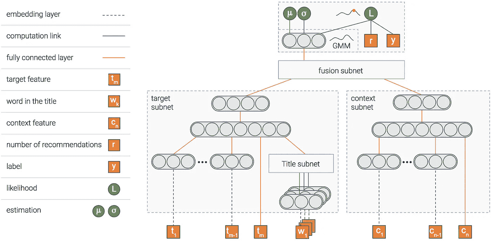

一张图胜过千言万语，不是吗？一张包含一千个神经元的图片？…

无论如何，这是我们使用的模型。该模型由几个模块组成。我们将解释每个人的目标，然后画面会变得更清晰…

## 项目模块

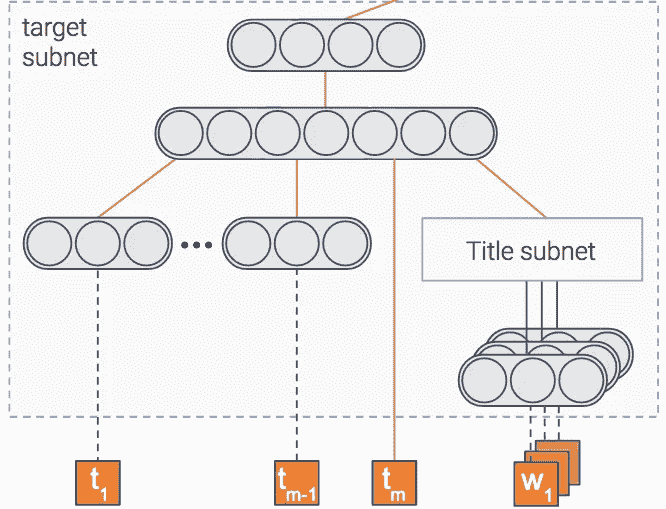

该模型试图预测一个项目被点击的概率，即 CTR(点击率)。为此，我们有一个模块，它获取项目的特征作为输入，如标题和缩略图，并输出一个密集的表示——如果你愿意，也可以是一个数字向量。

一旦模型被训练，这个向量将包含从项目中提取的重要信息。

## 上下文模块

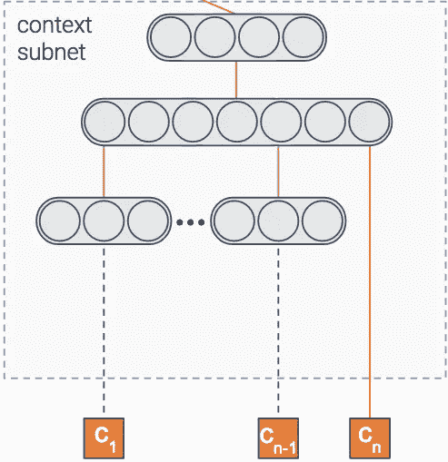

我们说过模型预测了一个项目被点击的概率，对吗？但是这个项目是在什么样的背景下展示的呢？

上下文可能意味着很多事情——出版商、用户、一天中的时间等等。该模块获取上下文的特征作为输入。然后它输出上下文的密集表示。

## 融合模块

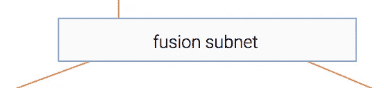

因此，我们从项目和上下文中提取了信息。当然，这两者之间有一些互动。例如，与金融出版商相比，体育出版商中关于足球的项目可能具有更高的点击率。

这个模块将两种表示融合成一种，类似于协同过滤。

## 估计模块

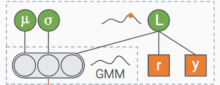

最后，我们有一个模块，其目标是预测 CTR。此外，它还估计了 CTR 估计的不确定性。

我猜你对这个模块是如何工作的不太确定，所以让我们来解释一下。

我们将带您了解我们提到的三种不确定性，并向您展示我们的模型是如何处理每一种不确定性的。首先，让我们解决数据的不确定性。

# 资料不确定

让我们用一些在回归任务上训练的通用神经网络。一个常见的损失函数是 MSE——均方误差。我们喜欢这种损失，因为它是直观的，对不对？您希望最小化误差…但事实证明，当您最小化 MSE 时，您隐含地最大化了数据的似然性-假设标签正态分布，具有固定的标准偏差𝝈.这个𝝈是数据中固有的噪声。

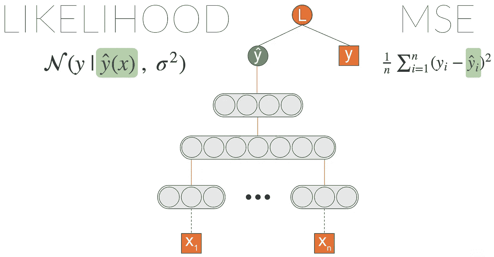

我们可以做的一件事是通过引入一个新的节点，我们称之为𝝈.，显式地最大化可能性将其插入似然方程并让梯度传播使得该节点能够学习输出数据噪声。

我们没有取得任何不同，对吗？我们得到了与最初基于 MSE 的模型相同的结果。但是，现在我们可以引入从最后一层到𝝈:的链路

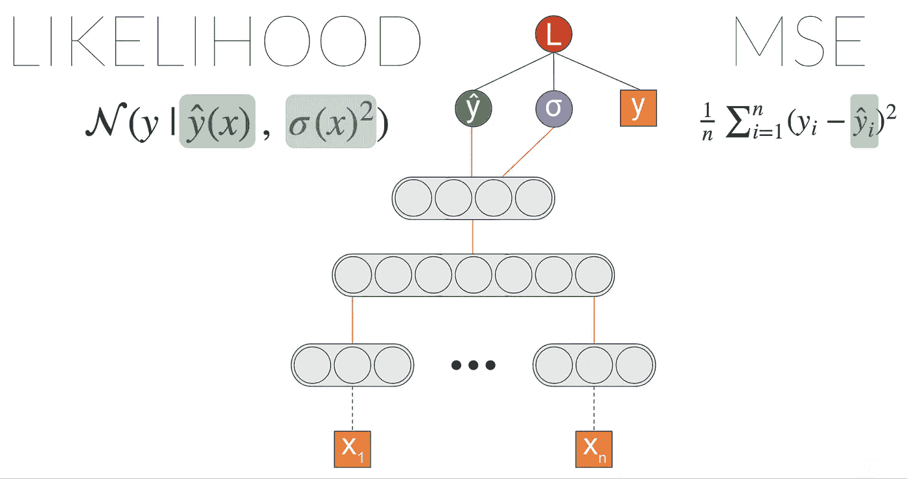

现在我们开始有趣的事情了！𝝈现在是输入的函数。这意味着模型可以学习将不同级别的数据不确定性与不同的输入关联起来。

我们可以让这个模型更加强大。我们可以估计高斯分布的混合物，而不是估计高斯分布。我们加入的高斯函数越多，模型的容量就越大——也更容易过度拟合，所以要小心。

这种架构被称为 MDN——混合密度网络。它是由[主教*等人*于 1994 年](https://www.microsoft.com/en-us/research/wp-content/uploads/2016/02/bishop-ncrg-94-004.pdf)引进的。以下是它捕捉到的一个例子:

我们有两组类似的项目——一组是关于购物的，另一组是关于运动的。

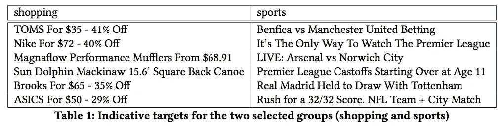

事实证明，购物项目往往有更多的可变点击率——可能是由于趋势。事实上，如果我们要求模型估计每组中一个项目的不确定性(图中的虚线)，我们得到的购物不确定性比运动更高。

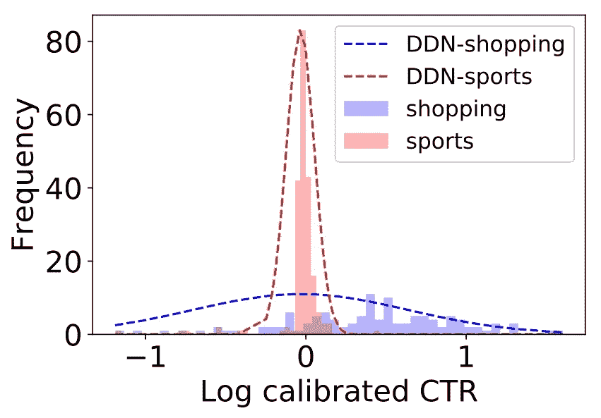

所以数据不确定性已经过去了。下一步是什么？

# 测量不确定度

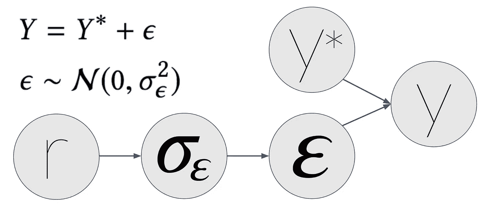

这个有点复杂。在[的第一篇文章](https://engineering.taboola.com/using-uncertainty-interpret-model/)中，我们解释了有时候测量会有噪音。这可能会导致有噪声的要素甚至有噪声的标注。在我们的例子中，我们的标签 y 是一个项目的经验性点击率——到目前为止它被点击的次数除以它被显示的次数。

假设一个物品的真实 CTR 是 y* —也就是说，没有测量噪声。如果我们在上下文中无限次显示该项目，这将是 CTR。但是时间是有限的(至少我们有的时间是有限的)，所以我们只展示了有限的次数。我们测量了一个观察到的 CTR y。这个 y 有测量噪声——我们用𝜺.表示

接下来，我们假设𝜺呈正态分布，标准偏差为𝝈𝜺。r 的𝝈𝜺函数——我们展示物品的次数。r 越大，𝝈𝜺越小，这使得 y 更类似于 y*。

在一天结束时，在我们把你从数学细节中解救出来(你可以在我们的论文中找到[)之后，我们得到这个可能性等式:](https://arxiv.org/abs/1711.02487)

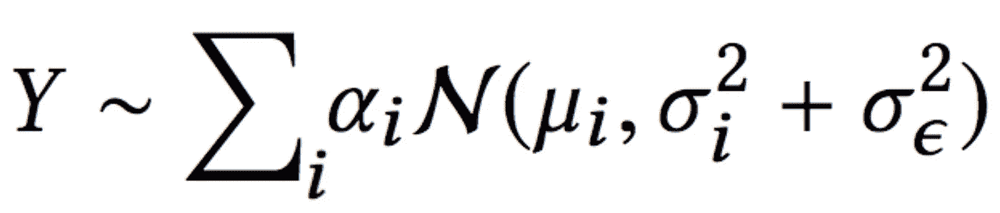

这与混合高斯分布的 MDN 架构中的可能性相同，但有一点不同，误差项分为两部分:

*   数据不确定性(𝝈i)
*   测量不确定度(𝝈𝜺)

既然模型能够用不同的术语解释每个不确定性，数据不确定性就不会被测量不确定性所污染。

除了能够以更好的方式解释数据，这允许我们在训练过程中使用更多的数据。这是因为在这项工作之前，我们过滤掉了太多噪音的数据。

# 最后但并不是最不重要的

在前一篇文章中，我们讨论了如何处理模型不确定性。我们描述的方法之一是在推理时使用 dropout。

能够估计模型的不确定性使我们能够更好地理解模型由于缺乏数据而不知道的东西。所以让我们来测试一下吧！

让我们看看独特的标题是否与高不确定性有关。我们将把训练集中的每个标题映射到一个密集表示(例如，平均 word2vec 嵌入)，并期望该模型对唯一标题不太确定，唯一标题是映射到嵌入空间的稀疏区域的标题。

为了测试它，我们通过计算 KDE(核密度估计)来计算稀疏和密集区域。这是一种估计我们空间的 PDF(概率密度函数)的方法。接下来，我们要求模型估计与每个标题相关的不确定性。事实证明，该模型在稀疏区域确实具有更高的不确定性！

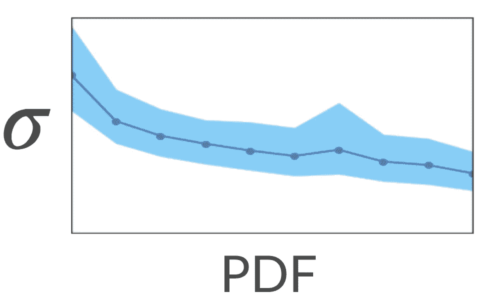

很好…如果我们向模型显示更多稀疏区域的标题，会发生什么？会不会对这些区域比较确定？让我们来测试一下！

我们取了一堆类似的关于汽车的标题，把它们从训练集中去掉了。实际上，它改变了他们在空间中的区域，从密集变为稀疏。接下来，我们估计了这些标题的模型不确定性。不出所料，不确定性很高。

最后，我们只将其中一个标题添加到训练集中，并重新训练该模型。令我们满意的是，现在*所有这些项目的不确定性都降低了。整洁！*

正如我们在[看到的关于勘探开发的帖子](https://engineering.taboola.com/recommender-systems-exploring-the-unknown-using-uncertainty/)，我们可以鼓励对这些稀疏地区的勘探。这样做之后，不确定性就会降低。这将导致该地区勘探的自然衰退。

# 最后的想法

在这篇文章中，我们详细阐述了如何使用一个统一的模型，以一种原则性的方式对所有三种类型的不确定性——数据、模型和测量——进行建模。

我们鼓励你思考如何在你的应用中使用不确定性！即使你不需要在你的预测中明确地模拟不确定性，你也可能从在训练过程中使用它中受益——如果你的模型能够更好地理解数据是如何产生的，以及不确定性如何影响游戏，它可能会有所改进。

*这是与我们在今年 KDD 会议的一个研讨会上提交的论文相关的系列文章的第四篇:* [*深度密度网络和推荐系统中的不确定性*](https://arxiv.org/abs/1711.02487) *。*

*第一篇帖子可以在* [*这里找到*](https://engineering.taboola.com/using-uncertainty-interpret-model) *。
第二个帖子可以在这里找到***。
第三个帖子可以在这里找到***。***

***原载于*[*engineering.taboola.com*](https://engineering.taboola.com/uncertainty-ctr-prediction-one-model-clarify)*由我和* [Inbar Naor](https://medium.com/u/5d840e4443e4?source=post_page-----8cb0aa5ed2--------------------------------) 。**