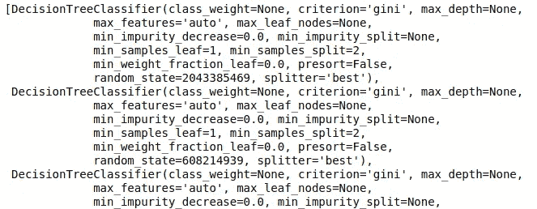
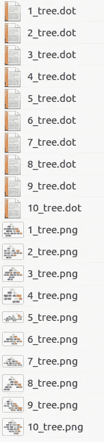
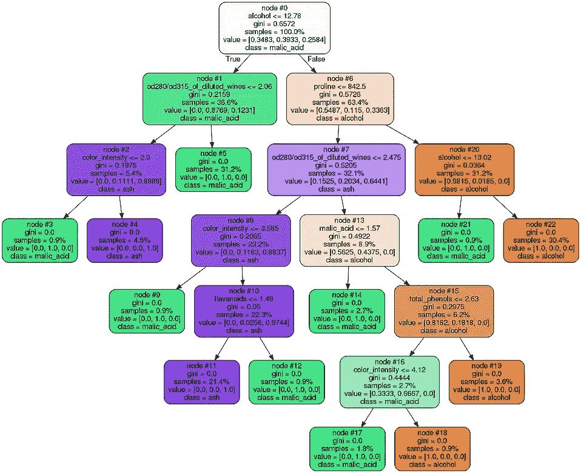
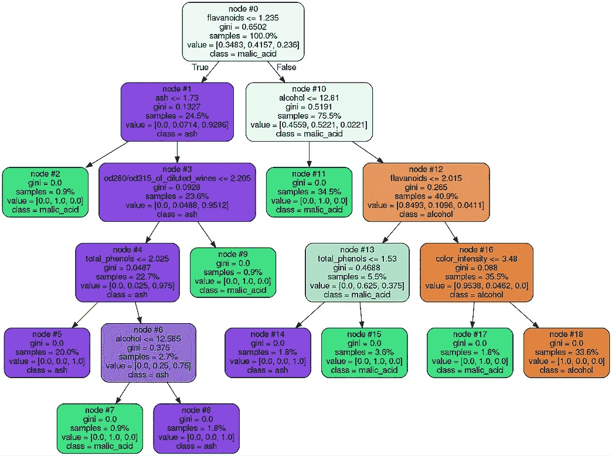
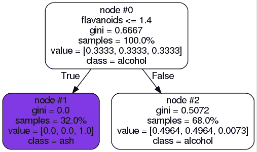
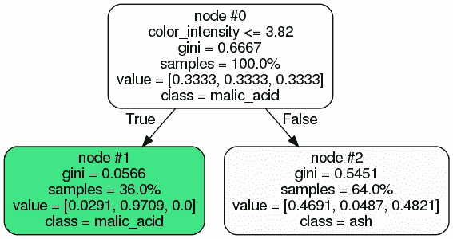
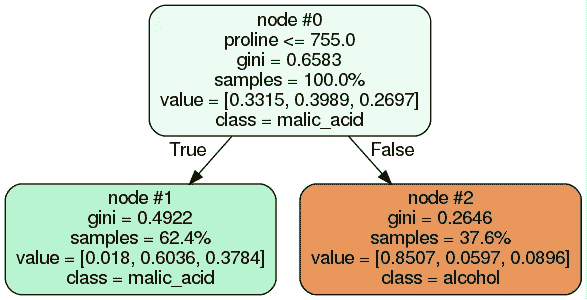

# 揭示 Python 中树集合的结构

> 原文：<https://towardsdatascience.com/uncover-the-structure-of-tree-ensembles-in-python-a01f72ea54a2?source=collection_archive---------6----------------------->


Photo by [Ghost Presenter](https://unsplash.com/photos/zhws9e2tzfA?utm_source=unsplash&utm_medium=referral&utm_content=creditCopyText) on [Unsplash](https://unsplash.com/?utm_source=unsplash&utm_medium=referral&utm_content=creditCopyText)

集成方法将多个基本估计量结合起来，以产生更稳健的模型，更好地概括新数据。 *Bagging* 和 *Boosting* 是集成方法的两个主要类别，它们的区别在于它们组合来自基础估计量的预测的方式。

Bagging 方法独立地建立估计量，然后平均它们的预测值。通过在构建每个基础估计量的方式中引入随机性，他们旨在减少最终模型的方差。换句话说，减少过度拟合。

Boosting 方法在序列中建立基本估计量，其中每个后续估计量从其前一个估计量的错误中学习。与减少方差相反，这些方法的目标是减少所得估计量的偏差。

每一类都包含几个算法。在这里，我们将看看两个广泛应用的算法，每个类别一个；*随机森林*作为装袋的例子 *Ada Boost* 作为 boosting 方法的例子，用决策树作为基本估计器。我们将在分类的上下文中讨论这些方法，尽管这两种方法也在回归任务中使用。

这篇文章的目的是展示如何通过可视化的树来挖掘集合的几个潜在估计量。

**随机森林**

随机森林，顾名思义，是一种建立在决策树上的装袋方法。每棵树都在数据的引导样本上进行训练，并且可以选择使用原始输入特征的子集。这两个随机因素确保了每棵树都是不同的。如果我们假设每棵树都超过了部分数据，我们期望它们的平均值会减少这种影响。

控制随机森林结构的主要参数是估计器的数量( *n_estimators* )，即构建的决策树的总数和用于在每个节点选择分裂的输入属性的最大数量( *max_features* )。

一般来说，估计量越大，结果越好。然而，大量的估计器也导致长的训练时间。也很有可能在一定数量的估计量之后，精确度的增加将趋于平稳。人们应该在准确性和性能之间寻求平衡。交叉验证是一种可以用来调整这些参数的原则性方法。

一旦选择了 n_estimators= *N* ，就以上述方式构建了 *N* 个决策树，并且通过对这些预测进行平均来获得最终预测。为了深入了解每个单独的预测，我们可以将构建的每个树可视化。

在这篇文章中，我们展示了如何在 Jupyter 笔记本中绘制决策树。这里，我们将更进一步，看看如何绘制一个系综的所有 *N* 棵树。

下面是为 sklearn 葡萄酒数据集训练随机森林分类器的脚本。

```
from sklearn.ensemble import RandomForestClassifier
from sklearn.datasets import load_wine# load dataset
data = load_wine()# feature matrix
X = data.data# target vector
y = data.target# class labels
labels = data.feature_namesestimator = RandomForestClassifier().fit(X, y)
```

分类器对象有一个属性 *estimators_* ，它是一个由 *N* 棵决策树组成的列表。这个列表的长度给出了树的数量。

```
print(“Number of trees “ + str(len(trees)))Number of trees 50
```

如果我们打印 trees 对象，我们将得到每个估计量的摘要。

```
display(estimator.estimators_)
```



Sample of estimators_

我们可以遍历列表中的每个元素，得到每棵树的节点数。

```
print("Number of nodes per tree is ")

i_tree = 0
for tree_in_forest in trees:
print(tree_in_forest.tree_.node_count)
i_tree += 1Number of nodes per tree is 
23
23
9
19
27
27
21
23
21
25
```

现在，如果我们迭代 trees 对象，我们可以使用 *export_graphviz* 函数来绘制每棵树。因为树的数量通常很大，所以在笔记本中画出每一棵树并不方便。相反，我们可以将每个文件保存在工作目录中的. dot 文件中。如果您还想将每个文件保存为. png 格式，请使用 *check_call* 功能。

```
from sklearn.tree import export_graphviz
from subprocess import check_callcnt = 1
for item in trees:
     export_graphviz(item, out_file=str(cnt)+’_tree.dot’,feature_names= labels, class_names=labels, rounded=True, precision=4, node_ids=True, proportion=True
, filled=True)

     check_call([‘dot’,’-Tpng’,str(cnt)+’_tree.dot’,’-o’,str(cnt)+’_tree.png’]) cnt += 1
```

一旦迭代完成，我们将在我们的目录中得到一个文件编号列表。



List of files in directory

下面是两种经过训练的树。



Two of the Decision Trees of the trained Random Forest model

我们可以看到，每棵树可以有不同的深度，以及不同的节点结构和分裂。这正是在不同的数据子集上构建每棵树，并基于特征子集进行分割的结果。在这一点上，我们应该提到，bagging 方法通常在复杂的底层模型(即深树)中工作得更好，它们减少了过拟合效应。

**Ada 增强**

与 bagging 相反，boosting 方法的原理是训练一系列“弱”学习器，例如深度小的决策树。在每次迭代中，通过为数据的每个实例分配权重来构建树。首先，给定 *k 个*训练样本，每个训练样本被赋予等于 *1/k* 的权重。在每次迭代中，没有被正确分类的样本得到更高的权重，迫使模型在这些情况下更好地训练。最后，通过加权多数投票将预测结合起来。

Ada Boost 的主要参数是 *base_estimator* 和*n _ estimator*。估计量的数量相当于随机森林所描述的参数。基本估计量是基础模型的模型类型。在 sklearn learn 中，默认的基础估计器是决策树桩(具有 *max_depth* = 1 的决策树)。

与 RandomForestClassifier 类似，AdaBoostClassifier 也有一个 *estimators_* 属性。因此，我们可以训练一个 AdaBoost 分类器，并以上述方式绘制所有的树。

```
from sklearn.ensemble import AdaBoostClassifierestimator = AdaBoostClassifier().fit(X, y)

trees = estimator.estimators_

print("Number of trees " + str(len(trees)))Number of trees 50
```

sklearn 中 AdaBoost 的默认估计数是 50。使用与上面完全相同的循环，我们可以得到 50 棵决策树中每一棵的图像。



Three first Decision Trees of the trained AdaBoost model

有前三个决策树，每个在顶部节点有不同的分割。这一次，不同的分裂是由于每个样本在每次迭代中得到的不同权重。每棵树都专注于正确预测前一棵树未能正确分类的内容。

在本文中，我们看到了一种可以应用于 bagging 和 boosting 两个分类器家族的方法，以便可视化底层模型，这些模型的投票构成了我们模型的最终预测。通过这种可视化，我们展示了如何通过装袋中的随机化和 boosting 中的权重分配从相同的原始数据和输入要素构建 N 个不同的树。再一次，我发现这是一个实用的方法，可以更好地理解集合方法在幕后是如何工作的，并且在我们的项目中使用这种模型时，可以减少黑箱。