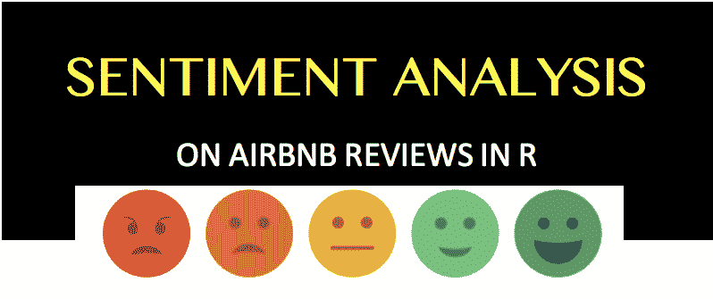
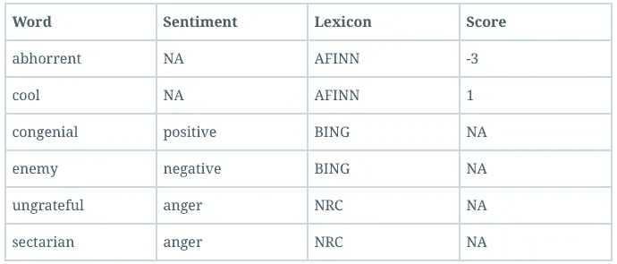
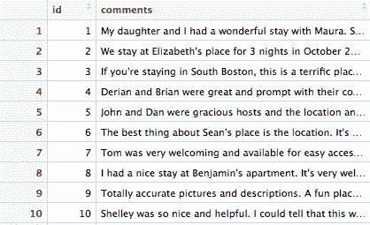
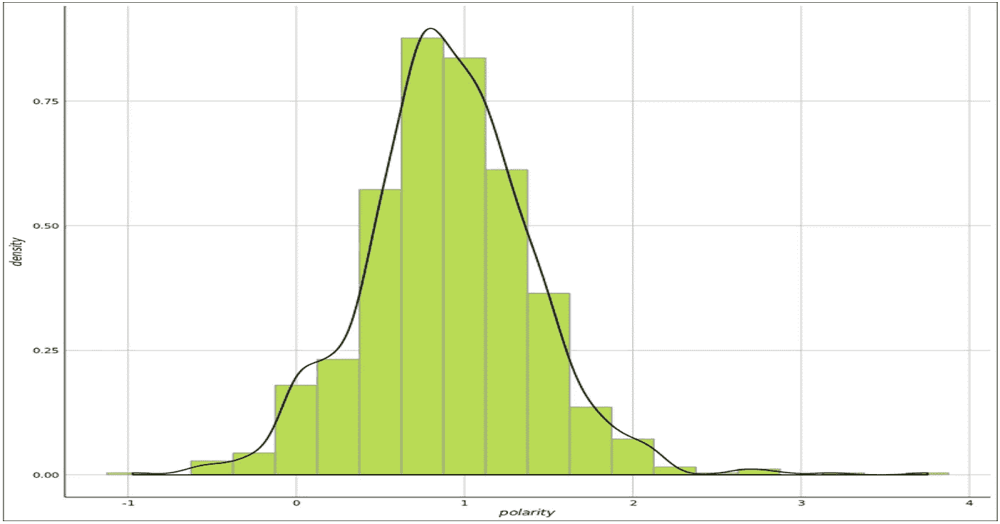
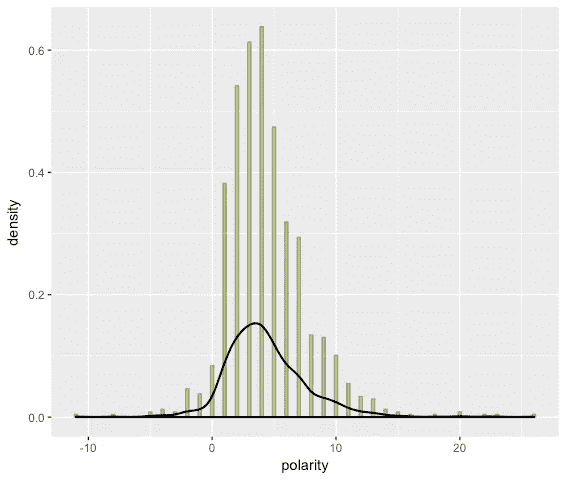
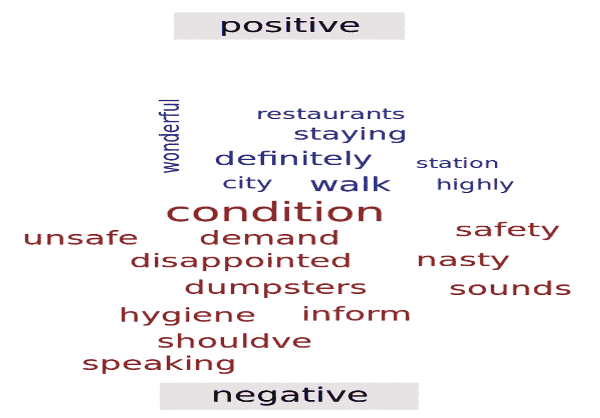
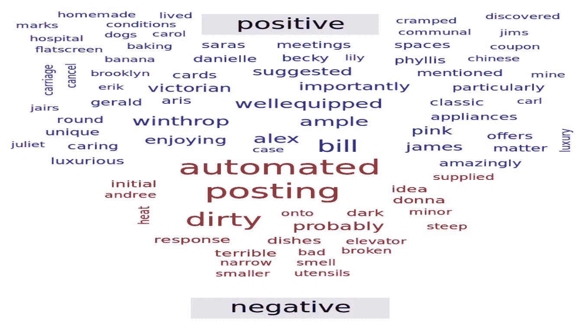
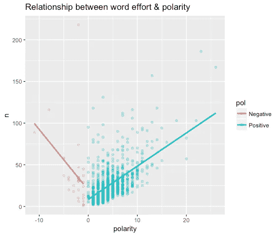

# 使用数据科学揭示 AirBnB 评论中的隐藏趋势

> 原文：<https://towardsdatascience.com/uncovering-hidden-trends-in-airbnb-reviews-11eb924f2fec?source=collection_archive---------9----------------------->



# 欢迎来到词汇世界

在做情感挖掘的研究时，我熟悉了主观词汇的重要概念。词典的应用是情感分析的两种主要方法之一。它包括从文本中出现的单词或短语的语义方向计算情感。

# R 中可用的词典:

**qdap 的*极性*()函数**:使用来自 hash _ 情操 _ 刘虎(IL @CHI 极性(+/-)词研究的 U)的词典

*   ****NRC** —根据 8 种情绪的单词，如“愤怒”或“喜悦”以及阳性/阴性**
*   ****并** —标记为肯定或否定的词**
*   ****AFINN** —得分从-5 到 5 的单词**

****

**[**省力原则**](https://anthrosource.onlinelibrary.wiley.com/doi/pdf/10.1525/aa.1950.52.2.02a00290) 使有限的词库变得有用。**

**您可以根据自己的需要随时修改词典！**

# **1.定义业务问题**

**这是我最喜欢的，也是任何项目成功的最重要的一步:问正确的问题。一些领域的理解或与领域专家的交流确实有助于定义一个合适的问题陈述。**

**你应该很清楚自己的数据，并且有充分的理由去挖掘情感，而不仅仅是因为这听起来很酷！；)**

**例如，通常在调查中，消费者被要求在一定范围内对产品进行评级。在这种情况下，**一个有序的评级足以确定消费者对产品的情绪**，这里的情绪分析就有点过了。如果你**想** **知道消费者喜欢或不喜欢产品的什么，** **使用开放式问题**，并使用回答提取有意义的见解。**

**在这个博客中，我们将找出哪些住房属性(例如，餐馆、地铁站附近、卫生、安全等。)根据总体客户评价带来良好的租赁体验。**

# **2.识别文本来源**

**从任何网站获取顾客评论的流行方式之一是通过**网络搜集。用 R 或者 Python 都可以。我会在我的下一篇博客中保留这个话题。目前，**我选择了一个数据集，其中有 1000 条关于波士顿 AirBnB 租赁的用户评论**。****

```
*# Upload dataset in R (available as .rds file)* 
> bos_reviews <- readRDS("bos_reviews.rds", refhook = NULL)
```

****

# **3.组织和清理文本**

**在这一步，我们将使用两种不同的词汇( **Polarity** 和 **BING** )来确定所收集的房屋评论的情感得分。**

## **基于简单 Qdap 的极性评分**

**从进行情绪分析开始是一种合理的方法，因为它让您熟悉数据，并帮助您设定期望，以更好地解决业务问题。为此，来自 *qdap* 封装的[极性](https://www.rdocumentation.org/packages/qdap/versions/2.2.9/topics/polarity)功能非常有用。它允许我们将文本分为正面或负面。**

```
*# Check out the boston reviews polarity overall polarity score* > bos_pol <- polarity(bos_reviews)  
> bos_pol all total.sentences total.words ave.polarity sd.polarity stan.mean.polarity all 1000 70481 0.902 0.502 1.799 *# Summary for all reviews* 
> summary(bos_pol$all$polarity) 
   Min. 1st Qu. Median  Mean  3rd Qu.  Max.   NA's 
-0.9712 0.6047  0.8921 0.9022 1.2063  3.7510   1 *# Kernel density plot of polarity score for all reviews* 
> ggplot(bos_pol$all, aes(x = polarity, y = ..density..)) + theme_gdocs() + geom_histogram(binwidth = 0.25, fill = "#bada55", colour = "grey60") + geom_density(size = 0.75)
```

****

**The above graph shows that the median polarity score is greater than zero, i.e., the reviews tend to be positive. Notice that the reviews do not center on zero: this is known as **grade inflation**. There are two possible causes for this. First, **social norms** may lead respondents to be pleasant instead of neutral*.* The second reason could be **feature-based sentiment,**where an author may write, “the bed was comfortable and nice, but the kitchen was dirty and gross” and the sentiment encompasses multiple “features” simultaneously, thereby skewing the average score.**

## **TidyText 的必应词典**

**在这里，我们将直接从名为“comments”的 review 列创建 word data。**

```
> library(tidytext) 
> library(tidyr) 
> library(dplyr) *# Use unnest_tokens to make text lowercase & tokenize reviews into single words.* 
> tidy_reviews <- bos_reviews %>% unnest_tokens(word, comments) *# Group by and mutate to capture original word order within each group of a corpus.* 
> tidy_reviews <- tidy_reviews %>% group_by(id) %>% mutate(original_word_order = seq_along(word)) *# Quick review* 
> tidy_reviews 
A tibble: 70,834 x 3 
Groups: id [1,000] 
id               word         original_word_order 
1 1               my                  1 
2 1            daughter               2 
3 1              and                  3 
4 1               i                   4 
5 1              had                  5 
6 1               a                   6 
7 1           wonderful               7 
8 1             stay                  8 
9 1             with                  9 
10 1            maura                 10 # ... with 70,824 more rows 
*# Load stopwords lexicon* 
> data("stop_words") *# Perform anti-join to remove stopwords* 
> tidy_reviews_without_stopwords <- tidy_reviews %>% anti_join(stop_words) *# Getting the correct lexicon* > bing <- get_sentiments(lexicon = "bing") *# Calculating polarity for each review* > pos_neg <- tidy_reviews_without_stopwords %>% inner_join(bing) %>% count(sentiment) %>% spread(sentiment, n, fill = 0) %>% mutate(polarity = positive - negative) *# Checking outcome* 
> summary(pos_neg) 
    id              negative         positive         polarity 
Min. : 1.0       Min. : 0.0000      Min. : 0.00     Min. :-11.000 
1st Qu.: 253.0   1st Qu.: 0.0000    1st Qu.: 3.00   1st Qu.: 2.000 Median : 498.0   Median : 0.0000    Median : 4.00   Median : 4.000 Mean : 500.4     Mean : 0.6139      Mean : 4.97     Mean : 4.356 
3rd Qu.: 748.0   3rd Qu.: 1.0000    3rd Qu.: 7.00   3rd Qu.: 6.000 Max. :1000.0     Max. :14.0000      Max. :28.00     Max. : 26.000 *# Kernel density plot of Tidy Sentiment score for all reviews* 
> ggplot(pos_neg, aes(x = polarity, y = ..density..)) + geom_histogram(binwidth = 0.25, fill = "#bada55", colour = "grey60") + geom_density(size = 0.75)
```

****

**Based on the polarity distribution for both Qdap’s polarity score and TidyText’s BING, we can say that the comments are tending towards positive.**

# **4.创建基于极性的语料库**

**在极性检查之后，我们需要创建一个大的文本集，用于下一步的特征提取。**

****a .根据步骤 2 中计算出的极性得分，将所有 1，000 条意见分为正面和负面意见。****

```
*# Add polarity column to the reviews*
> bos_reviews_with_pol <- bos_reviews %>% mutate(polarity = bos_pol$all$polarity)

*# Subset positive comments based on polarity score*
> pos_comments <- bos_reviews_with_pol %>% filter(polarity > 0) %>% pull(comments)

*# Subset negative comments based on polarity score*
> neg_comments <- bos_reviews_with_pol %>% filter(polarity < 0) %>% pull(comments)
```

****b .将正面和负面评论折叠成两个较大的文档。****

```
*# Paste and collapse the positive comments* 
> pos_terms <- paste(pos_comments, collapse = " ") *# Paste and collapse the negative comments * 
> neg_terms <- paste(neg_comments, collapse = " ") *# Concatenate the positive and negative terms* 
> all_terms <- c(pos_terms, neg_terms)
```

****c .创建词频逆文档频率(TFIDF)加权词频文档矩阵(TDM)。****

**这里，不是计算单词在语料库中的频率，而是对过度使用的术语惩罚 TDM 中的值，这有助于减少无信息的单词。**

```
*# Pipe a VectorSource Corpus* 
> all_corpus <- all_terms %>% VectorSource() %>% VCorpus() *# Simple TFIDF TDM* 
> all_tdm <- TermDocumentMatrix(all_corpus, control = list( weighting = weightTfIdf, removePunctuation = TRUE, stopwords = stopwords(kind = "en"))) *# Examine the TDM * 
> all_tdm <> Non-/sparse entries: 4348/5582 Sparsity: 56% Maximal term length: 372 Weighting: term frequency - inverse document frequency (normalized) (tf-idf) *# Matrix* 
> all_tdm_m <- as.matrix(all_tdm) *# Column names* 
> colnames(all_tdm_m) <- c("positive", "negative")
```

# **5.提取特征**

**在这一步中，我们将从 TDM 中提取关键的住房特征，从而得出正面和负面的评价。**

```
*# Top positive words* 
> order_by_pos <- order(all_tdm_m[, 1], decreasing = TRUE) *# Review top 10 positive words* 
> all_tdm_m[order_by_pos, ] %>% head(n = 10) DocsTerms       positive     negative 
walk           0.004565669       0 
definitely     0.004180255       0 
staying        0.003735547       0 
city           0.003290839       0 
wonderful      0.003112956       0 
restaurants    0.003053661       0 
highly         0.002964720       0 
station        0.002697895       0 
enjoyed        0.002431070       0 
subway         0.002401423       0 *# Top negative words* 
> order_by_neg <- order(all_tdm_m[, 2], decreasing = TRUE) *# Review top 10 negative words* 
> all_tdm_m[order_by_neg, ] %>% head(n = 10) DocsTerms       positive      negative 
condition           0        0.002162942 
demand              0        0.001441961 
disappointed        0        0.001441961 
dumpsters           0        0.001441961 
hygiene             0        0.001441961 
inform              0        0.001441961 
nasty               0        0.001441961 
safety              0        0.001441961 
shouldve            0        0.001441961 
sounds              0        0.001441961
```

# **6.分析特征**

**让我们比较一下通过 WordClouds 获得**正面和负面评价**的房屋特征。**

****a .对比云****

```
> comparison.cloud(all_tdm_m, max.words = 20, colors = c("darkblue","darkred"))
```

****

****b .缩放后的对比云****

**通过这种可视化，我们将在执行语料库子集之前，通过将评论分数调整回零，修复**等级膨胀**对租赁评论极性分数的影响。这意味着一些先前的正面评论可能会成为负面子部分的一部分，反之亦然，因为平均值变为零。**

```
*# Scale/center & append* 
> bos_reviews$scaled_polarity <- scale(bos_pol$all$polarity) *# Subset positive comments* 
> pos_comments <- subset(bos_reviews$comments, bos_reviews$scaled_polarity > 0) *# Subset negative comments* 
> neg_comments <- subset(bos_reviews$comments, bos_reviews$scaled_polarity < 0) *# Paste and collapse the positive comments* 
> pos_terms <- paste(pos_comments, collapse = " ") *# Paste and collapse the negative comments* 
> neg_terms <- paste(neg_comments, collapse = " ") *# Organize* 
> all_terms<- c(pos_terms, neg_terms) *# VCorpus* 
> all_corpus <- VCorpus(VectorSource(all_terms)) *# TDM* 
> all_tdm <- TermDocumentMatrix( all_corpus, control = list( weighting = weightTfIdf, removePunctuation = TRUE, stopwords = stopwords(kind = "en"))) # Column names 
> all_tdm_m <- as.matrix(all_tdm) 
> colnames(all_tdm_m) <- c("positive", "negative") # Comparison cloud 
> comparison.cloud(all_tdm_m, max.words = 100, colors = c("darkblue", "darkred"))
```

****

**除了上面的分析，我还想评估一个作者在写正面评论和负面评论时付出的努力之间的相关性。这是通过绘制正面和负面评论的字数来完成的。**

```
*# Create effort* 
> effort <- tidy_reviews_without_stopwords %>% count(id) *# Inner join* 
> pos_neg_with_effort <- inner_join(pos_neg, effort) *# Review* 
> pos_neg_with_effort  
A tibble: 953 x 5 Groups: id [?] 
id      negative     positive      polarity     n 
1 1         0            4             4        26 
2 2         0            3             3        27 
3 3         0            3             3        16 
4 4         0            6             6        32 
5 5         0            2             2         8 
6 6         0            3             3        21 
7 7         0            5             5        18 
8 8         0            2             2        10 
9 9         0            4             4        12 
10 10       1           15            14        46 
*# ... with 943 more rows * *# Add pol* 
> pos_neg_pol <- pos_neg_with_effort %>% mutate(pol = ifelse(polarity >= 0, "Positive", "Negative")) *# Plot* 
> ggplot(pos_neg_pol, aes(polarity,n, color = pol)) + geom_point(alpha = 0.25) + geom_smooth (method = "lm", se = FALSE) + ggtitle("Relationship between word effort & polarity")
```

****

# **7.得出结论**

**不足为奇的是，顶级**正面**词汇包括:**

*   **步行**
*   **装备精良**
*   **饭店**
*   **地铁**
*   **站**

**相比之下，最负面的**术语包括:****

*   **自动过账**
*   **垃圾箱**
*   **肮脏的**
*   **卫生**
*   **安全**
*   **声音**

**同样，可以看出作者会花更多的精力来写一篇更强有力的正面或负面评论。这话多么真实啊！**

**我确信，有了更大的数据集，我们可以挖掘出比这个小案例研究更深刻的见解。**

# **非常感谢您的阅读！**

**我写这篇博客的目的是与所有有志成为数据科学家的人分享情绪分析的基本概念，但我们不能就此止步！我想我已经准备好为我的作品集做一个更精细的情感挖掘项目了，:D，你呢？**

**请在下面的评论中分享你的想法/反馈。**

**也可以在 [Linkedin](https://www.linkedin.com/in/gupta-sakshi/) 上和我联系。**

**继续编码。干杯！**

***(首发@www.datacritics.com)***