# 揭开 Airbnb 高收入的秘密

> 原文：<https://towardsdatascience.com/uncovering-the-secrets-to-higher-airbnb-revenues-6dbf178942af?source=collection_archive---------8----------------------->

使用数据分析和机器学习来揭示波士顿和西雅图 Airbnb 成功上市背后的秘密

## 介绍

Airbnb 是全球最受欢迎的短期租赁在线房源服务之一。虽然建立 Airbnb 业务相对容易，但在这一行取得成功可能很难。如果你正在考虑进入波士顿和西雅图的 Airbnb 业务，这篇文章就是为你而写的。

我们将探索 Airbnb 在这些城市是否确实是一项可行的业务，并应用数据分析和机器学习来确定策略，以帮助您获得超越竞争对手的优势。

将调查以下问题:

*   Airbnb 主机的收入有多少？
*   出租什么类型的房产最好？
*   什么时候是最好的租赁时间？
*   哪些区域最适合出租？
*   为了吸引更多的注意，你应该在列表名称中写些什么？

我们还将分享一些额外的技巧，帮助你成为一名成功的 Airbnb 房东，敬请关注。

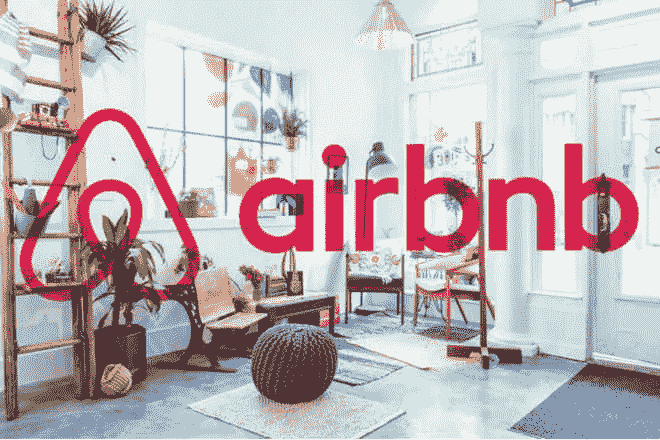

## 数据

为了回答这些问题，我们将使用 Kaggle 提供的 Airbnb 数据集来处理波士顿和 T2 的数据。这些数据集提供的信息包括两个城市的房源详情、客户评论和房源安排。

## 假设

虽然两个数据集都没有提供预订的详细信息，但我们可以根据他们在该时间段内收到的评论数量来估计每个酒店的预订数量。然后，我们可以用以下公式推断每项资产的收入:

*评论数量* **x** *列表价格* **x** *最短停留时间*

这是对收入的保守估计，因为酒店的预订量很可能会超过点评量。此外，客人还可能会停留超过规定的最低住宿天数。

事不宜迟，我们开始吧！

s

## 2015 年波士顿的平均主机收入为 7200 美元，而西雅图为 4700 美元

2015 年，波士顿 Airbnb 主机的平均估计收入为 7200 美元。在一年中有 90 多天在网上登记房产的活跃房东中，平均年收入增长到了 9000 美元左右。

虽然 2015 年波士顿 Airbnb 主机的平均收入相对较高，但收入差距普遍存在。50%的活跃主机收入低于 3，900 美元，而前四分之一的活跃主机平均收入超过 9，800 美元。

波士顿的顶级 Airbnb 主机在 2015 年获得了超过 371，000 美元的收入！事实上，4 个票房收入最高的主机在那一年获得了至少 10 万美元的收入。

在西雅图，2015 年 Airbnb 主机的平均收入估计为 4700 美元，而一个活跃的主机收入超过 4900 美元。

和波士顿的情况一样，西雅图也存在收入差距。50%的活跃主机收入不到 2，400 美元，而前 25%的活跃主机平均收入超过 5，800 美元。同时，西雅图的顶级主持人获得了超过 27 万美元的收入。

## 在波士顿，你应该租出整个公寓或房子，而在西雅图，能容纳 4 个人的公寓最好

在波士顿出租整个公寓或房子可能会带来不错的收入。预计整套公寓的年收入为 6100 美元，整栋房子的年收入为 6700 美元。

这不仅远高于波士顿 Airbnb 房源的平均收入(4600 美元)，公寓和房屋也是波士顿房源的最大组成部分。因此，对这类房产的需求相对健康。

虽然可能有其他类型的财产(床和早餐，阁楼等。)产生了更高的收入，它们在波士顿上市公司中所占的比例较小，因此更有可能服务于较小的利基市场。

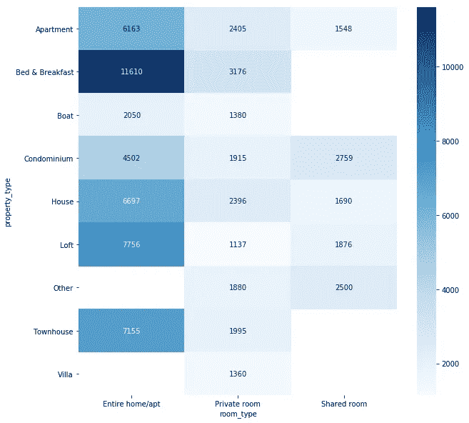

Average annual revenues of Airbnb listings in Boston in 2015

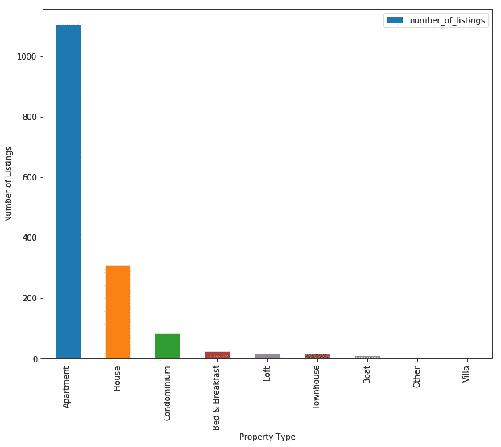

Number of listings by property type in Boston in 2015

此外，能容纳更多客人的酒店也更有可能在波士顿创造更高的收入。事实上，容纳 4 位客人的酒店的平均收入几乎是容纳 3 位客人的酒店的两倍。2015 年，可容纳 6 名客人的房源收入最高。但是这些房源比较稀缺，所以这个细分市场可能不会很大。

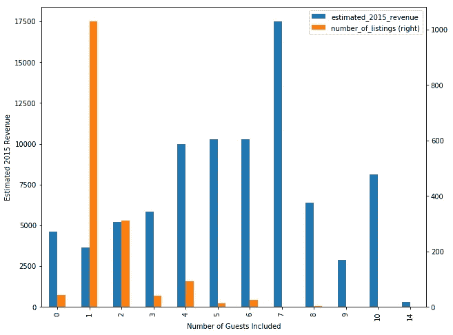

Mean Revenues vs Number of Guests in Boston in 2015

列表的收入会有很大的不同，就像主机的收入一样。2015 年，波士顿 50%的房源收入低于 2300 美元，而前 25%的房源收入超过 5520 美元。

如果你正在西雅图寻找一个完美的 Airbnb 房源，那就看看能容纳 4 人的公寓吧。2015 年有 336 处此类房产上市，平均年收入为 4500 美元。

相比之下，2015 年西雅图 Airbnb 房源的平均收入为 3400 美元。

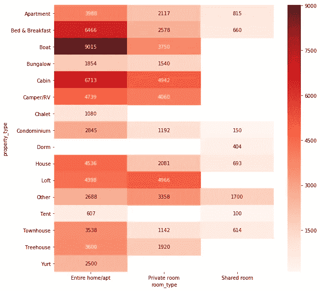

Average annual revenues of Airbnb listings in Seattle in 2015

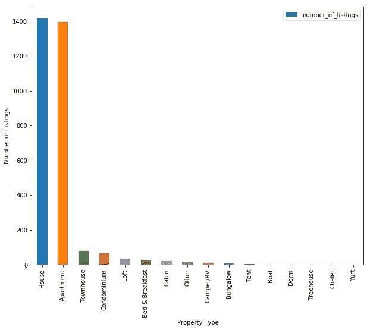

Number of listings by property type in Seattle in 2015

出租整艘船估计每年可以获得 9000 美元的收入，远远超过其他任何财产。然而，这个数字应该谨慎对待，因为 2015 年只有两个这样的财产被列入名单。

如果你出租整栋房子或公寓，这是西雅图最常见的房源，你可以合理地预计分别获得 4500 美元和 4000 美元。

在西雅图，能容纳更多客人的酒店也在 2015 年创造了更高的收入。同样，理想的客人数量似乎是 4 个，因为这些酒店产生了相对较高的收入，同时仍然服务于相当大的市场。

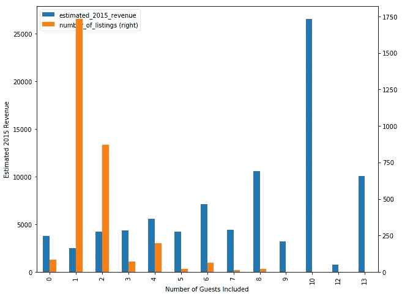

Mean Revenues vs Number of Guests in Boston in 2015

有两间卧室的房源也获得了相对较高的收入，同时仍然迎合了一个大市场。拥有超过 2 间卧室的影响通常可以忽略不计。当我们考虑到超过 4 间卧室的房源的较小市场规模时，这一点尤其正确。

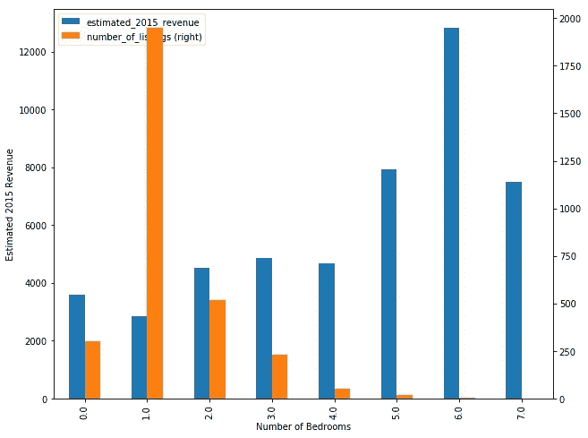

Mean Revenues vs Number of Bedrooms in Boston in 2015

收入差距在西雅图也确实存在。50%的房产在 2015 年收入低于 1800 美元，而前 25%的房产收入超过 4500 美元。

## 八月和九月是波士顿最好的租房时间。虽然八月是西雅图最好的月份

8 月和 9 月是波士顿 Airbnb 房产最好的月份。这几个月的收入最高也就不足为奇了，因为这段时间天气通常很好，游客可以欣赏波士顿令人惊叹的秋色。

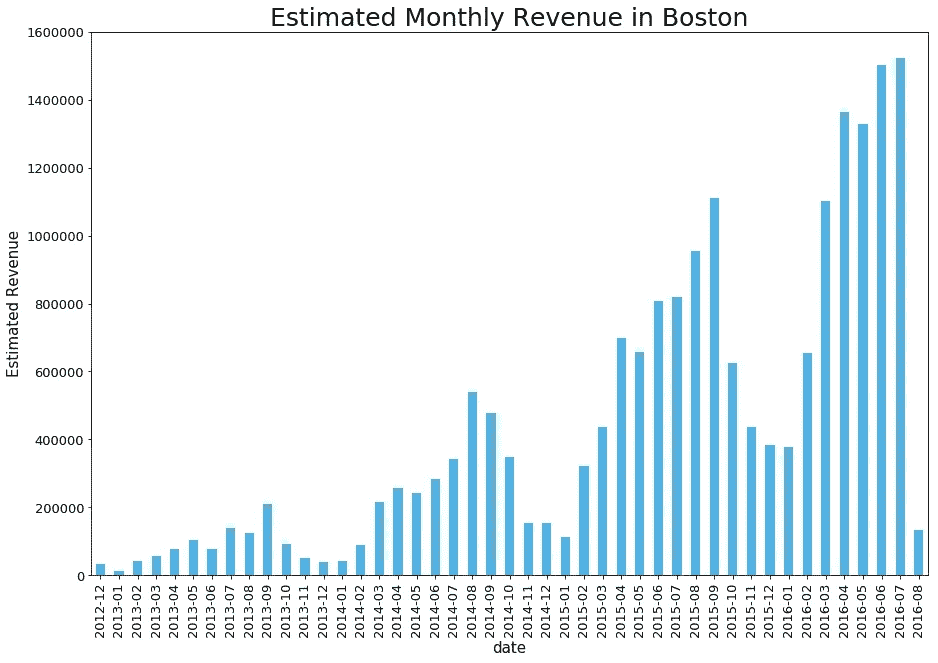

在西雅图，八月是出租房产的最佳月份，而七月和九月也是有利可图的选择。

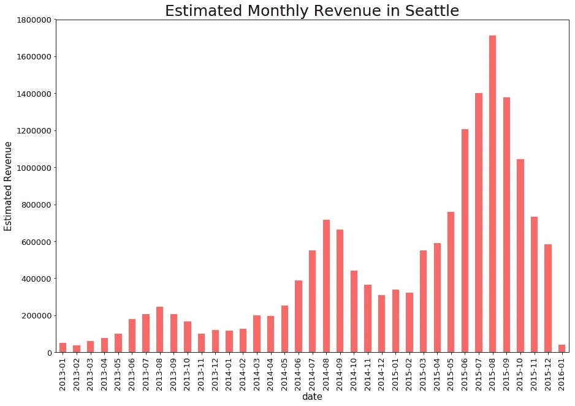

在这两个城市，总收入多年来一直大幅上升，这表明在可预见的未来，对 Airbnb 房产的需求可能会增长。

## 灯塔山和后湾是波士顿表现最好的社区，而第一山是西雅图最好的社区

在波士顿，Beacon Hill 在 2015 年创造了所有社区中最高的收入，平均每份房源约 7400 美元。Back Bay 是第二好的社区，总收入超过 6900 美元。

就可用房源总数而言，这两个社区都位列前五名。这是 Airbnb 认可的波士顿 25 个社区中的一个。

*注意:在地图上，每个邻近区域都用一个圆圈表示，圆圈的颜色反映了邻近区域中某个列表的平均收入。每个圆圈的大小对应附近的房源数量，圆圈越大，房源越多。*

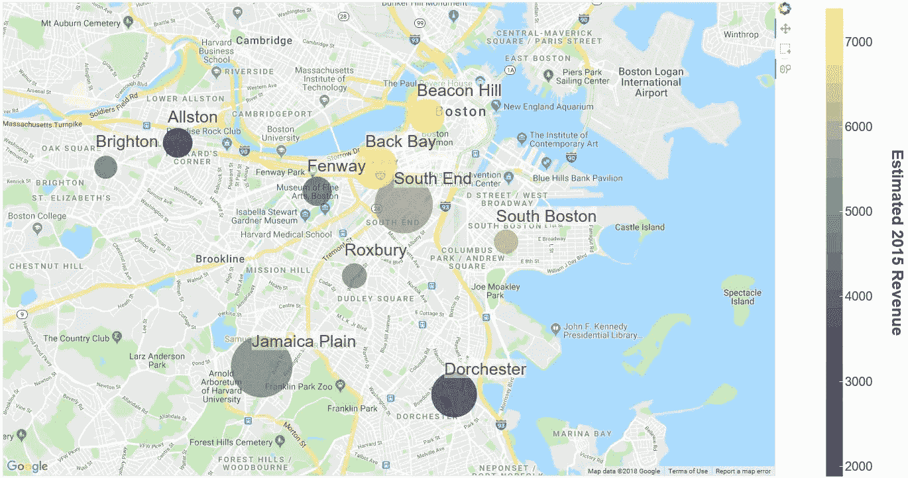

This map depicts the average revenue in each neighborhood in Boston during 2015.

在西雅图的所有社区中，第一山的收入最高，2015 年平均每家上市公司的收入超过 5900 美元。然而，值得注意的是，与贝尔敦和百老汇等社区相比，该地区的房源数量明显较低。

中央商务区和史蒂文斯是 2015 年票房收入第二高的社区。2015 年，这两个社区的 Airbnb 房源收入约为 4500 美元。

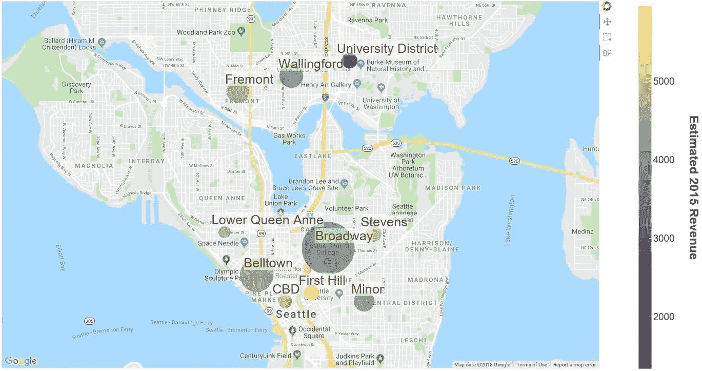

This map depicts the average revenue in each neighborhood in Seattle during 2015.

## 在你的刊登名称中提及热门地点

潜在客户在寻找公寓时首先看到的往往是房源名称和房源图片。因此，你的上市名称吸引读者的注意力是至关重要的。

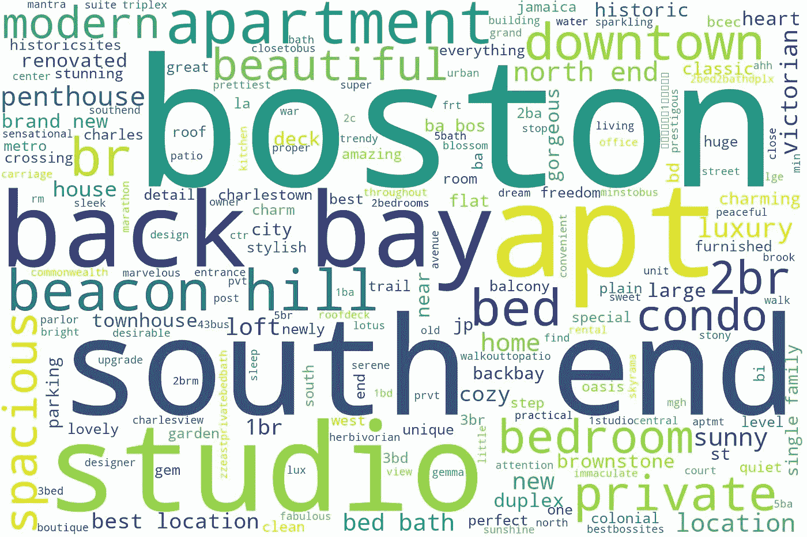

Most popular words used in the names for Boston listings ranked in the top 10% of revenue generated

上面显示的是收入排名前 10%的波士顿上市公司名称中最常用的词的词云。相比之下，下面的单词云描述了收入排名后 30%的列表中最常见的单词。

*注意:单词在云中的大小与其在列表中出现的频率相对应，使用频率越高的单词出现得越大。*

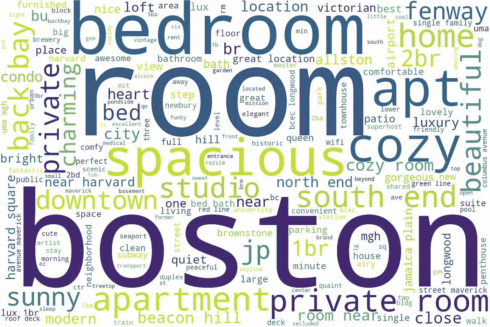

Most popular words used in the names for Boston listings ranked in the bottom 30% of revenue generated

通过比较，我们立即注意到，像 *South End* 、 *Back Bay* 和 *Beacon Hill* 这样的社区经常出现在高收入的列表中。另一方面，这些社区在低收入的列表中很少被提及。因此，如果你的房产位于上述社区附近，一定要在你的房源名称中突出显示。

单词 *studio* 在表现最好的列表中出现过多，而单词 *room* 在表现较差的列表中出现过多。在波士顿，出租工作室单元似乎比出租房间更有利可图，尽管人们必须记住，出租房间可能比工作室单元产生更低的运营成本。

有趣的是，虽然像*漂亮*、*宽敞*这样的词在这两种房源中都很常见，但顶级房源更有可能使用*现代*这个词来描述它们的房产，而收入较低的房源更倾向于使用*舒适*这个词。这可能是波士顿游客更喜欢现代装饰的一个标志。

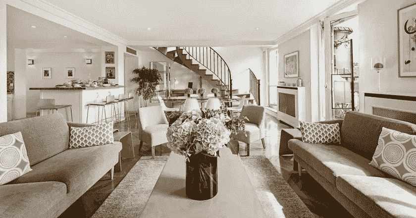

下面显示的是收入排名前 10%的西雅图列表名称中最常用的词。

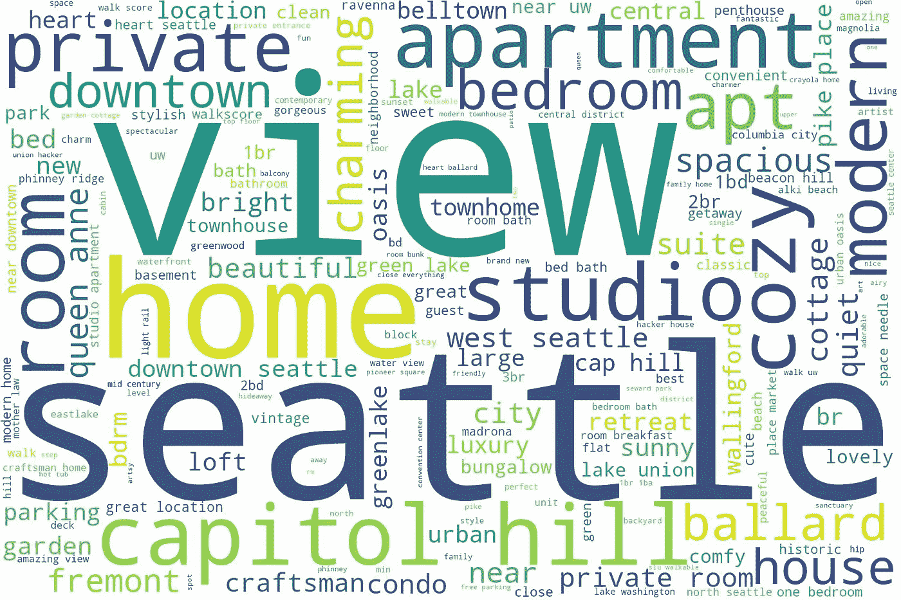

Most popular words used in the names for Seattle listings ranked in the top 10% of revenue generated

相比之下，收入排名在后 30%的列表中使用频率最高的词。

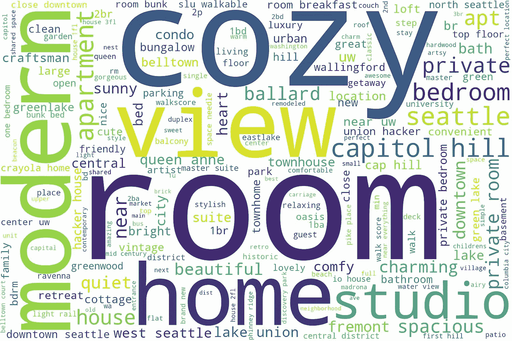

Most popular words used in the names for Seattle listings ranked in the bottom 30% of revenue generated

两者之间最明显的区别是，顶级上市公司的名字中经常有西雅图 T21 这个词，而收入较低的上市公司很少提到它。另一方面，与顶级房源*相比，低收入房源更有可能使用*房间*、*舒适*、*现代*等词语。*

*私人、市中心、巴拉德*和*国会山*也更频繁地出现在顶级列表中，这表明这些属性很受欢迎。巴拉德和国会山都是西雅图的街区，很可能这两个地方都非常受游客欢迎。

有趣的是，*视图*在任一类型的列表中都有很好的表现。大多数游客可能是因为西雅图的壮观景色而来到这里的。

与波士顿相反，工作室单元的吸引力较低，这表明在西雅图拥有工作室单元没有任何优势。

从这一点可以得出一个重要的结论，即地名在列表名称中非常重要。房产的位置可能是 Airbnb 客户最重要的考虑因素之一。如果您的酒店位于任何热门地点附近，请确保在您的列表名称中突出显示这些地点的名称。

另一个关键要点是中的单词 *room。在这两个城市，房源名称几乎总是与较低的收入联系在一起。*

如果到目前为止你喜欢这篇文章，这里有一些额外的见解可以帮助你的 Airbnb 之旅。

Airbnb 超级房东在波士顿和西雅图挣得更多。在这两个城市，被认可为 Airbnb 超级房东可能会带来更高的收入。成为一名超级房东的要求如下:获得 4.8+的综合评分，在 24 小时内回复至少 90%的预订请求，每年至少接待 10 次住宿，并尊重每一次预订。

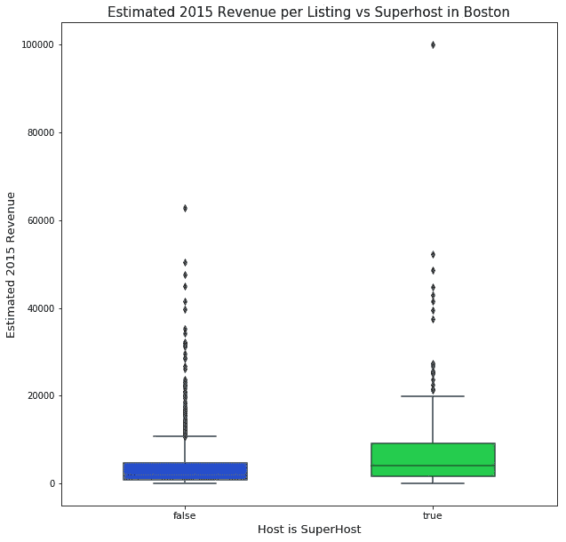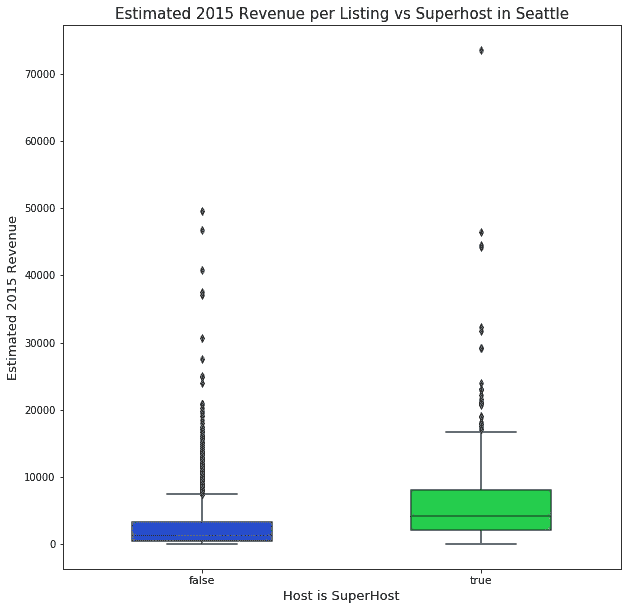

**波士顿偏好温和或严格的取消政策。**在波士顿，具有适度或严格取消政策的酒店往往能获得更高的收入。2015 年，实行中度或严格取消政策的酒店的收入中值为 2600 美元。相比之下，采用灵活或超严格 30 取消政策的酒店的收入中位数为 1300 美元。

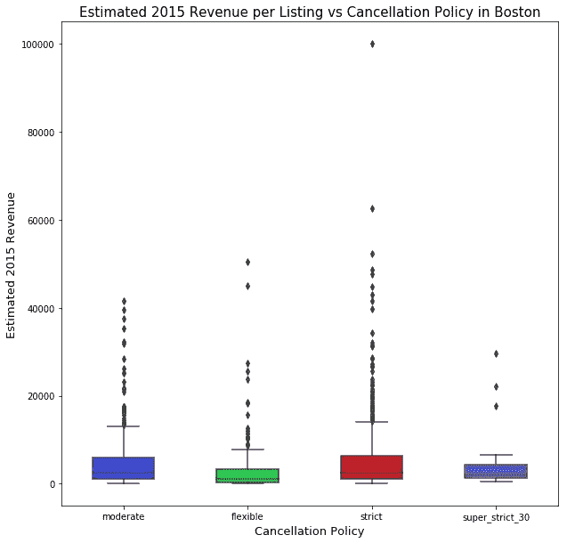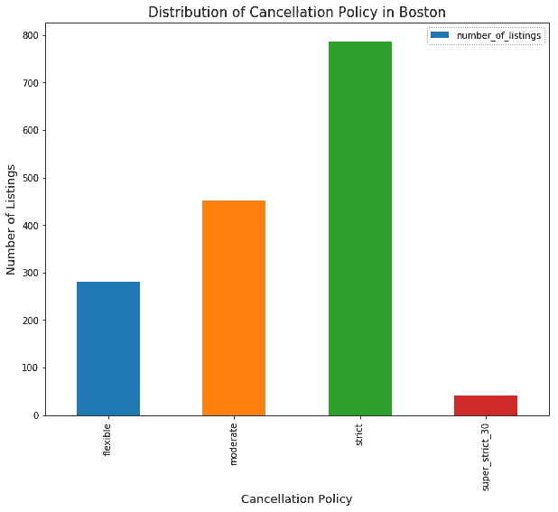

**在波士顿，顾客更喜欢物有所值的房产。**波士顿 Airbnb 的顾客主要关心的是让他们的钱花得值。因此，在波士顿，价值评估得分较高的酒店往往表现更好。

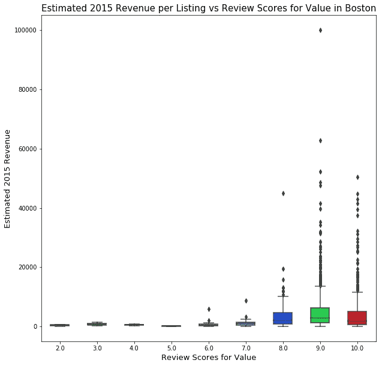

在西雅图，顾客更喜欢干净的酒店。在西雅图，清洁度评分较高的酒店往往会获得略高的收入。西雅图的 Airbnb 客户肯定对清洁有强烈的偏好，所以要注意这一点。

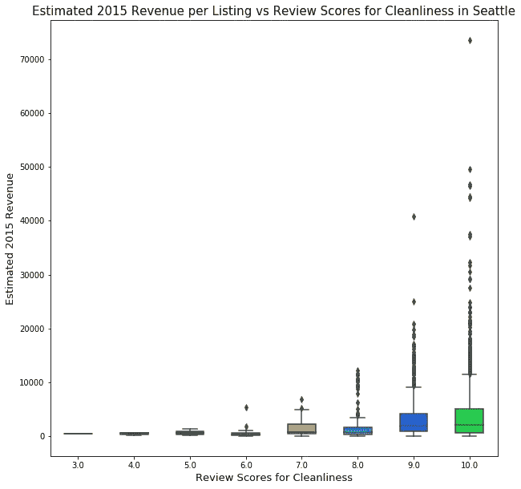

**更高的清洁费不会影响波士顿的收入。**事实上，清洁费较高的房源往往比波士顿的其他房源表现更好。因此，如果你需要的话，不要害怕要求更高的清洁费，特别是如果你的地方为需要清洁的客人提供了很多额外的补贴。

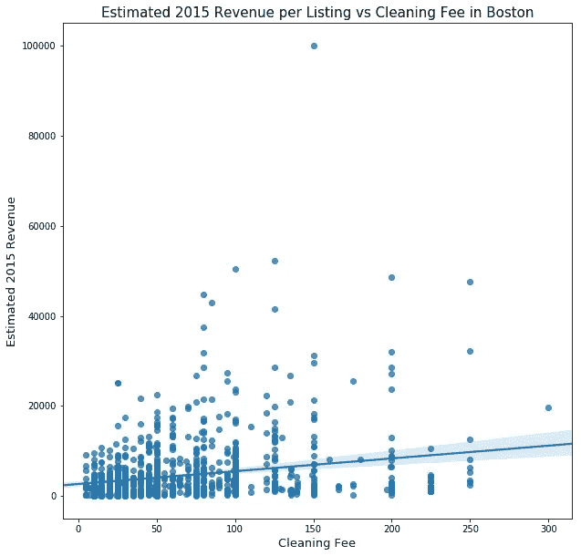

在整篇文章中，我们看到了许多帮助你建立完美 Airbnb 房源的技巧和策略。现在，我们将总结一下这篇文章的主要发现。

## 波士顿 Airbnb 主机的关键见解概述

*   2015 年，波士顿 Airbnb 的平均收入为 7200 美元
*   租一整栋公寓可能会带来稳定的收入
*   可容纳 4 位客人的酒店似乎是最佳选择
*   八月和九月是出租房产的最佳时间
*   Beacon Hill 和 Back Bay 通常是建立 Airbnb 的最佳社区
*   在你的列表名称中提及热门地点，如*南端*、*后湾*和*比肯山*可能会吸引浏览者的注意
*   工作室单位在波士顿是首选。
*   作为 Airbnb 超级房东，你会赚得更多
*   具有适度或严格取消政策的酒店通常表现更好
*   顾客更喜欢物有所值的房产
*   更高的清洁费不会影响收入

## 西雅图 AIrbnb 房东的关键见解概述

*   2015 年，西雅图 Airbnb 的平均收入为 4700 美元
*   租一整栋公寓来接待 4 个客人可能会带来稳定的收入
*   有两间卧室的房产是最好的选择
*   八月是出租房产的最佳月份。七月和九月也是不错的选择
*   第一山是出租房产的最佳街区，其次是中央商务区和史蒂文斯
*   在你的列表名称中提到 *private、downtown、Ballard* 和 *Capitol Hill* 可能会吸引更多的兴趣
*   作为 Airbnb 超级房东，你会赚得更多
*   顾客更喜欢干净的房产

*感谢您阅读这篇文章！我希望你喜欢它！*

这个分析的代码可以在[这里](https://github.com/joshxinjie/Data_Scientist_Nanodegree/tree/master/data_science_blog)找到。