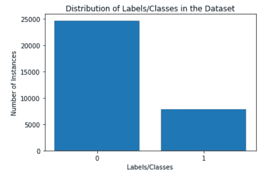
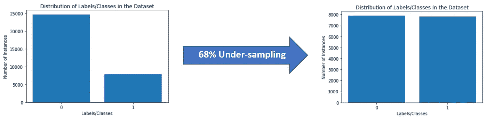
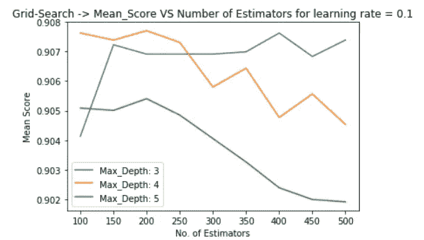
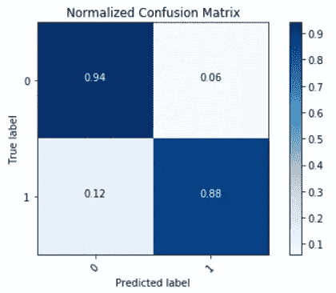
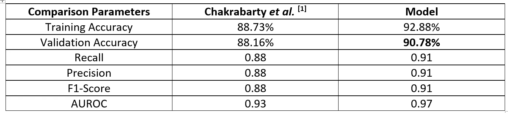

# 欠采样:不平衡数据的性能助推器

> 原文：<https://towardsdatascience.com/under-sampling-a-performance-booster-on-imbalanced-data-a79ff1559fab?source=collection_archive---------11----------------------->

在某些情况下，用于开发机器学习/深度学习模型的数据集通常是不平衡的。在这里，不均衡是指阶级分布的高度不平等或不均衡。不平衡数据的一个例子如下(图 1):

**Fig 1\. Binary Imbalanced Data**

这里，标签 0 包含 24，720 个实例，而标签 1 仅包含 7841 个实例。这是一个二进制(因为有 2 个标签，0 和 1)不平衡数据的例子。通过对多数类(标签 0)进行欠采样，并使其接近标签 1，可以在很大程度上减少这种不平衡。其中一个著名的欠采样算法是**基于聚类质心的多数欠采样技术(CCMUT)** 。除此之外，我在之前的文章《 [*基于扩展聚类质心的多数欠采样技术(E-CCMUT)*](/extended-cluster-centroid-based-majority-under-sampling-technique-e-ccmut-bd3f13e5d0fe) 》中介绍了**基于扩展聚类质心的多数欠采样技术(E-CCMUT)** 。在这之后的下一篇文章中，我一定会讨论 E-CCMUT 对 CCMUT 的改进。至于现在，在本文中，我将展示一个在 [***UCI 成人数据集***](https://archive.ics.uci.edu/ml/datasets/Adult)*上的实验，并从统计上证明欠采样可以获得更好的结果，并在不平衡数据集中充当性能助推器。*

***实验***

**“从人口普查数据预测一个人的收入水平是否大于 50k 美元”。**

***数据集***

*来自 UCI(加州大学欧文分校)的[成人数据集用于预测模型开发。数据集包含 48，842 个实例和 14 个属性/特征](https://archive.ics.uci.edu/ml/datasets/Adult)*

***数据预处理***

1.  ***对分类特征进行标签编码**(参见表 1)*
2.  ***特征选择**通过使用额外的树分类器训练整个数据集并使用每个特征的特征重要性分数来完成，特征*种族*和*本国*被丢弃。(参见表 1)*
3.  ***对分类特征进行一键编码**，其中假设二进制值为 0/1，特征的每个类别成为特征本身。*

**

***Table 1***

***数据不平衡消除***

*数据的不平衡性质如图 1 所示。它包含 24，720 个‘0’标记的(多数)实例和 7841 个‘1’标记的(少数)实例。使用基于聚类质心的多数欠采样技术(CCMUT)来消除这种数据不平衡，其中多数类(标签 0)欠采样 68%。图 2 显示了 68%欠采样后数据失衡的减少。*

**

***Fig 2\. Reduction in Data Imbalance after 68% Under-sampling***

***洗牌和拆分***

*结果数据集包含 7911 个“0”标记的实例和 7841 个“1”标记的实例。整个数据集以一致的方式进行混洗，并且 80–20 分割(80%训练集和 20%验证集)。*

***学习算法***

*在训练集上使用梯度提升分类器作为学习算法。分类器通过网格搜索进行调整，以获得最佳的超参数集。*

*网格搜索后得到 200 个估计量和最大深度为 4 的最优超参数。图 3 显示了基于平均分数的模型的网格搜索调整的总结。*

**

***Fig 3\. Grid-Search Summary on Mean Score***

***结果**:*

*使用度量、训练准确度、验证准确度、召回率、精确度、F1 分数、受试者操作者特征曲线下面积(图 4 所示的 AUROC)和混淆矩阵(图 5 所示)来分析模型性能。*

**

***Fig 4\. ROC Curve showing Area Under the Curve***

**

***Fig 5\. Normalized Confusion Matrix***

*表 2 中列出了训练准确度、验证准确度、召回率、精确度和 F1 分数。*

***与最先进技术的对比***

*到目前为止， **Chakrabarty 等人**【1】名为“ ***一种成年人普查收入水平预测的统计方法*** ”的研究论文是最先进的模型。表 2 给出了与最先进水平的比较。*

**

***Table 2***

***结论***

*从上述演示实验的统计结果来看，很明显，如果所使用的数据中存在类别不平衡，欠采样可以证明是非常强大的性能助推器。*

***参考文献***

*[1] Chakrabarty，Navoneel 和 Sanket Biswas。"成人人口普查收入水平预测的统计方法." *arXiv 预印本 arXiv:1810.10076* (2018)。*