# 在神经网络前向传播——可怕的矩阵乘法的掩护下

> 原文：<https://towardsdatascience.com/under-the-hood-of-neural-network-forward-propagation-the-dreaded-matrix-multiplication-a5360b33426?source=collection_archive---------0----------------------->

**简介**

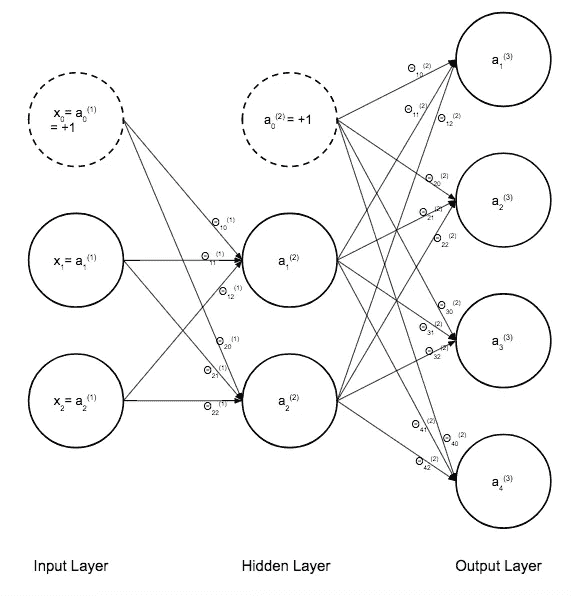

这篇文章的动机是我正在构建的神经网络中的一个令人沮丧的错误，它最终迫使我进入引擎盖下，真正理解神经网络核心的线性代数。我发现我做得很好，只是确保我相乘的两个矩阵的内部维度匹配，当错误发生时，我会在这里转置一个矩阵，在那里转置一个矩阵，直到事情解决，但这掩盖了我并不真正理解矩阵乘法如何工作的每一步的事实。

我们将介绍使用前向传播来计算一个相当简单的神经网络的成本函数的每个步骤。哦，如果你想知道我的矩阵乘法无知导致的错误，那就是我把我的偏差单位(1 的向量)作为一列添加了，而它应该是一行。我这样做是因为在这一步之前，我并没有真正理解矩阵乘法的全部输出，所以没有意识到我必须做出改变。首先，我将解释神经网络正向传播中发生的高级背景，然后我们将更仔细地看一个具体的例子，用索引值和代码来保持事情的清晰。

因此，神经网络在模拟复杂关系方面是不可思议的。我们只讨论网络的前馈传播部分。现在，神经网络的输入单元可以是任何东西。例如，它们可以是代表一串手写数字的 20 像素乘 20 像素图像的灰度强度(在 0 和 1 之间)。在这种情况下，您将有 400 个输入单元。这里我们有 2 个输入单元，加上+1 个偏置单元(关于为什么要有偏置单元的精彩解释，请点击[这里](https://www.quora.com/What-is-bias-in-artificial-neural-network))。正向传播实质上是从一个示例(比如一个手写数字的图像)中提取每个输入，然后将输入值乘以单元/节点之间每个连接的权重(见图 5)，然后将所有连接的所有乘积加到正在计算激活的节点上，取总和(z)并通过 sigmoid 函数进行计算(见下文)。

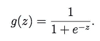

Figure 1: Sigmoid Function

这样你就可以激活隐藏层的每一个单元。然后你做同样的事情来计算下一层，但是这次你使用隐藏层的激活作为“输入”值。你将所有的 a 激活(即隐藏层)单元乘以第二组权重θ2，将连接到单个最终输出单元的每个乘积求和，并将该乘积通过 sigmoid 函数，从而得到最终输出激活 a。g(z)是 sigmoid 函数，z 是 x 输入(或隐藏层中的激活)和权重θ(在图 5 的正常神经网络图中由单个箭头表示)的乘积。

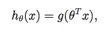

Figure 2: Hypothesis Function, using the Sigmoid Function.

一旦你有了所有这些，你想计算网络的成本(图 4)。对于给定的示例，您的成本函数本质上是计算输出假设 h(x)和实际 y 值之间的成本/差异。因此，在我一直使用的例子中，y 是输入所代表的实际数字的值。如果通过网络有一个“4”馈送的图像，则 y 是值“4”。因为有多个输出单元，所以成本函数将输出 h(x)与列向量进行比较，其中第 4 行是 1，其余都是 0。这意味着表示“4”的输出单元输出为真，其余都为假。对于 1、2 或 n 的输出，请参见下文。

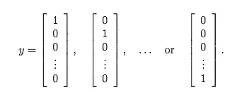

Figure 3: Our example data y values represented as logical TRUE/FALSE column vectors.

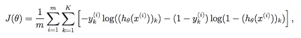

Figure 4: The Multi-Class Logistic Regression Cost Function

上面成本函数 J(theta)中的两个适马用于合计通过网络输入的每个示例(m)和每个输出类(K)的成本。现在，你可以通过单独进行每个计算来做到这一点，但事实证明，人类定义矩阵乘法的方式非常适合同时进行所有这些正向传播计算。我们在数值计算方面的朋友已经优化了矩阵乘法函数，这样神经网络就可以极其高效地输出假设。编写我们的代码，以便我们同时进行所有的计算，而不是对所有的输入示例进行 for 循环，这是一个称为向量化代码的过程。这在神经网络中非常重要，因为它们在计算上已经足够昂贵，我们不需要任何 for 循环来进一步降低我们的速度。

**我们的网络示例**

在我们的网络中，我们将有四个类，1、2、3、4，我们将完成这个计算的每一步。我们将假设网络已经被训练，并且我们已经通过反向传播训练了我们的θ参数/权重。这将是一个 3 层网络(有两个输入单元，2 个隐藏层单元和 4 个输出单元)。网络和参数(也称为权重)可以表示如下。


Figure 5: Our Neural Network, with indexed weights.

在我们走得更远之前，如果你不知道矩阵乘法是如何工作的，那就去看看[可汗学院](https://www.khanacademy.org/math/precalculus/precalc-matrices/multiplying-matrices-by-matrices/v/matrix-multiplication-intro)花 7 分钟，然后做一两个例子，确保你对它是如何工作的有直觉。在前进之前知道这一点是很重要的。

让我们从所有的数据开始。我们的 3 个示例数据和相应的 y 输出值。这些数据不代表任何东西，它们只是显示我们将要进行的计算的数字:

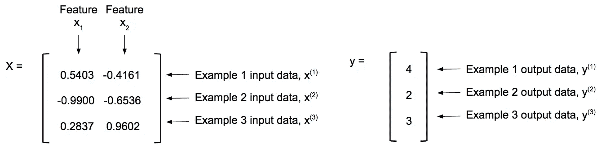

Figure 6: Our data.

当然，正如我提到的，由于有 4 个输出单元，我们的数据必须表示为三个示例输出的逻辑向量矩阵。我在 MATLAB 中工作，把我们的 y 向量变成一个逻辑向量矩阵:

```
yv=[1:4] == y;   %creating logical vectors of y values
```

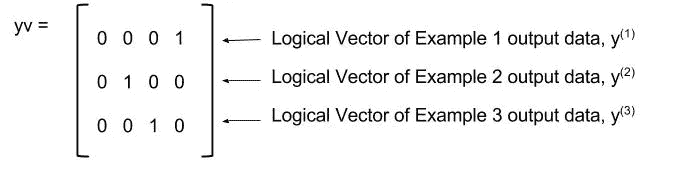

Figure 7: Matrix of Example Output y data turned into logical vectors.

另外，注意我们的 X 数据没有足够的特性。在我们图 5 的神经网络中，当我们计算权重/参数和输入值的乘积时，我们有虚线偏置单元 x(0)。这意味着我们需要将偏差单位添加到数据中。这意味着我们在矩阵的开头添加了一列:

```
X = [ones(m,1),X];
```

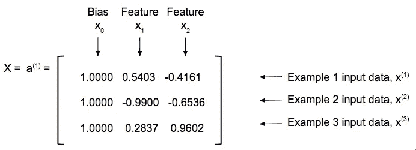

Figure 8: Data with bias added. Bias represented by dotted-line unit/node in Neural Net Figure 5

数据 X 被定义为第一个输入层 a 的第一个激活值，所以如果你在代码中看到 a(第 3 行)，它只是指初始输入数据。网络中每个连接/箭头的权重或参数如下:

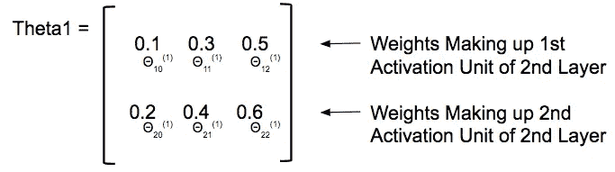

Figure 9: First set of weights/parameters for our neural network with indices that match those on the arrows of the Figure 5 Neural Network diagram.

下面是我们将用于计算物流成本函数的完整代码，我们已经处理了第 2 行和第 9 行，但我们将在代码的其余部分慢慢分解矩阵乘法和重要的矩阵操作:

```
1:  m = size(X, 1);
2:  X = [ones(m,1),X]; 
3:  a1 = X;
4:  z2 = Theta1*a1';
5:  a2 = sigmoid(z2);
6:  a2 = [ones(1,m);a2];
7:  z3 = Theta2*a2;
8:  a3 = sigmoid(z3);
9:  yv=[1:4] == y;
10: J = (1/m) * (sum(-yv’ .* log(a3) — ((1 — yv’) .* log(1 — a3))));
11: J = sum(J);
```

让我们执行正向传播的第一步，上面代码中的第 4 行。将每个示例的输入值乘以它们相应的权重。我总是想象输入值沿着我们网络中的箭头流动(图 5 ),被击中/乘以权重，然后在激活单元/节点等待其他箭头进行乘法。然后，特定单元的整个激活值首先由这些箭头的总和(输入 x 重量)组成，然后该总和通过 sigmoid 函数传递(参见上面的图 1)。

所以这里很容易犯你的第一个矩阵乘法错误。因为我们的偏置单位加到 X(这里也称为 a1)的数据是 3×3 矩阵，而θ1 是 2×3 矩阵。简单地将这两个矩阵相乘是很容易的，因为θ:2×3 和 X:3×3 的两个内部维度是相同的，所以 viola 应该正确工作，并给出我们的 2×3 合成矩阵？不对！

```
z2 = Theta1 * a1;      %WRONG! THIS DOESN'T GIVE US WHAT WE WANT
```

虽然运行这个计算将输出一个我们期望的和下一步需要的正确维数的矩阵，但是所有计算的值都将是错误的，因此从现在开始所有的计算都将是错误的。此外，由于不存在计算机错误，即使您注意到了，也很难解释为什么您的网络成本函数会计算错误的成本。记住，当你做矩阵乘法时，得到的矩阵的每个元素 ab 都是第一个矩阵**的行 a** 乘以第二个矩阵**的列 b** 的点积和。如果我们使用上面的代码来计算上面的 z，那么得到的矩阵中的第一个元素将由我们的第一行 Theta 的[0.1 0.3]相乘得到。0.5]有一整列偏置单位，[1.000；1.000;1.000]，对我们没用。这意味着我们需要转置示例输入数据的矩阵，以便矩阵将每个θ与每个输入正确相乘:

```
z2 = Theta1*a1';
```

其矩阵乘法如下:

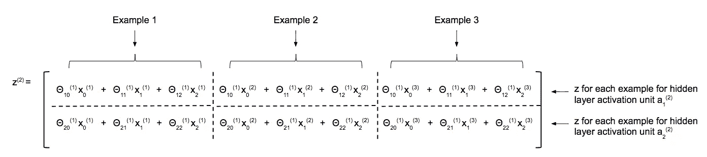

Figure 10: The indexed symbolic representation of the matrix multiplication. The resultant elements in the columns each representing a single example, and the rows being the different activation units in the hidden layer. 2 hidden layers results in two values (or rows) per example.

然后，我们对上述 z 矩阵中的 6 个元素分别应用 sigmoid 函数:

```
a2 = sigmoid(z2);
```

对于三个示例中的每一个，这仅仅给出了两个隐藏单元的隐藏层激活值的 2×3 矩阵:

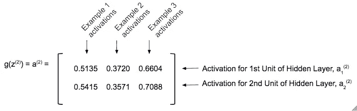

Figure 11: The activation values of the hidden units.

因为这是作为矩阵乘法完成的，所以我们能够一次性计算隐藏层的激活值，而不是在所有示例中使用 for 循环，这在处理较大的数据集时会变得非常昂贵。更不用说还需要反向传播。

现在我们在第二层中有了激活单元的值，这些值作为下一层也是最后一层，即输出层的输入。对于图 5 中第二层和第三层之间的每个箭头，该层具有一组新的权重/参数θ2，我们将做与上面相同的事情。将激活值(输入)乘以连接到每个激活节点的权重，分别对连接到每个激活节点的乘积求和，然后通过 sigmoid 函数对每个激活节点求和，得到最终输出。上述 a 作为我们的输入数据，我们的权重/参数如下:

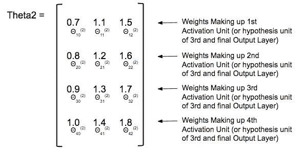

Figure 12: Theta2 weights/parameters with indices. Each row represents a different output unit with the weights contributing to each output unit across each column.

我们想做以下计算:

```
z3 = Theta2*a2;
```

但在此之前，我们必须再次将偏差单位添加到我们的数据中，在这种情况下，隐藏层激活 a。如果您在图 5 中再次注意到，隐藏层中的虚线圆圈 a(0)，偏差单位仅在我们进行下一次计算时添加。因此，我们将它添加到上面图 11 所示的激活矩阵中。

这是我介绍我的 bug 的地方，这也是我写这篇文章的动机。为了向前传播激活值，我们将θ中的一行的每个元素与 a 中的一列的每个元素相乘，并且这些乘积的总和将给出结果 z 矩阵的单个元素。通常数据的组织方式是将偏差单位作为一列添加，但是如果你这样做了(我愚蠢地这样做了)，这将会给我们错误的结果。所以我们将偏差单位作为一行添加到。

```
a2 = [ones(1,m);a2];
```

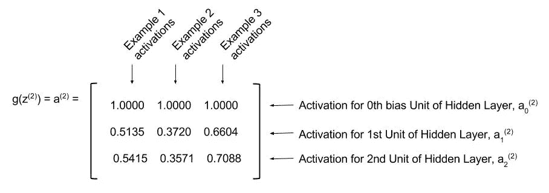

Figure 13: Adding the bias row to the a² activations.

在我们运行矩阵乘法来计算 z 之前，请注意，在 z 之前，您必须转置输入数据 a，使其正确“排列”,矩阵乘法才能产生我们想要的计算结果。这里，我们的矩阵按照我们想要的方式排列，所以没有 a 矩阵的转置。这是另一个常见的错误，如果你不理解其核心的计算，这是很容易做到的(我过去对此非常内疚)。现在，我们可以在 4x3 和 3x3 矩阵上运行矩阵乘法，从而为 3 个示例中的每一个生成 4x3 输出假设矩阵:

```
z3 = Theta2*a2;
```

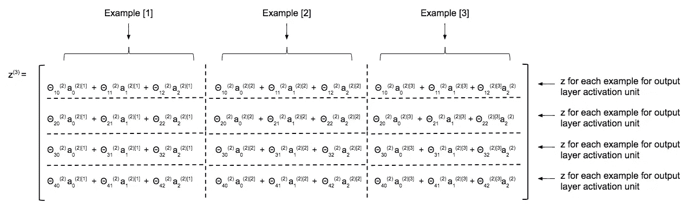

Figure 14: The indexed symbolic representation of the matrix multiplication. The resultant elements in the columns each representing a single example, and the rows being the different activation units of the output layer, with four output units. In a classification problem this would mean four classes/categories. Also notice the [m] superscript index on all the a’s in each element is the example number.

然后，我们对 z 矩阵中的 12 个元素逐一应用 sigmoid 函数:

```
a3 = sigmoid(z3);
```

这就为我们提供了每个输出单元/类的输出层激活的 4x3 矩阵(也称为假设):

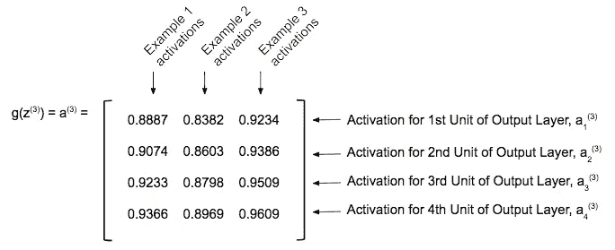

Figure 15: The activation values for each of the output units of the network, for each example. If you were doing a for loop over all your examples, this would be a column vector rather than a matrix.

从这里开始，你只是在计算成本函数。唯一要注意的是，你必须转置 y 向量的矩阵，以确保你在成本函数中进行的元素操作与每个示例和输出单元正确对齐。

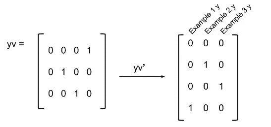

Figure 16: Transpose of the logical y vectors matrix.

然后，我们将它们放在一起计算成本函数:


Figure 4: The Multi-Class Logistic Regression Cost Function

```
J = (1/m) * (sum(-yv’ .* log(a3) — ((1 — yv’) .* log(1 — a3))));
J = sum(J);
```

这就给出了我们的成本，注意，所有类和所有例子的总和都是双倍的。这就是所有的人。矩阵乘法可以使代码非常简洁高效，不需要 for 循环来减慢速度，但是您必须知道矩阵乘法中发生了什么，以便您可以适当地调整矩阵，无论是乘法的顺序、必要时的转置，还是将偏差单位添加到矩阵的正确区域。一旦你把它分解了，掌握起来就更直观了，我强烈建议你自己慢慢地看一遍这个例子，如果你还是不确定，它总是归结到一些非常简单的基础上。

我希望这有助于理解向前传播所需的线性代数。此外，这是我的第一个帖子，也是我的第一个技术帖子，所以任何反馈，问题，评论等，都非常感谢。