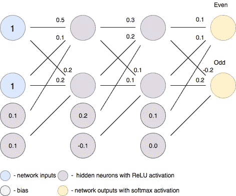
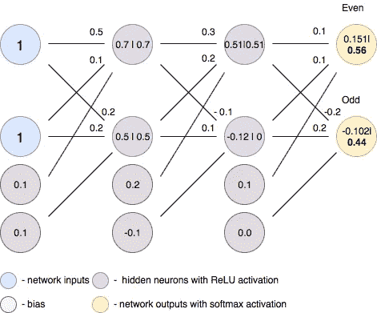
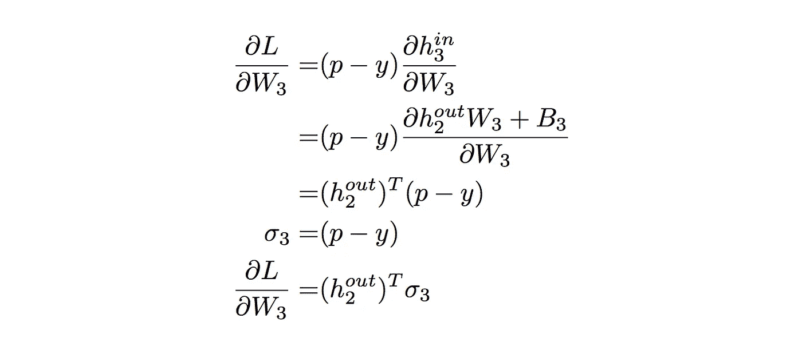
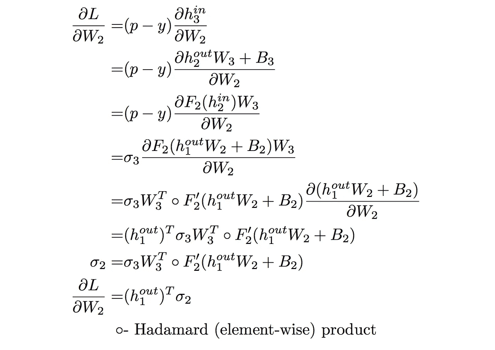
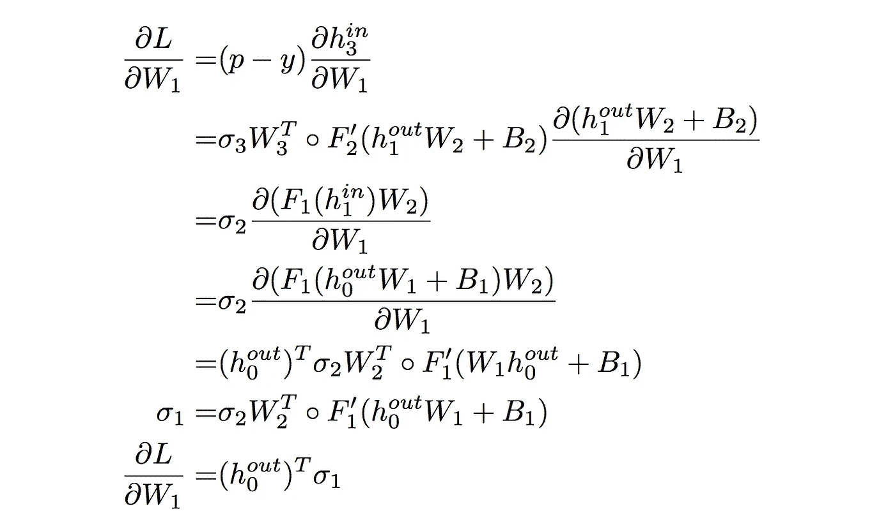
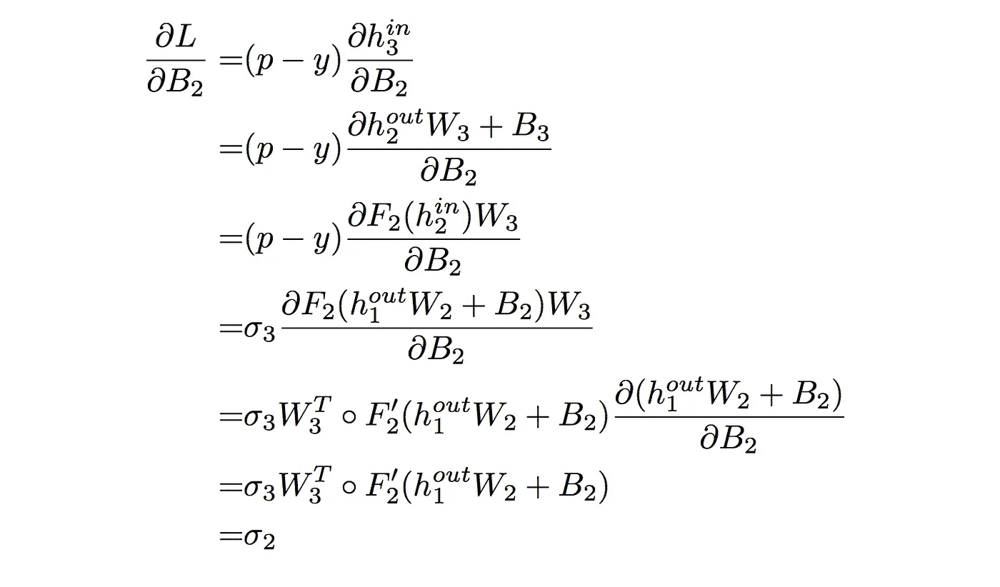
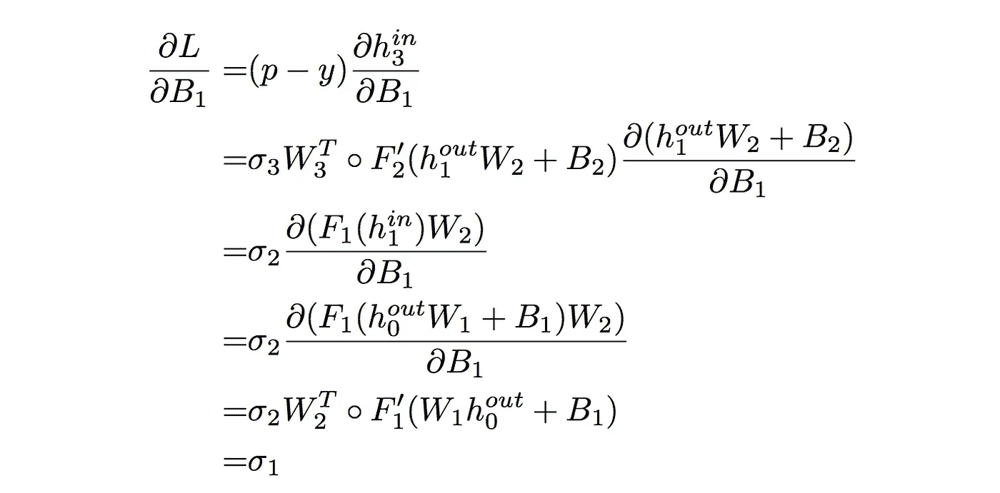
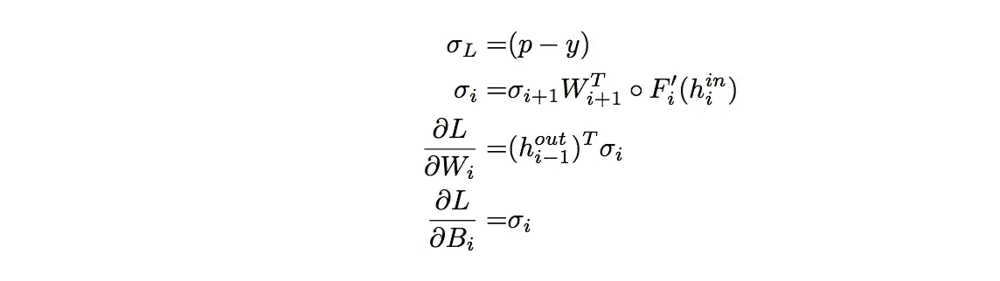
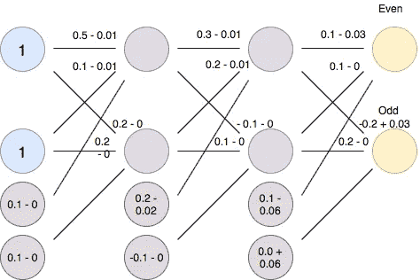
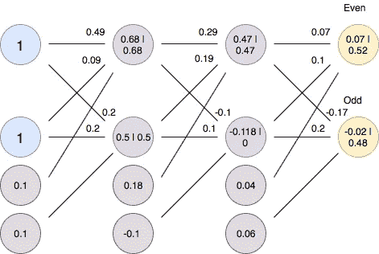

# 在神经网络的保护下。第 1 部分:完全连接。

> 原文：<https://towardsdatascience.com/under-the-hood-of-neural-networks-part-1-fully-connected-5223b7f78528?source=collection_archive---------0----------------------->

深度学习进展很快，快得令人难以置信。拥有如此大的 AI 开发人员社区的原因之一是我们有许多非常方便的库，如 TensorFlow、PyTorch、Caffe 等。正因为如此，通常实现一个神经网络不需要任何该领域的高深知识，这是非常酷的！然而，随着任务复杂性的增加，了解内部实际发生的事情会非常有用。这些知识可以帮助您选择激活函数、权重初始化、理解高级概念等等。所以在这组文章中，我将解释不同类型的神经网络的推理和训练过程背后的数学原理。

这篇文章我将致力于最基本类型的神经网络:全连接网络。尽管纯全连接网络是最简单的网络类型，但理解它们的工作原理是有用的，原因有二。首先，与其他类型的网络相比，它更容易理解后面的数学。第二，全连接层仍然存在于大多数模型中。

在这里，我将解释任何监督神经网络中的两个主要过程:全连接网络中的前向和后向传递。这篇文章的重点将放在称为反向传播的概念上，它成为现代人工智能的主力。

# 前进传球

*前向传递*基本上是一组将网络输入转换到输出空间的操作。在推理阶段，神经网络仅依赖于正向传递。让我们考虑一个具有两个隐藏层的简单神经网络，它试图将二进制数(这里是十进制 3)分类为偶数或奇数:

这里我们假设除了最后几层的神经元，每个神经元都使用 [ReLU](https://en.wikipedia.org/wiki/Rectifier_(neural_networks)) 激活函数(最后一层使用 [softmax](https://en.wikipedia.org/wiki/Softmax_function) )。激活函数用于将非线性引入系统，这允许学习复杂的函数。让我们记下在第一个隐藏层中进行的计算:

神经元 1(顶部):

神经元 2(底部):

将它改写成矩阵形式，我们将得到:

现在，如果我们将输入表示为矩阵 I(在我们的情况下，它是一个向量，但是如果我们使用批量输入，我们将使它的大小为样本数乘以输入数)，神经元权重为 W，偏差为 B，我们将得到:

其可以被概括为全连接神经网络的任何层:

其中 **i** —是层数， **F** —是给定层的激活函数。将此公式应用于网络的每一层，我们将实现正向传递，并最终获得网络输出。您的结果应该如下所示:

# 偶数道次

如果我们做所有的计算，我们最终会得到一个输出，这个输出实际上是不正确的(因为 0.56 > 0.44 我们输出的是偶数作为结果)。知道了这一点，我们想更新神经元的权重和偏差，这样我们就能得到正确的结果。这正是反向传播发挥作用的地方。反向传播是一种计算关于每个网络变量(神经元权重和偏差)的误差梯度的算法。这些梯度随后用于优化算法，如梯度下降，相应地更新它们。权重和偏差更新的过程称为反向传递。

为了开始计算误差梯度，首先，我们必须计算误差(即损耗)本身。我们将使用标准分类损失—交叉熵。然而，损失函数可以是任何可微分的数学表达式。回归问题的标准选择是均方根误差(RMSE)。交叉熵损失如下所示:

其中 **M** 是类的数量， **p** 是网络输出的向量， **y** 是真实标签的向量。对于我们的情况，我们得到:

现在，为了找到每个变量的误差梯度，我们将集中使用链式法则:

因此，从最后一层开始，对损失相对于神经元权重进行偏导数，我们得到:

了解在 softmax 激活和交叉吸附丢失的情况下我们拥有的事实(你可以自己推导出来作为一个很好的练习):

现在我们可以找到最后一层的梯度为:

继续第 2 层:

第一层:

对偏差遵循相同的程序:

现在我们可以跟踪一个常见的模式，它可以概括为:

这是反向传播算法的矩阵方程。有了这些等式，我们就可以计算每个权重/偏差的误差梯度。为了减少误差，我们需要在与梯度相反的方向上更新我们的权重/偏差。这种思想用于梯度下降算法，定义如下:

其中 **x** 是任何可训练变量(W 或 B)， **t** 是当前时间步长(算法迭代)，而 **α** 是学习率。现在，设置 **α** = 0.1(您可以选择不同的，但请记住，小值假设较长的训练过程，而高值导致不稳定的训练过程)并使用上面的梯度计算公式，我们可以计算梯度下降算法的一次迭代。您应该获得以下重量更新:

应用此更改并执行向前传递:

我们可以看到，我们的网络性能有所提高，与上例相比，现在奇数输出的值有所提高。对不同的例子(或一批样本)多次运行梯度下降算法，最终将得到一个经过适当训练的神经网络。

# 摘要

在这篇文章中，我解释了全连接神经网络训练过程的主要部分:向前和向后传球。尽管给出的概念很简单，但对反向传播的理解是建立鲁棒神经模型的一个基本步骤。我希望你从这篇文章中获得的知识能帮助你在训练过程中避免陷阱！

如果你觉得这篇文章有用，别忘了鼓掌，敬请关注！在下一篇文章中，我将解释递归网络的数学原理。

请在下面的评论中留下你的反馈/想法/建议/修正！

**感谢阅读！**