# 在神经网络的保护下。第二部分:经常性。

> 原文：<https://towardsdatascience.com/under-the-hood-of-neural-networks-part-2-recurrent-af091247ba78?source=collection_archive---------5----------------------->

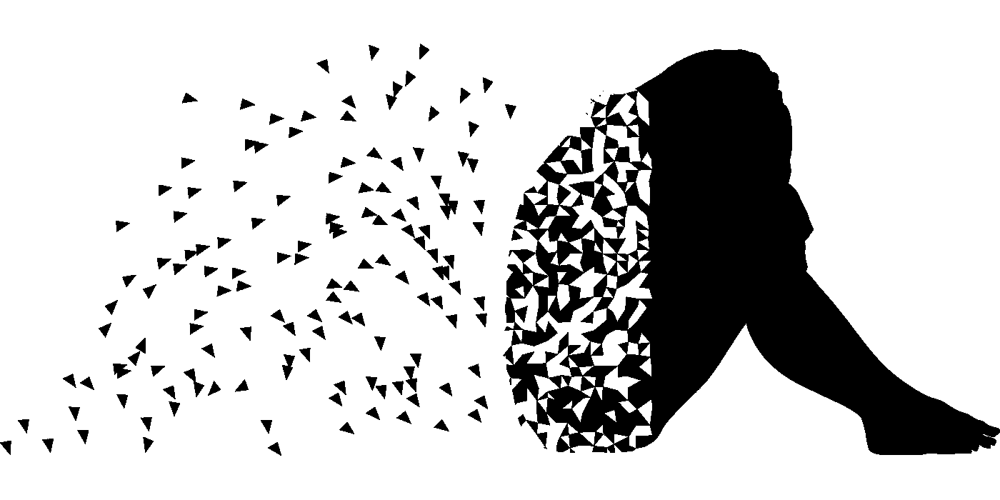

在本系列的第 1 部分中，我们已经研究了前馈全连接网络的前向和后向通路。尽管前馈网络很普遍，并且在现实世界中有很多应用，但是它们有一个主要的局限性。前馈网络不能处理顺序数据。这意味着它们不能处理不同大小的输入，也不能存储以前状态的信息(内存)。因此，在本文中，我们将讨论允许克服命名限制的递归神经网络(RNNs)。

# 前进传球

从技术上讲，*循环网络*可以表示为用状态变量和循环回路扩展的前馈网络。因此，在数学上，RNNs 的输入序列的每个元素被处理如下:

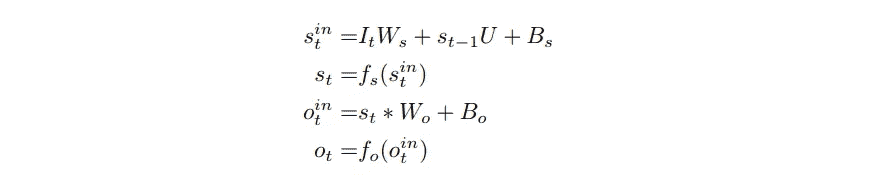

其中 **It** 为时步 **t** (输入序列的第 **t** 个元素)的输入， **st** 为时步 **t** 的隐藏状态， **yt** 为时步 t 的输出， **fs** 和 **fo** 为各层的激活函数。从等式中我们可以看出，递归网络的状态基本上是隐含层的输出。网络的 r *ecurrence* 通过在时间步长 **t** 的计算中出现 **t-1** 项来解释。因此递归网络的每次计算都依赖于先前的状态和输入。

随着递归网络在各种现实世界问题中的应用，我们可以看到 RNN 架构的不同变体，这些变体不会显著改变背后的数学。这种应用和相应模型的例子可以是:(a)语言翻译，(b)视频分类，(c)图像字幕，(d)自动完成系统。

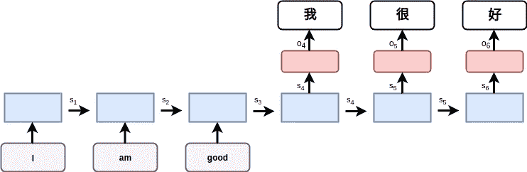

(a) RNN for translation

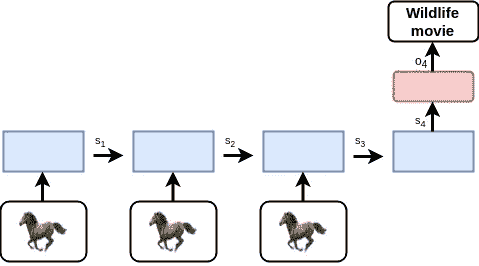

(b) RNN for video classification

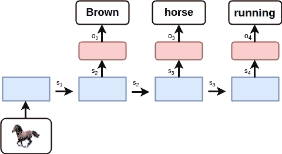

(c ) RNN for image captioning

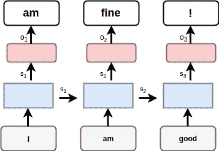

(d) RNN for the autocomplete system

由于情况(a)的训练过程的数学推导可以容易地应用于其余情况，我们将考虑一个序列遍历网络的简单例子。假设我们有一个数字序列(用二进制表示)1，3，5，在将它们逐个输入我们的网络后，我们希望得到 5，3，1 作为输出。首先让我们随机初始化变量:

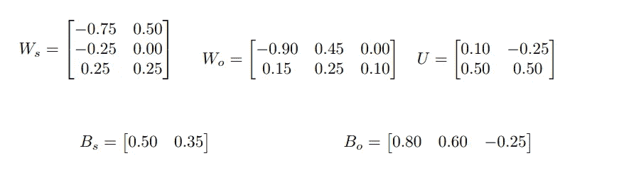

**注:**这里为了计算简单，我们将状态大小设为 2，然而状态变量通常是高维变量。

由于输出端可以有多个 1，我们将使用 [sigmoid](https://en.wikipedia.org/wiki/Sigmoid_function) 激活函数( **fo** )，而 **fs** 将使用 **tanh** 。

现在，已经初始化了变量，我们可以使用上面介绍的等式来计算网络的正向传递。结果我们会得到:

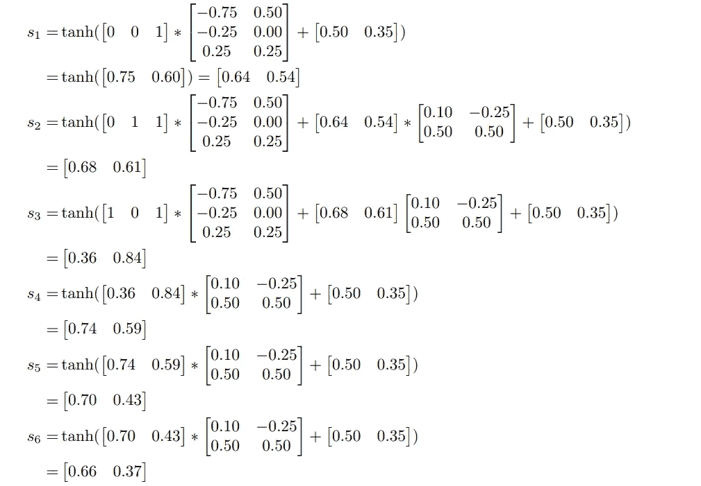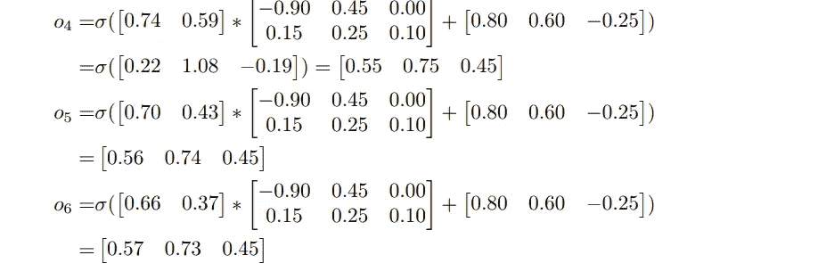

示意性地，我们的网络看起来像:

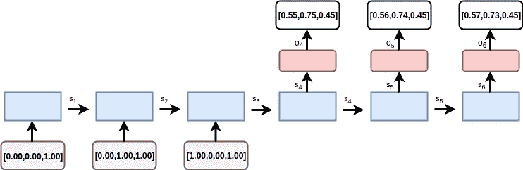

# 偶数道次

与前馈相比，递归网络的第一个不同之处在于，我们也可以将序列作为输出。因此，损耗表示为每个输出端的损耗之和(或它们的平均值)。因此:

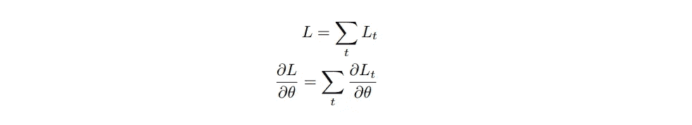

其中**θ**可以由任何可训练变量表示。

这里我们将再次使用交叉衰减(在[第 1 部分](/under-the-hood-of-neural-networks-part-1-fully-connected-5223b7f78528)中介绍)。在这种情况下，我们向前传球的损失是 **3.30** 。在激活功能之前，损失相对于 **o** 的导数为:

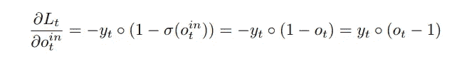

由于 **Wo** 和 **Bo** 不依赖于之前的时间步，没有循环回路，我们将从它们开始推导:

继续处理其余变量:

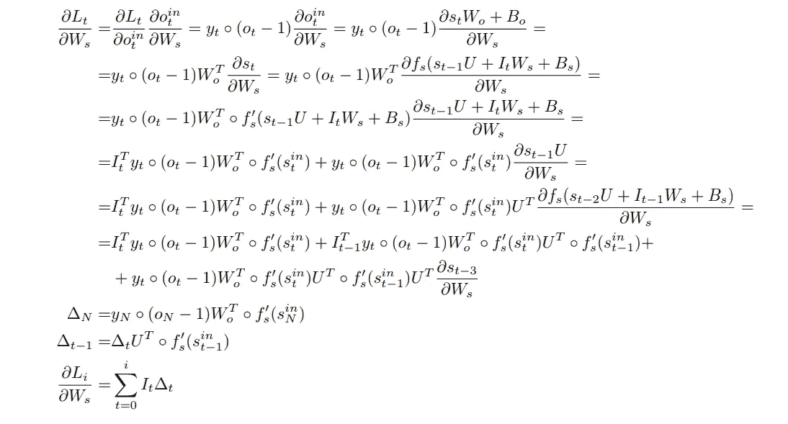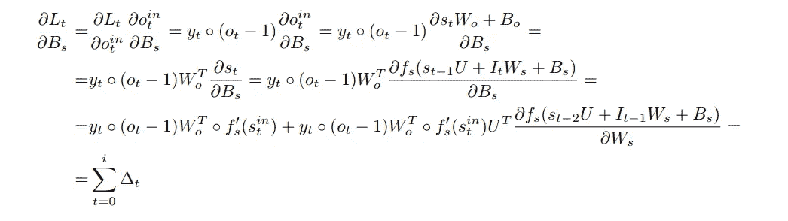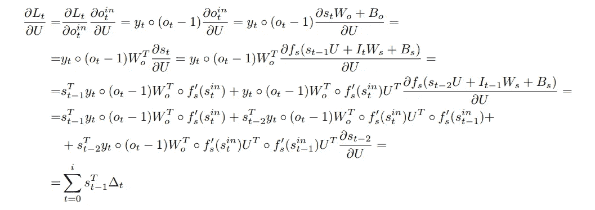

**注: **tanh** 激活函数的**衍生物:

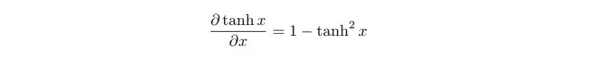

现在我们有了计算梯度和应用梯度下降算法的所有方程(在[第 1 部分](/under-the-hood-of-neural-networks-part-1-fully-connected-5223b7f78528)中讨论)。让我们从分别计算每个输出的梯度开始，我们将从时间步骤 4 的输出开始:

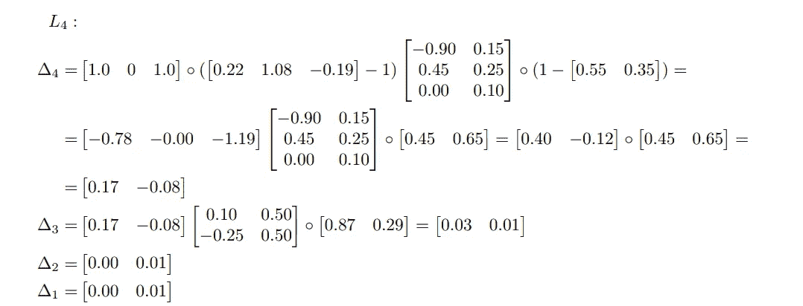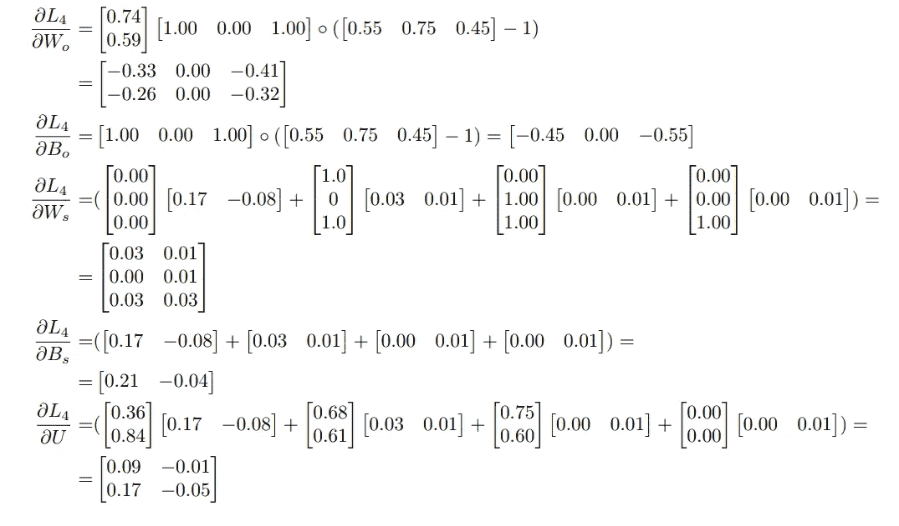

对时间步骤 5 和 6 的输出执行相同的计算，我们将得到:

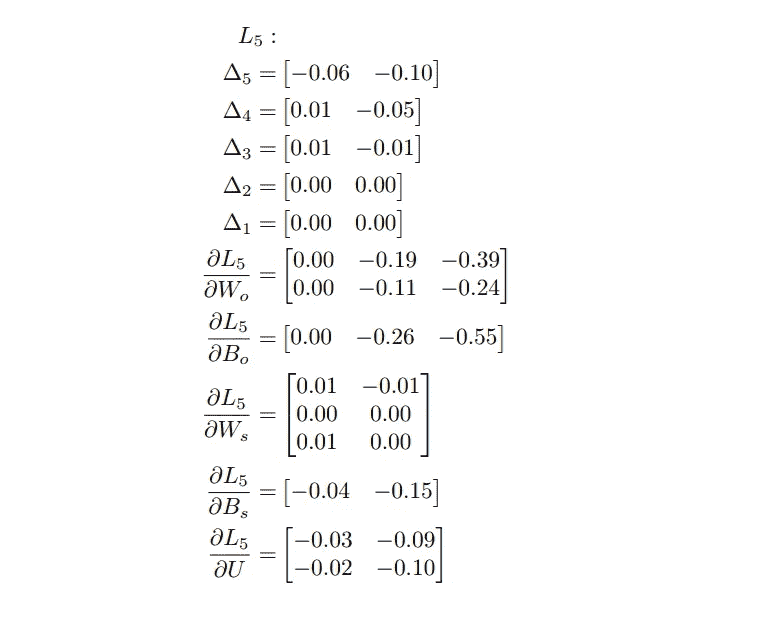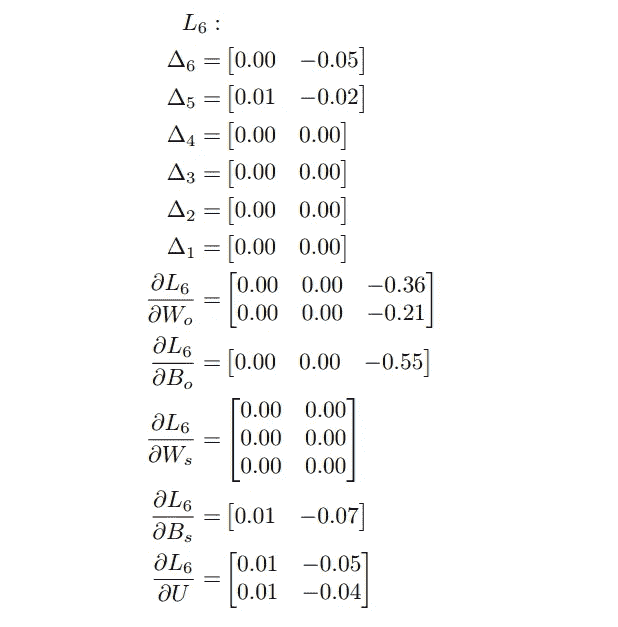

有了所有需要的梯度，我们可以将总损失的最终梯度计算为每个单独损失的梯度之和:

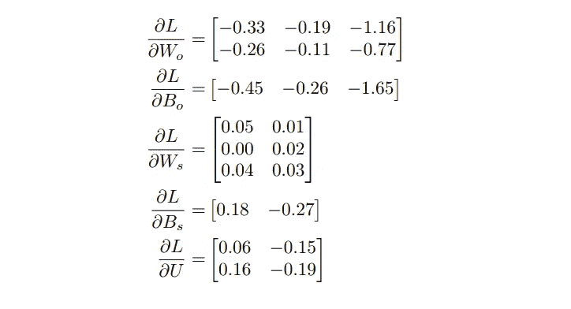

在应用学习率为 0.5 的梯度下降算法后，我们将得到新的变量:

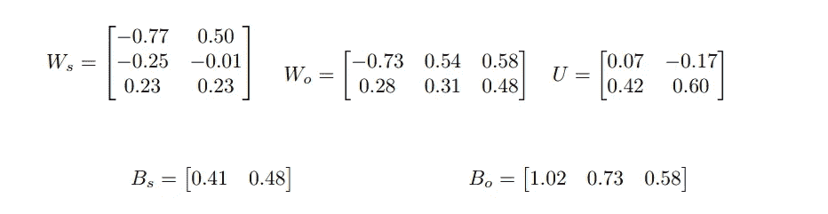

现在，更新的网络将导致以下正向传递:

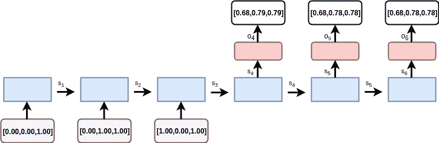

新的总损失等于 **1.36** 。

# **总结**

在本文中，我介绍了*递归神经网络* (RNNs)，并推导了训练过程所需的基本方程。这种类型的网络对于序列处理任务特别有用。

尽管反向传递后的训练损失显著减少，但这种网络的训练过程仍然是棘手的。首先，应该增加状态的维度。更重要的是，经典(或香草)rnn 很难记住旧的状态。为了解决这个问题，存在许多解决方案。其中最著名的可能是:

1.  在状态之间添加剩余连接(使得每个状态不仅依赖于前一个状态，也依赖于 t-2 或 t-3 状态)
2.  使用长短期记忆( [LSTM](https://en.wikipedia.org/wiki/Long_short-term_memory) )细胞，这需要单独一篇文章来描述。

在下一部分中，我将描述卷积神经网络，它成为了现代深度学习和计算机视觉领域的重要组成部分。

如果你觉得这篇文章有用，别忘了鼓掌，关注我，看更多这样的帖子！

请在下面的评论中分享你对未来帖子的反馈和想法！

**感谢阅读！**