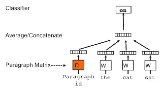
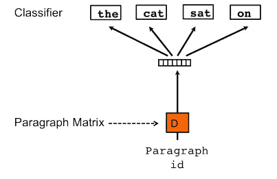

# 了解如何通过 doc2vec 将您的段落转换为 vector

> 原文：<https://towardsdatascience.com/understand-how-to-transfer-your-paragraph-to-vector-by-doc2vec-1e225ccf102?source=collection_archive---------7----------------------->


“person holding camera lens” by [Paul Skorupskas](https://unsplash.com/@pawelskor?utm_source=medium&utm_medium=referral) on [Unsplash](https://unsplash.com?utm_source=medium&utm_medium=referral)

在之前的故事中，提到的 [word2vec](/3-silver-bullets-of-word-embedding-in-nlp-10fa8f50cc5a) 是 Mikolov 等人(2013)介绍的。Mikolov 和 Le 发表了句子/文档向量转换。这是嵌入技术的又一个突破，我们可以用向量来表示一个句子或文档。米科洛夫等人称之为“段落向量”。

看完这篇文章，你会明白:

*   段落向量设计
*   体系结构
*   履行
*   拿走

# 段落向量设计

doc2vec 的设计基于 word2vec。如果你不熟悉 word2vec(即 skip-gram 和 CBOW)，你可以看看这个[的故事](/3-silver-bullets-of-word-embedding-in-nlp-10fa8f50cc5a)。Doc2vec 还使用无监督学习方法来学习文档表示。每个文档的文本(即单词)输入可以是多种多样的，而输出是固定长度的向量。

段落向量和单词向量被初始化。段落向量在所有文档中是唯一，而单词向量在所有文档中是共享的，从而可以从不同的文档中学习单词向量。

在训练阶段，单词向量将被训练，而段落将被丢弃。在预测阶段(即在线预测)，段落向量将被随机初始化，并通过词向量来计算。

# 体系结构

学习单词向量有两种算法。这两种方法都是受学习单词向量的启发，单词向量是 skip-gram 和连续词袋(CBOW)

***分布式段落向量记忆模型(PV-DM)***

段落向量和单词向量都是随机初始化的。每个段落向量被分配给单个文档，而单词向量在所有文档之间共享。平均或连接段落向量和单词向量，并传递到随机梯度下降，梯度通过反向传播获得。



Architecture of PV-DM (Mikolov et al., 2014)

这种方法类似于 word2vec 中的连续词包(CBOW)方法。

***【分布式文字包版本段落矢量(PV-DBOW)***

另一种方法走的是不同的路。它不是预测下一个单词，而是使用段落向量对文档中的整个单词进行分类。在训练过程中，对单词列表进行采样，然后形成分类器，对单词是否属于文档进行分类，从而学习单词向量。



Architecture of PV-DBOW (Mikolov et al., 2014)

这种方法类似于 word2vec 中的跳格法。

# 履行

首先，我们需要传递训练数据来构建词汇，并调用训练阶段来计算单词向量。

```
doc2vec_embs = Doc2VecEmbeddings()
x_train_tokens = doc2vec_embs.build_vocab(documents=x_train)
doc2vec_embs.train(x_train_tokens)
```

之后，我们可以通过提供训练数据和测试数据对其进行编码。

```
x_train_t = doc2vec_embs.encode(documents=x_train)
x_test_t = doc2vec_embs.encode(documents=x_test)
```

最后，我们可以将向量传递给分类器

```
from sklearn.linear_model import LogisticRegressionmodel = LogisticRegression(solver='newton-cg', max_iter=1000)
model.fit(x_train_t, y_train)y_pred = model.predict(x_test_t)from sklearn.metrics import accuracy_score
from sklearn.metrics import classification_reportprint('Accuracy:%.2f%%' % (accuracy_score(y_test, y_pred)*100))
print('Classification Report:')
print(classification_report(y_test, y_pred))
```

结果

```
Accuracy: 52.8%
Average Precision: 0.66
Average Recall: 0.53
Average f1: 0.5
```

# 拿走

要访问所有代码，你可以访问我的 github repo。

*   与 word2vec 不同，doc2vec 动态计算句子/文档向量。换句话说，**在预测时间**内得到矢量需要时间。
*   根据 Mikolov 等人的实验， **PV-DM 始终优于 PV-DBOW** 。
*   **在 PV-DM 方法中，串联方式通常比求和/平均方式更好**。

# 参考

米克洛夫·托马斯，来自英国。2014.[句子和文档的分布式表示](https://arxiv.org/pdf/1405.4053.pdf)

[gensim 中的 doc 2 vec](https://radimrehurek.com/gensim/models/doc2vec.html)