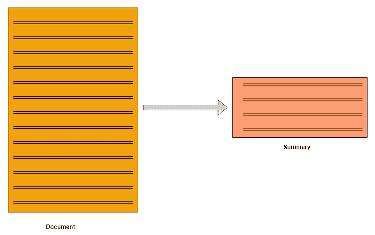

# 理解文本摘要并在 python 中创建自己的摘要器

> 原文：<https://towardsdatascience.com/understand-text-summarization-and-create-your-own-summarizer-in-python-b26a9f09fc70?source=collection_archive---------1----------------------->

## 文本摘要介绍


我们都与使用文本摘要的应用程序进行交互。这些应用程序中有许多是针对发布每日新闻、娱乐、体育文章的平台的。在我们忙碌的时间表中，我们更喜欢在决定阅读整篇文章之前先阅读那些文章的摘要。阅读摘要有助于我们确定感兴趣的领域，给出故事的简要背景。



摘要可以被定义为在保留关键信息和整体含义的同时产生一个简洁流畅的摘要的任务。

## **冲击**

摘要系统通常有额外的证据，它们可以用来指定文档中最重要的主题。例如，当总结博客时，博客帖子后面的讨论或评论是很好的信息来源，可以确定博客的哪些部分是重要的和有趣的。

在科学论文摘要中，有大量的信息，如引用的论文和会议信息，可以用来识别原始论文中的重要句子。

# 文本摘要的工作原理

通常有两种类型的摘要，**抽象的**和**提取的**摘要。

1.  **抽象概括:**抽象方法基于语义理解选择单词，即使那些单词没有出现在源文档中。它旨在以新的方式生产重要的材料。他们使用先进的自然语言技术解释和检查文本，以便生成新的更短的文本，传达原始文本中最重要的信息。

它可以与人类阅读文本或博客文章，然后用自己的话总结的方式相关联。

***输入文档→理解上下文→语义→创建自己的摘要。***

**2。提取摘要:**提取方法试图通过选择保留最重要观点的单词子集来总结文章。

这种方法对句子的重要部分进行加权，并用其形成摘要。使用不同的算法和技术来定义句子的权重，并基于它们之间的重要性和相似性来进一步对它们进行排序。

***输入文档→句子相似度→句子权重→选择等级较高的句子。***

有限的研究可用于抽象概括，因为与提取方法相比，它需要对文本有更深的理解。

与自动抽象摘要相比，纯粹的提取摘要经常给出更好的结果。这是因为抽象摘要方法处理诸如语义表示、
推理和自然语言生成之类的问题，这比诸如句子提取之类的数据驱动方法相对困难。

有许多技术可以用来生成摘要。为了简单起见，我将使用一种 [**无监督学习**](https://en.wikipedia.org/wiki/Unsupervised_learning) 方法来寻找句子的相似性并对它们进行排序。这样做的一个好处是，在项目中使用它之前，您不需要训练和构建模型。

理解**余弦相似性**对于充分利用你将要看到的代码是有好处的。**余弦相似度**是内积空间的两个非零向量之间的相似度，度量它们之间角度的余弦。因为我们将把我们的句子表示为向量束，所以我们可以用它来寻找句子之间的相似性。它测量矢量之间角度的余弦值。如果句子相似，角度将为 **0** 。

*到现在都好..？* *希望如此:)*

**接下来，下面是我们生成总结文本的代码流:-**

*输入文章→拆分成句子→去除停用词→建立相似度矩阵→基于矩阵生成排名→挑选前 N 个句子进行汇总。*

让我们创建这些方法。

## 1.导入所有必需的库

```
from nltk.corpus import stopwords
from nltk.cluster.util import cosine_distance
import numpy as np
import networkx as nx
```

## 2.生成干净的句子

```
**def read_article(file_name):**
    file = open(file_name, "r")
    filedata = file.readlines()
    article = filedata[0].split(". ")
    sentences = [] for sentence in article:
     print(sentence)
     sentences.append(sentence.replace("[^a-zA-Z]", " ").split(" "))
     sentences.pop() 

    return sentences
```

## **3。相似性矩阵**

这就是我们将使用余弦相似度来寻找句子间相似度的地方。

```
**def build_similarity_matrix(sentences, stop_words):**
    # Create an empty similarity matrix
    similarity_matrix = np.zeros((len(sentences), len(sentences)))

    for idx1 in range(len(sentences)):
        for idx2 in range(len(sentences)):
            if idx1 == idx2: #ignore if both are same sentences
                continue 
            similarity_matrix[idx1][idx2] = sentence_similarity(sentences[idx1], sentences[idx2], stop_words)return similarity_matrix
```

## 4.生成汇总方法

方法将继续调用所有其他帮助函数，以保持我们的摘要管道运行。确保看一下下面代码中的所有`# Steps`。

```
**def generate_summary(file_name, top_n=5):**
    stop_words = stopwords.words('english')
    summarize_text = [] **# Step 1 - Read text and tokenize**
    sentences =  read_article(file_name) **# Step 2 - Generate Similary Martix across sentences**
    sentence_similarity_martix = build_similarity_matrix(sentences, stop_words) **# Step 3 - Rank sentences in similarity martix**
    sentence_similarity_graph = nx.from_numpy_array(sentence_similarity_martix)
    scores = nx.pagerank(sentence_similarity_graph) **# Step 4 - Sort the rank and pick top sentences**
    ranked_sentence = sorted(((scores[i],s) for i,s in enumerate(sentences)), reverse=True)    
    print("Indexes of top ranked_sentence order are ", ranked_sentence)for i in range(top_n):
      summarize_text.append(" ".join(ranked_sentence[i][1])) **# Step 5 - Offcourse, output the summarize texr**
    print("Summarize Text: \n", ". ".join(summarize_text))
```

所有放在一起，这里是完整的代码。

# 让我们看看它的运行情况。

一篇名为 ***的文章的全文微软推出智能云中心，提升学生在人工智能&云技术*** 方面的技能

```
In an attempt to build an AI-ready workforce, Microsoft announced Intelligent Cloud Hub which has been launched to empower the next generation of students with AI-ready skills. Envisioned as a three-year collaborative program, Intelligent Cloud Hub will support around 100 institutions with AI infrastructure, course content and curriculum, developer support, development tools and give students access to cloud and AI services. As part of the program, the Redmond giant which wants to expand its reach and is planning to build a strong developer ecosystem in India with the program will set up the core AI infrastructure and IoT Hub for the selected campuses. The company will provide AI development tools and Azure AI services such as Microsoft Cognitive Services, Bot Services and Azure Machine Learning.According to Manish Prakash, Country General Manager-PS, Health and Education, Microsoft India, said, "With AI being the defining technology of our time, it is transforming lives and industry and the jobs of tomorrow will require a different skillset. This will require more collaborations and training and working with AI. That’s why it has become more critical than ever for educational institutions to integrate new cloud and AI technologies. The program is an attempt to ramp up the institutional set-up and build capabilities among the educators to educate the workforce of tomorrow." The program aims to build up the cognitive skills and in-depth understanding of developing intelligent cloud connected solutions for applications across industry. Earlier in April this year, the company announced Microsoft Professional Program In AI as a learning track open to the public. The program was developed to provide job ready skills to programmers who wanted to hone their skills in AI and data science with a series of online courses which featured hands-on labs and expert instructors as well. This program also included developer-focused AI school that provided a bunch of assets to help build AI skills.
```

(来源:analyticsindiamag.com)

而用*2***行*作为输入的概括文本是*

```
*Envisioned as a three-year collaborative program, Intelligent Cloud Hub will support around 100 institutions with AI infrastructure, course content and curriculum, developer support, development tools and give students access to cloud and AI services. The company will provide AI development tools and Azure AI services such as Microsoft Cognitive Services, Bot Services and Azure Machine Learning. According to Manish Prakash, Country General Manager-PS, Health and Education, Microsoft India, said, "With AI being the defining technology of our time, it is transforming lives and industry and the jobs of tomorrow will require a different skillset.*
```

*如你所见，它做得很好。您可以进一步定制它，以减少到数字到字符而不是行。*

*重要的是要理解我们已经使用了 **textrank** 作为对句子进行排序的方法。TextRank *不依赖于任何以前的训练数据*，可以处理任何任意文本。TextRank 是 NLP 的一个通用的*基于图的排序*算法。*

*有许多先进的技术可用于文本摘要。如果你是新手，你可以从一篇名为[文本摘要技术:简要调查](http://arxiv.org/abs/1707.02268v3)的有趣的研究论文开始*

*[自然语言生成技术现状调查:核心任务、应用和评估](https://arxiv.org/abs/1703.09902v1)是一篇更加详细的研究论文，您可以浏览一下以获得更好的理解。*

*希望这已经给了你一个文本摘要的简要概述和总结文本的代码示例演示。你可以从上面的研究论文入手，获取解决这个问题的高级知识和方法。*

***这里显示的代码在我的**[**GitHub**](https://github.com/edubey/text-summarizer)**上有。**可以下载玩玩。*

*你可以在 [Medium](https://medium.com/@edubey) 、 [Twitter](https://twitter.com/edubey1) 和 [LinkedIn](https://www.linkedin.com/in/edubey/) 上关注我，有任何问题，请发邮件给我(praveend806 [at] gmail [dot] com)。*