# 用交互代码理解 Numpy 和 Tensorflow 中的 2D 展开卷积运算

> 原文：<https://towardsdatascience.com/understanding-2d-dilated-convolution-operation-with-examples-in-numpy-and-tensorflow-with-d376b3972b25?source=collection_archive---------1----------------------->

Image from [Pixabay](https://pixabay.com/en/create-symbols-sacred-geometry-3014605/)

所以从这篇论文来看。[用膨胀卷积进行多尺度上下文聚合](https://arxiv.org/abs/1511.07122)，我被介绍到膨胀卷积运算。而且说实话只是用修改过的核，准确的说是更宽的核进行卷积运算。然而，为了充分理解一些事情，我需要实施它，因此有了这个帖子。

**卷积 vs 扩张卷积(理论)**

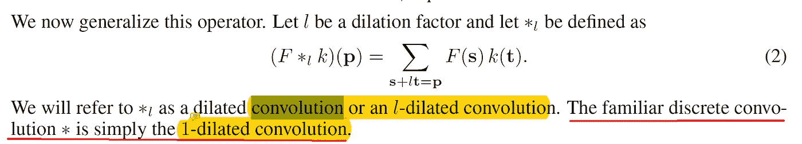

Image from [paper](https://arxiv.org/abs/1511.07122)

**红线→** “熟悉的”离散卷积(在我们的例子中是正常的 2D 卷积)运算和扩张卷积之间的关系

***我们熟悉的离散卷积就是 1-膨胀卷积*** 。因此，仅仅从这个陈述中，我们已经可以看出，当 1 的值增加到 2 时，这不是我们都喜欢的“熟悉的”卷积运算。而这一点，可以通过图片看得很清楚。

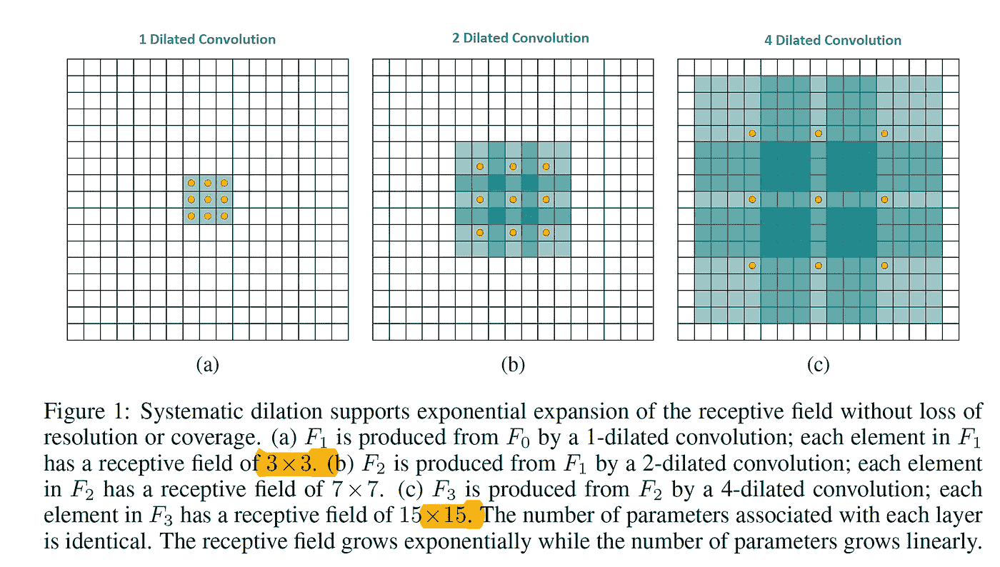

**蓝色书写→** 膨胀因子为 1、2、4。(或 1-扩张卷积、2-扩张卷积和 4-扩张卷积)

那么这些扩张因子是什么呢？这可以用另一个图像来解释。(其实是同一个图像 lol)

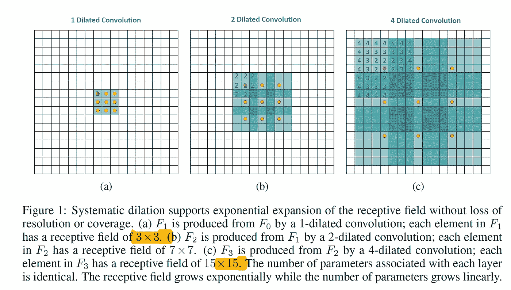

**蓝色数字** →应用于内核的膨胀因子

所以上图并不是膨胀卷积的最佳表现，但你可以大致了解这个膨胀因子是什么。并且随着膨胀因子的增加，原始核元素之间的空间变得越来越宽。现在让我们来看例子。

**实验设置**

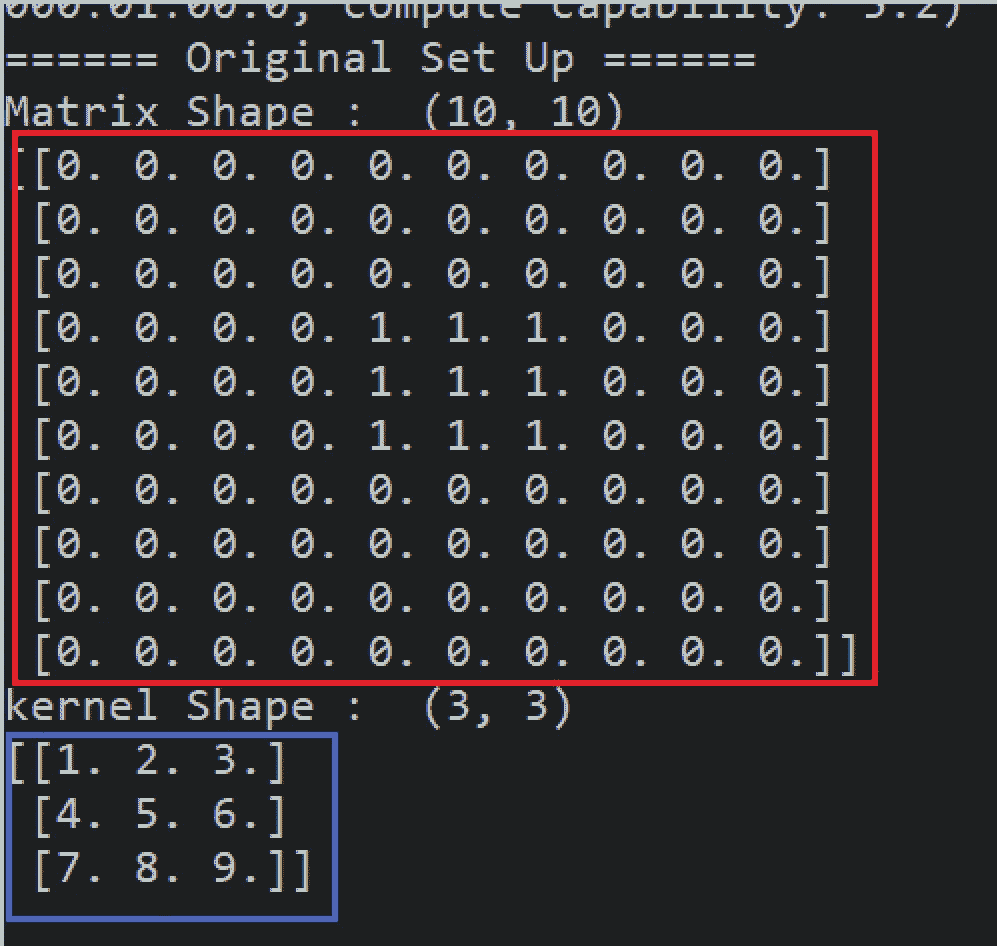

**红框** →原矩阵
**蓝框** →我们要用的内核

因此，我们将使用蓝框核对红框矩阵执行多重卷积运算。但是，有三点需要注意。

1.  在 Tensorflow 中有两种方法来执行扩张卷积，或者通过基本的 [tf.nn.conv2d()](https://www.tensorflow.org/api_docs/python/tf/nn/conv2d_backprop_filter) (通过设置扩张的)或者通过 [tf.nn.atrous_conv2d()](https://www.tensorflow.org/api_docs/python/tf/nn/conv2d)
2.  然而，似乎这两个操作都没有翻转内核。所以他们正在执行互相关(如果我错了请纠正我)，所以我们将手动翻转内核，如下所示。(红线)

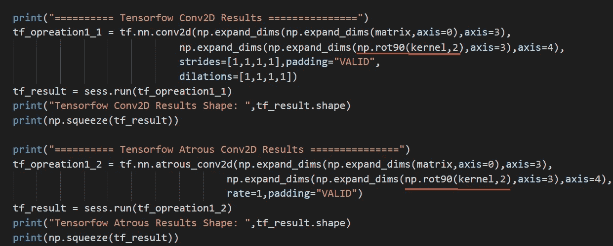

3.如上所述，**所有的** Tensorflow 操作将使用原始(3*3)内核，同时改变膨胀因子，而对于 Numpy，我们将**为每个膨胀率生成**特定内核。

**例 1-扩张因子 1**

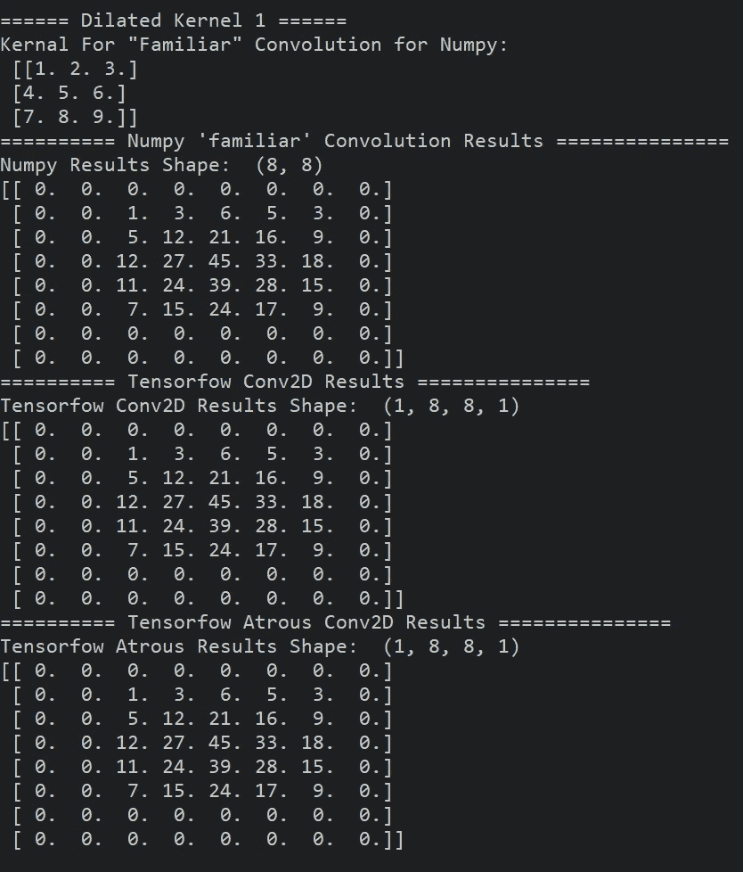

我们已经知道，如果我们将膨胀因子设置为 1，它就像我们学会的卷积运算一样。所以这个例子没有什么特别的。现在让我们看一下代码。

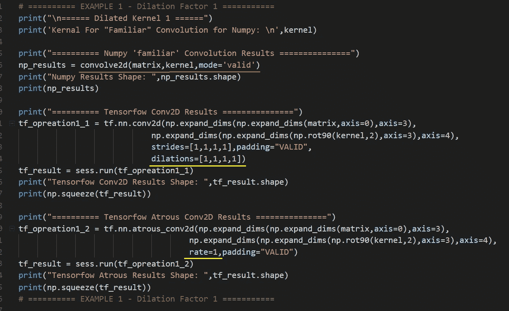

**红线** →注意我们正在对 Numpy
**进行“熟悉的”卷积运算，黄线** →张量流的膨胀因子

**示例 2 -扩张因子 2**

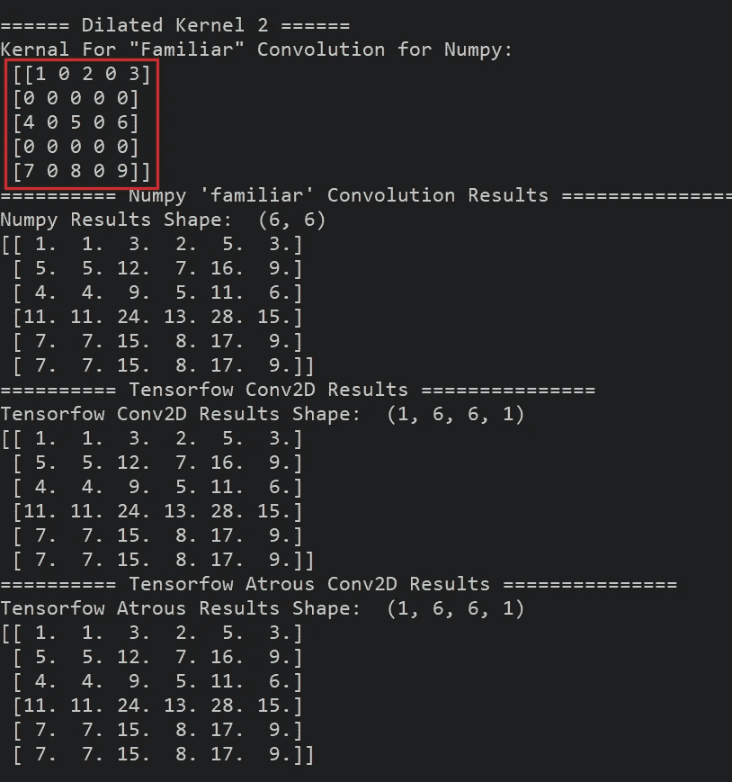

**红框** →为 Numpy 生成膨胀因子为 2 的内核

现在，由于膨胀因子已经增加到 2，我们将为 Numpy 生成一个新内核。

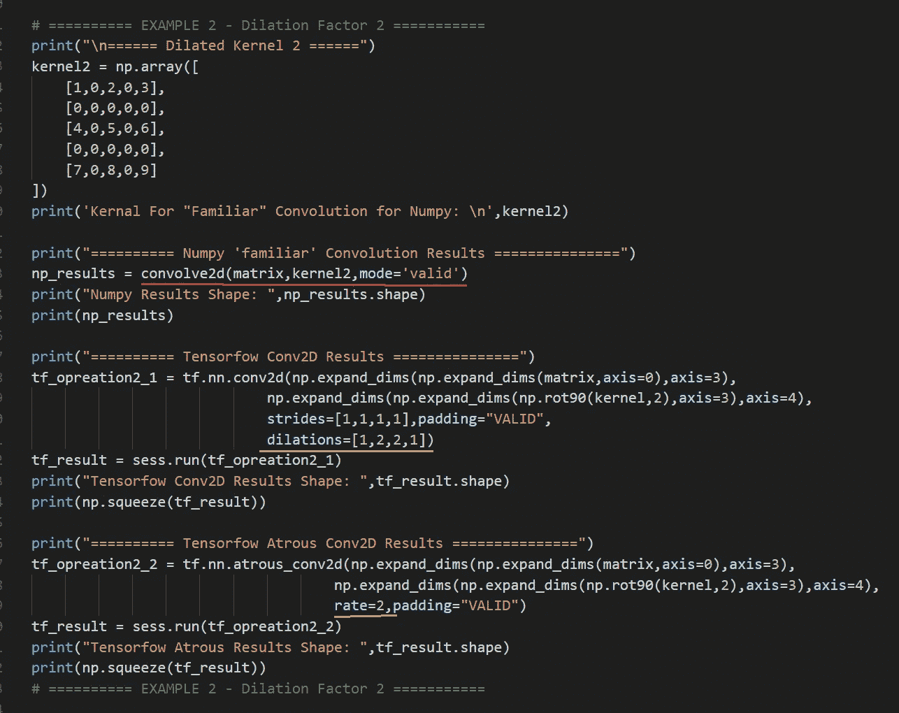

**红线** →注意我们正在对 Numpy
**黄线** →张量流的膨胀因子进行“熟悉的”卷积运算

**示例 3 —扩张因子 3**

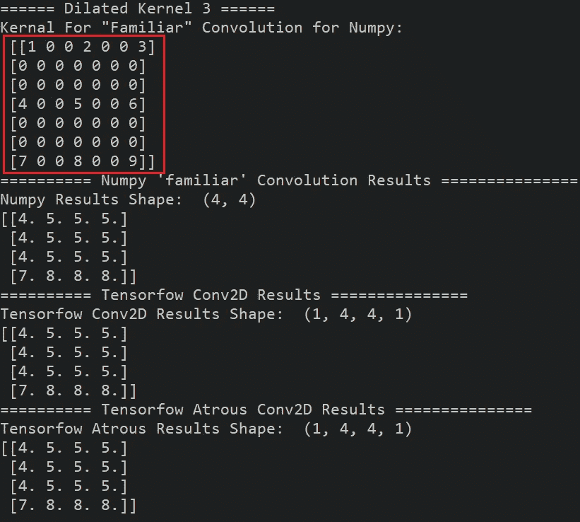

**红框** →为 Numpy 生成膨胀系数为 3 的内核

现在，由于膨胀因子已经增加到 3，我们将为 Numpy 生成一个新内核。

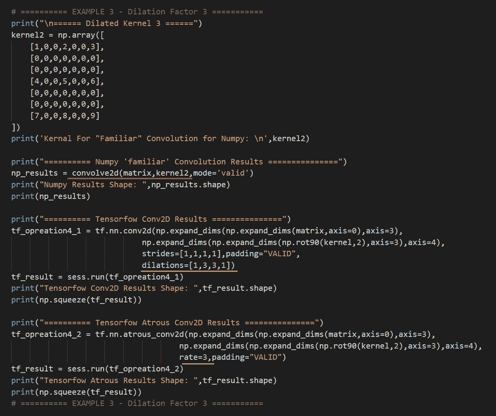

**红线** →注意我们正在对 Numpy
**进行“熟悉的”卷积运算，黄线** →张量流的膨胀因子

**例 4—扩张因子 4**

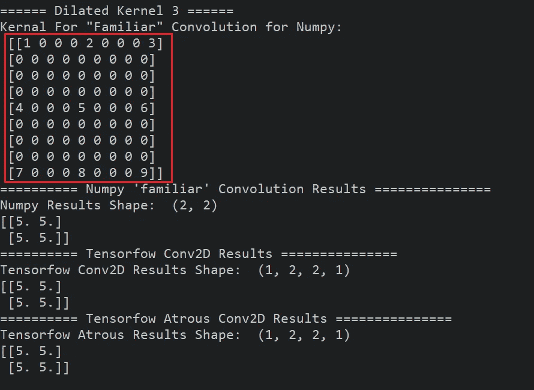

**红框** →为 Numpy 生成膨胀系数为 4 的内核

现在，由于膨胀因子已经增加到 4，我们将为 Numpy 生成一个新内核。

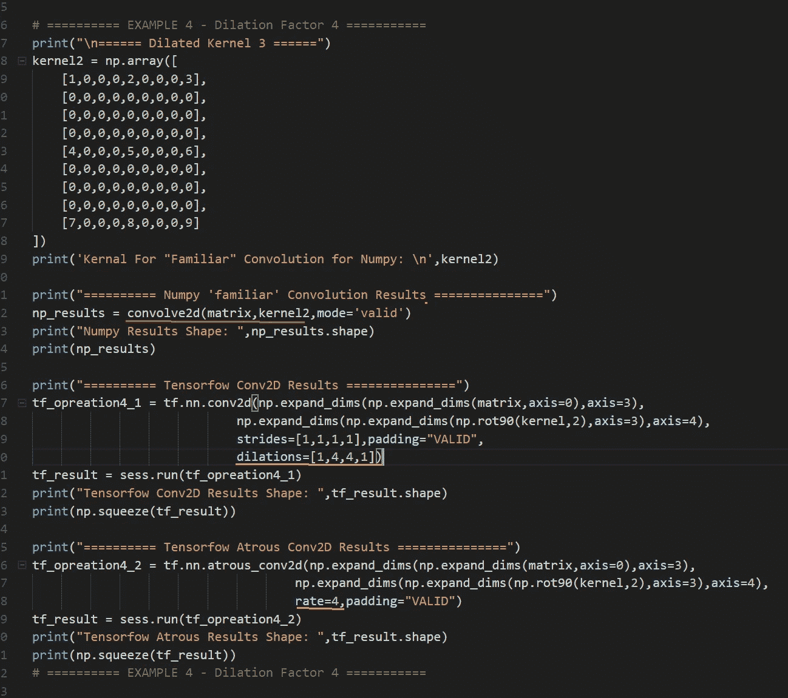

**红线** →注意我们正在对 Numpy
**黄线** →张量流的膨胀因子进行“熟悉的”卷积运算

**交互代码**

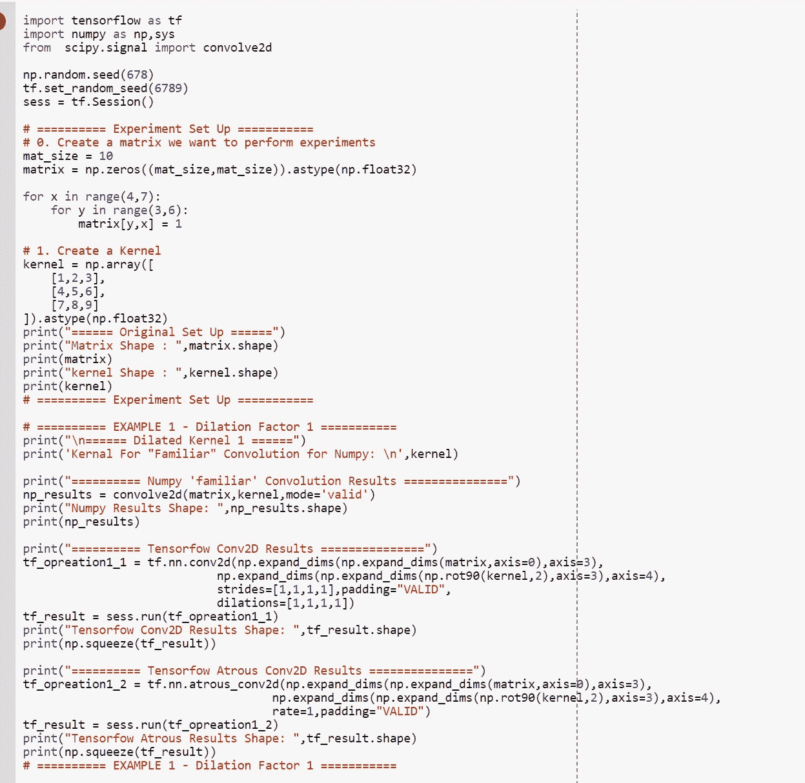

*我为了交互代码搬到了 Google Colab！所以你需要一个谷歌帐户来查看代码，你也不能在谷歌实验室运行只读脚本，所以在你的操场上做一个副本。最后，我永远不会请求允许访问你在 Google Drive 上的文件，仅供参考。编码快乐！*

**注意**安装在 Google Collab 上的 Tensorflow 版本似乎不支持膨胀因子大于 2 的膨胀卷积，(仅适用于 tf.nn.conv2d())它会给出以下错误。所以我已经把 tf.nn.cond2d()注释掉了。

要访问代码，[请点击此处](https://colab.research.google.com/drive/11v7HffmCyiww94Ftiz8mvKP_W-oUhnUF)。

**最后的话**

一个惊人的事实是:对扩张卷积运算进行反向传播只是[转置卷积运算](https://medium.com/swlh/only-numpy-understanding-back-propagation-for-transpose-convolution-in-multi-layer-cnn-with-c0a07d191981)。

如果发现任何错误，请发电子邮件到 jae.duk.seo@gmail.com 给我，如果你想看我所有写作的列表，请点击这里查看我的网站。

同时，在我的推特[这里](https://twitter.com/JaeDukSeo)关注我，访问[我的网站](https://jaedukseo.me/)，或者我的 [Youtube 频道](https://www.youtube.com/c/JaeDukSeo)了解更多内容。如果你感兴趣，我还在这里做了解耦神经网络[的比较。](https://becominghuman.ai/only-numpy-implementing-and-comparing-combination-of-google-brains-decoupled-neural-interfaces-6712e758c1af)

**参考**

1.  膨胀卷积和克罗内克因子卷积。(2016).推论。检索于 2018 年 3 月 12 日，来自[http://www . inference . VC/expanded-convolutions-and-kronecker-factorisation/](http://www.inference.vc/dilated-convolutions-and-kronecker-factorisation/)
2.  卷积运算教程—no 1 . 0 . 0 文档。(2018).Deeplearning.net。检索于 2018 年 3 月 12 日，来自[http://deep learning . net/software/the ano/tutorial/conv _ 算术. html](http://deeplearning.net/software/theano/tutorial/conv_arithmetic.html)
3.  tf.nn.atrous_conv2d | TensorFlow。(2018).张量流。检索于 2018 年 3 月 12 日，来自[https://www . tensor flow . org/API _ docs/python/TF/nn/atrous _ conv 2d](https://www.tensorflow.org/api_docs/python/tf/nn/atrous_conv2d)
4.  SciPy . signal . convolved 2d—SciPy v 1 . 0 . 0 参考指南。(2018).Docs.scipy.org。检索于 2018 年 3 月 12 日，来自[https://docs . scipy . org/doc/scipy/reference/generated/scipy . signal . convolved . html](https://docs.scipy.org/doc/scipy/reference/generated/scipy.signal.convolve2d.html)
5.  数组，I. (2018)。NumPy 数组的就地类型转换。Stackoverflow.com。检索于 2018 年 3 月 12 日，来自[https://stack overflow . com/questions/4389517/in-place-type-conversion-of-a-numpy-array](https://stackoverflow.com/questions/4389517/in-place-type-conversion-of-a-numpy-array)
6.  TF . nn . conv 2d _ back prop _ filter | tensor flow。(2018).张量流。检索于 2018 年 3 月 12 日，来自[https://www . tensor flow . org/API _ docs/python/TF/nn/conv2d _ back prop _ filter](https://www.tensorflow.org/api_docs/python/tf/nn/conv2d_backprop_filter)
7.  tf.nn.conv2d | TensorFlow。(2018).张量流。检索于 2018 年 3 月 12 日，来自[https://www.tensorflow.org/api_docs/python/tf/nn/conv2d](https://www.tensorflow.org/api_docs/python/tf/nn/conv2d)
8.  “扩张卷积和卷积+步幅有什么区别？——Quora”。2018.Quora.Com。2018 年 3 月 12 日访问。[https://www . quora . com/What-is-difference-of-expanded-convolution-and-convolution+stride](https://www.quora.com/What-is-the-difference-between-dilated-convolution-and-convolution+stride)。
9.  于，冯，科尔敦，伏(2015)。基于扩张卷积的多尺度上下文聚合。 *arXiv 预印本 arXiv:1511.07122* 。
10.  理解多层 CNN 转置卷积的反向传播。(2018).中等。检索于 2018 年 3 月 12 日，来自[https://medium . com/swlh/only-numpy-understanding-back-propagation-for-transpose-convolution-in-multi-layer-CNN-with-c0a 07d 191981](https://medium.com/swlh/only-numpy-understanding-back-propagation-for-transpose-convolution-in-multi-layer-cnn-with-c0a07d191981)