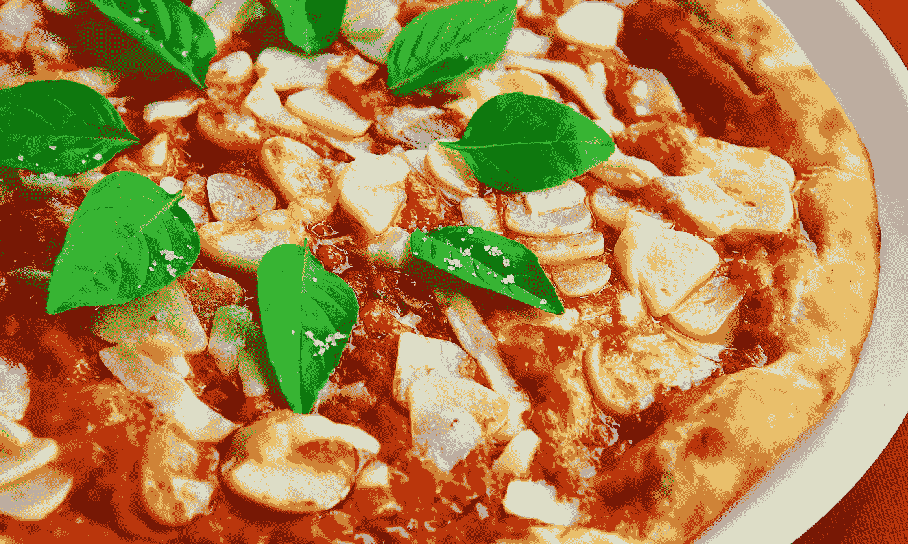
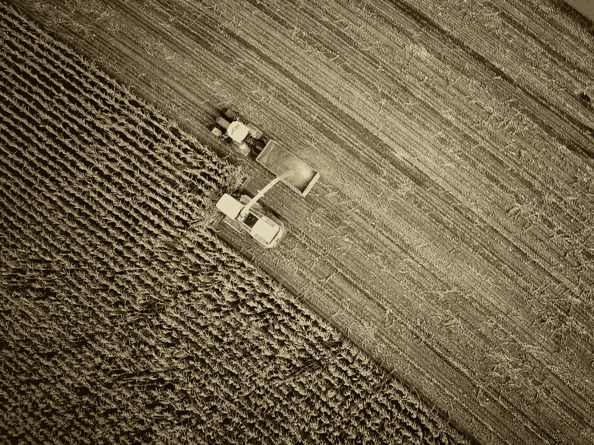
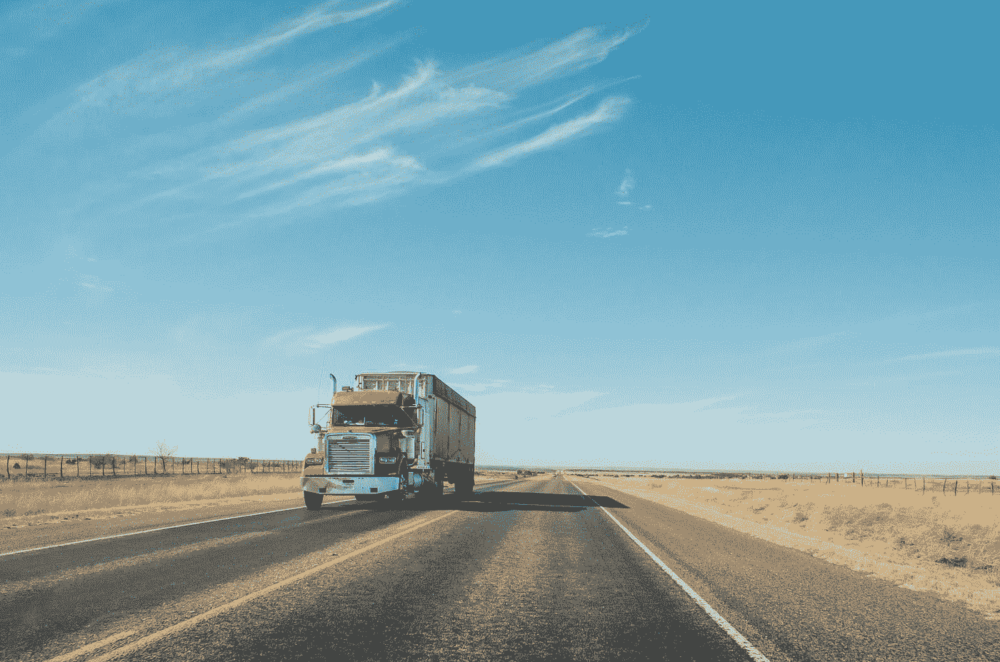
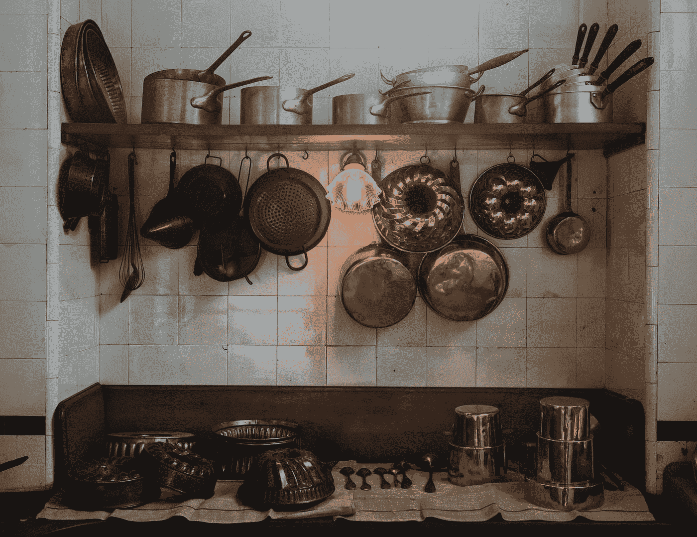
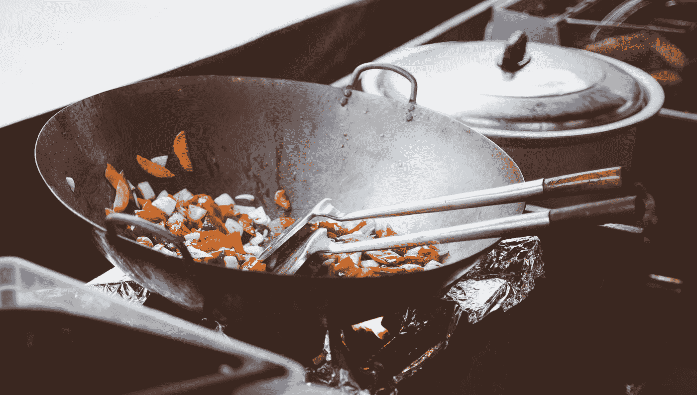

# 通过食物理解机器学习的工作流程

> 原文：<https://towardsdatascience.com/understanding-a-machine-learning-workflow-through-food-690ddad7803?source=collection_archive---------18----------------------->

Photo by [Cel Lisboa](https://unsplash.com/@cellisboa?utm_source=medium&utm_medium=referral) on [Unsplash](https://unsplash.com?utm_source=medium&utm_medium=referral)

## 穿越**美食**？！

**是的**，没错，通过**美食**！:-)

想象一下，你点了一份**披萨**，过了一会儿，那份*好吃的*、*热的*和*美味的*披萨就送到了你家。

你有没有想过让这样一个比萨饼送到你家背后的工作流程？我的意思是，完整的工作流程，从播种番茄种子到骑自行车的人在你家门口嗡嗡作响！事实证明，**与**机器学习工作流程并无太大不同。****

****真的**！我们去看看吧！**

> **这篇文章的灵感来自于谷歌首席决策科学家 Cassie Kozyrkov 在柏林举行的 Data Natives 会议上的一次演讲。**

****

**Photo by [SwapnIl Dwivedi](https://unsplash.com/@momentance?utm_source=medium&utm_medium=referral) on [Unsplash](https://unsplash.com?utm_source=medium&utm_medium=referral)**

## **1.播种**

**农民播下种子，这些种子会成长为我们比萨饼的配料，就像西红柿一样。**

**这相当于**数据生成过程**，可以是用户动作，例如触发传感器的运动、热量或噪声。**

****

**Photo by [no one cares](https://unsplash.com/@no_one_cares?utm_source=medium&utm_medium=referral) on [Unsplash](https://unsplash.com?utm_source=medium&utm_medium=referral)**

## **2.收获**

**然后是收获的时候，也就是蔬菜或水果成熟的时候。**

**这相当于**数据收集**，意味着浏览器或传感器会将用户动作或触发传感器的事件转化为实际数据。**

****

**Photo by [Matthew T Rader](https://unsplash.com/@matthew_t_rader?utm_source=medium&utm_medium=referral) on [Unsplash](https://unsplash.com?utm_source=medium&utm_medium=referral)**

## **3.运送**

**收获后，产品必须**运输**到目的地，用作我们披萨的配料。**

**这相当于**将数据**接收到一个存储库中，稍后将从那里获取数据，比如数据库或数据湖。**

****

**Photo by [Nicolas Gras](https://unsplash.com/@armgd?utm_source=medium&utm_medium=referral) on [Unsplash](https://unsplash.com?utm_source=medium&utm_medium=referral)**

## **4.选择器具和器皿**

**对于每一种**配料**，都有最合适的**器具**来处理。如果需要*切片*，使用*刀*。如果需要*搅拌*，一把*勺子*。同样的道理也适用于**器具**:如果你需要*烘烤*，使用*烤箱*。如果需要*炒*，一个*灶*。你也可以使用更复杂的设备，如**微波炉**，有更多的设置选项。**

**有时候，使用**更简单的**设备甚至会更好**——你见过餐馆做广告说“*微波披萨*”吗？！我没有！****

**在机器学习中，**器具**是预处理数据的**技术，而**器具**是**算法**，就像*线性回归*或*随机森林*。还可以用一个**微波**，我是说**深度学习**。可用的不同选项是**超参数**。在简单的电器里只有几个，我是说算法。但是在一个复杂的世界里还有很多很多。此外，无法保证复杂的算法会带来更好的性能(或者你更喜欢微波披萨？！).所以，明智地选择你的算法。****

****

**Photo by [S O C I A L . C U T](https://unsplash.com/@socialcut?utm_source=medium&utm_medium=referral) on [Unsplash](https://unsplash.com?utm_source=medium&utm_medium=referral)**

## **5.选择食谱**

**光有食材和器具是不够的。你还需要一份**食谱**，里面有你准备菜肴需要遵循的所有**步骤**。**

**这是你的**型号**。而**没有**，你的*型号*是**不是**跟你的*算法*一样。该模型包括您的算法所需的所有*前置* -后置*-*-*加工*。并且，说到*预处理* …**

****

**Photo by [Caroline Attwood](https://unsplash.com/@carolineattwood?utm_source=medium&utm_medium=referral) on [Unsplash](https://unsplash.com?utm_source=medium&utm_medium=referral)**

## **6.准备配料**

**我敢打赌，大多数食谱中的第一个说明是这样的:“*切这个*”，“削那个”等等。他们不会告诉你去**洗**蔬菜，因为这是理所当然的——没人想吃**脏**的蔬菜，对吧？**

**数据也是如此。**没人想要脏数据**。你要**清理**它，也就是处理**缺失值**和**离群值**。然后你要*剥*和*切片*，我的意思是**预处理**，就像编码分类变量(*男*或*女*)成数值( *0* 或 *1* )。**

**没人喜欢那部分。数据科学家和厨师都不是(我猜)。**

****

**Photo by [Bonnie Kittle](https://unsplash.com/@bonniekdesign?utm_source=medium&utm_medium=referral) on [Unsplash](https://unsplash.com?utm_source=medium&utm_medium=referral)**

## **7.特殊准备**

**有时候，你可以用你的配料获得**创意**，以获得**更好的口味**或**更精致的** **呈现**。**

**你可以将牛排风干以获得不同的味道，或者将胡萝卜雕刻成玫瑰的形状，然后放在你的盘子上:-)。**

**这是**特色工程**！这是一个重要的步骤，如果用一种巧妙的方式，*可能会大大提高你的模型的性能*。**

**几乎每个数据科学家都喜欢这一部分。我猜厨师也喜欢它。**

****

**Photo by [Clem Onojeghuo](https://unsplash.com/@clemono2?utm_source=medium&utm_medium=referral) on [Unsplash](https://unsplash.com?utm_source=medium&utm_medium=referral)**

## **8.烹饪**

**最基本的一步——没有真正的**烹饪**，就没有菜肴。很明显。你把准备好的**配料**放入**器具**，调整**热度**，等一会儿再检查。**

**这是你模型的**训练**。您将**数据**输入到您的**算法**，调整其**超参数**并等待一段时间，然后再次检查。**

****

**Photo by [Icons8 team](https://unsplash.com/@icons8?utm_source=medium&utm_medium=referral) on [Unsplash](https://unsplash.com?utm_source=medium&utm_medium=referral)**

## **9.品尝**

**即使你严格按照菜谱做，你也不能保证一切都是正确的。那么，你怎么知道你是否做对了呢？你**尝尝**吧！如果不好吃，可以多加*盐*尝试修复。您也可以改变*温度*。但是你继续做饭！**

**不幸的是，有时你的披萨会被烧焦，或者不管你怎么做都难以下咽。你把它扔进垃圾桶，从错误中吸取教训，重新开始。**

**但愿，坚持和一点点运气能做出**美味** **披萨** :-)**

****品鉴**就是**评价**。你需要评估你的模型，检查它是否运行良好。如果没有，您可能需要添加*更多功能*。您也可以更改一个*超参数*。但是你要坚持训练！**

**不幸的是，有时你的模型**不会收敛**到一个解决方案，或者**做出可怕的预测，不管你做什么**来试图挽救它。你抛弃了你的模型，从你的错误中吸取教训，重新开始。**

**希望，坚持和一点点运气会产生一个**高性能模型** :-)**

****

**Photo by [Kai Pilger](https://unsplash.com/@kaip?utm_source=medium&utm_medium=referral) on [Unsplash](https://unsplash.com?utm_source=medium&utm_medium=referral)**

## **10.递送**

**从厨师的角度来看，他/她的工作已经完成了。他/她做了美味的比萨饼。句号。**

**但是如果比萨饼没有很好地送到顾客手中，及时送到顾客手中，比萨饼店就会倒闭，厨师也会失业。**

**比萨饼做好之后，必须立即包装好以保温，并小心地处理好，以免在送到饥饿的顾客手中时看起来湿漉漉的。如果骑车人没有到达他/她的目的地，在路上丢失了比萨饼或者把它摇得面目全非，所有的烹饪努力都是徒劳的。**

****交付**就是**部署**。不是披萨，而是预测。预测就像披萨一样，必须**包装**，不是装在盒子里，而是**作为数据产品**，这样才能送到热切的顾客手中。如果管道出现故障、中途断裂或以任何方式修改预测，所有的模型训练和评估都是徒劳的。**

**就是这样！**机器学习就像烹饪食物**——过程中有几个人参与，需要付出**很多努力**，但最后的结果却可以**好吃**！**

**只有几个要点:**

*   **如果**食材**是**坏的**，那**菜**就要**坏了**——**没有菜谱能搞定** **那**当然，**没有器具，也没有**；**
*   **如果你是**厨师**，千万不要忘记，**不送**，烹饪就毫无意义，因为**永远不会有人品尝你的美味**；**
*   **如果你是一个**餐馆老板**，不要试图把电器强加给你的厨师——有时候 ***微波炉*** *并不是最好的选择*——如果他/她把所有的时间**花在洗碗**和**切片** **配料**上，你会得到一个非常**不开心的厨师**…**

**我不知道你怎么样，但是我现在想要订购一个比萨饼！:-)**

***如果你有什么想法、评论或者问题，请在下方留言或者联系我* [*推特*](https://twitter.com/dvgodoy) *。***