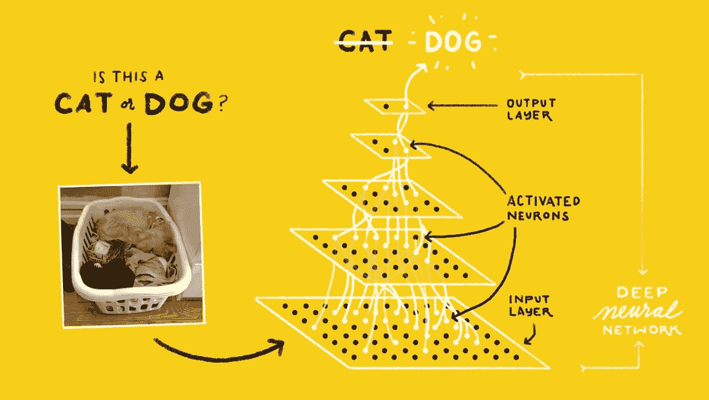
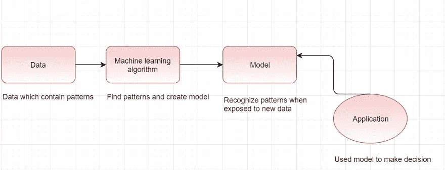
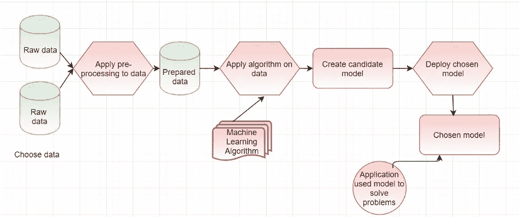
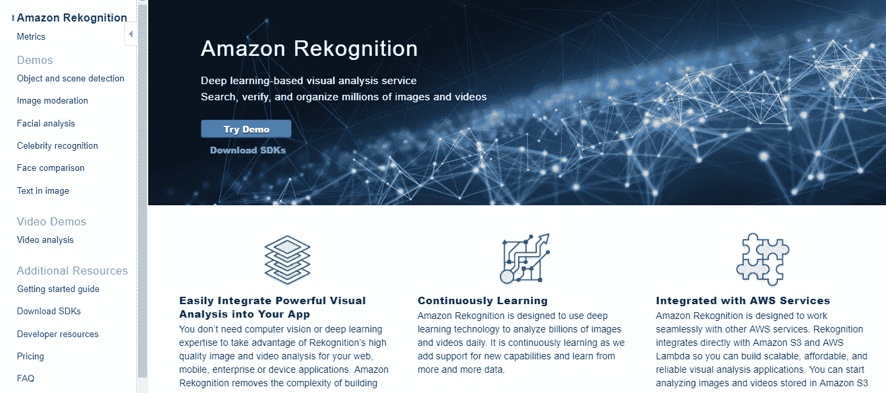
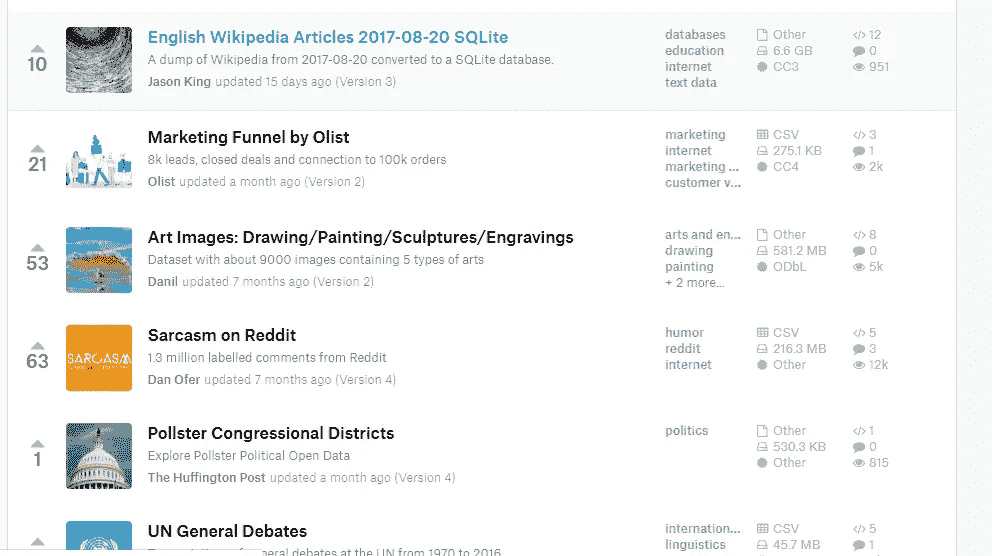

# 了解用于移动应用程序开发的人工智能和 ML

> 原文：<https://towardsdatascience.com/understanding-ai-and-ml-for-mobile-app-development-d07a3788d508?source=collection_archive---------7----------------------->

Photo by [Rock'n Roll Monkey](https://unsplash.com/@rocknrollmonkey?utm_source=medium&utm_medium=referral) on [Unsplah](https://unsplash.com?utm_source=medium&utm_medium=referral)

上次我发表了[这篇](https://www.nexmobility.com/articles/using-ml-kit-in-android.html)博客，其中我解释了 AI 和 ML 的一个应用——“视觉”，还简要解释了在移动开发中使用 ML kit，这是谷歌提供的云平台，用于集成 Android 和 iOS 应用中的 ML 功能。这篇文章是那篇文章的前传，在这篇文章中，我将解释人工智能和机器学习的基础知识。我将阐明什么是不同类型的机器学习，以及当我们看到谷歌照片应用程序检测我们的面部时，或者当 Gmail 建议我们用完整的句子作为回复时，这一切是如何发生的。

# AI vs ML

人工智能和 ML 是计算机科学的一个分支，一个单独的博客无法对这些主题做出公正的评价，我也不自称是这些领域的专家，但是为了我们在移动应用程序中开始使用 ML 的目标，我们必须对这些术语有一些基本的理解。

人工智能被定义为——机器或计算机对人类行为的模仿。人工智能研究的是科学的一个分支，其目标是使机器或计算机表现出与人类同等水平的智力、聪明、表达能力和艺术特征。人工智能的水平和应用各不相同。现在，例如，如果有一个假设的人形机器人可以洗碗、洗车和做饭，我们将把它称为人工智能的产品，但也将是一个能够理解语音并识别语音语气是愤怒、羡慕还是高兴的软件。人工智能是巨大的，涉及许多方面——有帮助收集、分类和处理数据的数据科学，有帮助理解和应用智能特征的算法，还有机器学习。ML 是人工智能的一部分，它实现了学习和训练能够做出决策的程序的目标。这些程序被输入了大量的数据，使用算法来处理这些数据，并根据这些数据进行训练，这样当它得到一个新的输入时，它就能够做出决定。

Cat or Dog — Using neural network for vision

人工智能在最近几年变得越来越热门，但它不是新概念，自 70 年代以来就一直存在。但直到现在，由于高处理能力、硬件和所需的大量数据的可用性，它才变得切实可行地用于解决问题。为了训练模型并给出可靠的输出，ML 需要处理的数据项不是几千而是几百万。

# ML 解释道

ML 可以分为三种方式:

1.  监督学习——我们向 ML 算法输入大量数据，这些数据被标记，即标有结果。该数据具有附在条目上的段或标签。在这种类型的学习中，我们教系统如何根据我们已经输入的数据来识别新的输入。
2.  无监督学习——数据没有被标记或分类。在这种情况下，系统不知道成功或失败终点，因为它没有任何可用的指导。在这种情况下，系统会尝试对可用数据进行分类，并用给定的信息创建模式，并存储这些模式。现在，当一个新的输入到达时，它会尝试将输入与存储的模式进行匹配，并将选择的模式分配给它。
3.  强化学习——这是一种无监督学习。在这种学习中，输入数据也没有标记。当获得成功时，它被反馈给系统以指示推断成功。这改善了未来的结果。

理解 ML 需要我们经历以下术语:

*   数据
*   模型
*   培养
*   决定
*   经验

ML 程序被输入大量的数据**训练*它。从*训练中，*它学习问题的规则，并积累*经验。有了经验，当新问题出现时，它就有能力做出决定。此外，在处理新的数据和问题陈述时，它*使*适应新的情况。所以和人类一样，它“边工作边学习”。例如，如果我们必须使用机器学习来创建一个国际象棋解算器，我们将不会编写大量的 if/else 来对每一步做出决定，而是我们将为 ML 程序提供一些非常基本的规则以及大量以前的国际象棋游戏数据。有了这些数据，它将学习并最终能够决定下一步该做什么。**

# *创建“模型”*

*创建和训练模型是创建您的 ML 系统的非常重要的部分。模型是预处理数据和选定算法的集合，这些算法对数据进行处理以推断输出。创建模型是一个复杂的过程，本质上是迭代的。对于我们的用例，我们从一些基本规则和选择的算法开始，并开始向我们的系统提供大量的使用数据。这些数据是我们以前在系统中收集的条目。例如，在银行欺诈检测系统的情况下，数据将是所有用户的信用和借记交易的历史。使用这些数据，我们首先创建不同的“候选模型”，然后在新的数据集上使用和尝试这些模型，并观察它们的性能。在成功率的基础上，选择和部署最佳的模型来提供新的用例。有了新的输入数据，选定的模型做出决策，并在此过程中收集更多的经验，使自己适应不断扩展的用例。*

**

*Training and using ML model*

**

*Creating ML model — iterative nature of the process*

# *ML 的应用*

*   *图像处理——这是最典型的 ML 用例。在这个 ML 中，算法被用于检测给定图像中的各种对象。这属于“监督学习”,其中 ML 系统被输入大量包含不同对象的标记图像。因此，ML 模型被训练来识别对象。谷歌助手和谷歌照片就是很好的例子。AWS Rekognition 和 Firebase ML kit 为此功能提供了 API。*
*   *自然语言处理和语音识别——自然语言处理和语音识别是 ML 的另一个非常著名且不断发展的用例。检测书面文本并推断其脚本和含义是非常有用的。有各种解决方案可用于集成这一点，包括 Google Cloud ML 和 AWS 的不同产品——Amazon transcripte、Translate 和 Lex。*
*   *诊断学——医学诊断学是人工智能和人工智能领域的一个衍生因素。医疗部门和人工智能科学家开发了一些系统，可以使用细胞视觉和包括病历在内的其他数据来检测癌症和其他疾病的可能性。*
*   *预测—使用历史数据 ML 模型可以推断未来事件，如商业欺诈检测、客户行为预测或自然事件预测。*

**

*First painting created by an AI program*

# *如何在应用中使用人工智能/人工智能——何去何从*

*有几个方向可供选择，这取决于开发人员想要多少功能、灵活性，以及他们的用例有多具体。我们可以从谷歌云或 AWS 平台的现成、完全成熟的人工智能产品中进行选择，也可以部署我们自己的定制模型。*

# *ML 框架*

*   *TensorFlow/Keras 模型——Tensor Flow 是谷歌的开源机器学习框架。张量流是一个通用的 ML 框架，涵盖了广泛的用例。这是最广泛用于开发和部署 ML 模型。Keras 是一个高级 Python API，用于构建和训练深度学习模型。它是独立开发的，但在谷歌收购后，现在是张量流的一部分。*
*   *来自脸书的 PyTorch 这个来自脸书的库是基于 Python 的深度学习库。这主要用于像自然语言处理这样的应用。这也是开源的。PyTorch 的主要优势在于它利用 GPU 的能力来解决复杂的数学问题。它被深度学习研究人员用作首选库。它可以说是早期著名的 Python 数学库的高级版本，是 numPy，但它更好更快，因为它使用了 GPU。*
*   *Google Cloud ML/Cloud Vision——Google Cloud Vision 框架是 Google ML 产品的一部分，专门处理计算机视觉或“图像分析”。在这种情况下，有几种功能可用于图像分析，如文本检测、人脸检测、内容调节等。*

**

*Google Cloud Vision home*

**

*Cloud vision API demo*

*   *Firebase ML kit with tensor flow Lite—Firebase ML kit 是 Cloud Vision API 的新成员，主要面向移动开发者。ML 工具包提供易于使用的云 API 的图像处理，如文本检测，人脸检测，条形码扫描，对象检测和标志检测。它提供了在设备上或云处理的选项。*
*   *AWS 套件——AWS 还提供了大量现成的 ML 特性。这些功能包括图像分析(AWS Rekognition)、语音转文本(AWS Transcribe)、翻译(AWS Translate)、聊天机器人(AWS Lex)、文本转语音(AWS Polly)和许多其他功能。在这些 AWS 中，Rekognition 涵盖了与图像分析相关的最广泛的使用案例，如文本和对象识别、人脸检测和识别等。*

**

*AWS rekognition*

*   *OpenCV —这是迄今为止最著名的计算机视觉和机器学习库，它非常强大，易于使用，并且是开源的。它适用于包括 Android 在内的不同平台。这个库非常容易使用，开发人员正在使用它来制作非常酷的计算机视觉相关应用程序，如检测人脸或特定对象，并在此基础上做出决定。*
*   *[kag gel](https://www.kaggle.com/)——对于人工智能开发人员来说，这是一个非常有用的地方，可以为他们的特定用例获取数据集/模型。拥有超过 10，000 个数据集，以满足不同的需求和领域。例如，如果你想创建一个实时微笑检测器，你会想检查一个检测到的脸是否在微笑。您需要一个成熟的数据集来创建和准备您的模型。你会从卡格尔那里得到这个。Kaggle 于 2017 年被谷歌收购。*

**

*Kaggle datasets (www.kaggle.com)*

*TL；灾难恢复—如果您的需求属于图像分析、文本或识别或视频分析等一般使用情形，那么您可以使用 AWS 或 Google Cloud 提供的现成解决方案。如果您需要对现有模型进行一些调整，或者您想要部署现有模型，您可以使用 TensorFlow/Keras，如果您想要用自己的定制解决方案解决一个新问题，您可以使用 PyTorch 或 TF 创建和训练您的模型，并使用任何云解决方案部署它。Kaggel 是一个非常好的存储库，可以存储大量用例的数据。*