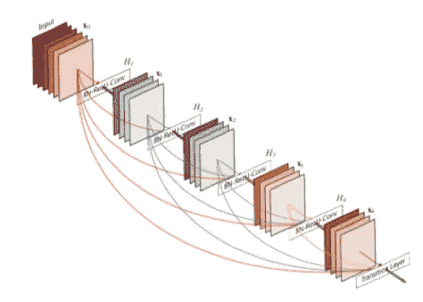
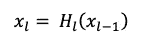
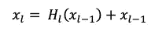
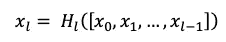
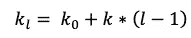
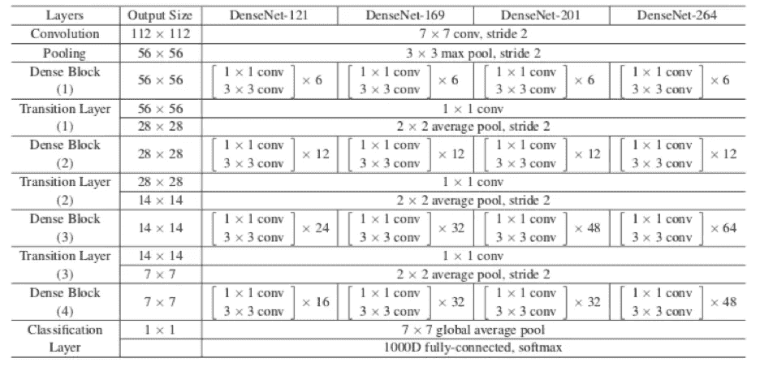
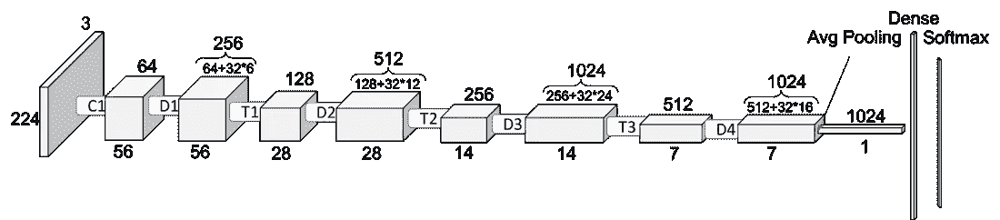
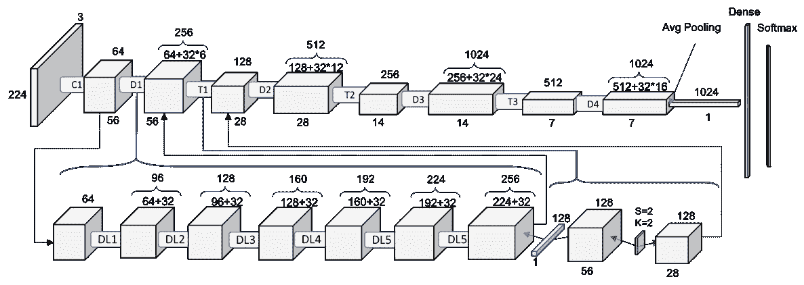
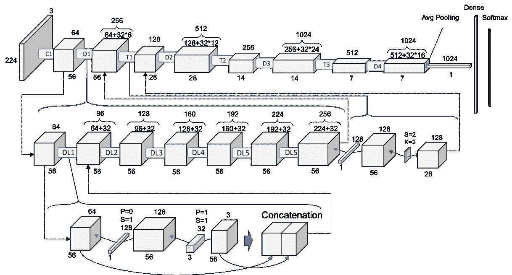

# 了解和可视化 DenseNets

> 原文：<https://towardsdatascience.com/understanding-and-visualizing-densenets-7f688092391a?source=collection_archive---------1----------------------->

这篇文章可以在 PDF [这里](http://www.pabloruizruiz10.com/resources/CNNs/DenseNets.pdf)下载。

这是关于 CNN 架构的[系列教程的一部分](https://medium.com/@pabloruizruiz/deep-convolutional-neural-networks-ccf96f830178)。

主要目的是深入了解 DenseNet，并深入研究针对 ImageNet 数据集的 DenseNet-121。

*   对于适用于 CIFAR10 的 DenseNets，这里还有另外一个教程。

**索引**

*   背景
*   动机
*   DenseNets 解决什么问题？
*   体系结构
*   摘要

# 背景

密集连接的卷积网络[1]，DenseNets，是继续增加深度卷积网络的下一步。

我们已经看到我们是如何从 5 层的 LeNet 发展到 19 层的 VGG 和超过 100 层甚至 1000 层的 ResNets。

# 动机

当 CNN 更深入时，问题就出现了。这是因为 ***路径*** 对于从输入层直到输出层的信息(对于反方向的渐变) ***变得如此之大*** ，以至于它们可以在到达另一边之前 ***消失*** 。

DenseNets **简化了其他架构中引入的层之间的连接模式**:

*   高速公路网[2]
*   剩余网络[3]
*   分形网络[4]

作者解决了确保**最大信息(和梯度)流**的问题。为此，他们只需将每一层直接相互连接。

DenseNets 没有从极深或极宽的架构中汲取代表力量，而是通过功能重用来挖掘网络的潜力。

# DenseNets 解决什么问题？

反直觉地，通过这种方式连接，densentes***比等效的传统 CNN 需要更少的参数*** ，因为不需要学习冗余的特征映射 。

此外，ResNets 的一些变体已经证明许多层几乎不起作用，并且可以被丢弃。事实上，ResNets 的参数数量很大，因为每一层都有其要学习的权重。相反， ***DenseNets 图层很窄*** (例如 12 个滤镜)，它们只是 ***增加了一小组新的特征贴图*** 。

非常深的网络的另一个问题是训练的问题，因为提到了信息流和梯度。DenseNets 解决了这个问题，因为 ***每一层都可以从损失函数*** 和原始输入图像直接访问梯度。

# 结构

Figure 1\. DenseNet with 5 layers with expansion of 4\. [1]

传统的前馈神经网络在应用操作 的 ***组合后，将该层的输出连接到下一层。***

我们已经看到，通常这个组合包括一个卷积运算或池层、一个批处理规范化和一个激活函数。

这个等式是:

ResNets 扩展了这种行为，包括跳过连接，将该等式重新表述为:

DenseNets 与 ResNets 的第一个区别就在这里。 **DenseNets 不将该层的输出特征图与输入特征图相加，而是将它们连接起来**。

因此，该等式再次变形为:

我们在 ResNets 上的工作面临着同样的问题，当它们的尺寸不同时，这种特征地图的分组就不能完成。不管分组是相加还是串联。因此，和我们用于 ResNets 的方法一样，DenseNets 被分成 **DenseBlocks，其中特征映射的尺寸在一个块内保持不变，但是过滤器的数量在它们之间变化**。它们之间的这些层被称为 ***过渡层*** ，并负责应用批量归一化、1x1 卷积和 2x2 合并层的下采样。

现在我们可以开始讨论增长率了。由于我们正在连接特征图，该信道维度在每一层都在增加。如果我们使 H_l 每次产生 k 个特征图，那么我们可以对第 l 层进行推广:

这个超参数 k 就是增长率。增长率决定了每层网络中增加的信息量。为什么

我们可以把特征图看作是网络的信息。 ***每一层都可以访问其前面的特征图*** ，因此，对 ***集合知识*** 。然后，每一层都向这一集体知识添加新的信息，具体表现为信息的 k 特征图

# DenseNets-B

DenseNets-B 只是常规 DenseNets，它利用 1x1 卷积来减少 3x3 卷积之前的特征映射大小，并提高计算效率。B 出现在瓶颈层之后，你已经熟悉这个名字了，来自[ResNets](https://medium.com/@pabloruizruiz/understanding-and-visualizing-resnets-442284831be8)的工作。

# 丹麦-公元前

DenseNets-C 是 DenseNets-B 的另一个小增量步骤，用于我们想要 ***减少输出特征映射*** 的情况。 ***压缩因子(θ)***决定了这个减少量。我们将拥有 *theta*m，而不是某一层的 m 个特征地图。当然，*在范围[0–1]内。所以当*θ= 1*时，DenseNets 将保持不变，否则将是 DenseNets-B。

为了与[resnet 上的工作](https://medium.com/@pabloruizruiz/understanding-and-visualizing-resnets-442284831be8)保持一致，我们将详细讨论 ImageNet 数据集上的案例。然而，CIFAR-10 或 SVHN 的结构更简单，因为输入量更小。

Figure 2\. Sizes of outputs and convolutional kernels for different DenseNets [1] architectures on ImageNet.

正如您从之前关于其他体系结构的工作中了解到的，我更喜欢观察模型中的卷实际上是如何改变其大小的。这种方式更容易理解特定模型的机制，能够根据我们的特定需求对其进行调整。我将尝试遵循接近于 [PyTorch 官方实现](https://github.com/pytorch/vision/blob/master/torchvision/models/densenet.py)的符号，以便于稍后在 PyTorch 上实现它。

# 密集和过渡块

然而，由于 DenseNets 上的高密度连接，可视化变得比 VGG 和雷斯内特更复杂一些。图 3 显示了 DenseNet-121 架构的一个非常简单的方案，这将是我们在这项工作中重点关注的 DenseNet。这是因为它是在 ImageNet 数据集上设计的最简单的 DenseNet。

我们可以在 DenseNet-121 上比较图 3 和图 2。每个体积下的尺寸代表宽度和深度的大小，而顶部的数字代表特征地图的尺寸。我介绍了它们是如何派生出来的，以帮助我们更好地理解即将到来的步骤。

Figure 3\. Another look at Dense-121\. Dx: Dense Block x. Tx: Transition Block x.

您可能想知道整个 DenseNet 的旁路连接在哪里，您问对了！然而，我只是想先画一个最简单的方案，以便更深入地了解 DenseNet 的整个结构。但是出于好奇，您可以注意到计算每个新卷的特征映射的加法的第一个数字是如何与前一卷的特征映射维度相匹配的。这将解释旁路连接，因为它确切地意味着我们正在将**串联**(串联意味着添加维度，但不是添加值！)**新信息到上一卷**，也就是被**重用的**。

请注意， **32 正是我们在本节开始时提到的增长率**。那么，从上图我们能得到什么呢？

> —每个密集块之后的体积增加了增长率乘以该密集块内的密集层数

在图 4 中，我们现在更深入地了解了每个块中实际发生的事情。

Figure 4\. One level deeper look at DenseNet-121\. Dense Block and Transition Block. DLx: Dense Layer x

# 致密层

现在，我们可以理解上面的说法了。每一层都在前一卷的基础上增加了 32 张新的特征地图。这就是我们在 6 层之后从 64 到 256 的原因。此外，过渡块执行 128 个滤波器的 1x1 卷积。随后是步长为 2 的 2×2 池，导致将体积的大小和特征图的数量对半分割。我们可以从这种模式观察中得出新的结论。

> —致密块内的体积保持不变—
> 
> —在每个过渡块之后，体积和特征图减半—

不过，我们还可以再深入一层！我们需要了解每个密集块中的每个密集层内部发生了什么，因为这还不是小事。让我们一起去看全图吧！

Figure 5\. 2 level deep. Full schematic representation of ResNet-121

在表示第一个密集块中的第一个密集层的新的更深层次中，我们可以看到添加 32 倍层数的行为实际上是如何实现的。我们执行作者建议的 128 个滤波器的 1×1 卷积，以减小*特征图的大小，并执行更昂贵的 3×3 卷积(记得包括填充以确保尺寸保持不变),具有选择的 32 个增长率特征图。

然后，在向网络的公共知识添加新信息的动作中，输入量和两个操作的结果(对于每个密集块内的每个密集层是相同的)被连接。

# 引用的作品

[1] G .黄，z .刘，l .范德马腾，“密集连接卷积网络”，2018 .

[2] R. Kumar，K. Gredd 和 J. Schmidhuber，“高速公路网络”，2015 年。

[3]何国光，张，任，孙健，“深度残差学习在图像识别中的应用”，2015 .

[4] G. Larsson，M. Maire 和 G. Shakhnarovich，“FractalNet:无残差的超深度神经网络”，2017 年。