# 理解和可视化资源

> 原文：<https://towardsdatascience.com/understanding-and-visualizing-resnets-442284831be8?source=collection_archive---------1----------------------->

这篇文章可以在 PDF [这里](http://pabloruizruiz10.com/resources/CNNs/ResNets.pdf)下载。

这是关于 CNN 架构的[系列教程的一部分](https://medium.com/@pabloruizruiz/deep-convolutional-neural-networks-ccf96f830178)。

主要目的是深入了解 ResNet，并深入研究 ResNet34 for ImageNet 数据集。

*   对于应用于 CIFAR10 的 ResNets，这里还有另外一个教程。
*   还有 PyTorch 实现详细教程[这里](http://www.pabloruizruiz10.com/resources/CNNs/ResNet-PyTorch.html)。

**索引**

*   背景
*   动机
*   ResNets 解决什么问题？
*   体系结构
*   摘要

# 背景

研究人员观察到，当涉及到卷积神经网络时，肯定“*越深越好”*是有意义的。这是有意义的，因为模型应该更有能力(它们适应任何空间增加的灵活性，因为它们有更大的参数空间来探索)。然而，已经注意到，在一定深度之后，性能会下降。

这是 VGG 的瓶颈之一。他们不能达到预期的深度，因为他们开始失去归纳能力。

# 动机

由于神经网络是良好的函数逼近器，它们应该能够容易地求解识别函数，其中函数的输出成为输入本身。

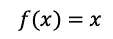

按照同样的逻辑，如果我们绕过模型第一层的输入，作为模型最后一层的输出，网络应该能够预测它之前学习的函数和添加的输入。

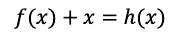

直觉告诉我们，学习 f(x) = 0 对网络来说一定很容易。

# ResNets 解决什么问题？

ResNets 解决的问题之一就是著名的已知 [**消失渐变**](https://medium.com/@anishsingh20/the-vanishing-gradient-problem-48ae7f501257) 。这是因为当网络太深时，在链规则的几次应用之后，计算损失函数的梯度容易收缩到零。这导致权重永远不会更新其值，因此没有学习被执行。

有了 ResNets，**渐变可以直接通过跳过连接从后面的层向后流到初始过滤器**。

# 体系结构

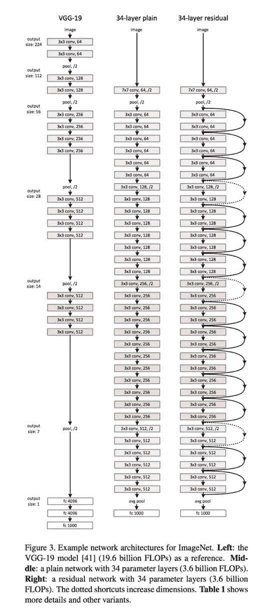

Figure 1\. ResNet 34 from original paper [1]

由于 ResNet 可以具有可变的大小，这取决于模型的每一层有多大，以及它有多少层，我们将遵循作者在论文[1] — ResNet 34 中描述的，以便解释这些网络之后的结构。

如果你看了一下这篇论文，你可能会看到一些如下的图表，你很难理解。让我们通过研究每一步的细节来描绘这些数字。

在这里，我们可以看到 ResNet(右边的那个)由一个卷积和合并步骤(在 orange 上)组成，后面是 4 层类似的行为。

每一层都遵循相同的模式。它们分别与固定的特征映射维度(F) [64，128，256，512]执行 3×3 卷积，每两次卷积绕过输入。此外，宽度(W)和高度(H)尺寸在整个层中保持不变。

虚线在那里，正是因为输入体积的维度发生了变化(当然是因为卷积而减少)。注意，层与层之间的这种减少是通过在每层的第一个回旋处将步幅从 1 增加到 2 来实现的；而不是像我们习惯看到的下采样器那样通过汇集操作。

在该表中，总结了每一层的输出大小以及该结构中每一点的卷积核的维数。

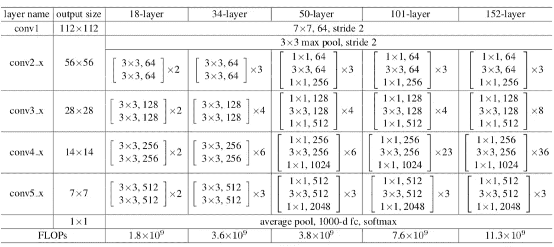

Figure 2\. Sizes of outputs and convolutional kernels for ResNet 34

但这是不可见的。我们想要图像！一张图片胜过千言万语！

图 3 是我更喜欢看到卷积模型的方式，从这里我将解释每一层。

我更喜欢观察通过模型的体积是如何改变它们的大小的。这种方式更容易理解特定模型的机制，能够根据我们的特定需求进行调整——我们将看到仅仅改变数据集如何迫使改变整个模型的架构。此外，我将尝试遵循接近于 [PyTorch 官方实现](https://github.com/pytorch/vision/blob/master/torchvision/models/resnet.py)的符号，以便稍后在 PyTorch 上实现它时更容易。

例如，论文中的 ResNet 主要针对 ImageNet 数据集进行解释。但是我第一次想用 ResNets 的集合做实验时，我不得不在 CIFAR10 上做。显然，由于 CIFAR10 输入图像是(32x32)而不是(224x224)，因此需要修改 ResNets 的结构。如果您想控制应用到您的 ResNet 的修改，您需要了解细节。[这另一个](https://medium.com/@pabloruizruiz/resnets-for-cifar-10-e63e900524e0)教程是当前应用于 CIFAR10 的一个简化版。

所以，我们一层一层来！

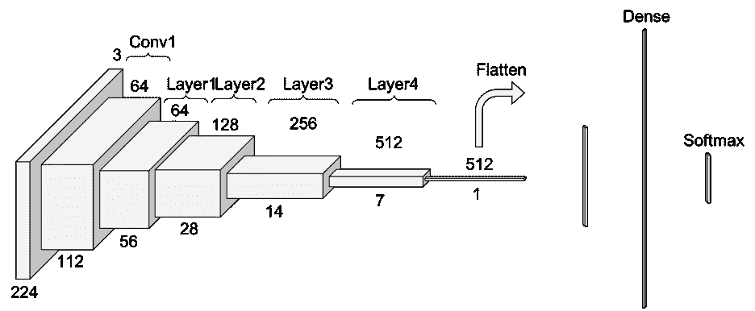

Figure 3\. Another look at ResNet 34

# 卷积 1

在进入公共层行为之前，ResNet 上的第一步是一个块(此处称为 Conv1 ),由卷积+批处理规范化+最大池操作组成。

如果你不记得卷积和池操作是如何执行的，快速看一下我画的这个图来解释它们，因为我在这里重用了它们的一部分[。](http://pabloruizruiz10.com/resources/CNNs/Convolution_Pooling.pdf)

首先有一个卷积运算。在图 1 中，我们可以看到他们使用的内核大小为 7，特征映射大小为 64。您需要推断它们在每个维度上用零填充了 3 次——并在 PyTorch 文档中进行检查。考虑到这一点，从图 4 中可以看出，该操作的输出大小将是一个(112x122)卷。由于(64 个中的)每个卷积滤波器在输出音量中提供一个通道，因此我们最终得到(112x112x64)的输出音量——注意，为了简化说明，这不包括批次维度。

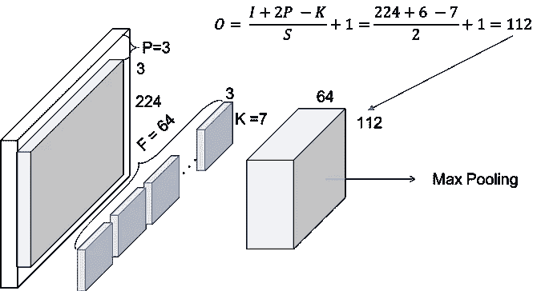

Figure 4\. Conv1 — Convolution

下一步是批处理规范化，这是一个基于元素的操作，因此不会改变卷的大小。最后，我们有一个跨度为 2 的(3x3)最大池操作。我们还可以推断，他们首先填充输入体积，因此最终体积具有所需的尺寸。

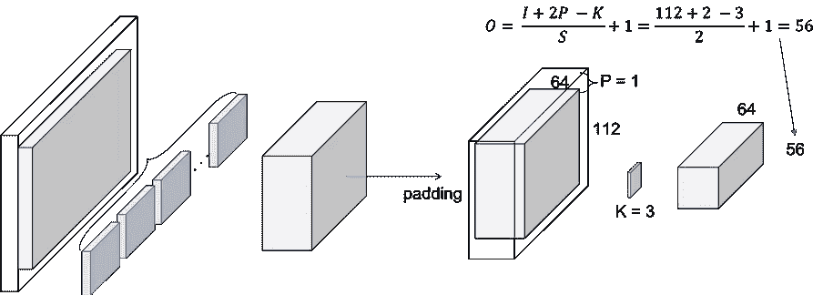

Figure 5\. Conv1 — Max Pooling

# ResNet 层

所以，我们来解释一下这个重复的名字，block。一个 ResNet 的每一层都由几个块组成。这是因为当 ResNets 更深入时，它们通常通过增加块内的操作数量来实现，但总层数保持不变，即 4 层。 ***这里的运算是指对一个输入进行卷积、批量归一化和 ReLU 激活，除了最后一个没有 ReLU 的块的运算。***

因此，在 PyTorch 实现中，他们区分包含 2 个操作的块**基本块**和包含 3 个操作的块**瓶颈块**。注意，通常这些操作中的每一个都被称为层，但是我们已经为一组块使用了层。

我们现在面临一个基本问题。输入音量是 Conv1 的最后一个输出音量。让我们看看图 6，看看这个模块内部发生了什么。

# 第一区

## 1 卷积

我们正在复制纸上每一层的简化操作。

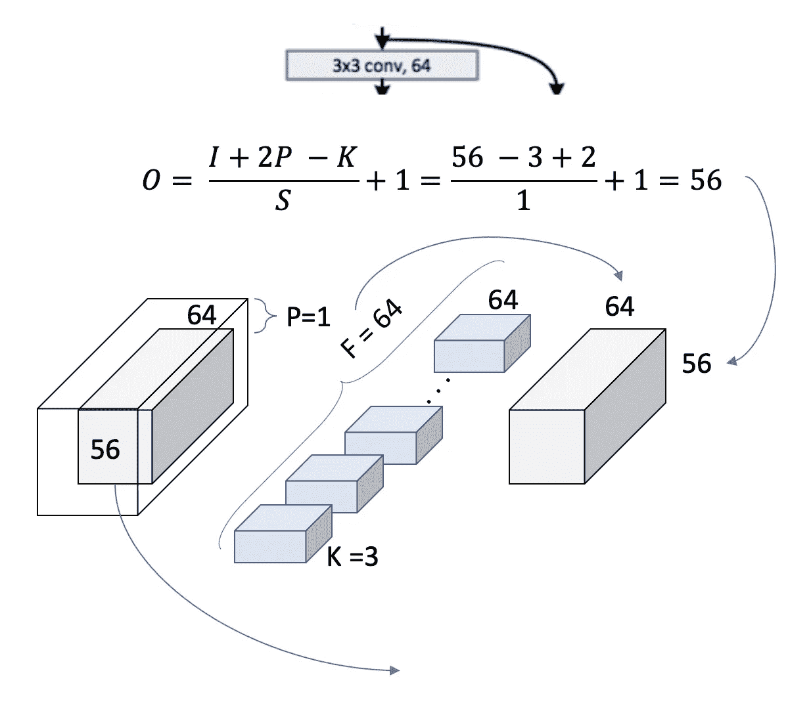

Figure 6\. Layer 1, block 1, operation 1

我们现在可以仔细检查我们使用的[3x3，64]内核和输出大小为[56x56]的论文中的表格。我们可以看到，正如我们前面提到的，在一个数据块中，卷的大小是如何保持不变的。这是因为使用了填充= 1，并且跨距也是 1。让我们看看这如何扩展到整个块，以覆盖表中出现的 2 [3x3，64]。

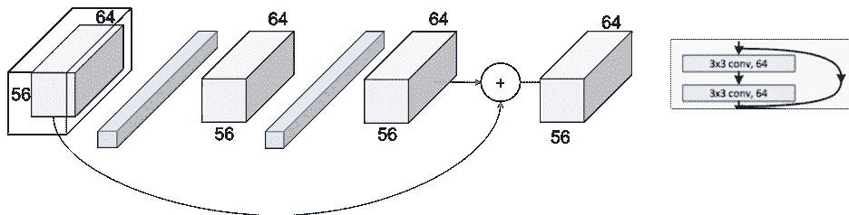

Figure 7\. Layer 1, block 1

相同的过程可以扩展到整个层，如图 8 所示。现在， ***我们可以完整的读取*** 表格的整个单元格了(只是重述一下我们在 Conv2_x 层的 34 层 ResNet 中。

我们可以看到如何在层 中使用***【3x 3，64】x 3 次。***

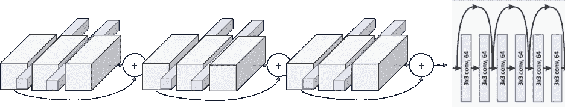

Figure 8\. Layer 1

# 模式

下一步是从整个块升级到整个层。在图 1 中，我们可以看到这些层是如何通过颜色区分的。但是，如果我们观察每一层的第一个操作，我们会发现第一层使用的步幅是 2，而不是其他层使用的 1。

这意味着通过网络的音量的 ***下采样是通过增加步幅来实现的，而不是像通常的 CNN 那样的汇集操作*** 。事实上，在我们的 Conv1 层中只执行了一次最大池化操作，在 ResNet 的末尾，就在图 1 中完全连接的密集层之前，执行了一次平均池化操作。

我们还可以看到 ResNet 层上的另一个重复图案，点层代表维度的变化。这和我们刚才说的一致。每一层的第一个操作是减少维度，因此我们还需要调整通过跳过连接的卷的大小，这样我们就可以像图 7 中那样添加它们。

这种跳过连接上的差异在文中被称为 ***恒等式快捷方式*** 和 ***投影快捷方式*** 。恒等快捷方式是我们已经讨论过的，简单地绕过加法运算符的输入量。投影快捷方式执行卷积运算，以确保此加法运算中的体积大小相同。从纸上我们可以看到 ***匹配*** 输出尺寸有两种选择。或者 ***填充输入音量*** 或者执行 ***1x1 卷积*** 。这里显示了第二个选项。

Figure 9\. Layer2, Block 1, operation 1

图 9 显示了通过将跨距增加到 2 来执行的下采样。滤波器的数量被加倍，以试图保持每个操作的时间复杂度( *56*64 = 28*128* )。另外，请注意，由于卷被修改，现在无法执行添加操作。在捷径中，我们需要应用一种下采样策略。1x1 卷积方法如图 10 所示。

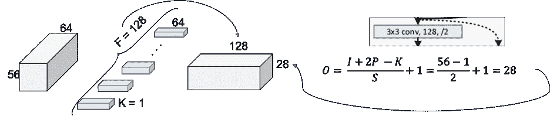

Figure 10\. Projection Shortcut

最终的图片如图 11 所示，其中每个线程的 2 个输出卷大小相同，可以相加。

Figure 11\. Layer 2, Block 1

在图 12 中，我们可以看到整个第二层的全局情况。下面的第 3 层和第 4 层的行为完全相同，只是改变了引入体积的尺寸。

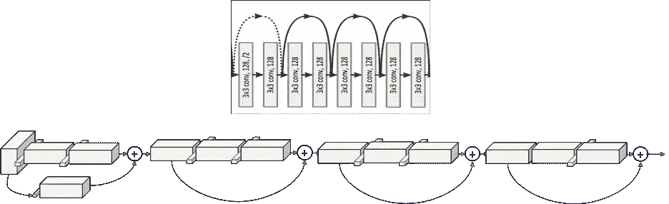

Figure 12.Layer 2

# 摘要

遵循作者建立的解释规则的结果产生了如图 2 所示的以下结构:

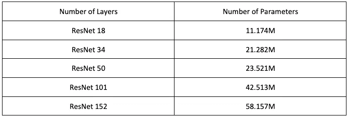

Table 1\. ResNets architectures for ImageNet

# 文献学

[1]何国光，张，任，孙，“深度残差学习在图像识别中的应用”，*，*，2016。