# 理解和可视化 SE-net

> 原文：<https://towardsdatascience.com/understanding-and-visualizing-se-nets-1544aff0fc68?source=collection_archive---------8----------------------->

这篇文章可以在 PDF [这里](http://www.pabloruizruiz10.com/resources/CNNs/SE_Nets.pdf)下载。

这是 CNN 架构系列文章[的一部分。](https://medium.com/@pabloruizruiz/deep-convolutional-neural-networks-ccf96f830178)

主要目的是提供理解 SE-Nets 的洞察力。

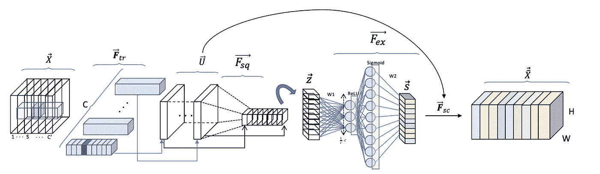

**指数**

(1)有哪些创新点？

*   新数据块与新网络
*   解决什么问题？
*   什么是 SE 块？

(2)结构

*   转换
*   挤压
*   激发，兴奋
*   缩放比例

(3)SE 模块的应用

(4)结果和结论

(5)全球图景

# 有哪些创新？

## 新块而不是新网络

首先，本文作者并没有试图通过开发一种新颖的 CNN 架构来提高经典计算机视觉竞赛的艺术水平。然而，非常有趣的是，作者创建了一个可以与现有模型一起使用的**模块来增强它们的性能**。

这个新的模块在完成两个主要操作后被命名为 SE 模块:挤压和激励

## 动机——这些积木解决了什么问题？

作者声称卷积的输出导致与滤波器捕获的空间相关性纠缠的信道依赖性。哇，这听起来太疯狂了！但是不要担心，在一些想象之后，这变得非常简单。

那么作者想用这些积木做什么来解决这个问题呢？

— — — — — — — — — — — — — — — — — — — — — — — — — — — — — — —

*他们的目标是通过利用选通网络对通道相互依赖性进行显式建模来提高网络的灵敏度，选通网络出现在 se 模块中*

— — — — — — — — — — — — — — — — — — — — — — — — — — — — — — —

## 那么什么是 SE 块呢？

简而言之，SE 模块是通道关系中的轻量级门控机制。

简而言之，网络现在能够学习如何理解在卷积运算[【1】](#_ftn1)之后提取的所有特征图的堆栈中的每个特征图的重要性，并且在将卷传递到下一层之前重新校准该输出以反映该重要性。

所有这些都将在结构部分详细介绍，所以如果您现在没有看到某些内容，也不必担心！

**但是等一下，为了学习，我们需要更多的参数，对吗？**

没错。门控机制或门控网络只不过是完全连接的层。这种技术在注意机制中被大量使用。我强烈推荐[这篇文章](https://medium.com/syncedreview/a-brief-overview-of-attention-mechanism-13c578ba9129)来更好地理解注意力机制和门控网络。

# 结构

让我们首先来看看图 1 中的图。我们可以称这个图为简化图，因为我们总是想要更多的细节！

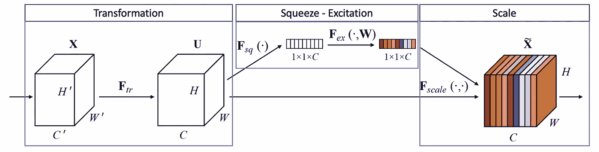

Figure 1\. The SE Block from the paper.

它显示了所提供的插图，我在上面分离了它的三个主要部分。重要的是要看到，挤压和激励步骤只发生在中间模块，而第一个和最后一个模块执行不同的操作。

在一次展示详细的图片之前，让我们一部分一部分地阐述它。

# 1 —转换

该转换简单地对应于将要实现 SE 模块的网络在其自然方案中执行的操作。例如，如果你在一个 ResNet 内的一个块中， ***F*** *tr* 项将对应于整个残差块的处理(卷积、批量归一化、ReLU…)。因此:

— — — — — — — — — — — — — — — — — — — — — — — — — — — — — — —

*SE 块应用于变换操作的输出体，通过校准提取的特征来丰富它。*

— — — — — — — — — — — — — — — — — — — — — — — — — — — — — — —

因此，如果 ResNet 在某个点将输出卷 X，则 SE 块丰富它包含的信息，并传递到下一层，成为 X`。(不能包含上面带~的 X)。

为了简化可视化，让我们假设变换是一个简单的卷积运算。我们已经在[之前的文章](http://pabloruizruiz10.com/aiblog/cv/cv.html)中描述了卷积运算，但是，让我们试着稍微详细一点，以便更好地理解接下来会发生什么。

我之所以声称这第一步很重要，是因为作者构建 se 块的动机就在于此。

— — — — — — — — — — — — — — — — — — — — — — — — — — — — — — —

*对于常规卷积层，是一组滤波器***被学习来表达沿着输入通道的局部空间连通性模式* ***X*** *因此卷积滤波器是局部感受域* *内的* ***通道方式信息的组合。****

*— — — — — — — — — — — — — — — — — — — — — — — — — — — — — — —*

*如果我们看一下对应于图 2 的符号，我们有:*

*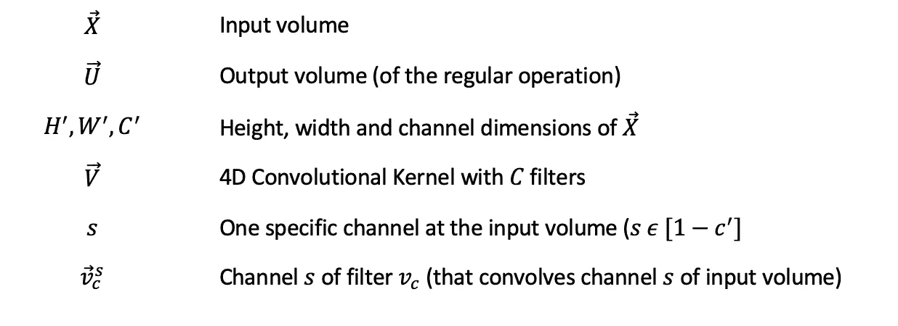*

*— — — — — — — — — — — — — — — — — — — — — — — — — — — — — — —*

**他们所说的* ***局部感受野*** *恰恰是每个通道 2 的空间****V****c，s 在每个过滤器***c .***

**— — — — — — — — — — — — — — — — — — — — — — — — — — — — — — —**

**为什么信息是渠道方面的？**

**嗯，请注意滤波器 **V** 1 的标记 **V** 1，s 将仅在输入音量 **X** s 的通道 *s* 上卷积。**

**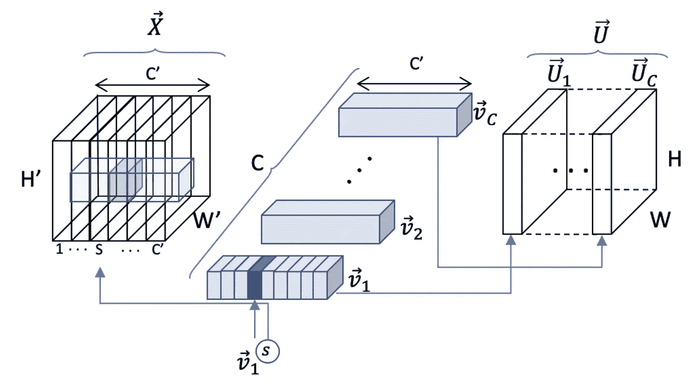**

**Figure 2\. Step1: Transformation**

**我们也可以按通道来表示卷积运算，以进行双重检查:**

**在体积 **X** 中卷积 1 个单个滤波器 **Vc** 的结果在单个特征图上， **U** c:**

**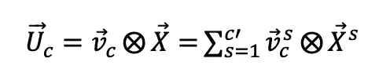**

**换句话说，一个滤波器在体积 **X** 上的卷积是输入体积 **X** s 的每个通道与其在滤波器 **V** c，s 中的对应通道的所有通道卷积的总和**

# **2 —挤压**

**挤压步骤可能是最简单的一步。它基本上在每个通道上执行**平均汇集，以创建一个 1x1 *压缩*的卷 **U** 表示。****

**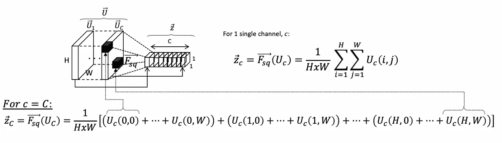**

**Figure 3\. Squeezing**

# **3 —激发**

**这是 SE 模块整个成功的关键部分，所以请注意。这确实是一个文字游戏，我们将使用一个使用门控网络的注意力机制: )**

**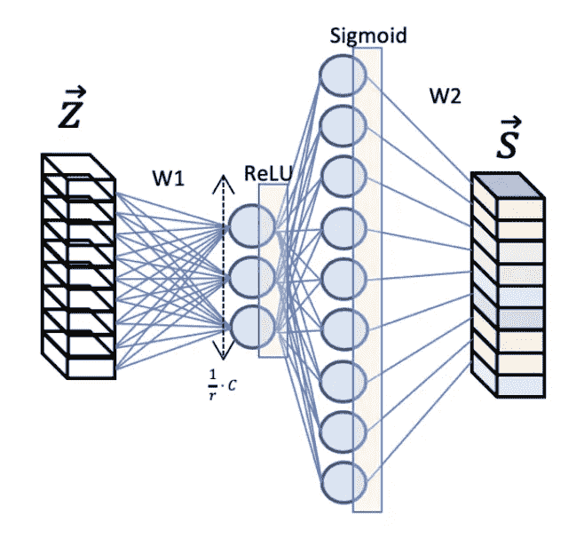**

**作者引入了一个称为**缩减比** *r* 的新参数，在 sigmoid 激活的选通网络之前，引入第一个具有 ReLU 激活的全连接(FC)层。**

**这样做的原因是引入一个瓶颈，它允许我们在引入新的非线性的同时降低维度。**

**此外，我们可以更好地控制模型的复杂性和辅助网络的泛化性能。**

**具有两个 FC 层将导致具有两个权重矩阵，这两个权重矩阵将由网络在训练期间以端到端的方式学习(所有权重矩阵都与卷积核一起反向传播)。**

**该函数的数学表达式得出:**

**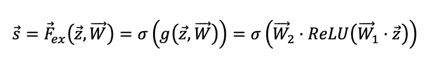**

**我们已经让我们的压缩特征地图兴奋了！**

****看看这些激励只不过是一对经过训练的神经网络，以便在训练过程中更好地校准这些激励。****

# **3.规模**

**最后一步，缩放，确实是重新缩放操作。我们将赋予压缩矢量其原始形状，保持在激发步骤中获得的信息。**

**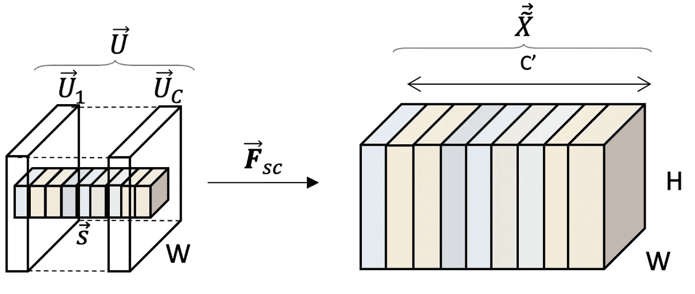**

**Figure 5\. Rescaling**

**在数学上，缩放是通过输入体积上的每个通道与激活的 1x1 压缩向量上的相应通道的简单标量积来实现的。**

**对于 1 个频道:**

****

***作者讨论:***

**激活充当适应于输入特定描述符 **z** 的通道权重。**

# **硒块的应用**

**如作为创新之一介绍的，SE 块不是新的神经网络架构。它试图通过使现有模型对渠道关系更加敏感来改进现有模型。**

**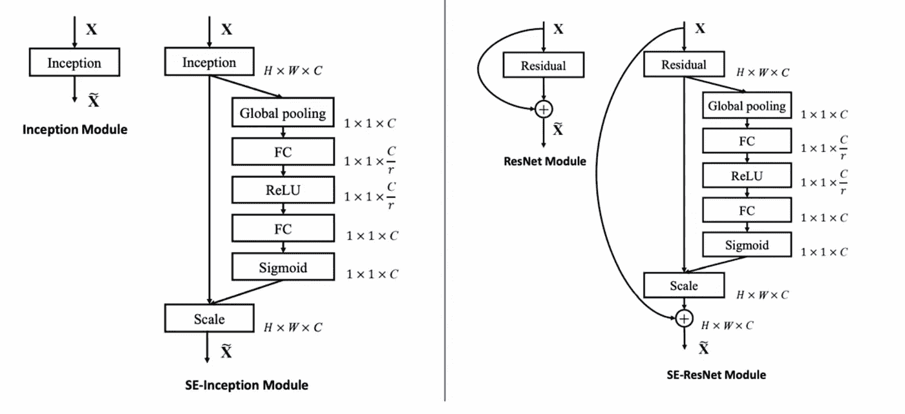**

**Figure 6\. SE block applied to Inception (left) and ResNets (right) modules**

**图 6 显示了如何在卷积层的输出音量之后应用相同的 SE 块，以在将其移动到下一层之前丰富其表示。在这种情况下，显示了 Inception 和 ResNets 模块。**

# **结果和结论**

**结果证实，在最先进的网络中引入 SE 块提高了它们在不同计算机视觉应用中的性能:图像网络分类、场景分类(Places365-Challenge 数据集)和对象检测(COCO 数据集)。这些结果太宽泛了，不包括在这个总结中，我建议在原始论文中查看它们。**

****折减系数**的经验研究值带来了一个有趣的观察结果。事实证明，16 是一个很好的值，超过这个值，性能不会随着模型容量的增加而单调地提高。**

**— — — — — — — — — — — — — — — — — — — — — — — — — — — — — — —**

***SE 块可能会过度拟合通道相关性***

**— — — — — — — — — — — — — — — — — — — — — — — — — — — — — — —**

**最后，作者在每个阶段(或层)对 50 个均匀采样的通道执行平均激活，其中为 5 个显著不同的类别引入了 SE 块。已经观察到，跨不同类别的分布在较低层中几乎**相同，而每个通道的值在更大深度**处变得更加**类别特定。****

# **全球图片**

**将所有东西放回一起，SE 块: )**

**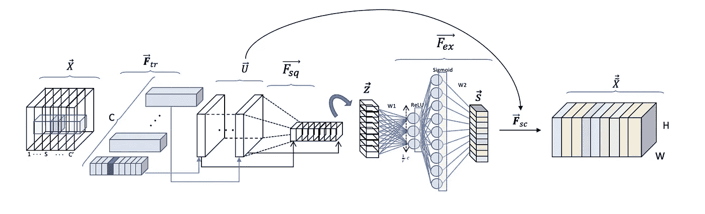**