# 使用 Valenbisi(瓦伦西亚自行车共享系统)了解 ARIMA 车型

> 原文：<https://towardsdatascience.com/understanding-arima-models-using-valenbisi-valencias-bike-share-system-dcbe13b3e8a?source=collection_archive---------8----------------------->

我杰出的同事 Nicole Eickhoff 和我一起去西班牙，我们希望在那里见到数据科学家。因为我们会在那里参加 Fallas，一个为期一个月的社区和传统庆祝活动，我们收集了 Valenbisi 在 [Crida Fallas](http://www.lasprovincias.es/fallas-valencia/programa-fallas/actos-dia-crida-fallas-2018-valencia-20180212193059-nt.html) 前一周的数据。Crida Fallas 是为期一个月的活动的第一天。我们想看看瀑布如何影响自行车共享活动。在这里，我详细介绍了我们在 2018 年 3 月 13 日星期二与巴伦西亚大数据会议上介绍和讨论的项目。


As part of the celebration of Fallas, each neighborhood in Valencia creates fantastic street light displays.

在这篇博客中，我简要描述了我使用刮刀收集数据、进行 ARIMA 分析、仔细考虑结果以及提出构建模型的后续步骤的过程，该模型可以预测瓦伦西亚每个 Valenbisi 站的自行车和码头可用性。关于这些的更深入的报道，请继续关注这个博客和我的 Github 上的 Jupyter 笔记本中提供的链接。

# 收集数据

Nicole 于 2018 年 2 月 16 日请求 Valenbisi 的 API 密钥访问。在发现 API 只提供两年前的数据后，她向我寻求建议。鉴于[网站](http://www.valencia.es/ayuntamiento/datosabiertos.nsf/resultadoCapas/95D6756F6861F9FDC1257C70003E4FBD?OpenDocument&lang=1&nivel=2&seccion=1&bdorigen=&idapoyo=22ADF97C1FD223B5C1257C55003BD01F)提供了一个实时下载的 CSV 文件，而且当时它的[使用条款](http://www.valencia.es/ayuntamiento/DatosAbiertos.nsf/vDocumentosTituloAux/Condiciones%20de%20uso?opendocument&lang=1&nivel=5&seccion=1)中也没有禁止抓取，我知道我们可以制作一个抓取器并尝试一下。除了 python [库‘requests’](http://docs.python-requests.org/en/master/)之外，我只用了很少的东西就能构建一个 scraper，并在去西班牙之前的 10 天里，在一个 [AWS web 实例](https://docs.aws.amazon.com/AWSEC2/latest/UserGuide/EC2_GetStarted.html)上托管它。


这里有一个链接指向我的 Github 托管的 Jupyter 笔记本，在那里我浏览了我在 AWS 上托管的 scraper 的主干。

我每 15 分钟收集实时数据 1001 次。csv 包括“自行车**可用**”、“加油站**空闲**”、“总计、 **X** 和 **Y** 的信息。

这是 10 天多一点的数据。这使得我们无法观察一年中的季节，而只能观察一周中的季节。由于我们的数据如此之少，这将是一个大规模的例子，可能会更直观地解释。我们将能够关注每周和每小时的趋势。

我们的数据不包括关于哪个活动是重新平衡工作的信息。

我们的数据不包括具体的乘坐数据，这使得这些数据不适合网络分析。

x 和 Y 是 UTF 坐标，可以使用 UTM 图书馆转换成经度和纬度坐标。西班牙的国家代码是“30”和“S”，如下例所示。

```
[Input]: **import** **utm** utm.to_latlon(725755.944, 4372972.613, 30, 'S')[Output]:
(39.47674728414135, -0.37534073558984327)
```

并且使用[散景](https://bokeh.pydata.org/en/latest/docs/user_guide/geo.html)，我能够绘制出每个 Valenbisi 站(蓝色)和为第一天安排的主要活动的每个位置(红色)，开始为期一个月的活动:Crida Fallas。2018 年 2 月 25 日。

#Plaza Ayuntamiento @39.4697661，-0.4113992
#圣胡安德尔医院教堂@39.4743981，-0.3814647
#托雷斯·德洛斯·塞拉诺斯@39.4791963，-0.378187

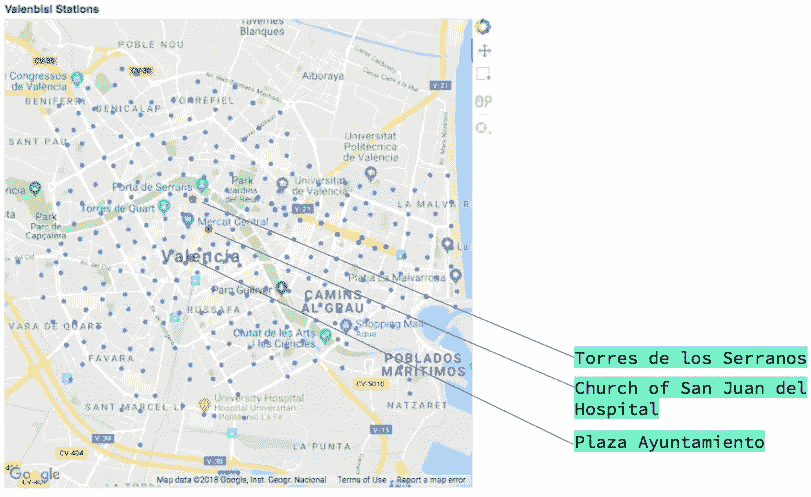

# 探索性数据分析

首先，我们预计 Crida Fallas 周围的整个系统会出现“尖峰”或一些不规则行为。以下所有车站所有可用自行车的图表显示，还有其他冲击发生，不一定与坠落有关。竖线表示 Crida Fallas，2018 年 2 月 25 日。

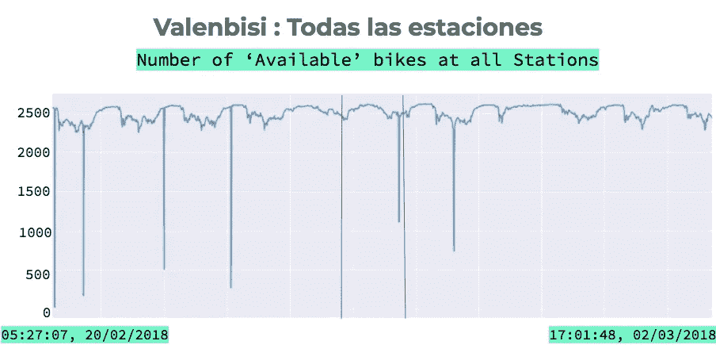

We presented to Valencia’s Big Data Meetup. Suggestions for such frequent and unrelated-to-commute-times plummets were system power outages. For this analysis, I retained all datapoints.

接下来，我绘制了三个单独的 Valenbisi 站。也许靠近 Crida Fallas 活动与车站受到的影响有关。首先，我们来看看位于 Crida 活动地点附近或地图上红点附近的车站是什么样的。

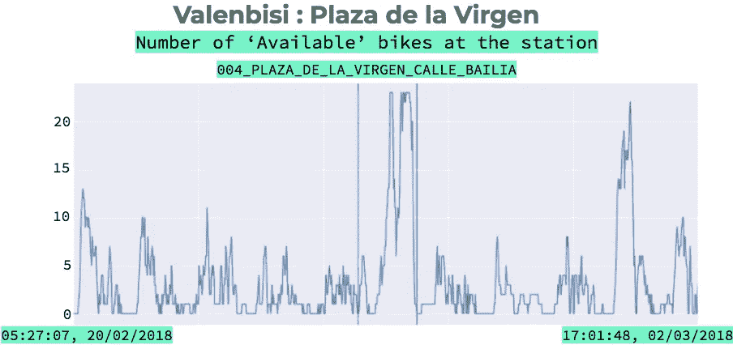

Wow, we see a big spike for Crida Fallas, and another later in the week! This station is, as we expected, very close to the city center, the Ayuntamiento. Over all, apparent return to normal behavior after Crida Fallas seems to happen pretty quickly.

对位于市中心附近的车站 Ayuntamiento 的视觉观察。

1.  Crida Fallas 期间可用自行车的大高峰
2.  本周晚些时候又一次飙升
3.  总的来说，在 Crida Fallas 之后，相对较快地恢复到“正常”行为

现在，以下车站更靠近巴伦西亚的城市边界。

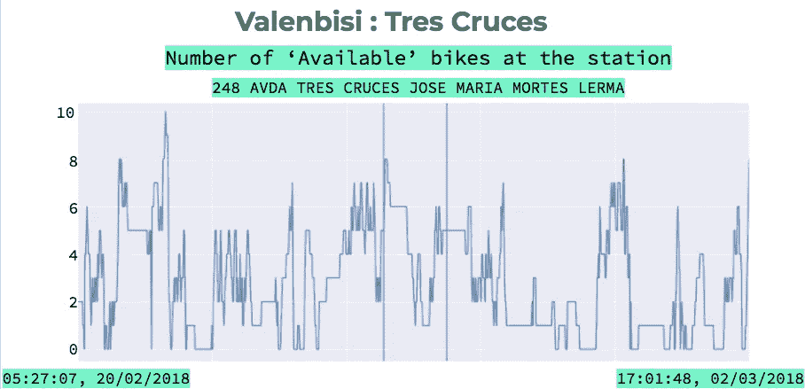

I see very little recognizable pattern here. Whatever occurred on February 25th looks as if it could have occured any day for this station.

对位于城市西南边界的车站的视觉观察:

1.  这里几乎没有可辨认的图案。
2.  无论这个站在 2 月 25 日表现出什么样的行为，看起来都像是发生在其他任何一天。

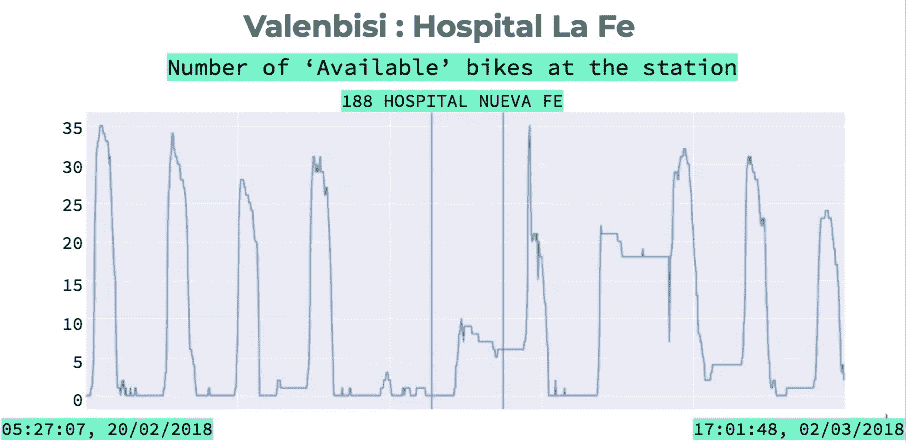

位于城市边缘附近的一个站的视觉观察。

1.  没有查一下这个车站附近有什么(也许是医院？)，很明显这里的自行车是用来通勤的。
2.  我们看到，Crida 不仅在当天影响该站，而且在行为恢复“正常”的前一天和后两天也影响该站。

我们看到，无论我们提出什么样的解决方案，都需要适用于具有多种不同行为的电视台。出于我们的目的，让我们对所有数据进行 ARIMA 分析。我选择首先查看所有数据来开始分析，因为它在 Crida Fallas 附近没有表现出不稳定的行为，并且将是 ARIMA 建模的一个很好的学习示例。 ARIMA 模型依赖于这样一种假设，即自行车站点最近所处的州会影响未来可用自行车/码头的数量。此外，ARIMA 模型可以捕捉我们的时间序列数据中的季节关系。

# ARIMA 分析

1.  将时间序列分解为趋势、季节性和残差
2.  平稳性检验(迪基-富勒检验)
3.  创建 ARIMA 模型
4.  结果解释

## 1.分解

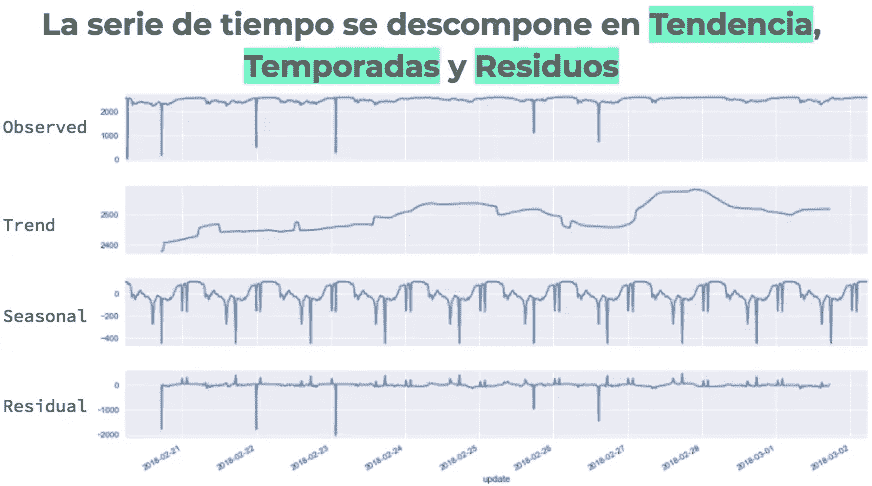

视觉观察:

1.  在 10 天的过程中，我们看到了一个略微向上的趋势。这种上升趋势仅涉及 100 辆自行车。
2.  在季节分解中，我们观察到重复。试图解释每个裂缝是徒劳的，但这个特征中的重复模式表明了一种日常行为模式。(我们有 10 天，可以数 10 次重复。)
3.  我们的残差图显示，正如预期的那样:6 次暴跌中只有 5 次出现了重大暴跌，这 6 次暴跌被巴伦西亚 Meetup 观众认为是“可能的断电”。

## 2.我们的数据是静态的吗？——扩展的迪基-富勒测试

首先，我[测试我们的数据是平稳的](https://machinelearningmastery.com/time-series-data-stationary-python/)。重要的是，你的时间序列在预测之前是平稳的，否则你的模型[将是一个糟糕的预测器](http://www.statisticshowto.com/stationarity/)，因为 ARIMA 依赖于平稳性的假设。

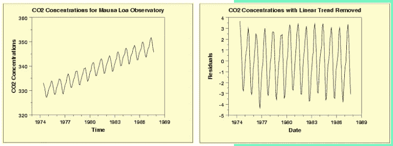

An example of non-stationary data, stationized. Provided by [https://www.itl.nist.gov/div898/handbook/pmc/section4/pmc442.htm](https://www.itl.nist.gov/div898/handbook/pmc/section4/pmc442.htm)

这可以是它自己的博客帖子，非常有趣。更定量的解释，我推荐[这个来源](http://dacatay.com/data-science/part-3-time-series-stationarity-python/)。

出于我们谈话的目的，重要的是要知道，在进行 Dickey-Fuller 检验时，我们是在进行假设检验:

**H0:数据是非平稳的**

**H1:数据是静止的**

我使用下面的代码对数据执行 Dickey-Fuller 测试。它是作为我的数据科学训练营的学习练习提供的:

输出:

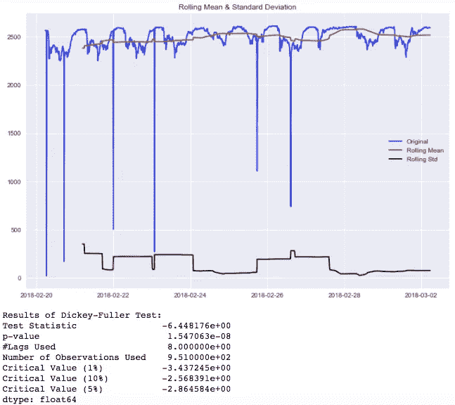

Our p-value is definitely below .05, meaning we can reject the null hypothesis; our data is stationary!

我们将[stats models . TSA . stat tools . ad fuller](http://www.statsmodels.org/dev/generated/statsmodels.tsa.stattools.adfuller.html)用于以下输入:

*   **maxlag** : None *(因为我们指定 autolag =‘AIC’，所以在我们的例子中不会用到它。)*
*   **回归**:‘c’:仅常量(默认)
*   **自动标记**:‘AIC’:如果‘AIC’(默认)或‘BIC’，那么选择标记的数量以最小化相应的信息标准。*这将选择具有最佳 AIC 分数的模型。*

[更多关于 AIC 和 BIC 的信息](https://methodology.psu.edu/AIC-vs-BIC):

> AIC 是一个常数加上数据的未知真实似然函数和模型的拟合似然函数之间的相对距离的估计值，因此 AIC 越小，模型越接近真实值。
> 
> BIC 是在特定的贝叶斯设置下，对模型为真的后验概率的函数的估计，因此较低的 BIC 意味着模型被认为更有可能是真实的模型。
> 
> ……尽管存在各种微妙的理论差异，但它们在实践中的唯一区别是处罚的大小；BIC 对模型复杂性的惩罚更重。他们应该不同意的唯一方式是当 AIC 选择一个比 BIC 更大的模型

我们的 Dickey-Fuller 检验的 p 值肯定低于 0.05，这意味着我们可以拒绝零假设。我们的数据是稳定的，因此可以插入 ARIMA 模型。

## 3.ARIMA 模型

现在开始在这个博客中，你会发现与我们瓦伦西亚大数据会议演示的原始对话有偏差。我希望这篇博客能推动关于方法论的进一步讨论，以及我在 ARIMA 模型和我的数据中遇到的一些不确定性。我对如何提高我的理解和我的模型的谈话和对话持开放态度。

**我发现 ARIMA 模型相当不确定，原因如下:**

*   在我们的 statsmodels SARIMAX 模型中使用的发现季节性指标的经验方法( [ACF/PACF 图](https://www.analyticsvidhya.com/blog/2016/02/time-series-forecasting-codes-python/))并没有产生一个有效的模型。(详见 github。)
*   (在我运行的多个模型中)预测最好的模型是一个几乎没有统计显著滞后变量的模型。

这是我看到的最适合预测的模型的代码。你可以在我的 Github 上找到(几乎)我所有的其他模型。

```
mod = sm.tsa.statespace.SARIMAX(df[0:960].available, 
                                trend='n', 
                                order=(1,0,1), 
                                seasonal_order=(4,0,7,24), 
                                enforce_stationarity =False, 
                                enforce_invertibility = False)results = mod.fit()
results.summary()
```

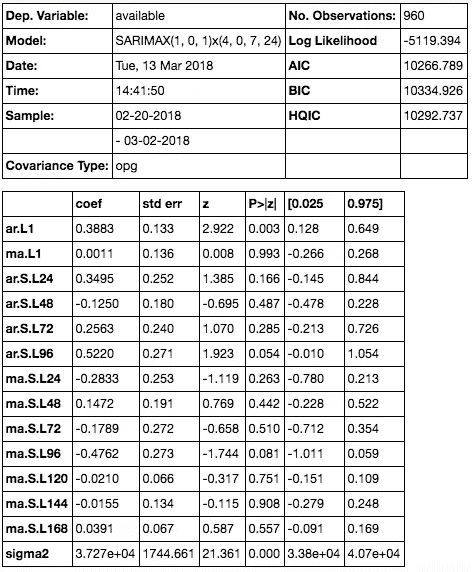

Wow, why does a model with nearly no significant lags produce the best predictions? Perhaps it’s not so bad. Discussion below.

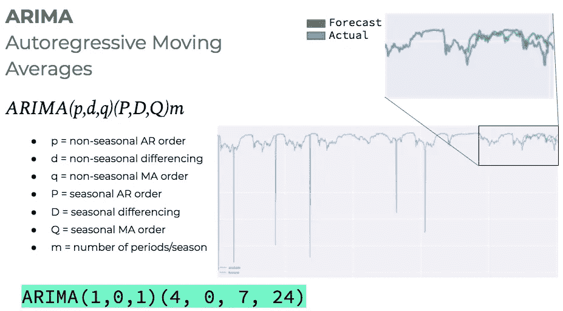

With no other independent variables besides its own behavior, our ARIMA model can predict pretty well, I’d say.

提醒一下:我们只有 10 天的数据，每小时 4 个点的数据。这使得我们无法测试年度季节性关系。出于我们的目的，我打算说一个赛季持续 6 个小时。这意味着每天有四个季节。这应该包括高峰时间、中午和晚上。最直观的是，这使得数据点/季节变量的数量 **m = 4*6 = 24。**

## 选择我的(pdq)(PDQ)m 价值观的动机:

非季节性的，对模型当前状态最有影响的滞后是在它之前的滞后期间发生的。p =1，q = 1，(以及 d = 0，因为我们的数据是平稳的)。

p，季节性 AR 订单。我怀疑日期之间有季节性，所以我想看看前一天发生了什么。(24 个数据点的 4 个滞后)

d，季节性差异为 0，因为我们的数据是稳定的。

q，季节移动平均订单。现在我承认，乍一看这似乎是最不直观的。我通过反复试验发现了它，但是如果我们考虑 7 个 24 点的滞后，意味着 42 小时之前，它似乎是可预测性最好的；不到两整天。如果你把一周看成 168 个小时，这些数字会清晰地分开:168/42 = 4。这表明一周有 4 个不同的行为时间。我们希望我们的模型相应地使用 1/4 周作为它的移动平均窗口。

请随意[参考我的 github](https://github.com/nmolivo/valencia-data-projects/blob/master/valenbisi/vb_analysis/02_arima.ipynb) 查看(几乎)我尝试过的所有机型，并在评论中留下任何对机型参数改进的建议。

## 4.结果解释:

首先，我要承认，虽然存在极少数具有统计显著性的滞后，但移除一个因其 p>|z|值而被认为在统计上无关紧要的变量会对模型的预测能力产生不利影响。 **ARIMA(1，0，0)(4，0，7，24)，绿色=预测，蓝色=实际。**

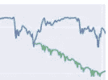

An example of what happens when you remove the ma.L1 with p>|z| value .993\. ARIMA(1,0,0)(4,0,7,24).

ARIMA(1，0，1)(4，0，7，24)模型确实有整体最低的 [AIC](https://en.wikipedia.org/wiki/Akaike_information_criterion) 和 [BIC](https://en.wikipedia.org/wiki/Bayesian_information_criterion) 分数*。这些指标不是对模型质量的评分，而是提供了与其他模型进行比较的手段；越低越好。

其次，我想深入了解 Statespace 模型结果提供的一些其他结果:

[**进行 Ljung-Box (Q)**](https://en.wikipedia.org/wiki/Ljung%E2%80%93Box_test) **测试**以确认残差是独立的。这意味着我们的误差彼此不相关，我们已经成功地用我们的模型解释了数据中的模式。

我们对 Ljung-Box 进行的假设检验如下:

**H0:** 数据是独立分布的(即样本总体的相关性为 0，因此数据中任何观察到的相关性都是由抽样过程的随机性造成的)。

**H1:** 数据不是独立分布的；它们表现出序列相关性。

Ljung-Box(Q)给出的测试统计量遵循 X 分布，具有( *h-p-q)* 个自由度，其中 *h* 为测试滞后的数量。

如果 p 值(Prob(Q)) [大于 0.05，那么](https://www.itl.nist.gov/div898/handbook/pmc/section6/pmc624.htm)我们不能拒绝零假设；残差是独立的，这表明模型为数据提供了足够的拟合。我们看到我们的问题(Q)是. 62。太好了。因此，尽管没有很多统计上显著的滞后变量，我们的模型已经设法解释了足够多的方差，即残差是随机的。

**异方差:**线性回归的一个假设是残差不存在异方差。这意味着残差的方差不应随着响应变量的拟合值而增加；我们更喜欢我们的残差是同伦的。

**H0:** 残差的方差是常数；没有异性。

H1: 异方差存在。

这里我们不能在 95%的置信水平上拒绝零假设，因为我们的 p 值是 0.07。我们可以假设残差中的同质性。好吧，还不错。我们的模型设法通过的另一个测试。

Jarque-Bera 和峰度度量是关于正态性的。我们的数据不是正态分布的，所以现在我将跳过这些度量。

# 可能的后续步骤

1.  扩大规模，这意味着收集更长时间的数据，并将模型应用于各个站点。考虑一个递归神经网络来模拟时间序列排序。
2.  考虑一个泊松点过程模型来预测可用自行车和码头开放，使用[建立时间优先级。shift()](https://medium.com/@NatalieOlivo/use-pandas-to-lag-your-timeseries-data-in-order-to-examine-causal-relationships-f8186451b3a9) 像这样的 [DSSG 项目做了](https://github.com/dssg/bikeshare)。
3.  请求关于再平衡工作的数据。
4.  考虑主要城市活动的特征工程附加变量以及与特定活动的距离。
5.  考虑对受影响的自行车站进行冲击建模。

## #数据假期

这是我和妮可为我们的西班牙之行准备的两个演示文稿之一。它被分享给了[巴伦西亚数据科学会议](https://www.meetup.com/Valencia-Data-Science/)。

我们的另一项工作是在巴伦西亚大学商学院的本科生市场营销课上进行的 CRM 数据研讨会。请关注妮可即将发表的关于此事的博客。

## 数据源:

[http://www . Valencia . es/ayuntamiento/datosabiertos . NSF/resultadoCapas/95d 6756 f 6861 f 9 FDC 1257 c 70003 e 4 FBD？open document&lang = 1&nivel = 2&seccion = 1&BD Origen =&idapoyo = 22 ADF 97 C1 FD 223 b5 c 1257 c 55003 BD 01 f](http://www.valencia.es/ayuntamiento/datosabiertos.nsf/resultadoCapas/95D6756F6861F9FDC1257C70003E4FBD?OpenDocument&lang=1&nivel=2&seccion=1&bdorigen=&idapoyo=22ADF97C1FD223B5C1257C55003BD01F)

## Github 资源库:

[](https://github.com/nmolivo/valencia-data-projects/tree/master/valenbisi) [## nmolivo/巴伦西亚-数据-项目

### 巴伦西亚-数据-项目-数据炸弹

github.com](https://github.com/nmolivo/valencia-data-projects/tree/master/valenbisi) 

附加资源:
[https://www . data camp . com/courses/introduction-to-time-series-analysis-in-python](https://www.datacamp.com/courses/introduction-to-time-series-analysis-in-python)