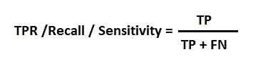
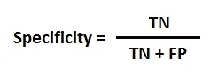
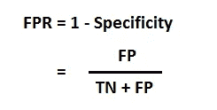
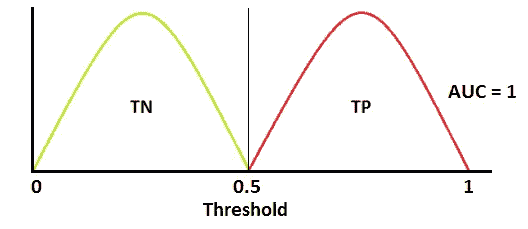
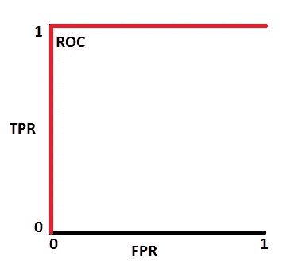
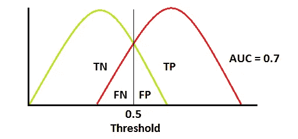
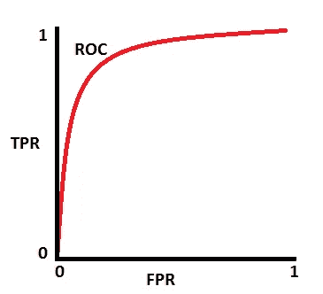
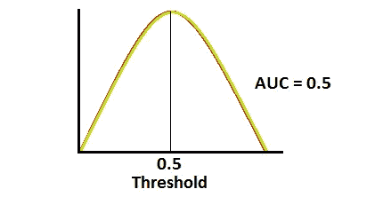
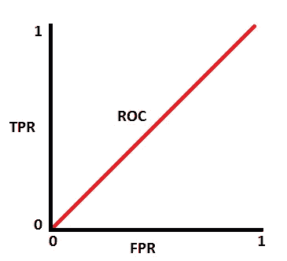
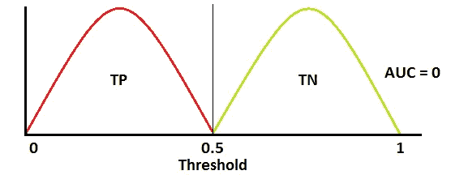

# 理解 AUC - ROC 曲线

> 原文：<https://towardsdatascience.com/understanding-auc-roc-curve-68b2303cc9c5?source=collection_archive---------0----------------------->

Understanding AUC - ROC Curve [Image 1] (Image courtesy: My Photoshopped Collection)

在机器学习中，性能测量是一项基本任务。所以当涉及到分类问题时，我们可以依靠 AUC - ROC 曲线。当我们需要检查或可视化多类分类问题的性能时，我们使用 AUC ( **曲线下的面积** ) ROC ( **接收器操作特性**)曲线。它是检验任何分类模型性能的最重要的评价指标之一。也可以写成 AUROC(**接收器工作特性**下的**区域)**

注:为了更好的理解，我建议你看一下我写的关于[混淆矩阵](https://medium.com/@narkhedesarang/understanding-confusion-matrix-a9ad42dcfd62)的文章。

本博客旨在回答以下问题:

1.什么是 AUC - ROC 曲线？

2.定义 AUC 和 ROC 曲线中使用的术语。

3.如何推测模型的性能？

4.敏感性、特异性、FPR 和阈值之间的关系。

5.多类模型如何使用 AUC - ROC 曲线？

# 什么是 AUC - ROC 曲线？

AUC - ROC 曲线是在各种阈值设置下对分类问题的性能测量。ROC 是概率曲线，AUC 代表可分性的程度或度量。它告诉我们这个模型在多大程度上能够区分不同的类。AUC 越高，模型预测 0 类为 0 和 1 类为 1 的能力越强。以此类推，AUC 越高，模型在区分患病和未患病患者方面就越好。

用 TPR 对 FPR 绘制 ROC 曲线，其中 TPR 在 y 轴上，FPR 在 x 轴上。

AUC - ROC Curve [Image 2] (Image courtesy: My Photoshopped Collection)

# **定义 AUC 和 ROC 曲线中使用的术语。**

## **TPR(真阳性率)/召回/灵敏度**

Image 3

## **特异性**

Image 4

## 定期用量法(Fixed Period Requirements)

Image 5

# **如何推测车型的性能？**

一个优秀的模型具有接近 1 的 AUC，这意味着它具有良好的可分性度量。差模型的 AUC 接近 0，这意味着它具有最差的可分性度量。事实上，这意味着它在往复结果。它预测 0 是 1，1 是 0。当 AUC 为 0.5 时，这意味着该模型没有任何类别分离能力。

我们来解读一下上面的说法。

我们知道，ROC 是一条概率曲线。让我们画出这些概率的分布:

注:红色分布曲线为阳性类别(患病患者)，绿色分布曲线为阴性类别(未患病患者)。

[Image 6 and 7] (Image courtesy: My Photoshopped Collection)

这是一种理想的情况。当两条曲线完全不重叠时，意味着模型具有理想的可分性度量。它完全能够区分积极类和消极类。

[Image 8 and 9] (Image courtesy: My Photoshopped Collection)

当两个分布重叠时，我们引入类型 1 和类型 2 误差。根据阈值，我们可以最小化或最大化它们。当 AUC 为 0.7 时，这意味着模型有 70%的机会能够区分正类和负类。

[Image 10 and 11] (Image courtesy: My Photoshopped Collection)

这是最坏的情况。当 AUC 约为 0.5 时，该模型没有区分阳性类别和阴性类别的区分能力。

[Image 12 and 13] (Image courtesy: My Photoshopped Collection)

当 AUC 大约为 0 时，模型实际上是在往复类。这意味着模型将一个负类预测为正类，反之亦然。

# 灵敏度、特异性、FPR 和阈值之间的关系。

灵敏度和特异性是成反比的。所以当我们提高敏感度时，特异性就会降低，反之亦然。

> Specificity⬇️的 Sensitivity⬆️和 Specificity⬆️的 Sensitivity⬇️

当我们降低阈值时，我们得到更多的正值，从而增加了灵敏度，降低了特异性。

类似地，当我们增加阈值时，我们得到更多的负值，因此我们得到更高的特异性和更低的敏感性。

正如我们所知，FPR 是 1 -特异性。因此，当我们提高 TPR 时，FPR 也会提高，反之亦然。

> FPR⬆️的 TPR⬆️和 FPR⬇️的 TPR⬇️

# **多类模型如何使用 AUC ROC 曲线？**

在一个多类模型中，我们可以使用一个对所有方法为 N 个类绘制 N 个 AUC ROC 曲线。例如，如果您有三个名为 **X，Y，**和 **Z** 的**类，您将有一个针对 X 和 Z 分类的 ROC，另一个针对 Y 和 Z 分类的 ROC，以及针对 Y 和 X 分类的第三个 ROC**

感谢阅读。

我希望我已经让你对什么是 AUC - ROC 曲线有了一些了解。如果你喜欢这篇文章，给这篇文章一些掌声会对你有所帮助👏。我随时欢迎你的问题和建议。你可以在脸书、推特、Linkedin 上分享这个，这样有需要的人可能会偶然发现这个。

您可以通过以下方式联系到我:

领英:[https://www.linkedin.com/in/narkhedesarang/](https://www.linkedin.com/in/narkhedesarang/)

推特:[https://twitter.com/narkhede_sarang](https://twitter.com/narkhede_sarang)

github:[https://github.com/TheSarang](https://github.com/TheSarang)