# 用 Python 理解基本的机器学习——感知器和人工神经元

> 原文：<https://towardsdatascience.com/understanding-basic-machine-learning-with-python-perceptrons-and-artificial-neurons-dfae8fe61700?source=collection_archive---------4----------------------->

## 基本功能的完整代码演练

如果你正在学习机器学习，很可能你的目标是应用前沿算法和“深度学习”来创建强大的应用程序。随着直观的 API 的广泛使用，这是可以实现的，只需要对正在发生的事情或深层底层实际上是如何工作的理解很少。

然而，在做这件事之前，浅显的架构基础知识和对底层的洞察是有益的。如果没有这一点，构建偏离盲目跟随教程的模型将变得困难(猴子见猴子做综合症)。

在这篇文章中，我们将讨论人工神经元和分类的起点，包括感知器和 Adaline 模型。对于每个模型，我们将讨论主要组件，然后将它们组合成完整的 Python 类实现。

**Image 1.** Neuron Cell, taken from Pixabay.

# 感知器模型

机器学习最根本的起点是**人工神经元**。第一个简化的脑细胞模型发表于 1943 年，被称为**麦卡洛克-皮茨(MCP)** 神经元。本质上，这是一个具有二进制输出(“0”或“1”)的基本逻辑门。如果到达神经元的输入的总和超过给定的阈值，则产生“1 ”,其中每个输入乘以相应的权重系数以产生这个总和。因此，神经元的放电很大程度上取决于输入集和相应的权重系数值。

弗兰克·罗森布拉特在 MCP 神经元的基本概念发表后不久就采用了这一概念，并提出了**感知器规则算法。**该允许自动学习神经元模型的最佳权重系数。通过这样的模型，我们可以预测给定的输入是属于一个类还是另一个类(二元分类)。

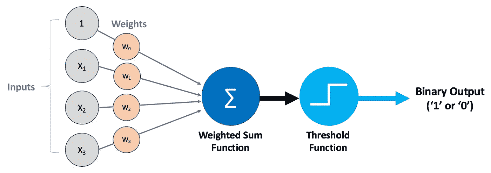

**Figure 1.** Simplified Perceptron Model. Diagram by Author.

感知器模型可能有任意数量的输入，也称为**特征**。因为我们通常有多个特征，所以用向量和矩阵来表示我们的输入和权重是有帮助的。不要混淆输入样本和输入特征；每个数据样本都有许多特征， *n，*，这些特征通过我们的模型输入，一次处理一个(按顺序)。例如，如果我们有 100 个汽车数据样本，其中每个样本都有 *m* 个特征(代表最高速度、bhp、成本等)。)，那么数据的每个样本 x 将具有一个 *m 个*特征的向量。每个输入特征都有一个相应的权重，经过训练后，权重将根据我们训练的数据进行优化。

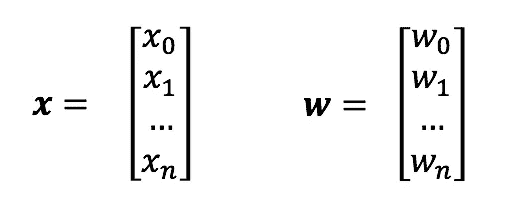

**Figure 2.** Vectors for our input features and weights.

对于每个数据样本，我们的输入特征和权重作为一个**加权和**在感知器中被接受，这就是通常所说的**网络输入函数， *z*** *。*对上面的 *x* 和 *w* 使用向量的好处是，我们可以使用线性代数来简洁地表示它，就像这样:

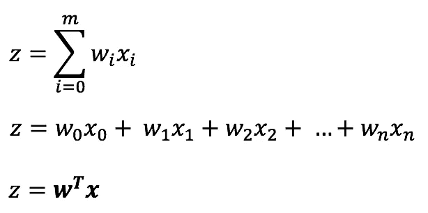

**Figure 3\.** Perceptron Net Input Function.

我们转置权重向量 **w** ，然后与我们的输入向量**x**相乘，这形成了我们需要的和。还应注意，我们还使用了一个**偏差项**来允许我们的感知器模型中有一个阈值，它等于我们向量中的第一个权重项。为了方便起见，输入矩阵中的第一个 x 项总是设置为 1。这意味着我们需要在输入向量中加入偏差项，然后再将它放入模型中。

如果你对这种数学符号完全陌生，我强烈推荐一些线性代数入门。几乎你在进一步的机器学习中所涉及的所有内容都将大量基于线性代数。

在净输入求和之后，我们的值被传递给感知器阈值，或**决策函数**。在这种情况下，该功能是一个**单位步进功能**。如果输入高于给定值，则输出“1”，否则输出“0”。

那么我们的感知机实际上是如何从一组数据中学习的呢？整个感知器过程如下:

*   将重量参数初始化为初始值(通常是小的随机值，而不是零)。
*   从每个训练样本输入的给定特征预测二进制输出。
*   通过**感知器学习规则更新权重。**

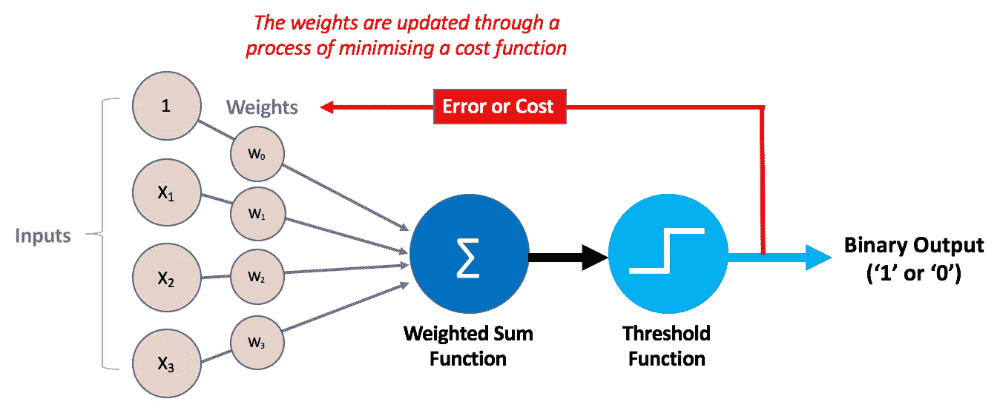

**Figure 4.** Model for the Perceptron, including weight optimisation using the error. Diagram by Author.

感知器的成本函数非常简单，被称为**感知器学习规则。**每次训练迭代后，我们的权重向量中的每个权重都会有一个小的变化，如下所示:

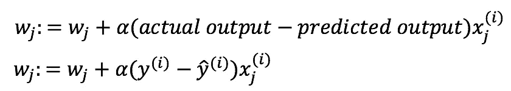

**Figure 5.** Perceptron Learning Rule for updating of weights.

:=符号意味着我们同时更新权重向量中的所有权重，而不是迭代地更新。因此，进行输出预测，然后更新所有权重参数，作为一个训练周期的一部分。上面的 alpha 项也等于**学习率**，它决定了我们的模型在每个训练周期中学习的速度。

假设我们用于训练的数据是线性可分的，如果经过足够的训练周期(时期)，感知器会将权重更新为最佳值。

# Python 中的感知器

我们将从用 Python 编写感知器的每个组件开始，然后在最后将它们组合成一个更大的感知器类。对于这个基本模型，我们唯一需要的 Python 包是 **numpy** 和 **matplotlib** 。

## 抽样资料

为此，我们将生成一个简单的数据集，其中包含两个不同的输出类，供我们的感知器进行训练。**注意**:该随机训练数据是通过随机函数生成的，并不完全可复制。

为了帮助理解我们正在努力做的事情，**可视化**我们的数据是有帮助的。在这种情况下，我们的输入样本只有两个特征，因此使用散点图来可视化我们的数据很容易。下面显示了数据生成，然后绘制成散点图。

**Figure 6.** Sample code for generating bird data and plotting on a scatter graph.

**Figure 7.** Visualisation of our generated data.

## 初始权重的生成

我们希望将我们的权重初始化为小的随机数字，而不是将它们初始化为零。我们需要这样做，否则我们的学习率将会降低训练过程中对分类结果的影响。这背后的理由将不被涵盖，然而，这是因为学习率只影响权重向量的规模，而不是方向，如果权重初始化为零。

这些权重可以以不同的方式生成。使用 numpy.random 的一个例子是:

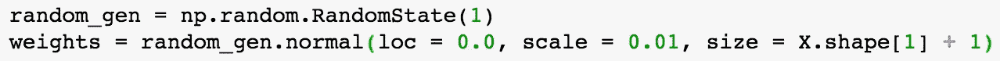

## **向 X 添加偏差项**

对于偏置项，我们只需在输入数据 x 中添加一列 1，在 numpy 中，这可以通过使用*one*和 *hstack* numpy 函数来实现。

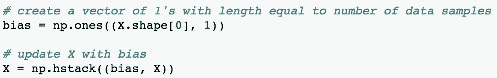

## **加权求和函数(净输入)**

如上所述，由于我们对每个样本的输入特征及其相关权重使用向量，因此我们可以非常容易地计算净输入和。在 Python 中使用带有 numpy 的矢量化，根据我们是否向训练数据添加了 1 的偏差列，网络输入函数变为:

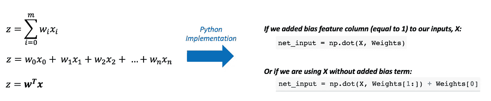

**Figure 8.** Implementing the net input sum in numpy.

## **预测用单位阶跃函数**

如果我们的净输入总和大于或等于零，我们希望返回 1，否则返回 0。

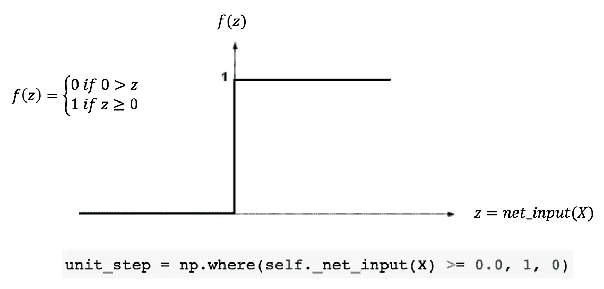

**Figure 9.** Implementing the step input function in numpy.

## **感知器学习规则**

使用之前在图 6 中定义的学习规则，我们可以执行一个完整的训练周期。这包括遍历所有训练样本，并根据感知器学习规则更新权重，如下所示:

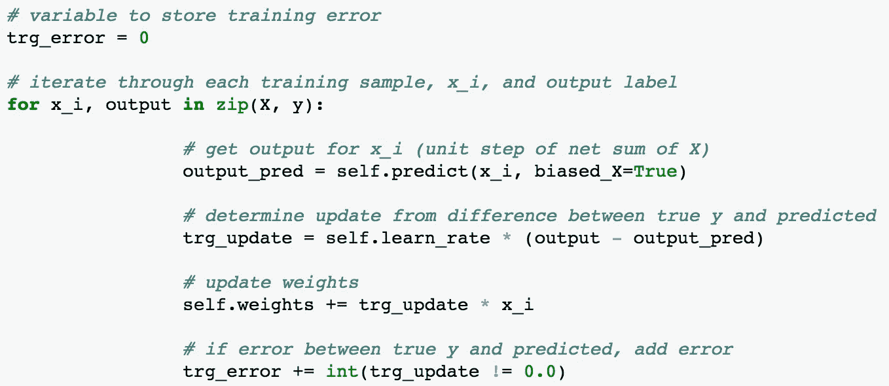

**Figure 10\.** Perceptron training cycle implementation.

## 把所有的放在一起

有了使用 numpy 形成的感知器的基本组件，我们可以将它们拼凑在一起，实现一个完整的感知器二进制分类器。使用分类器，我们可以在训练周期中可视化我们的错误，并且(希望如此！)随着权重的优化，错误数量会随着时间的推移而减少。

**Figure 11.** Code for a Perceptron class in Python for binary classification.

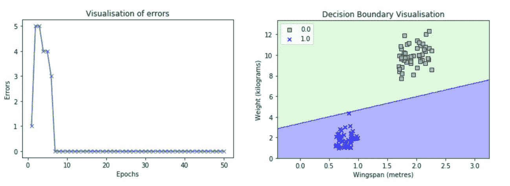

**Figure 12\.** Visualisation of the errors and decision boundaries made by our Perceptron classifier.

从误差与训练周期(时期)的关系图中可以看出，我们得到的误差数量随着时间的推移而减少。大约 7 个周期后，我们的模型将错误数量减少到零。我们的感知器分类器训练后做出的决策边界如右图所示，有效地区分了金雕和角枭。我们可以通过使用一组新输入 x 调用分类器预测函数，使用我们训练的模型对新数据进行预测。

感知器的一个问题是，如果所提供的数据是完全线性可分的，它们只会正确地优化权重。对于上面使用的数据，它是线性可分的。然而，如果我们使用更现实的数据，这些数据通常不能用直线分开，那么我们的感知器分类器将永远不会停止优化权重，并将不断出现错误。这是一个巨大的缺点，也是不使用感知机的原因之一。然而，它们确实是对基本神经元和更复杂模型的良好介绍。

# Adaline——自适应线性神经元

对原始感知器模型的改进是 Adaline，它增加了一个用于优化权重的线性激活函数。通过这种添加，使用连续成本函数而不是单位步长。Adaline 很重要，因为它为更高级的机器学习模型奠定了基础。

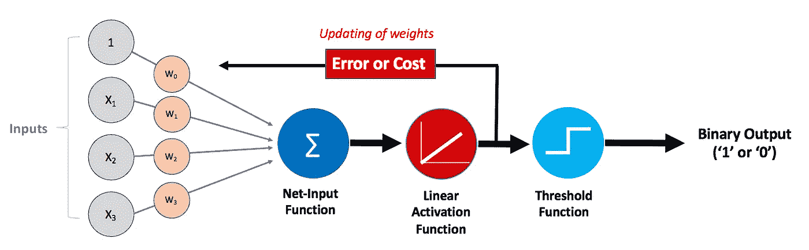

**Figure 13.** Model for Adaline, which includes the additional activation function. Diagram by Author.

正如您在上面看到的，单位步骤仍然存在，但是它仅用于模型末尾的输出分类(“1”或“0”)。线性激活模型的连续输出值用于**成本(或目标)函数**。这表明我们的算法在我们的训练数据上做得有多差(或多好)，并且可以通过众所周知的算法(如梯度下降)将其最小化。

## 价值函数

在这种情况下，我们将使用**误差平方和**作为我们的成本函数，可以这样实现:

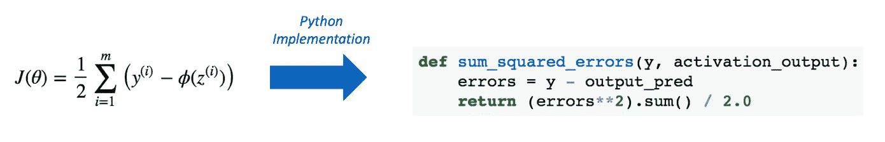

**Figure 14\.** Sum of Squared Errors implementation in Python.

## 梯度下降

为了应用**梯度下降**，我们需要确定成本函数相对于每个权重的偏导数。利用微分，我们发现这个偏导数等于:

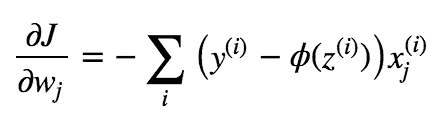

**Figure 15.** Partial derivative of our cost function with respect to each weight.

为了优化我们的权重，我们希望以我们的学习速率参数所选择的速率，在梯度的相反方向上迈出一步。这背后的逻辑是最小化成本并最终达到全局最小值。因此，对于每次重量优化，我们需要应用:

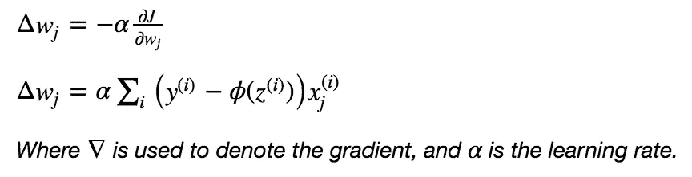

**Figure 16\.** Optimisation updates for our weights in the Adaline model.

我们可以将权重优化步骤和成本计算步骤合并到一个训练周期代码片段中，如下所示:

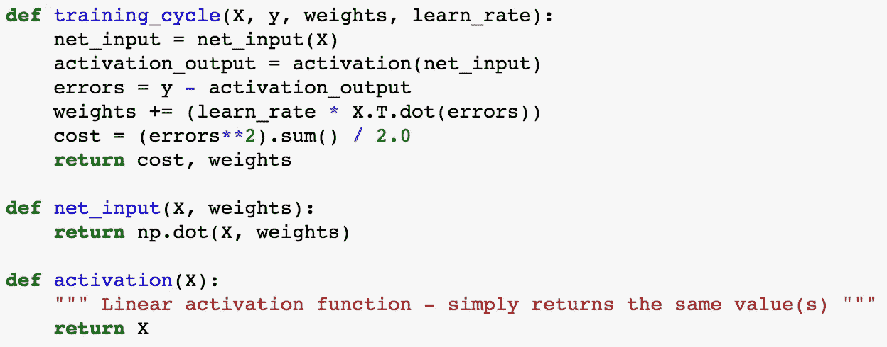

**Figure 17.** One training cycle for our Adaline model.

## 特征标准化

除了激活功能和梯度下降优化，我们还将通过 F **功能标准化**增强我们模型的性能。这是机器学习中的一种常见做法，对于给定数量的时期，这种做法使优化过程更快、更有效。为此，我们将从训练数据中的每个相关特征值中减去每个特征的平均值，然后将特征值除以它们各自的标准偏差。

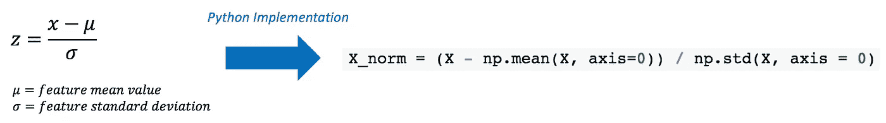

**Figure 18.** Feature standardisation in Python.

## 把所有的放在一起

有了 Adaline 模型的附加组件，我们就可以用 Python 生成一个最终的实现，就像我们用感知器一样。这个 Adaline 实现如下所示:

**Figure 19.** Adaline Classifier implemented in Python.

从下图中的基本 Adaline 示例中，我们可以看到为我们的模型设置超参数是多么重要；如果我们选择 0.1 的学习率，成本趋于无穷大并且不收敛，而如果我们选择 0.001 的学习率，我们的模型成功地收敛到成本函数的全局最小值。迭代的次数也很重要，应该足够高以充分降低成本。机器学习模型的这些可调方面被称为**超参数**，这些优化对于我们创建的任何模型都是一个重要方面。

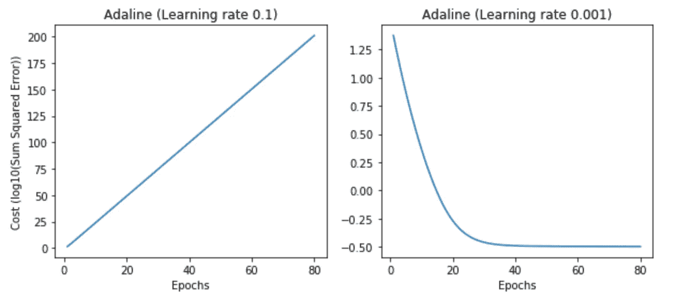

**Figure 20.** Comparison of different choices of learning rate for our Adaline classifier.

## 进一步改进和结束语

有很多方法可以进一步改进这个模型，包括随机梯度下降，它可以更频繁地优化，而不是像上述模型那样使用整批训练数据。我们还可以将它扩展到不仅仅是二元分类，使用一元对多元分类。

此外，还有比 Adaline 好得多的分类器可用。Adaline 是一个起点，可以用作理解更复杂的分类模型(如逻辑回归和神经网络)的基础。

在这篇文章中，我们研究了基本神经元的特性，然后使用 Python 和 numpy 构建了一个基本的 Rosenblatt 感知器模型。然后，我们构建了一个工作 Adaline 分类器，它通过激活函数和优化成本函数，在许多方面改进了感知器。在此期间，我们还应用了一些有价值的特征处理，包括标准化以使梯度下降更快更有效。

虽然这些模型不能替代通过 Sci-kit Learn 和其他软件包获得的专业构建和优化的模型，但它们应该能够让人们了解基本分类器的工作原理。我希望我们遵循的过程有助于您理解基本的机器学习分类，并为您提供使用 Python 实现这些模型的洞察力。