# 使用交互代码的 Numpy 和 Tensorflow 中的示例了解批处理规范化

> 原文：<https://towardsdatascience.com/understanding-batch-normalization-with-examples-in-numpy-and-tensorflow-with-interactive-code-7f59bb126642?source=collection_archive---------1----------------------->

Gif from [here](https://imgur.com/gallery/j6JLpVA)

所以今天我就来探讨一下批量规格化( [*批量规格化:通过减少内部协变 Shift*](https://arxiv.org/abs/1502.03167)*by*[*Sergey io FFE*](https://arxiv.org/find/cs/1/au:+Ioffe_S/0/1/0/all/0/1)*，以及*[*Christian Szegedy*](https://arxiv.org/find/cs/1/au:+Szegedy_C/0/1/0/all/0/1))。然而，为了加强我对数据预处理的理解，我将讨论 3 种情况，

**案例 1** — [归一化](http://www.dataminingblog.com/standardization-vs-normalization/):全数据(Numpy)
**案例 2** — [标准化](http://www.dataminingblog.com/standardization-vs-normalization/):全数据(Numpy)
**案例 3** — [批量归一化](https://arxiv.org/abs/1502.03167):小批量(Numpy / Tensorflow)

****注**** 本帖不涉及反向传播！

**实验设置**

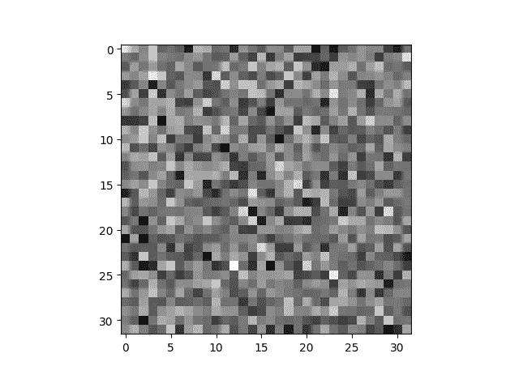

这个实验的设置非常简单。为了模拟真实世界的用例，让我们从随机正态分布创建一个 32*32 的图像，并添加一些噪声。以上是我们的形象看起来像。

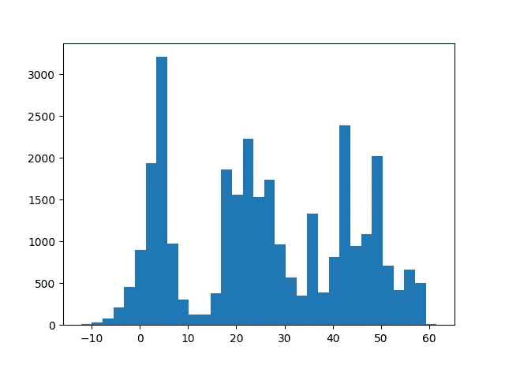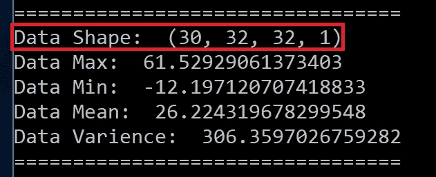

**红框** →(图像数量，图像宽度，图像高度，通道数量)现在我们将使用 32*32 灰度图像。
**左图** →我们图像数据的直方图

正如你在上面看到的，我们的图像平均值为 26，方差为 306。在左边，我们可以看到图像数据的直方图。

**情况 1:归一化—全部数据**

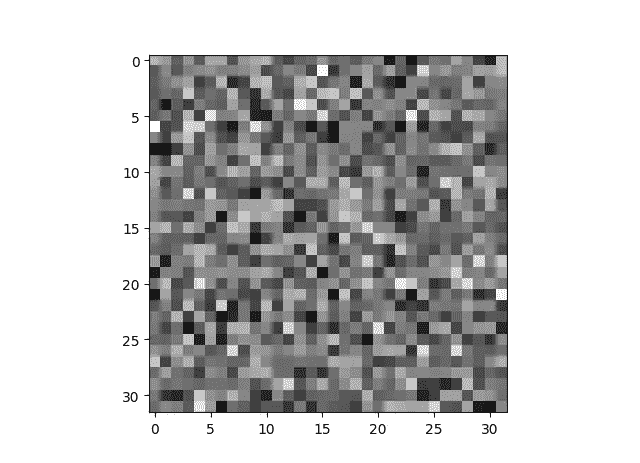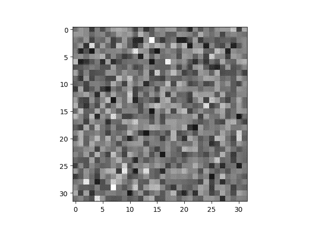

对于我们的第一个例子，让我们对整个数据集进行归一化。视觉上我们看不出有什么不同。

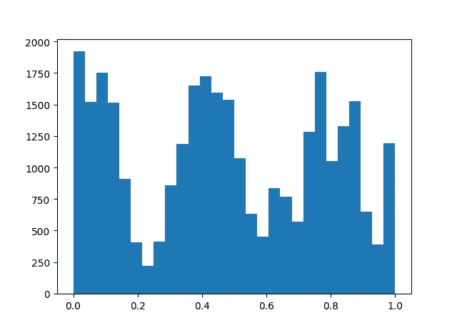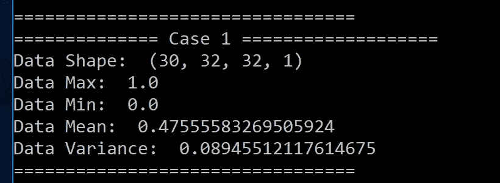

然而，一旦我们绘制直方图或查看平均值和标准差，我们可以清楚地看到我们的数据在 0 和 1 的范围内。

**案例 2:标准化—全部数据**

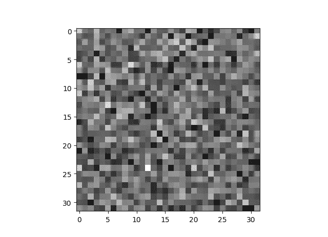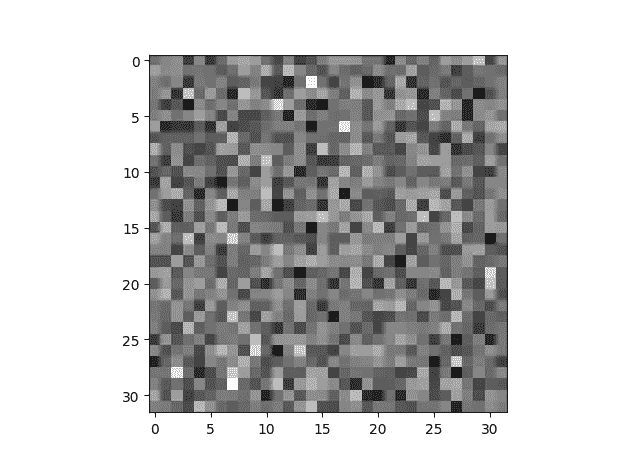

同样，视觉上我看不出彼此有什么太大的不同。

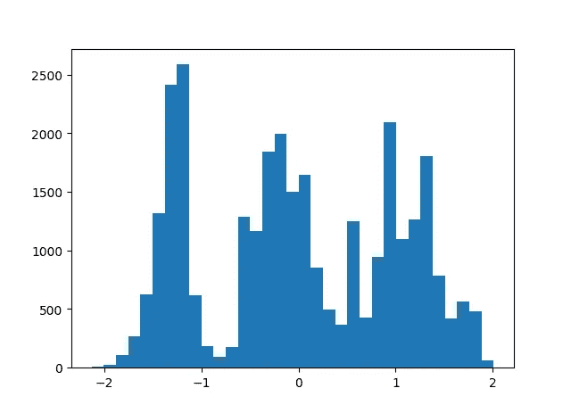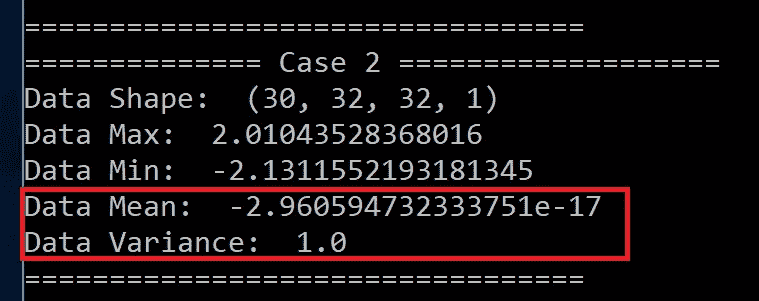

然而，当我们看到直方图的轴时，我们可以清楚地看到，我们的数据的平均值已经移动到 0(几乎)，方差为 1。

**标准化/规范化方程**

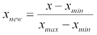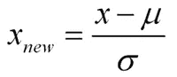

Image from this [website](http://www.dataminingblog.com/standardization-vs-normalization/)

**左→** 标准化方程
**右** →标准化方程

以防万一，如果有人想知道，让我们回顾一下标准化和规范化两种情况下的等式。请注意 **μ** 是平均值， **σ** 是标准差。

**批量归一化方程**

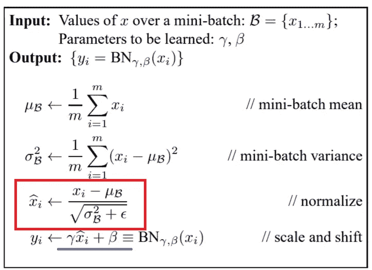

**红框→** 标准化方程
**蓝线→** 将要学习的参数

现在我们已经讨论了标准化和规范化，我们可以看到，批量标准化的等式与规范化的过程完全相同。唯一的区别是伽玛和贝塔项，用蓝色下划线标出。我们可以将这些项想象成权重，我们将从地面真实数据中计算误差，并使用反向传播来学习这些参数。

*但是有一点我希望注意！如果我们把 gamma(谢谢* [*洛阳方*](https://medium.com/@clementlfang?source=post_info_responses---------1----------------) *纠正我* ) *设为 1，beta 设为 0 整个过程只是标准化而已。对于 Tensorflow 的实现，我们将滥用该属性。*

**案例三:批量归一化——纯实现**

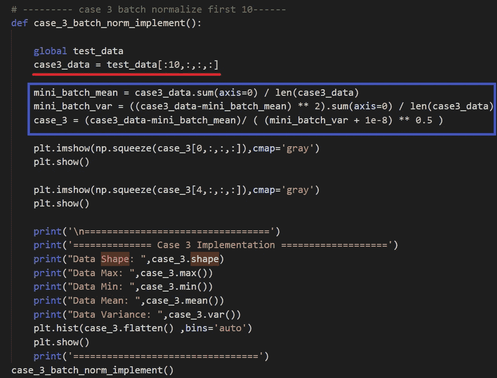

**红线** →小批量，从我们的图像数据
**中取出前 10 张图像，蓝框** →数据标准化

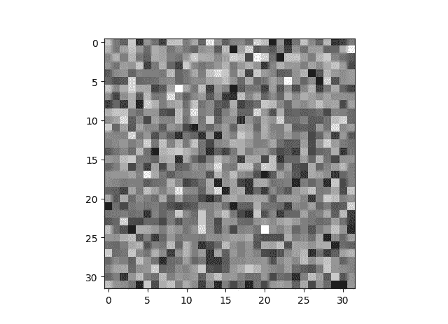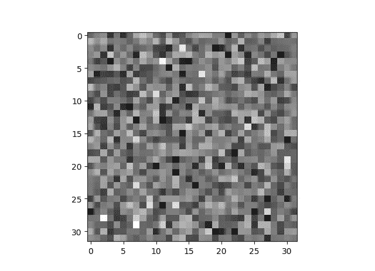

这里有一点需要注意，对于批量标准化，我们将从测试数据中提取前 10 幅图像，并应用批量标准化。

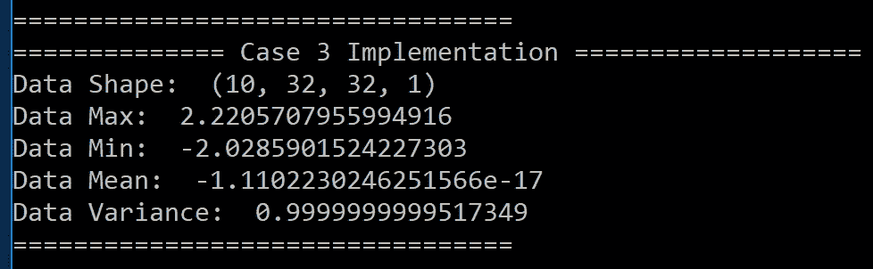

同样，我们可以看到均值在 0 左右，方差为 1。现在让我们看看 tensorflow 的实现。

**案例三:批量归一化—张量流**

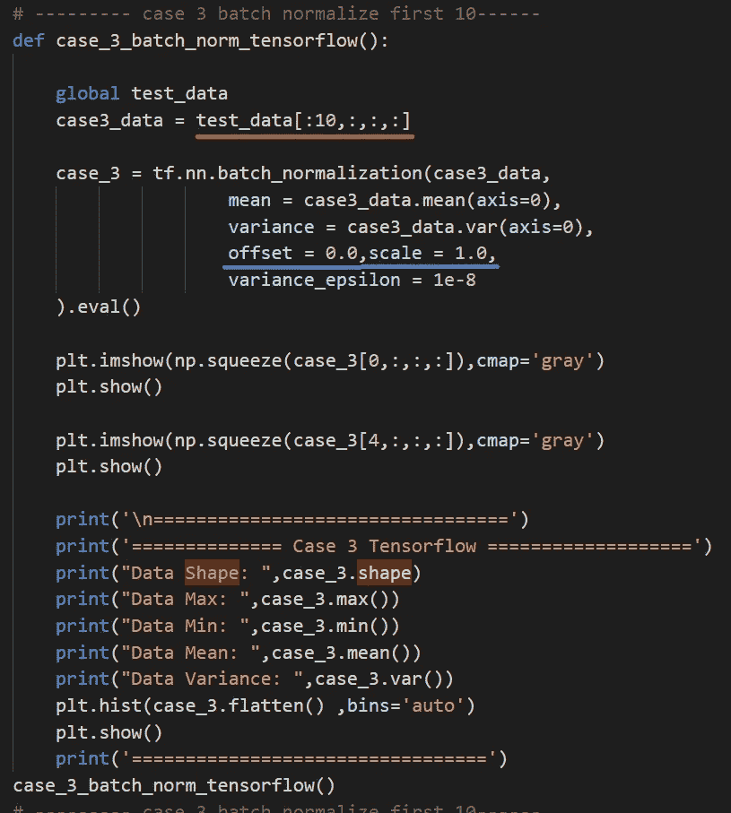

**红线** → Mini Batch，来自我们图像数据
**的前 10 张图像蓝线→** Offset (Beta)为 0，Scale (Gamma)为 1

还是那句话，视觉上，我们看不出任何区别。

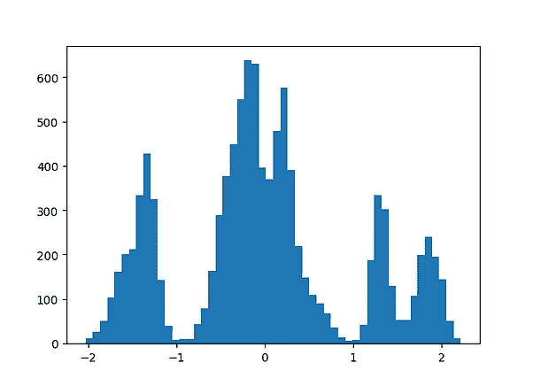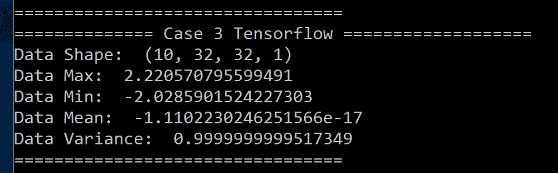

但是，如果我们看一下数据的平均值和方差，我们可以看到这与应用标准化完全相同。

**交互代码(谷歌 Collab/ Replit/微软 Azure 笔记本)**

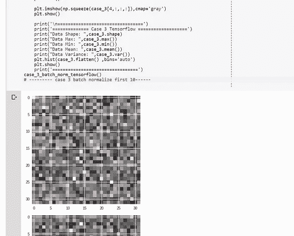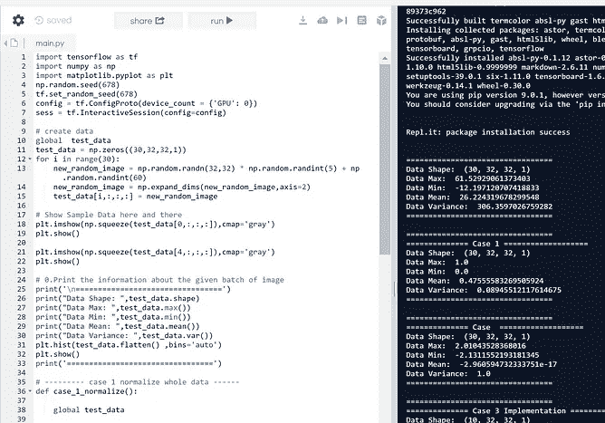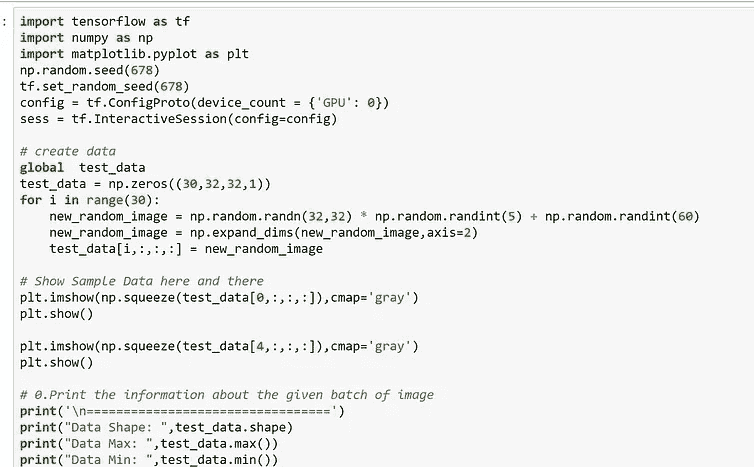

对于谷歌 Colab，你需要一个谷歌帐户来查看代码，而且你不能在谷歌 Colab 中运行只读脚本，所以在你的操场上做一个副本。最后，我永远不会请求允许访问你在 Google Drive 上的文件，仅供参考。编码快乐！

要访问 Google Colab 上的代码，[请点击此处](https://colab.research.google.com/drive/19ECWYHC72rSBuF9fQCGCuu6OAgZ1HBWu)。
要访问 Repl it 上的代码，[请点击这里](https://repl.it/@Jae_DukDuk/33-Batch-Norm)。
要访问 Microsoft Azure 笔记本上的代码，[请单击此处](https://selfcar-jaedukseo.notebooks.azure.com/nb/notebooks/33%20Batch%20Norm.ipynb)。

**遗言**

最近 Face book AI 研究组发布了群组规范化。( [*分组规格化*](https://arxiv.org/pdf/1803.08494.pdf)*n by*[*吴雨欣*](https://arxiv.org/find/cs/1/au:+Wu_Y/0/1/0/all/0/1) *，以及* [*明凯何*](https://arxiv.org/find/cs/1/au:+He_K/0/1/0/all/0/1) )我会尽量涵盖这一点。

如果发现任何错误，请发电子邮件到 jae.duk.seo@gmail.com 给我，如果你想看我所有写作的列表，请在这里查看我的网站。

同时，在我的 twitter [这里](https://twitter.com/JaeDukSeo)关注我，并访问[我的网站](https://jaedukseo.me/)，或我的 [Youtube 频道](https://www.youtube.com/c/JaeDukSeo)了解更多内容。如果你感兴趣，我还在这里做了解耦神经网络[的比较。](https://becominghuman.ai/only-numpy-implementing-and-comparing-combination-of-google-brains-decoupled-neural-interfaces-6712e758c1af)

**参考**

1.  CS231n 冬季:第五讲:神经网络第二部分。(2018).YouTube。检索于 2018 年 3 月 19 日，来自[https://www.youtube.com/watch?v=gYpoJMlgyXA&feature = youtu . be&list = plkt 2 usq 6 rbvctenobvg 1 tpcc 7 aoqi 31 ALC&t = 3078](https://www.youtube.com/watch?v=gYpoJMlgyXA&feature=youtu.be&list=PLkt2uSq6rBVctENoVBg1TpCC7OQi31AlC&t=3078)
2.  thorey，C. (2016 年)。流过批量归一化的渐变是什么样子的？。cthorey . github . io . 2018 年 3 月 19 日检索，来自[http://cthorey.github.io/backpropagation/](http://cthorey.github.io/backpropagation/)
3.  推导批量范数反投影方程。(2018).chrisyeh 96 . github . io . 2018 年 3 月 19 日检索，来自[https://chrisyeh 96 . github . io/2017/08/28/derivating-batch norm-back prop . html](https://chrisyeh96.github.io/2017/08/28/deriving-batchnorm-backprop.html)
4.  推导批次标准化的后向传递的梯度。(2018).kevinzakka . github . io . 2018 年 3 月 19 日检索，来自[https://kevinzakka . github . io/2016/09/14/batch _ normalization/](https://kevinzakka.github.io/2016/09/14/batch_normalization/)
5.  克拉泽特，F. (2018)。了解反向传递批处理规范化层。krat zert . github . io . 2018 年 3 月 19 日检索，来自[https://krat zert . github . io/2016/02/12/understanding-the gradient-flow-through-the-batch-normalization-layer . html](https://kratzert.github.io/2016/02/12/understanding-the-gradient-flow-through-the-batch-normalization-layer.html)
6.  (2018).Arxiv.org。检索于 2018 年 3 月 19 日，来自[https://arxiv.org/pdf/1502.03167.pdf](https://arxiv.org/pdf/1502.03167.pdf)
7.  NumPy . histogram—NumPy 1.13 版手册。(2018).Docs.scipy.org。检索于 2018 年 3 月 19 日，来自[https://docs . scipy . org/doc/numpy-1 . 13 . 0/reference/generated/numpy . histogram . html](https://docs.scipy.org/doc/numpy-1.13.0/reference/generated/numpy.histogram.html)
8.  NumPy . random . Weibull—NumPy v 1.13 手册。(2018).Docs.scipy.org。检索于 2018 年 3 月 19 日，来自[https://docs . scipy . org/doc/numpy-1 . 13 . 0/reference/generated/numpy . random . Weibull . html # numpy . random . Weibull](https://docs.scipy.org/doc/numpy-1.13.0/reference/generated/numpy.random.weibull.html#numpy.random.weibull)
9.  numpy.var — NumPy v1.14 手册。(2018).Docs.scipy.org。检索于 2018 年 3 月 26 日，来自[https://docs . scipy . org/doc/numpy/reference/generated/numpy . var . html](https://docs.scipy.org/doc/numpy/reference/generated/numpy.var.html)
10.  数据？，H. (2018)。如何用 Python 中的 Matplotlib 绘制一个带有数据列表的直方图？。Stackoverflow.com。检索于 2018 年 3 月 26 日，来自[https://stack overflow . com/questions/33203645/how-to-plot-a-histogram-using-matplotlib-in-python-with-a-list-of-data](https://stackoverflow.com/questions/33203645/how-to-plot-a-histogram-using-matplotlib-in-python-with-a-list-of-data)
11.  numpy.random.randn — NumPy v1.14 手册。(2018).Docs.scipy.org。检索于 2018 年 3 月 27 日，来自[https://docs . scipy . org/doc/numpy/reference/generated/numpy . random . randn . html](https://docs.scipy.org/doc/numpy/reference/generated/numpy.random.randn.html)
12.  吴，杨，何，王(2018)。群体规范化。Arxiv.org。检索于 2018 年 3 月 27 日，来自 https://arxiv.org/abs/1803.08494
13.  标准化与规范化|数据挖掘博客—【www.dataminingblog.com 。(2007).Dataminingblog.com。检索于 2018 年 3 月 27 日，来自[http://www . dataminingblog . com/standardization-vs-normalization/](http://www.dataminingblog.com/standardization-vs-normalization/)
14.  约夫和塞格迪(2015 年)。批量标准化:通过减少内部协变量转移加速深度网络训练。Arxiv.org。检索于 2018 年 3 月 27 日，来自[https://arxiv.org/abs/1502.03167](https://arxiv.org/abs/1502.03167)
15.  正态分布。(2018).Mathsisfun.com。检索于 2018 年 3 月 27 日，来自[https://www . mathsisfun . com/data/standard-normal-distribution . html](https://www.mathsisfun.com/data/standard-normal-distribution.html)