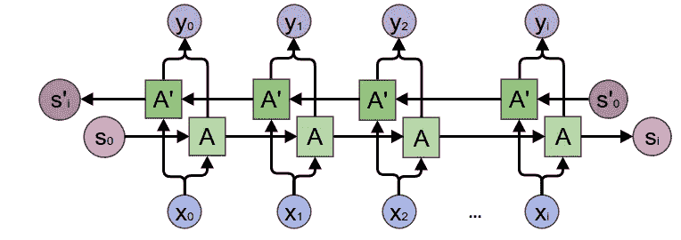
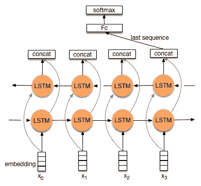

# 理解 PyTorch 中的双向 RNN

> 原文：<https://towardsdatascience.com/understanding-bidirectional-rnn-in-pytorch-5bd25a5dd66?source=collection_archive---------2----------------------->

## 快速回顾

Fig 1: General Structure of Bidirectional Recurrent Neural Networks. [Source: colah’s blog](http://colah.github.io/posts/2015-09-NN-Types-FP/)

双向递归神经网络(RNN)实际上只是将两个独立的递归神经网络放在一起。对于一个网络，输入序列以正常的时间顺序馈送，而对于另一个网络，输入序列以相反的时间顺序馈送。两个网络的输出通常在每个时间步被连接，尽管还有其他选择，例如求和。

这种结构允许网络在每个时间步都具有关于序列的前向和后向信息。这个概念似乎很简单。但是当实际实现一个利用双向结构的神经网络时，就出现了混淆…

## 困惑

第一个困惑是关于**将双向 RNN 的输出转发到密集神经网络**的方式。对于普通的 RNNs，我们可以只转发最后一个时间步的输出，下面的图片是我通过谷歌找到的，展示了双向 RNN 的类似技术。

Fig 2: A confusing formulation. [Image Source](http://doc.paddlepaddle.org/develop/doc/_images/bi_lstm.jpg)

但是等等…如果我们选择最后一个时间步的输出，反向 RNN 只会看到最后一个输入(图中的 x_3)。它几乎不会提供任何预测能力。

第二个困惑是关于**返回隐藏状态**。在 seq2seq 模型中，我们需要编码器的隐藏状态来初始化解码器的隐藏状态。直观地说，如果我们只能在一个时间步选择隐藏状态(如 PyTorch ),我们会选择 RNN 刚刚消耗完序列中最后一个输入的状态。但是**如果**返回时间步长 *n* (最后一个)的隐藏状态，和以前一样，我们将得到反转 RNN 的隐藏状态，只看到一步输入。

## 查看 Keras 实现

Keras 为双向 rnn 提供了一个包装器。如果您查看 wrappers.py 中的第 *292* 行:

 [## fchollet/keras

### 用于 Python 的深度学习库。在 TensorFlow、Theano 或 CNTK 上运行。

github.com](https://github.com/fchollet/keras/blob/4edd0379e14c7b502b3c81c95c7319b5df2af65c/keras/layers/wrappers.py#L292) 

你会发现，默认情况下，反向 RNN 的输出按时间步长向后排序( *n…1* )。当`return_sequences`为真(默认为假)时，Keras 将反转它。因此，如果我们采用一个时间步长输出，Keras 将在正常 RNN 的时间步长 *n* 采用一个，在反向 RNN 的时间步长 *1* 采用一个。这很好地证实了图 2 显示了有缺陷的结构。

## 在 PyTorch 中它是如何工作的

随着第一个困惑的解决。我们现在感兴趣的是如何在 PyTorch 中正确使用双向 rnn:

上面的笔记本回答了我们遇到的两个困惑(假设`batch_first`为假):

1.  我们要取`output[-1, :, :hidden_size]`(正常的 RNN)和`output[0, :, hidden_size:]`(反向的 RNN)，把它们串联起来，把结果反馈给后续的密集神经网络。
2.  返回的隐藏状态是消耗完整个序列后的状态。它们可以被安全地传递给解码器。

(边注)[`batch_first`为假时 PyTorch](http://pytorch.org/docs/master/nn.html#torch.nn.GRU) 中 GRU 的输出形状:

> **输出**(序列长度，批次，隐藏尺寸*数量方向)
> 
> **h_n** (层数*方向数，批次，隐藏大小)

LSTM 的方法类似，但是返回一个附加的单元格状态变量，形状与 **h_n.** 相同