# 理解二元交叉熵/对数损失:一个直观的解释

> 原文：<https://towardsdatascience.com/understanding-binary-cross-entropy-log-loss-a-visual-explanation-a3ac6025181a?source=collection_archive---------0----------------------->

Photo by [G. Crescoli](https://unsplash.com/@freegraphictoday?utm_source=medium&utm_medium=referral) on [Unsplash](https://unsplash.com?utm_source=medium&utm_medium=referral)

# 介绍

如果你正在训练一个**二进制分类器**，很可能你正在使用**二进制交叉熵** / **对数损失**作为你的损失函数。

有没有想过**用这个损失函数**到底是什么意思？问题是，考虑到今天的库和框架的易用性，很容易忽略所使用的损失函数的真正含义。

# 动机

我在寻找一篇博客文章，以一种视觉上清晰简洁的方式解释**二元交叉熵** / **日志损失**背后的概念，这样我就可以在[数据科学务虚会](https://www.datascienceretreat.com/)上向我的学生展示它。因为我找不到任何适合我的目的的，所以我自己承担了写它的任务:-)

# 一个简单的分类问题

让我们从 10 个随机点开始:

`x = [-2.2, -1.4, -0.8, 0.2, 0.4, 0.8, 1.2, 2.2, 2.9, 4.6]`

这是我们唯一的**特色** : ***x*** 。

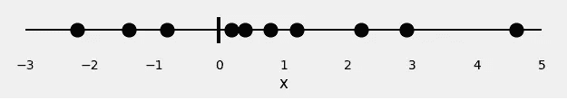

Figure 0: the feature

现在，让我们给我们的点分配一些**颜色**:**红色**和**绿色**。这些是我们的**标签**。

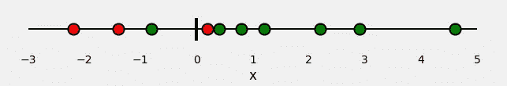

Figure 1: the data

所以，我们的分类问题非常简单:给定我们的**特征*x*，我们需要预测它的**标签** : **红色**或者**绿色**。**

既然这是一个**二元分类**，我们也可以把这个问题提出来:“点**是绿色的**”或者更好一点，“点**是绿色的**的概率是多少”？理想情况下，**绿点**的概率为 **1.0** (绿色)，而**红点**的概率为 **0.0** (绿色)。

在此设置中，**绿点**属于**正类** ( **是**，为绿色)，而**红点**属于**负类** ( **否**，为非绿色)。

如果我们**拟合一个模型**来执行这个分类，它将**预测我们每一个点都是绿色的概率**。给定我们所知道的点的颜色，我们如何**评估**预测的概率有多好(或多差)？这就是**损失函数**的全部目的！对于**不良预测**，它应该返回**高值**，对于**良好预测**，它应该返回**低值**。

对于像我们的例子一样的**二元分类**，典型的**损失函数**是**二元交叉熵** / **对数损失**。

# 损失函数:二元交叉熵/对数损失

如果你查找这个**损失函数**，你会发现:

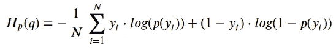

Binary Cross-Entropy / Log Loss

其中 **y** 为的**标号(对于** **绿色**点为 **1** **，对于** **红色**点为**0****)**p(y)**为所有 **N** 点为绿色**的预测**概率。**

阅读这个公式，它告诉你，对于每一个**绿色**点( *y=1* )，它将 *log(p(y))* 加到损失上，即它是绿色的的 **log 概率。反之，它为每个**红色**点( *y=0* )加上 *log(1-p(y))* ，即它为红色**的 **log 概率。当然，不一定很难，但也没有那么直观…**

况且**熵**跟这一切有什么关系？为什么我们首先采用**概率对数**？这些都是有效的问题，我希望在下面的“*展示数学*”部分回答它们。

但是，在进入更多公式之前，让我给你看一个上面公式的**可视化表示**…

# 计算损失——可视化方法

首先，让我们**将**分门别类，**正**或**负**，如下图:

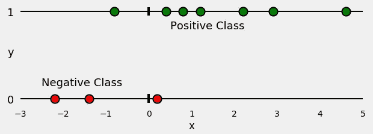

Figure 2: splitting the data!

现在，让我们训练一个**逻辑回归**来对我们的点进行分类。拟合回归是一条*s 形曲线*，代表对于任何给定的*x*点为绿色的**概率。看起来是这样的:**

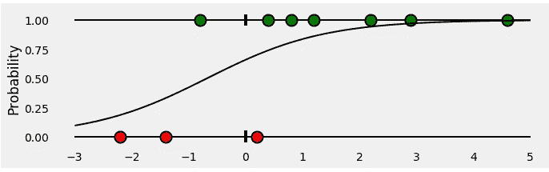

Figure 3: fitting a Logistic Regression

那么，对于所有属于**正类** ( **绿**)的点，我们的分类器给出的预测**概率**是多少？这些是下的**绿色条*****s 形曲线*，在 ***x*** 坐标处对应的点。**

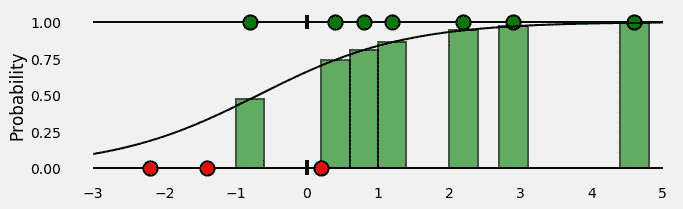

Figure 4: probabilities of classifying points in the POSITIVE class correctly

好的，到目前为止，一切顺利！**负类**中的点呢？记住， *下的**绿色条*****s 形曲线***代表给定点为**绿色**的概率。那么，给定点**红**的概率是多少？上方的**红色条*s 形曲线*，当然:-)***

*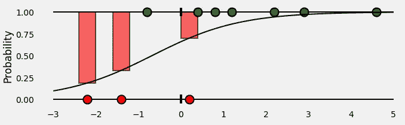*

*Figure 5: probabilities of classifying points in the NEGATIVE class correctly*

*将所有这些放在一起，我们最终会得到这样的结果:*

*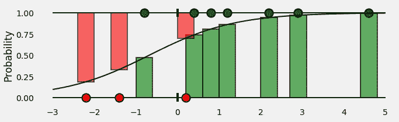*

*Figure 6: all probabilities put together!*

*条形代表与每个点的相应**真实类别**相关的**预测概率**！*

*好了，我们有了预测的概率…是时候**通过计算**二元交叉熵** / **日志损失**来评估**了！*

*这些**概率就是我们所需要的全部**，所以，让我们**去掉 *x* 轴**并使棒条彼此相邻:*

*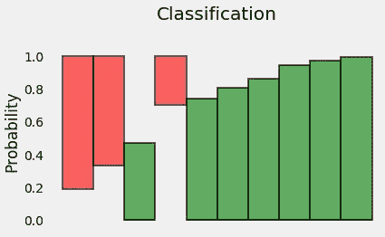*

*Figure 7: probabilities of all points*

*嗯，*挂杆*已经没有多大意义了，所以让我们**重新定位它们**:*

*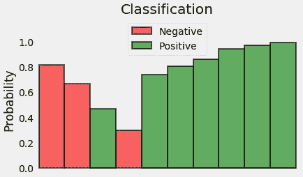*

*Figure 8: probabilities of all points — much better :-)*

*因为我们试图计算一个**损失**，我们需要惩罚坏的预测，对吗？如果**真类**关联的**概率**为 **1.0** ，我们需要它的**损失**为**零**。反之，如果那个**概率是** **低**，比如说 **0.01** ，我们需要它的**损失**是**巨大**！*

*事实证明，采用概率的**(负)对数非常适合我们的目的(*由于 0.0 和 1.0 之间的值的对数是负的，我们采用负对数来获得损失的正值*)。***

> *实际上，我们使用 **log** 的原因来自于**交叉熵**的定义，请查看下面的“**展示数学**”部分了解更多细节。*

*下面的图给了我们一个清晰的画面——随着**真实等级**的**预测概率**变得**更接近零**，损失**呈指数增长**:*

*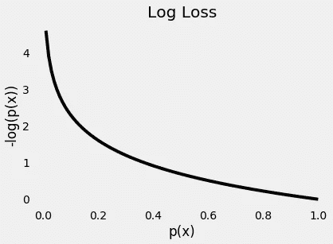*

*Figure 9: Log Loss for different probabilities*

*很公平！让我们**取概率**的(负)对数——这些是每个点对应的**损失**。*

*最后，我们计算所有这些损失的**平均值。***

*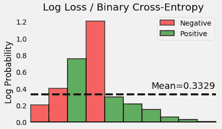*

*Figure 10: finally, the loss!*

*瞧！我们已经成功计算出这个玩具例子的**二元交叉熵** / **对数损失**。**是 0.3329！***

# *给我看看代码*

*如果您想**再次检查我们找到的值**，只需**运行下面的代码**并自己查看:-)*

# *给我看看数学(真的？！)*

*玩笑归玩笑，这篇文章**不是**旨在非常数学化…但是对于那些想要理解**熵**、**对数**在所有这些中的作用的读者，我们开始吧:-)*

> *如果你想更深入地了解**信息论**，包括所有这些概念——熵、交叉熵以及更多更多——请查看**克里斯·奥拉的** [**帖子**](http://colah.github.io/posts/2015-09-Visual-Information/) 查看，它非常详细！*

## ***分配***

*先说我们的积分分布。由于 **y** 代表我们点的**类**(我们有 **3 个红点**和 **7 个绿点**，这就是它的分布，姑且称之为 **q(y)** ，看起来像是:*

*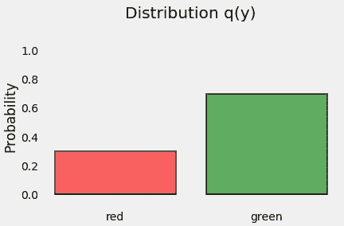*

*Figure 11: q(y), the distribution of our points*

## *熵*

***熵**是与给定分布 **q(y)** 相关的不确定性的**度量。***

*如果**我们所有的点**都是**绿色**会怎么样？**的**不确定性**会是什么样的**分布？**零**对吧？毕竟，一个点的颜色是毫无疑问的:它**总是**绿色！所以，**熵为零**！*

*另一方面，如果我们确切地知道**一半的点**是**绿色**而**的另一半是**、**红色**会怎么样？这是最糟糕的情况，对吗？我们在猜测一个点的颜色上绝对没有优势:这完全是随机的！在这种情况下，熵由下面的公式给出(*我们有两类(颜色)——红色或绿色——因此，* ***2*** ):*

*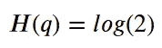*

*Entropy for a half-half distribution*

*对于在之间的**每隔一种情况，我们可以计算分布**的**熵，就像我们的 **q(y)** 一样，使用下面的公式，其中 *C* 是类的数量:***

*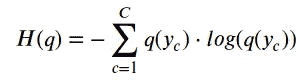*

*Entropy*

*所以，如果我们*知道*一个随机变量的**真实分布**，我们就可以计算出它的**熵**。但是，如果是这样的话，*为什么首先要费心训练一个分类器*？毕竟，我们**知道**真实的分布…*

*但是，如果我们**不**呢？我们能否尝试用一些**其他分布**来近似真实分布，比如说 **p(y)** ？我们当然可以！:-)*

## *交叉熵*

*让我们假设我们的**分** **跟随**这个**其他**分布 **p(y)** 。但是我们知道他们是从**真** ( *未知*)分布 **q(y)** 实际上来的对吧？*

*如果我们像这样计算**熵**，我们实际上是在计算两个分布之间的**交叉熵**:*

*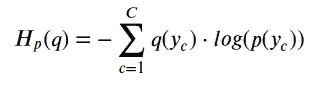*

*Cross-Entropy*

*如果我们奇迹般地将*与* **p(y)** *到* **q(y)** *完美匹配*，那么**交叉熵** *和* **熵** *的计算值也将与*匹配。*

*因为这很可能永远不会发生，**交叉熵的值将大于对真实分布计算的熵**。*

*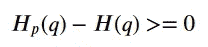*

*Cross-Entropy minus Entropy*

*原来，**交叉熵**和**熵**之间的差异有一个名字…*

## *库尔贝克-莱布勒散度*

***Kullback-Leibler 散度**，或简称为“ ***KL 散度*** ，是两个分布之间**相异度**的度量:*

*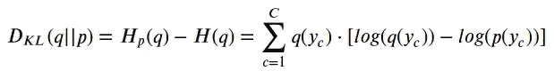*

*KL Divergence*

*这意味着，p(y)越接近 q(y) ，**越低**，**散度**，因此，**交叉熵**，将是。*

*所以，我们需要找一个好的 **p(y)** 来用……但是，这是我们**分类器**应该做的，不是吗？！**的确如此**！它寻找**最可能的** **p(y)** ，也就是**最小化交叉熵**的那个。*

## *损失函数*

*在其训练期间，**分类器**使用其训练集中的 **N 个点**中的每一个来计算**交叉熵**损失，有效地**拟合分布 p(y)** ！由于每个点的概率是 1/N，交叉熵由下式给出:*

*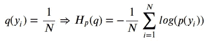*

*Cross-Entropy —point by point*

*还记得上面的图 6 到 10 吗？我们需要在与每个点的真实类别相关联的*概率之上计算**交叉熵**。这意味着使用**绿色条**用于**正级** ( *y=1* )中的点，使用**红色*悬挂*条**用于**负级** **级** ( *y=0* )中的点，或者从数学上来说:**

*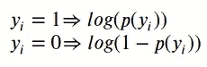*

*Mathematical expression corresponding to Figure 10 :-)*

*最后一步是计算两个类别中所有点的**平均值**，**正值**和**负值**:*

*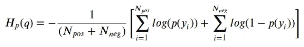*

*Binary Cross-Entropy — computed over positive and negative classes*

*最后，通过一点点操作，我们可以从正类或负类**中取任意一点，在相同的公式下:***

**

*Binary Cross-Entropy — the usual formula*

***瞧吧**！我们回到了**原始公式**用于**二元交叉熵/对数损失** :-)*

# *最后的想法*

*我真心希望这篇文章能够**在一个经常被认为是理所当然的概念上**闪耀一些新的光芒，这个概念就是**二元交叉熵**作为**损失函数**。此外，我也希望它能向你展示一点点**机器学习**和**信息论**是如何联系在一起的。*

> *2022 年 7 月 10 日更新:我刚刚在 YouTube 上发布了一个视频，里面有这篇文章的动画版本——来看看吧！*

*Understanding Binary Cross-Entropy / Log Loss in 5 Minutes!*

**如果你有什么想法、意见或问题，欢迎在下方留言评论或联系我* [*推特*](https://twitter.com/dvgodoy) *。**