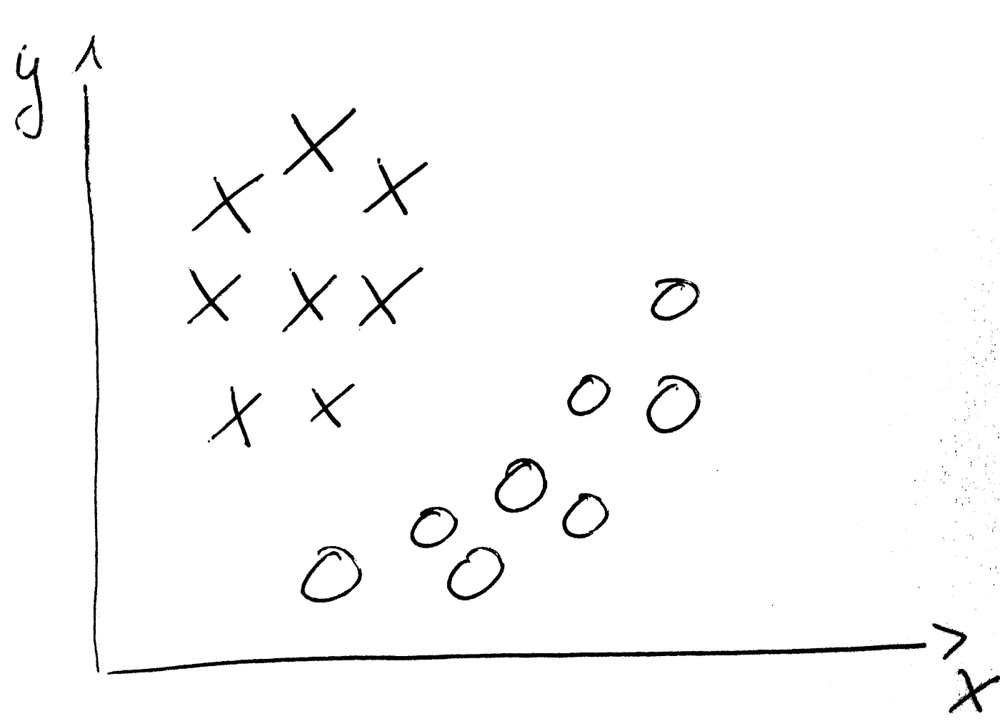
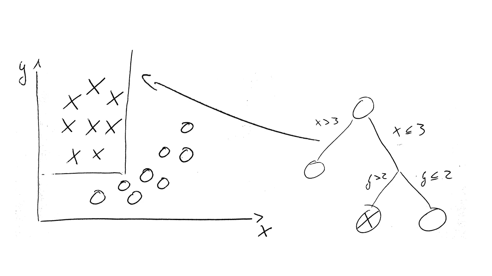

# 如何理解您的聚类结果

> 原文：<https://towardsdatascience.com/understanding-clustering-cf0117148ef4?source=collection_archive---------3----------------------->

我正与全球许多客户合作实施各种数据科学项目。有时，客户希望进行群集，而我试图避免这种情况。我遵循一个简单的经验法则:

> 如果你能被监督，那就去被监督。

原因很简单。每个分析都有超参数。这些都需要确定。在有监督的情况下，优化什么是相当直接的:商业价值。在无人监督的情况下，你常常很难找到正确的衡量标准。当然，有很多方法可以衡量你的聚类质量，比如戴维斯-波尔丁指数或者轮廓系数。但是它们与我的业务目标不一致，因此不好。

原来很多分割问题都可以转化为分类问题。这样做总是更可取的。只有在极少数情况下你不能。在这种情况下，您需要使结果易于理解，以符合您的业务目标。以下是我让聚类结果易于解释的技巧。

**技巧 1——把它变成一个特征选择问题**

通常在数据分析中，您需要能够将业务问题映射到方法。在您的案例中，问题是:*什么最能描述 cluster_0？*或者换句话说:【cluster _ 0 与其他所有产品的区别是什么？这其实可以解释为一个特征选择问题。您想知道哪些特征具有区分聚类的能力。我建议以一对一的方式来做这件事，因为这回答了直接的问题。

Data on two dimensions grouped. A feature selection technique would identify that both dimensions are important to distinguish the classes.

通常的特征选择技术，如包装器或过滤器方法，提供了一系列特征及其重要性。那已经相当不错了！

在众所周知的泰坦尼克号数据集上，我们可以得到“年龄、性别和乘客级别”作为最重要的属性。这使得我们可以将 cluster_0 重命名为:“年龄-性别-乘客级别”。这里的问题是，虽然你发现了重要的因素，但你没有指明方向。这是一群老人吗？或者说是年轻女性？我们可以通过查看质心坐标来更深入地挖掘，并将它们放入透视图中。但是有一个更简单的方法:决策树！

**诀窍 2——决策树！**

决策树是最容易理解的机器学习模型之一。通常它们用于解决分类问题。我们将使用它们来首先区分我们的 cluster_0 和所有其他聚类。

The Decision Tree can distinguish between the classes and also tell you on the exact values to look at.

第二步是分析决策树分支。所有预测我们的 cluster_0 的分支都可以作为描述。我们可以得到像这样的分支:

*年龄< 20，乘客阶级=第一，性别=女。*

这很好地描述了我们 cluster_0！

你也可以看看我们的描述有多精确，通过看树的训练精度。你需要平衡结果的质量和可解释性。您可以通过使用修剪来实现这一点。我建议在树的深处进行硬切割。根据我的经验，最多 4 到 5 次就能得到好的结果。人类经常高估他们解释模型的能力。对于决策树，他们通常把所有割的重要性等同起来，而他们需要在上下文和层次结构中进行解释。