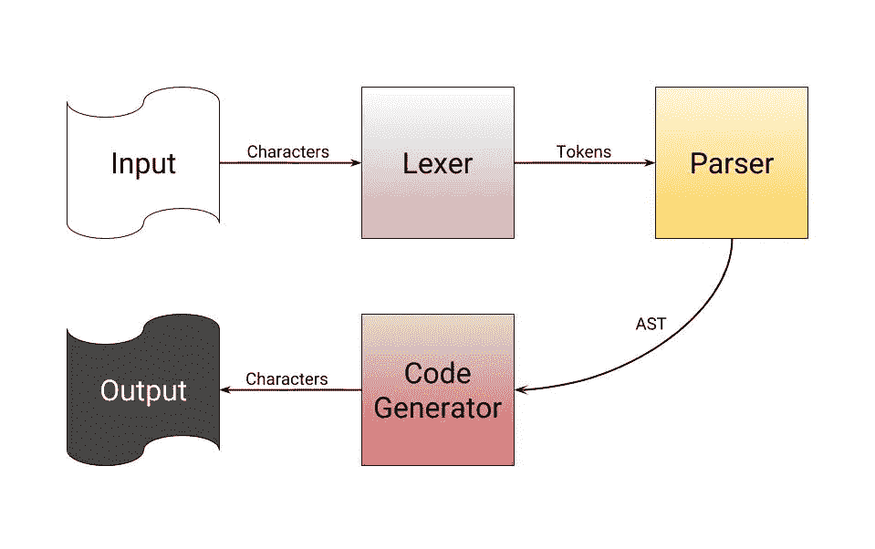
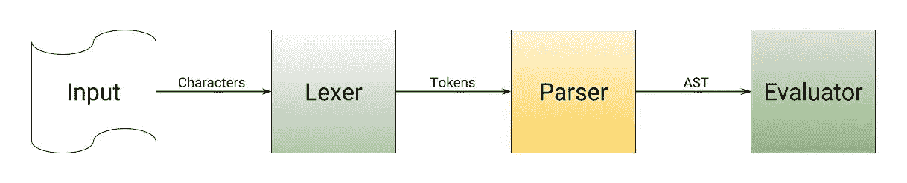
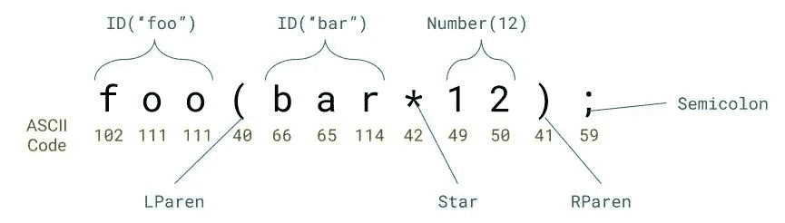
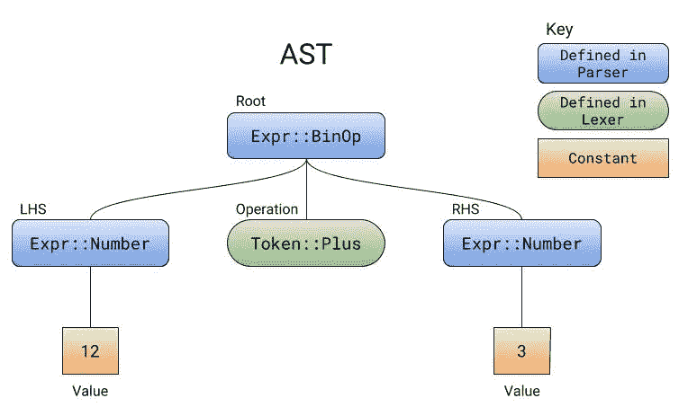
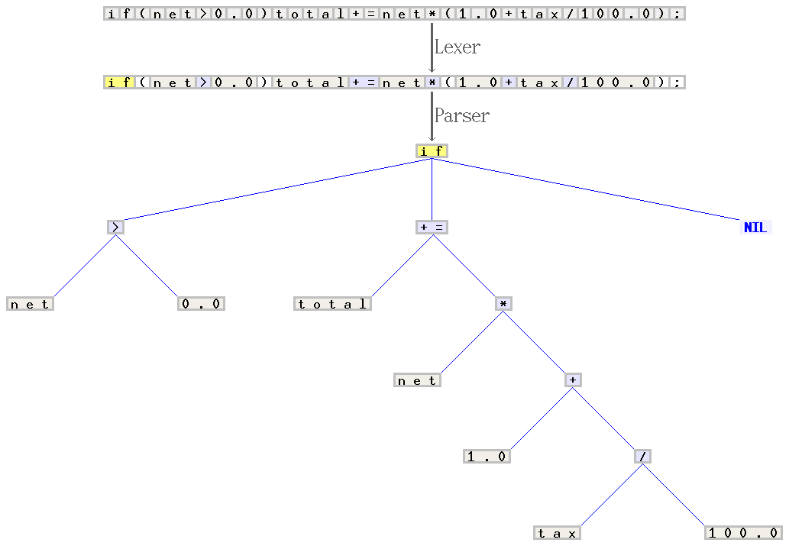

# 理解编译器——面向人类(第 2 版)

> 原文：<https://towardsdatascience.com/understanding-compilers-for-humans-version-2-157f0edb02dd?source=collection_archive---------6----------------------->

## 编程语言如何工作

从内部理解你的编译器可以让你有效地使用它。在这个按时间顺序排列的大纲中，浏览编程语言和编译器是如何工作的。许多链接、示例代码和图表有助于您的理解。

## 作者说明

*理解编译器——人类版(第 2 版)*是我第二篇关于 Medium 的文章的后续，有超过 21，000 的浏览量。我很高兴我能对人们的教育产生积极的影响，并且我很高兴能根据我从最初的文章中得到的信息给**带来一个完整的重写。**

 [## 理解编译器——为了人类

### 你是否点击了绿色的运行按钮，但并不真正知道引擎下面发生了什么？你想知道一个…

medium.com](https://medium.com/@CanHasCommunism/understanding-compilers-for-humans-ba970e045877) 

我选择了铁锈作为这部作品的主要语言。它冗长、高效、现代，而且从设计上看，对于编译器来说非常简单。我喜欢使用它。【https://www.rust-lang.org/ 

这篇文章的目的是保持读者的注意力，而不是有 20 页令人麻木的阅读。文本中有许多链接，将引导您找到更深入了解您感兴趣的主题的资源。大多数链接会将你引向维基百科。

欢迎在底部的评论区提出任何问题或建议。感谢您的关注，希望您喜欢。

# 介绍

## 什么是编译器

总之，你所谓的编程语言实际上只是一种叫做编译器的软件，它可以读取文本文件，对其进行大量处理，并生成二进制文件。由于计算机只能读取 1 和 0，而人类比二进制写得更好，编译器被设计成将人类可读的文本转换成计算机可读的机器码。

编译器可以是将一种文本翻译成另一种文本的任何程序。例如，这里有一个用 Rust 编写的编译器，它把 0 变成 1，把 1 变成 0:

While this compiler doesn’t read a file, doesn’t generate an AST, and doesn’t produce binary, it is still considered a compiler for the simple reason that it translates an input.

## 编译器做什么

简而言之，编译器获取源代码并生成二进制代码。因为从复杂的、人类可读的代码直接转换成 1 和 0 是相当复杂的，所以编译器在程序运行之前有几个处理步骤要做:

1.  读取你给它的源代码的单个字符。
2.  将字符分类为单词、数字、符号和运算符。
3.  获取排序后的字符，通过将它们与模式进行匹配来确定它们试图执行的操作，并生成操作树。
4.  迭代上一步中在树中进行的每个操作，并生成等效的二进制文件。

*虽然我说编译器立即从操作树进入二进制，但它实际上生成汇编代码，然后汇编/编译成二进制。汇编就像一个更高级的、人类可读的二进制文件。更多了解什么是* [*这里是*](https://en.wikipedia.org/wiki/Assembly_language) *。*

## 什么是口译员

解释器很像编译器，因为它们阅读并处理语言。不过，**解释器跳过代码生成，执行 AST** [**实时**](https://en.wikipedia.org/wiki/Just-in-time_compilation) **。对解释器来说，最大的好处是在调试期间开始运行程序所花费的时间。编译器在程序执行前可能要花几秒到几分钟的时间来编译程序，而解释器不编译就立即开始执行。解释器最大的缺点是它需要安装在用户的计算机上，然后程序才能执行。**

*本文主要指的是编译器，但是应该清楚它们之间的区别以及编译器之间的关系。*

# 1.词汇分析

第一步是一个字符一个字符地分割输入。这一步被称为[词法分析](https://en.wikipedia.org/wiki/Lexical_analysis)，或标记化。主要的想法是，我们将字符组合在一起，形成我们的单词、标识符、符号等等。词法分析大多不处理像求解`2+2`这样的逻辑问题——它只会说有三个[记号](https://en.wikipedia.org/wiki/Lexical_analysis#Token):一个数字:`2`，一个加号，然后是另一个数字:`2`。

假设您正在编写一个类似于`12+3`的字符串:它将读取字符`1`、`2`、`+`和`3`。我们有各自独立的角色，但我们必须把它们组合在一起；分词器的主要任务之一。例如，我们将`1`和`2`作为单独的字母，但是我们需要将它们放在一起，并作为单个整数进行解析。`+`也需要被识别为加号，而不是它的文字字符值——字符代码[43。](http://www.asciitable.com/)

如果您可以看到代码，并以这种方式使其更有意义，那么下面的 Rust tokenizer 可以将数字分组为 32 位整数，并将加号作为`Token`值`Plus`。

 [## 铁锈操场

play.rust-lang.org](https://play.rust-lang.org/?gist=070c3b6b985098a306c62881d7f2f82c&version=stable&mode=debug&edition=2015) 

*您可以点击 Rust Playground 左上角的“运行”按钮，在您的浏览器中编译并执行代码。*

在编程语言的编译器中，词法分析器可能需要几种不同类型的标记。例如:符号、数字、标识符、字符串、运算符等。知道需要从源代码中提取哪种单独的标记完全取决于语言本身。

Example of C source code that has been lexically analyzed, and its tokens printed.

# 2.从语法上分析

解析器确实是语法的核心。**解析器获取由词法分析器生成的标记，尝试查看它们是否符合特定的模式，然后将这些模式与像调用函数、调用变量或数学运算这样的表达式相关联。**解析器是真正定义语言语法的东西。

说`int a = 3`和`a: int = 3`的区别在于解析器。解析器决定语法应该是什么样子。它确保括号和花括号是平衡的，每个语句都以分号结束，并且每个函数都有一个名称。当标记不符合预期模式时，解析器知道什么时候事情没有按照正确的顺序进行。

*你可以编写几种不同类型的* [*解析器*](https://en.wikipedia.org/wiki/Parsing#Types_of_parsers) *。其中最常见的是自上而下，***递归下降解析器。递归下降解析是最容易使用和理解的解析之一。我创建的所有解析器例子都是基于递归下降的。**

*解析器解析的语法可以用[语法](https://en.wikipedia.org/wiki/Formal_grammar)来概括。像 [EBNF](https://en.wikipedia.org/wiki/Extended_Backus-Naur_form) 这样的语法可以描述像`12+3`这样的简单数学运算的解析器:*

*EBNF grammar for simple addition and subtraction expressions.*

**记住语法文件是* ***而不是*** *解析器，而是解析器工作的概要。你可以围绕这样的语法构建一个解析器。它将由人类使用，比直接查看解析器的代码更容易阅读和理解。**

*该语法的解析器将是`expr`解析器，因为它是基本上所有内容都与之相关的顶级项目。唯一有效的输入必须是任何数字，加或减，任何数字。`expr`期待一个`additive_expr`，这是大加减法出现的地方。`additive_expr`先预计一个`term`(一个数字)，然后加减，再一个`term`。*

**

*Example AST generated for parsing 12+3.*

***解析器在解析时生成的树称为** [**抽象语法树**](https://en.wikipedia.org/wiki/Abstract_syntax_tree) **，简称 AST。**AST 包含所有的操作。解析器不计算操作，它只是按照正确的顺序收集它们。*

*我添加了之前的 lexer 代码，这样它就能匹配我们的语法，并能生成如图所示的 ASTs。我用注释`// BEGIN PARSER //`和`// END PARSER //`标记了新解析器代码的开头和结尾。*

 *[## 铁锈操场

play.rust-lang.org](https://play.rust-lang.org/?gist=205deadb23dbc814912185cec8148fcf&version=stable&mode=debug&edition=2015)* 

*我们实际上可以走得更远。比方说，我们希望支持没有运算的数字输入，或者添加乘法和除法，甚至添加优先级。通过快速修改语法文件，并在解析器代码中反映出来，这一切都是可能的。*

*The new grammar.*

 *[## 铁锈操场

play.rust-lang.org](https://play.rust-lang.org/?gist=1587a5dd6109f70cafe68818a8c1a883&version=nightly&mode=debug&edition=2018)* **

*Scanner (a.k.a. lexer) and parser example for C. Starting from the sequence of characters "`if(net>0.0)total+=net*(1.0+tax/100.0);"`, the scanner composes a sequence of tokens, and categorizes each of them, e.g. as identifier, reserved word, number literal, or operator. The latter sequence is transformed by the parser into a syntax tree, which is then treated by the remaining compiler phases. The scanner and parser handles the regular and properly context-free parts of the grammar for C, respectively. Credit: Jochen Burghardt. [Original](https://commons.wikimedia.org/wiki/File:Xxx_Scanner_and_parser_example_for_C.gif).*

# *3.生成代码*

*代码生成器接受一个 AST 并发出代码或汇编中的等价代码。**代码生成器必须以递归下降的顺序遍历 AST 中的每一项——很像解析器的工作方式——然后发出等价的代码。***

* [## 编译器资源管理器- Rust (rustc 1.29.0)

### pub fn main(){ let a = 10 * 3；}

godbolt.org](https://godbolt.org/z/K8416_) 

如果打开上面的链接，可以看到左边的示例代码生成的程序集。汇编代码的第 3 行和第 4 行显示了编译器在 AST 中遇到常量时是如何为它们生成代码的。

*god bolt 编译器资源管理器是一款优秀的工具，允许你用高级编程语言编写代码，并查看其生成的汇编代码。您可以用它来看看应该生成什么样的代码，但是不要忘记在您的语言的编译器中添加优化标志，看看它有多聪明。(* `*-O*` *为铁锈)*

如果您对编译器如何将局部变量保存到 ASM 的内存中感兴趣，本文(“代码生成”一节)将详细解释[堆栈](https://stackoverflow.com/a/80113)。大多数情况下，当变量不在本地时，高级编译器会在堆上为变量分配内存，并将它们存储在堆上，而不是堆栈上。你可以在[这个 StackOverflow 回答](https://stackoverflow.com/a/18446414)中阅读更多关于存储变量的内容。

因为组装是一个完全不同的复杂的主题，所以我不会详细讨论它。我只想强调代码生成器的重要性和作用。此外，代码生成器不仅仅可以生成汇编。 [Haxe](https://haxe.org/) 编译器有一个 [*后端*](https://en.wikipedia.org/wiki/Compiler#Back_end) 可以生成超过六种不同的编程语言；包括 C++、Java 和 Python。

*后端指编译器的代码生成器或评估器；因此，前端是词法分析器和语法分析器。还有一个中间端，它主要与优化和 IRs 有关，这将在本节后面解释。后端大多与前端无关，只关心自己收到的 AST。这意味着一个人可以为几个不同的前端或语言重用同一个后端。臭名昭著的* [*GNU 编译器合集*](https://gcc.gnu.org/) *就是如此。*

我没有比我的 C 编译器后端更好的代码生成器的例子了；你可以在这里找到**。**

*生成汇编后，它将被写入一个新的汇编文件(`.s`或`.asm`)。然后，该文件将通过汇编器传递，汇编器是用于汇编的编译器，它将生成等价的二进制文件。然后，二进制代码将被写入一个名为目标文件的新文件中(`.o`)。*

***目标文件是机器代码，但不可执行。为了使它们成为可执行的，目标文件需要被链接在一起。链接器获取这个通用机器码，并使其成为可执行文件，一个[共享库](https://en.wikipedia.org/wiki/Library_(computing)#Shared_libraries)，或者一个[静态库](https://en.wikipedia.org/wiki/Library_(computing)#Static_libraries)。*更多关于联系人* [*这里*](https://en.wikipedia.org/wiki/Linker_(computing)#Overview) *。****

**链接程序是根据操作系统而变化的实用程序。一个单独的第三方链接器应该能够编译后端生成的目标代码。在制作编译器时，应该不需要创建自己的链接器。**

**

*一个编译器可能有一个[中间表示](https://en.wikipedia.org/wiki/Intermediate_representation)，或者 IR。**IR 是为了优化或翻译成另一种语言而无损地表示原始指令。**IR 不是原始源代码；IR 是为了在代码中找到潜在的优化而进行的无损简化。[循环展开](https://en.wikipedia.org/wiki/Loop_unrolling)和[矢量化](https://en.wikipedia.org/wiki/Automatic_vectorization)使用 IR 完成。更多与 IR 相关的优化示例可以在[本 PDF](http://www.keithschwarz.com/cs143/WWW/sum2011/lectures/140_IR_Optimization.pdf) 中找到。*

# *结论*

*当你理解了编译器，你就能更有效地使用你的编程语言。也许有一天你会对制作自己的编程语言感兴趣？我希望这对你有帮助。*

# *资源和延伸阅读*

*   *[http://craftinginterpreters.com/](http://craftinginterpreters.com/)—指导你用 C 和 Java 创建一个解释器。*
*   *[https://norasandler.com/2017/11/29/Write-a-Compiler.html](https://norasandler.com/2017/11/29/Write-a-Compiler.html)——可能是对我最有益的“编写编译器”教程。*
*   *我的 C 编译器和科学计算器解析器可以在[这里](https://github.com/asmoaesl/ox)和[这里](https://github.com/asmoaesl/rsc)找到。*
*   *另一种类型的解析器的例子，称为优先攀爬解析器，可以在[这里](https://play.rust-lang.org/?gist=d9db7cfad2bb3efb0a635cddcc513839&version=stable&mode=debug&edition=2015)找到。致谢:韦斯利·诺里斯。**