# 理解合成模式产生网络(上)

> 原文：<https://towardsdatascience.com/understanding-compositional-pattern-producing-networks-810f6bef1b88?source=collection_archive---------4----------------------->

## 全面解释 CPPNs 背后的理论

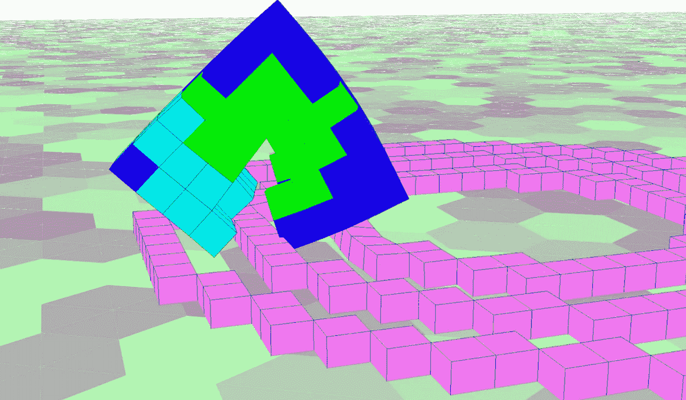

[3]

在过去的两年里，我一直在研究复合模式产生网络(CPPN)，这是一种在[1]中提出的扩充拓扑神经网络。然而，在我的整个研究中，我总是对 CPPNs 背后的一些概念和理论感到困惑，我努力理解它们是如何工作的。虽然网上有一些 CPPN 的开源版本，但在我的研究中，我想为定制目的构建自己的实现，这比我最初预期的要复杂得多。因此，我想对 CPPN 背后的理论以及如何实现它们进行全面的解释，以便像我一样与 CPPN 斗争的每个人都可以获得这样的资源。这篇文章将分成两个独立的部分。您现在正在阅读的第一部分将关注 CPPN 背后的理论以及它们是如何在科学研究中使用的，而第二部分将关注用 Python 实际实现 CPPN。

# 这是什么鬼东西？CPPNs 理论

在[1]中提出，CPPNs 是对以前提出的神经网络的扩展，称为 NEAT [2]。这些类型的神经网络非常相似，所以我将概述 NEAT 背后的一些理论，然后快速说明 CPPNs 的不同之处(别担心，它们几乎是相同的)。首先，NEAT 是一个用遗传算法进化的扩充拓扑神经网络。对这意味着什么的解释可以分成两个相关的概念:进化/遗传算法和扩充拓扑网络。

**遗传算法**

进化/遗传算法(GA)用于训练和优化神经网络的参数，类似于反向传播或爬山。然而，GA 不是使用导数来总是朝着改善损失的方向调整网络的权重，而是通过计算机版本的自然选择来找到最优的权重集，从达尔文主义和适者生存中汲取灵感。通过创建一个巨大的可能权重矩阵“群体”(通常约 25–100，但这可以变化)，g a 可以评估群体中每个“个体”的损失，每个个体由一个唯一的权重矩阵表示。使用该信息，最佳权重矩阵然后被变异，彼此交叉，并被选择以前进到下一个“代”。通过在选择过程的许多代或迭代中重复该过程，GA 可以创建最小化损失的权重矩阵的最终群体，从而产生许多可能的性能最优的权重矩阵。

变异是通过随机扰动单个网络的权重来执行的，而交叉是通过将一个网络的权重与另一个网络的权重部分交换来执行的。这些概念对我来说总是有点困惑，所以这里是两组权重交叉和变异的直观表示:

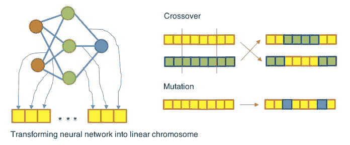

Crossing Over Weight Matrices (found at [https://github.com/lagodiuk/evo-neural-network-agents](https://github.com/lagodiuk/evo-neural-network-agents))

从上图中可以看出，在交叉过程中，很大一部分权重在权重矩阵之间交换，从而产生两个不同于原始“父”权重集的“子”权重集。在变异过程中，一些权重在随机方向上被扰动，以使“子”权重集与原始权重集略有不同。

这种变异、交叉和选择生存的最佳权重矩阵的过程重复许多代，直到你剩下最佳权重矩阵的最终群体。使用这种方法，只有最好的解决方案才能进入下一代，以便进一步变异、交叉和探索。因此，随着时间的推移，使用达尔文的适者生存原则来优化种群。如果你很好奇，想了解更多关于 GA 的知识，我鼓励你查看[这个链接](/introduction-to-genetic-algorithms-including-example-code-e396e98d8bf3)，它比我在这里给出的解释要深入得多。

**扩充拓扑神经网络**

通常，遗传算法在一组结构相同的网络上工作。扩充拓扑神经网络也利用 GA，但是它们允许 GA 在进化期间操纵神经网络的结构(不仅仅是权重)，从而允许找到神经网络的最佳结构/拓扑。在进化之初，所有神经网络都是用完全连接到输出的输入来初始化的，没有隐藏节点——这是一个非常简单的最小结构。然而，随着拓扑的增加，随着神经网络的权重“进化”，网络的结构同时被优化——这在典型的 GA 优化中不会发生。为了探索可能的网络拓扑，当允许扩充拓扑时，GA 通过添加隐藏节点、添加更多的连接、甚至删除群体中某些拓扑内的现有连接来增加网络的复杂性。因此，虽然网络在进化之初结构简单，但它们的拓扑结构会进化到产生更高的性能，从而允许训练创建更复杂的网络结构。扩充拓扑的概念是 NEAT/CPPN 背后的核心思想，在我看来，这也是模型如此强大的原因。下图直观地展示了在进化过程中拓扑突变是如何应用于网络的:

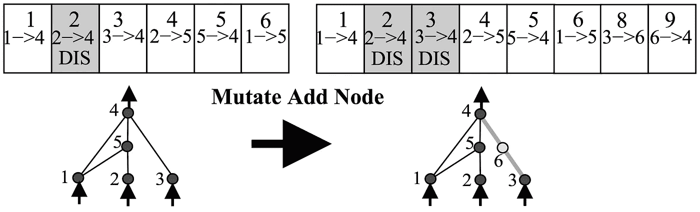

Mutating Neural Network Structure [2]

在上图中，一个现有的连接被拆分为两个新的连接，并且在这两个连接之间添加了一个节点。除了这种类型的拓扑突变(称为节点突变)，NEAT 还有向网络中添加连接的拓扑突变(连接添加突变)和从网络中删除连接的拓扑突变(连接删除突变)。这种拓扑扩充导致最终的网络群体在结构上非常多样化，但都完成类似的任务-群体中的每个网络可能具有不同的拓扑，以不同的方式解决问题。

# CPPN 和 NEAT 的区别？

既然您对 NEAT 有了很高的理解，您可能会好奇为什么我要写一个与标题中提到的(CPPN)完全不同的网络类型，但是这两者之间的区别非常简单。CPPN 允许每个节点包含从可能的激活功能列表中选择的唯一激活功能，而不是在每个节点中使用相同的激活功能。该激活列表可能包括 sin、cos、tanh、sigmoid、relu 或您可能想要包括的任何其他激活函数。允许神经网络包含许多不同的激活函数，反过来，允许它对展示所有这些不同激活的属性的函数进行建模，并创建模式化的、对称的和独特的输出。由于 CPPN 能够创建如此复杂和有趣的几何图形，因此它的目的是生成各种 2D 和 3D 形状。CPPN 的输入是像素的 x 和 y(甚至可能是 z)位置，它输出该输入位置的像素值(在[0，1]或[白色、黑色]之间)。对 2D 或 3D 空间内的每个可能的像素位置重复这种激活，以产生完整的输出形状。下图显示了 CPPN 的典型激活:

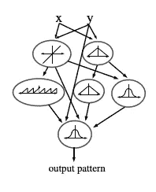

2D CPPN Activation [1]

在该图像中，可以观察到像素的 x 和 y 位置被输入到 CPPN 中，并且在该 x 和 y 位置的像素的强度值被输出。CPPN 中的每个节点都包含一个独特的激活函数，该函数根据输入值以不同方式影响输出值。通过对 2D 或 3D 空间内的每个像素位置执行 CPPN 的激活，可以创建有趣的结构和图案，如下所示:

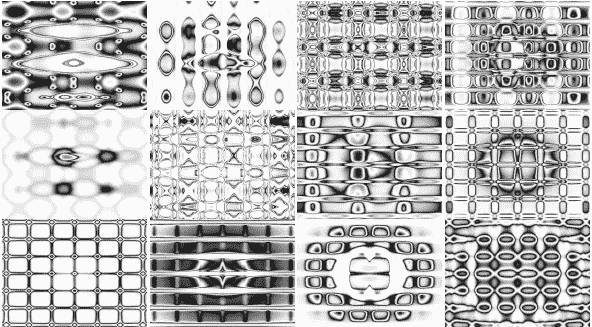

CPPN Black and White Output [1]

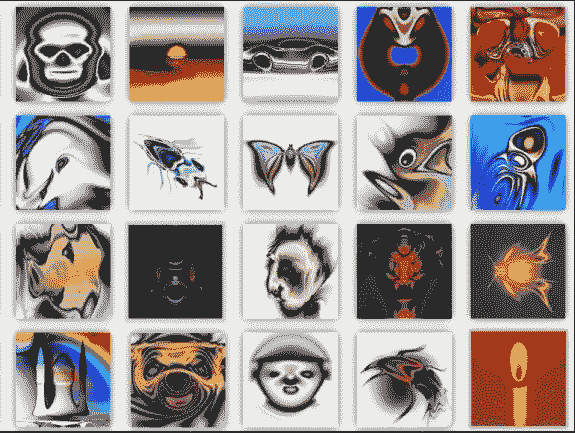

CPPN Color Output (found on picbreeder.com)

从上面的输出中可以看出，CPPN 产生规则和对称形状的能力非常适合于发展类似艺术品、活生物体和许多其他有趣几何形状的结构。在我看来，这样的应用和能力非常有趣，这也是为什么我觉得研究 CPPNs 如此有趣。

# 演进中的 CPPNs 的细节

在进化开始时，cppn 的群体以不包含隐藏节点的简单结构初始化，但是，由于 cppn 的扩充拓扑特征，随着进化的继续和拓扑突变的应用，群体变得越来越复杂。在每一代中，额外的节点和连接被添加到网络结构中，从而产生越来越复杂且更适于解决预期问题的网络。然而，认识到群体中的所有网络不会同时突变是非常重要的，因此，每个网络可能具有与群体中其他 CPPNs 不同的拓扑结构。网络拓扑之间缺乏一致性使得 cppn 的发展变得有些独特和困难，因此我认为有必要解释一些 cppn 通常如何发展以及如何处理这种缺乏结构一致性的细节。

**历史标记**

每次一个新的连接被添加到 CPPN 的拓扑结构中，它都会被赋予一个“历史标记”或“创新号”，这只是一个特定连接所特有的整数。添加到群体中每个 CPPN 的每个连接都被赋予一个唯一的历史标记。随着连接在整个进化过程中的增加，全局计数器被维护并递增，使得分配的每个历史标记都是唯一的。这样的历史标记允许你理解人口中每个联系的历史和血统。此外，当结构在进化过程中相互交叉时，人们可以使用历史标记来观察哪些连接具有相似的进化血统。通过对添加的连接执行这种简单的簿记，进化 CPPNs 的几个方面被大大简化。在下图中，你可以观察到一个连接列表及其对应的创新编号(创新编号和历史标记是一回事！).

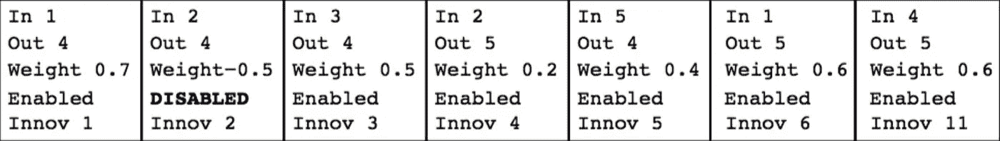

List of Connections [2]

请注意，上图中的每个连接都被分配了一个创新号，并且每个连接的创新号都是唯一的。这允许您确定群体中的哪些网络共享共同的连接，从而从相同的结构中派生出来。

**cppn 的交叉**

如前所述，用遗传算法进化神经网络的一部分涉及交叉——在网络之间交换权重值以创建新的网络。对于遗传算法神经网络的典型进化，交叉是非常简单的。下图显示了相同拓扑网络之间常见的交叉类型:

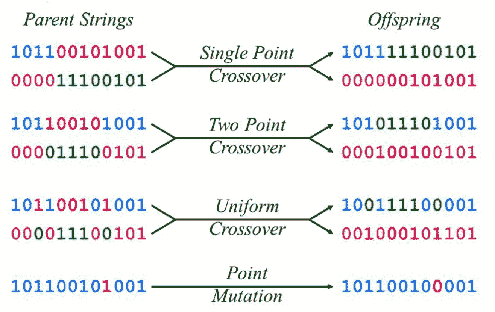

Different Types of Crossover

对于扩充拓扑 CPPNs 的发展，由于两个网络之间的权重数目可能不相同，交叉变得稍微复杂。然而，创新数字的使用大大简化了这一过程。不是试图找到一种特殊的方法来决定哪些权重相互交叉，而是只交叉具有相同创新数的权重。因此，可以简单地通过在两个网络之间找到具有相等新息数的连接并交换它们的权重来执行交叉，从而产生 CPPNs 之间的伪一致交叉。

**通过物种形成保护多样性**

随着拓扑突变(新的连接和节点)被添加到群体中的 CPPNs 的拓扑中，这种突变通常会导致适应度的初始下降。这种适应度的降低是由这样的事实引起的，即在初始化时放入网络的新权重是随机的，并且尽管拓扑变化可以提供更优的结构，但是在网络实现其全部潜力之前必须训练这样的权重。网络中的这种新的随机权重通常会导致网络的适应性最初下降，然后在权重被训练后提高。如果我们不保护这样的网络不被选择，允许它们有时间训练并实现它们的最大适应度，它们将被 GA 立即从种群中淘汰，这将阻止 CPPNs 探索更复杂的结构。幸运的是，这样的新结构可以通过一个叫做“物种形成”的重要概念得以保存。

就个人而言，物种形成是我在研究 cppn 时最难理解的概念，但没有它，cppn 就无法有效进化。物种形成背后的基本概念是，当被选择用于下一代时，cppn 应该只与具有相似拓扑结构的 cppn 竞争。这样，如果通过变异创建了具有新的更复杂拓扑的网络，它将不必与已经达到其最大适应度的不太复杂的拓扑竞争，从而给更复杂的网络时间来训练和提高其适应度。拓扑的相似性通过比较网络之间的新息数来评估——如果网络有许多具有相同新息数的连接，则它们更相似，反之亦然。使用这样的信息，当执行选择时，基于新息数距离度量，CPPNs 被分成几个“种类”，或者具有相似拓扑的不同组。一旦这些物种形成，对每个物种分别进行选择，允许 CPPNs 只与它们物种的其他成员竞争。这种方法允许具有新的不同结构的 CPPNs 存在足够长的时间用于训练和优化，以发现这种拓扑是否是最佳的。

**CPPN 演进总结**

如果你理解了发展 cppn 的所有这些特殊细节，你就对 cppn 背后的理论有了很好的理解，并且可能理解使用 cppn 发表的大多数论文和项目。我相信这张图很好地总结了这些细节:

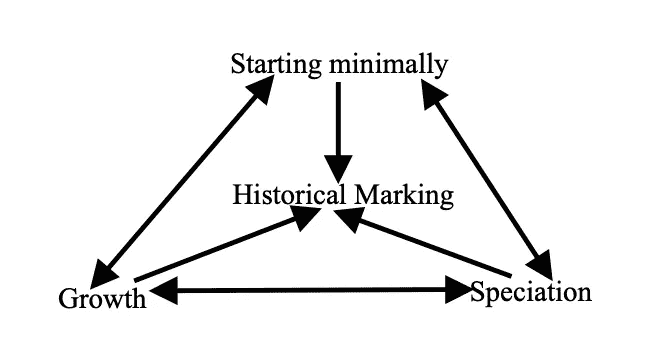

Evolution Details [2]

如上图所示，要进化的 CPPNs 的群体从最低限度开始——完全连接，在任何结构中都没有隐藏节点。随着进化的进行，拓扑和重量突变被应用于 CPPNs，这允许它们生长，在结构上变得更复杂，并优化它们的参数。当新的连接被添加到 CPPNs 中时，它们每个都被赋予一个唯一的历史标记(或创新号),允许识别相似的连接。然后，这些历史标记可以用于创建不同网络拓扑之间的距离/相似性度量，这允许基于它们的网络结构将 CPPNs 分成不同的物种。通过对每个物种分别进行选择，允许新的 CPPN 拓扑在选择和进化中存活足够长的时间，以探索它们的能力，从而允许找到并优化最佳网络结构。

# 涉及 CPPN 的项目/研究示例

既然你已经理解了 cppn 是如何工作的，以及它们能做的很酷的事情，那么看看一些用 cppn 完成的研究项目可能会有所帮助，其中一些项目在计算进化领域相当有影响力。

**pic breader 网站**

在研究 CPPNs 时面临的最初问题之一是，在许多情况下，很难确定某个网络的适合度。每个 CPPN 输出一个独特的形状或图像，给这样的输出分配一个适合度是非常主观的——用户必须根据他们的偏好来确定适合度。Picbreeder.com 是一个作为研究项目开发的网站，完全基于用户的偏好，大规模地众包 CPPNs 的演变。使用 CPPNs 编码许多不同的图像，该网站允许用户选择他们喜欢的图像，并通过不断选择图像的变异版本来进一步进化它们。进化甚至可以在以后由不同的用户在相同的图像上继续。这样一个平台允许 CPPNs 完全基于主观用户输入，进化了令人难以置信的多代，这导致了各种有趣输出的集体创造。以下是网站上一些图片的例子:

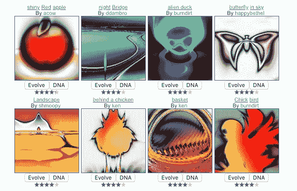

Top Images on picbreeder.com

正如上面所看到的，一些非常有趣和令人印象深刻的图像是通过这样的合作进化创造出来的。此外，这项研究中的进化结果有效地证明了 CPPNs 的许多有价值的特性，使它们变得有用和有趣。例如，考虑下面一组也是使用 picbreeder 开发的图像:

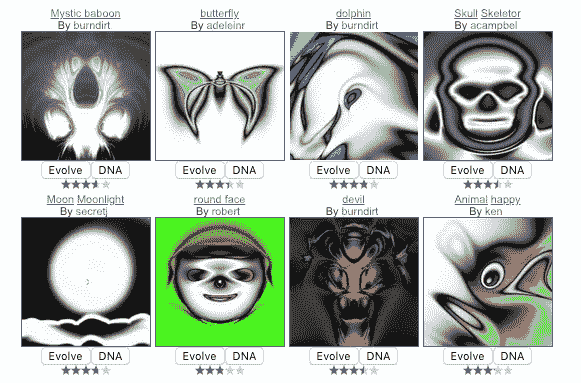

Living Organism Images from picbreeder.com

从上面的图像中可以清楚地看到，CPPNs 可以产生类似于活生物体的对称和规则的几何形状，这是它们产生的主要动机之一。因此，picbreeder.com 进化的结果巩固了 CPPNs 在实现这一目的方面的有效性。

**软体机器人进化**

已经发表了许多论文来探索具有图像的 CPPNs 的 2D 应用，但是我发现许多最有趣的应用涉及 3D 形状的产生。CPPNs 最突出的 3D 应用之一是研究由 CPPNs 间接编码以实现最大行驶距离的软机器人的进化。现在，你可能在想“等等，到底什么是软体机器人”，所以这里有一张本文中软体机器人的快速图片:

Soft Robot Example [3]

在这项研究中，软机器人是通过向 3D 空间添加材料来创建的，这些材料可以以不同的方式扩展和收缩(因此是“软”机器人)，这使得机器人像生命体一样移动。这些软机器人是通过用不同类型的体素(3D 像素)填充 3D 空间(或者没有体素/空白空间)来创建结构而创建的。每种类型的体素(由不同的颜色表示)不同地收缩或松弛，从而当配对在一起时，体素的运动可以产生结构的整体运动。这种结构是通过查询输出空间中每个可能的体素位置处的 CPPN 以产生每个体素的类型和存在的输出来创建的。在这项研究中，该模型还使用距空间中心的距离(d)作为输入，但我发现对位置输入值进行归一化可以减少网络中的参数数量，并且表现类似。如果您仍然有一点困惑，这里是 CPPNs 如何在这个项目中用于创建软机器人输出的可视化:

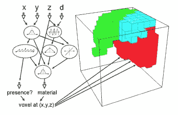

Creating a Soft Robot with CPPN [3]

每个结构都通过模拟来评估，模拟确定了每个软机器人在给定时间内移动的距离。这项研究成功地进化出了能够移动最大距离的 CPPNs，有趣的是，这些进化的结构中有许多在移动中类似于活的有机体(如果你感兴趣，请查看[这个视频](https://www.youtube.com/watch?v=EXuR_soDnFo))。).此外，当这个问题试图只使用软机器人的直接编码(直接存储结构中每个体素的值)并用 GA 进化时，它根本不起作用，从而证明了 CPPNs 在创建逼真的功能性生物方面的有用性和有效性。以下是这项研究中进化出的一些最好的软体机器人的图片:

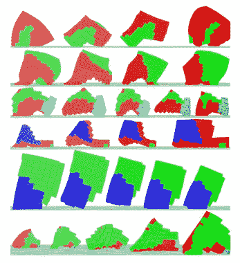

Set of Results from Soft Robot Evolution [3]

**其他论文/研究**

有很多论文探讨了 CPPNs 的有效性和功能，但是写这些文章可能会花费很长时间(我相信您已经厌倦了阅读)。因此，以下是我在研究过程中发现的一些关于 CPPNs 的有用且有趣的额外论文:

1.  [上传任何物体并进化它:将复杂的几何图案注入 CPPNs 以进一步进化](https://ieeexplore.ieee.org/document/6557986)
2.  [在一个开放的、互动的进化系统中，管道化和可进化性的出现](https://arxiv.org/abs/1704.05143)
3.  [受发育生物学启发，用生殖编码进化三维物体](http://www.evolvingai.org/clune-lipson-2011-evolving-three-dimensional)

# 结论

非常感谢你的阅读！我希望您现在对 CPPNs 以及如何使用它们有了更好的理解。如果你很好奇，想了解更多关于 CPPN 的知识，我真的鼓励你访问 NEAT 的[网页](https://www.cs.ucf.edu/~kstanley/neat.html)，它是由 NEAT 的创建者创建的，允许研究人员分享关于 NEAT 的想法和方法(记住，NEAT 几乎与 CPPN 相同，所以大多数想法/技巧都适用于两者！).此外，请随时在 LinkedIn[上联系我或者在 GitHub](https://www.linkedin.com/in/cameron-wolfe-9b2511144/) 上关注我。

# 引文

[1] K. O .斯坦利一种新的发展抽象。遗传编程和进化机器，2007。

[2] K. O .斯坦利和 r .米库拉宁。通过扩充拓扑进化神经网络。进化计算，2002。

[3] Cheney，n .，MacCurdy，r .，Clune，j .和 Lipson，h.《解开束缚的进化:用多种材料和强大的生成编码进化出柔软的机器人》。遗传和进化计算会议论文集。纽约计算机学会，2013 年。