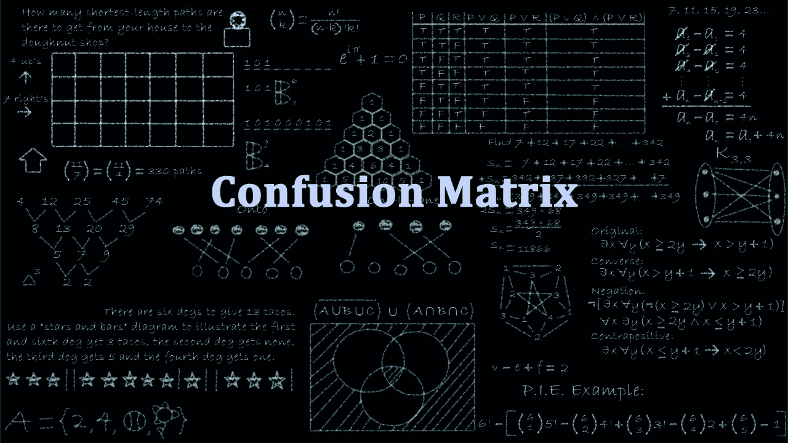
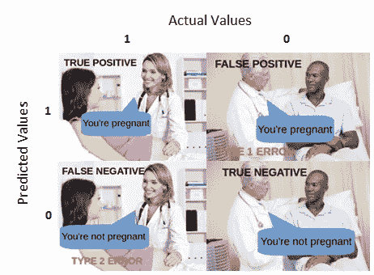
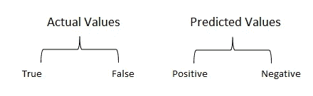
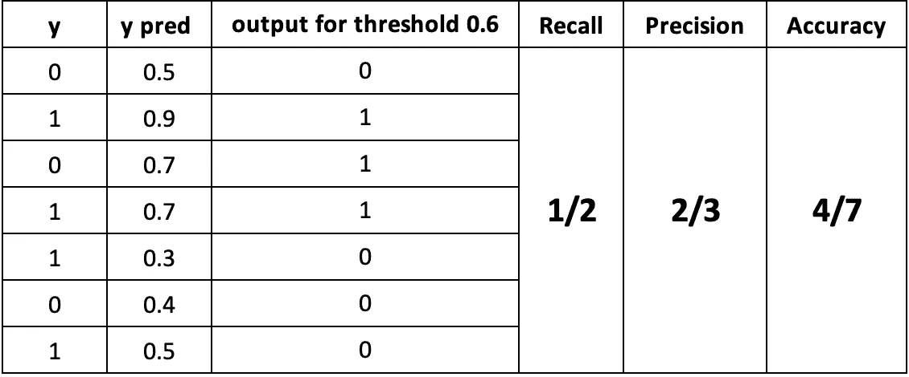
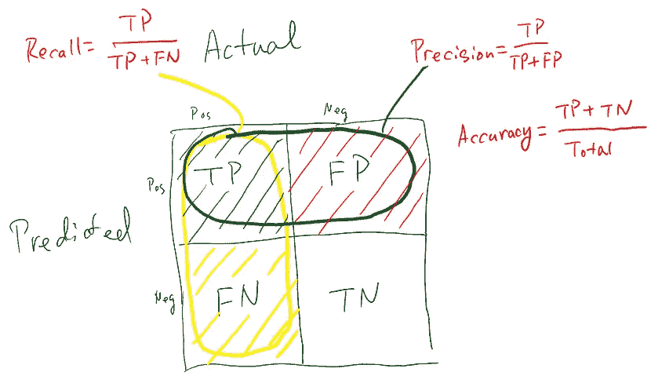
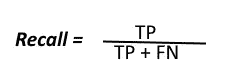
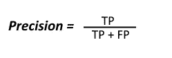
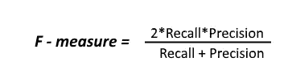

# 理解混淆矩阵

> 原文：<https://towardsdatascience.com/understanding-confusion-matrix-a9ad42dcfd62?source=collection_archive---------0----------------------->

Understanding Confusion Matrix [Image 1] (Image courtesy: My Photoshopped Collection)

当我们得到数据后，经过数据清理、预处理和争论，我们做的第一步是把它输入到一个优秀的模型中，当然，得到概率输出。但是坚持住！我们到底如何衡量我们模型的有效性。效果越好，性能越好，这正是我们想要的。这也是混淆矩阵引人注目的地方。混淆矩阵是机器学习分类的性能度量。

本博客旨在回答以下问题:

1.  混淆矩阵是什么，为什么需要它？
2.  如何计算二类分类问题的混淆矩阵？

今天我们就来一劳永逸的了解一下混淆矩阵。

**什么是混淆矩阵，为什么你需要它？**

嗯，这是对机器学习分类问题的性能测量，其中输出可以是两个或更多个类。这是一个包含预测值和实际值的 4 种不同组合的表格。

Confusion Matrix [Image 2] (Image courtesy: My Photoshopped Collection)

它对测量召回率、精确度、特异性、准确性以及最重要的 AUC-ROC 曲线非常有用。

我们从怀孕类比的角度来理解 TP，FP，FN，TN。

Confusion Matrix [Image 3] (Image courtesy: My Photoshopped Collection)

**真阳性:**

解读:你预测的是正的，这是真的。

你预言一个女人怀孕了，她真的怀孕了。

**真否定:**

解读:你预测的是负数，这是真的。

你预言一个男人不会怀孕，他实际上也没有。

**假阳性:(1 型错误)**

解读:你预测的是正的，是假的。

你预言一个男人怀孕了，但他实际上没有。

**假阴性:(2 型错误)**

解读:你预测的是负数，这是假的。

你预测一个女人不会怀孕，但她确实怀孕了。

请记住，我们将预测值描述为正和负，将实际值描述为真和假。

Actual vs Predicted values [Image 4] (Image courtesy: My Photoshopped Collection)

**如何计算二类分类问题的混淆矩阵？**

让我们通过数学来理解混淆矩阵。

Confusion Matrix [Image 5 and 6] (Image 5 courtesy: My Photoshopped Collection) (Image 6 courtesy: I can not find the source. If you know please comment. I will provide appropriate citations. :D)

**召回**

Recall [Image 7] (Image courtesy: My Photoshopped Collection)

上面的等式可以解释为，从所有的正类中，我们正确预测了多少。

召回率要尽可能高。

**精度**

Precision [Image 8] (Image courtesy: My Photoshopped Collection)

上面的等式可以解释为，从我们预测为正的所有类中，有多少实际上是正的。

精度要尽可能高。

和

**精度**

从所有的类(正类和负类)中，我们正确预测了多少。在这种情况下，它将是 4/7。

精确度应该尽可能高。

**F-measure**

F1 Score [Image 9] (Image courtesy: My Photoshopped Collection)

低精度和高召回率的两个模型很难比较，反之亦然。所以为了使它们具有可比性，我们使用 F-Score。F-score 有助于同时衡量查全率和查准率。它用调和平均值代替算术平均值，更多地惩罚极值。

我希望我已经让你对混淆矩阵有了一些基本的了解。如果你喜欢这篇文章，给这篇文章一些掌声会对你有所帮助👏。我随时欢迎你的问题和建议。你可以在脸书、推特、Linkedin 上分享这个，这样有需要的人可能会偶然发现这个。

您可以通过以下方式联系到我:

领英:[https://www.linkedin.com/in/narkhedesarang/](https://www.linkedin.com/in/narkhedesarang/)

推特:【https://twitter.com/narkhede_sarang 

github:【https://github.com/TheSarang 

**感谢阅读！**