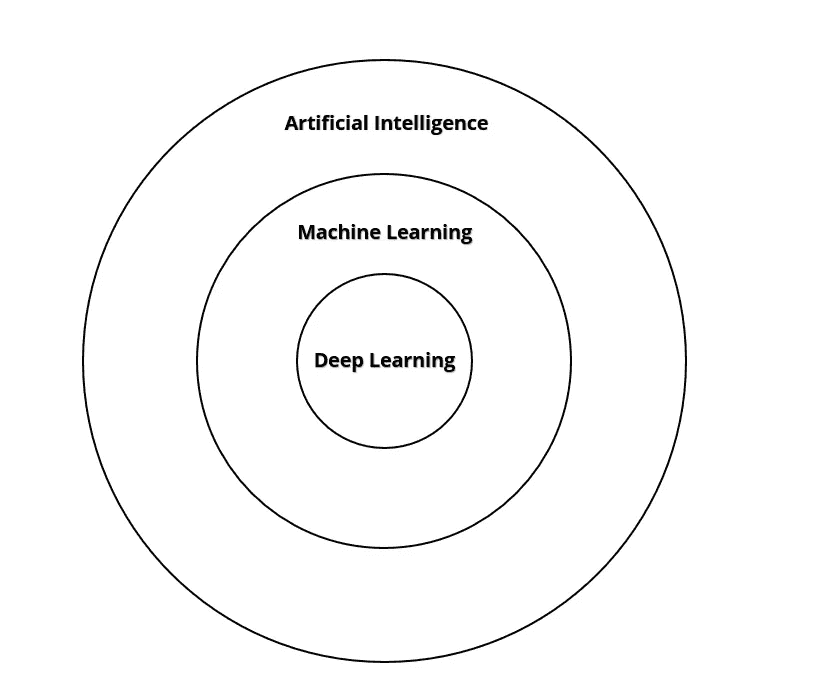
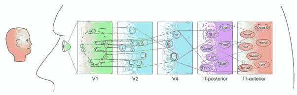
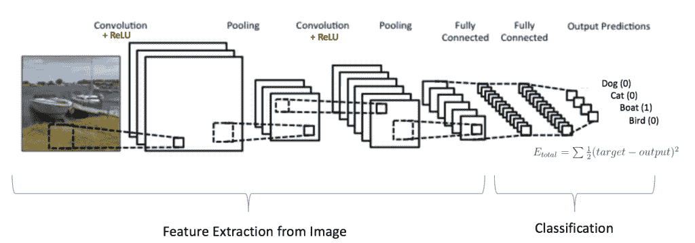
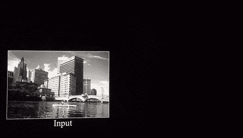
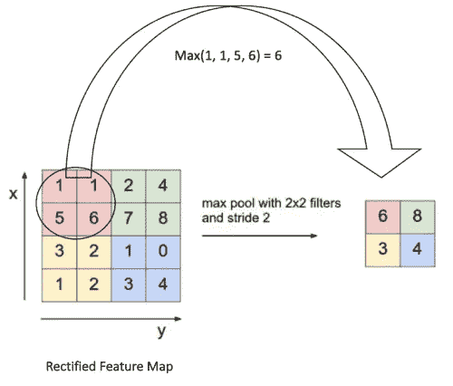
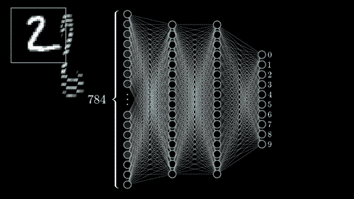
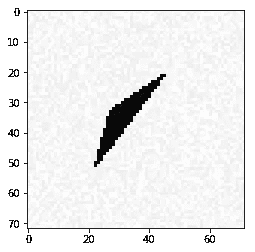
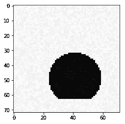
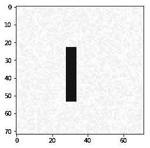

# 理解卷积神经网络

> 原文：<https://towardsdatascience.com/understanding-convolutional-neural-networks-221930904a8e?source=collection_archive---------3----------------------->

在这篇博文中，我们将探索(或至少尝试)卷积神经网络背后的直觉，卷积神经网络是机器视觉和图像识别中最重要的深度学习技术之一。我们还将通过一个例子来使用卷积神经网络识别不同的形状。

# 一些背景

随着人工智能的突破继续吸引着普通公众，诸如*、【人工智能】、*、【机器学习】、*、【深度学习】、*等术语已经被互换使用。为了更好地了解人工智能在未来几年的发展方向，理解每个术语之间的差异绝对是值得的。**

The concentric circles of Artificial Intelligence

我们可以将这三个术语视为同心圆，人工智能包含机器学习，机器学习包含深度学习。我们可以更深入地研究人工智能的历史以及这一进步是如何产生的——但是关于这个话题已经讨论了很多。

简而言之，人工智能是计算机系统的发展，它执行通常保留给人类认知的任务。例如，尽管是一个硬编码系统，但计算器是一种人工智能。用于开发这种系统的技术是这些同心圆的关键。

机器学习围绕着创建可以从大型数据集学习有用模式的系统，并因此提供有用的见解。机器学习本身分为三个主要类别——第一个是**监督学习**，它需要创建理解一组数据点*(上下文)*和标签*(结果)*之间关系的系统，从而提供未标记数据点的结果。此类系统的示例包括对贷款申请是否会导致违约进行分类的系统、预测未来股票价格的系统等。或者，**无监督学习**正在构建能够简单地基于相似特征或特性从数据集中识别有意义模式的系统。例如，根据相似的购物行为对客户进行聚类。最后，**强化学习**是机器学习的一个分支，它试图将智能代理置于一个定义明确的环境中，有一组可能的动作和一个目标函数*(奖励)*要最大化。我们可以想到自动驾驶汽车*(代理)*行驶在高速公路上*(环境)*其唯一的目标是不发生事故*(奖励)*例如。

最后，深度学习是一种在机器学习中使用的技术，它利用大量数据和多层神经网络*(可以在这里找到神经网络的优秀遍历***)*，以便理解数据集内的模式。最近人工智能在计算机视觉和语音识别等方面的突破几乎都回到了深度学习研究，更重要的是计算能力的商品化*(一篇关于计算能力在人工智能研究中的使用的有趣博客文章可以在这里找到***)*。**

**直观地说，把机器学习想象成对孩子大脑建模的尝试。儿童从他人的动作中学习**(监督学习)**试图辨别世界上不同物体之间的相似性，例如将形状相似的乐高积木组合在一起**(无监督学习)**并在没有直接输入的情况下导航困难的环境，例如攀登架**(强化学习)**。深度学习是机器学习中的一种技术，是人工智能最近突破的根源。**

# **什么是卷积神经网络？**

**在深度学习中，出现了大量的架构和技术，可以实现许多用例，其中主要是卷积神经网络。卷积神经网络的灵感来自于对哺乳动物视觉皮层的研究，以及它们如何使用大脑中神经元的分层结构来感知世界。把这个视觉皮层模型想象成专门设计来识别不同形状的神经元群。每组神经元在看到一个物体时都会放电，并相互交流，以形成对感知物体的整体理解。**

****

**Different groups of neurons in the brain learn to recognize different groups of characteristics given an input stimulus**

**该系统可以被解释为神经元的分级集群，其检测输入刺激的低级特征，并在该分级结构中相互通信，以开发对象的高级检测。
将层次结构想象成如下:**

*   **第一个聚类作为识别低级特征的结构(*即面部轮廓)***
*   **第二类是识别颜色和形状的结构(*肤色或颌线)***
*   **第三个是识别细节的结构(*耳朵、鼻子和眼睛……)***
*   **最终聚类从整体上识别整个对象(*脸部和附在脸部的人)***

**简单来说，给定一个物体的景象，该系统有不同组的神经元，它们针对该物体的不同方面激活，并相互通信以形成大画面。**

**[Yann LeCun](https://en.wikipedia.org/wiki/Yann_LeCun) 从视觉皮层的分层模型中获得灵感，开发了卷积神经网络，包含以下内容:**

*   **本地连接:每一层*(或集群)*共享一个连接，在那里它们将学习到的特性从一个集群转移到另一个集群。**
*   **分层:在不同的层*(或集群)*之间有一个明显的层次——这类似于说从低级特征*(即耳朵、眼睛)*到高级特征*(面部、所讨论的人等等)的学习中有一个层次。***
*   **空间不变性:输入的移动会导致输出的同等移动——无论我们如何改变输入图像，模型都应该相应地适应和移动其输出。*(人类有能力识别一个物体，即使它在各种情况下颠倒或移动)***

**因此，卷积神经网络架构对应于类似这样的内容:**

****

**A typical Convolutional Neural Network Architecture**

*   **其中 4D 矩阵形式的输入数据包括样本数*(图像数)*、每个样本的高度*(每个图像的高度)*、每个样本的宽度*(每个图像的宽度)*、通道数*(这里的通道数指的是每个图像的颜色规格——彩色图像对应于红色(R)、绿色(G)和蓝色(B)像素， 因此，每幅图像都有 3 个通道——把它想象成三个相互叠加的二维矩阵，每个矩阵对应于 RGB 像素的强度，而一幅灰色图像只有 1 个通道)*。 在我们的例子中，我们将只使用灰色图像。**
*   **我们的输入数据将被连接到一个隐藏的卷积层，该层在我们的图像上应用了许多任意尺寸的任意过滤器*(通常是 3×3 或 5×5)*。把滤镜想象成一个尺寸为 3 x 3 *(或者 5 x 5)* 的小手电筒，它试图理解我们的输入图像，并绘制出特征图。从特征图中，算法可以理解我们的数据中的局部特征*(眼睛、耳朵等)*，而不管其位置*(平移不变性)*。我们可以看到卷积运算在这里有很大的显示:**

****

**A convolution trying to capture low level features in a picture of buildings**

*   **池化是一种子采样操作，通过应用任意大小的窗口*(这被称为步幅)*来减少提取的特征图的维度，并根据用户的指定提取窗口的总和、最大值或平均值。在这种情况下，我们将使用最大池，对于特征图中的每个 2 x 2 窗口，我们提取最高值。这项技术帮助我们在保留信息的同时降低维度。我们可以看看下面这个操作:**

****

*   **最后，产生 Softmax 输出的传统全连接层接收卷积和 max 池层的学习表示，并输出预测。简而言之，全连接层是[神经网络](https://www.youtube.com/watch?v=aircAruvnKk&t=347s)中的一层，它包含当观察到某个模式时会“点亮”的节点。卷积神经网络的更详细的分解及其背后的数学可以在这里找到。**

****

**直观地说，卷积神经网络接受图像作为输入，试图破译图像的不同小特征*(局部连接)*而不管它们的位置*(空间不变性)*使用一系列数学运算*(分层，汇集)*，以便理解正在发生的事情的全貌。这些数学运算将图像建模为一系列数字，每个数字代表像素密度*(图片上特定位置的颜色强度)。***

# **一个工作实例**

***在* *这里可以找到一个更详细的笔记本，上面有所有的实用功能和结果。***

**我们的数据集是一组几何形状*(三角形、圆形和矩形)*，可以放置在 72 x 72 的网格中的任何位置。这些图片只有一个通道，因为它们是灰度级的。我们可以在下面看到这些图像的例子:**

**********

Random triangles, circles and rectangles that can have any position in the grid — utility functions on how to produce them can be found in the github link above.** 

**我们将使用 python 上的 Keras 包*(Keras 实现卷积神经网络的详细文档可以在这里找到***)*来开发一个卷积神经网络，它将能够以高达 98%的准确度对每个形状进行分类。***

**最终，卷积神经网络代表了图像识别的一个重大突破。自动驾驶汽车、面部识别系统和医疗诊断是卷积神经网络能够实现的几个用例。然而，值得注意的是，随着新技术的出现，仍然有增长的空间。**