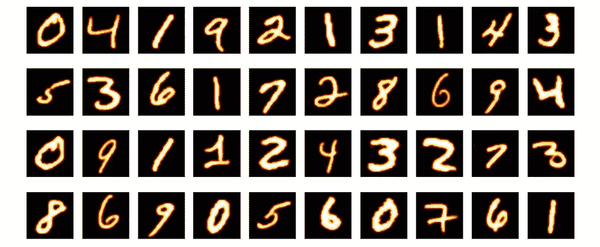
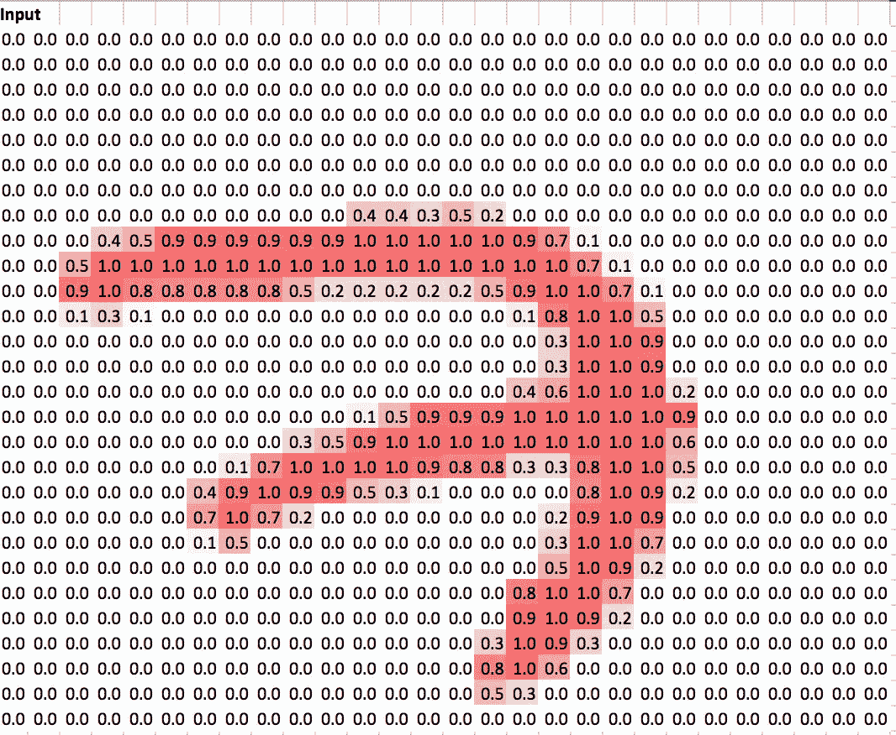
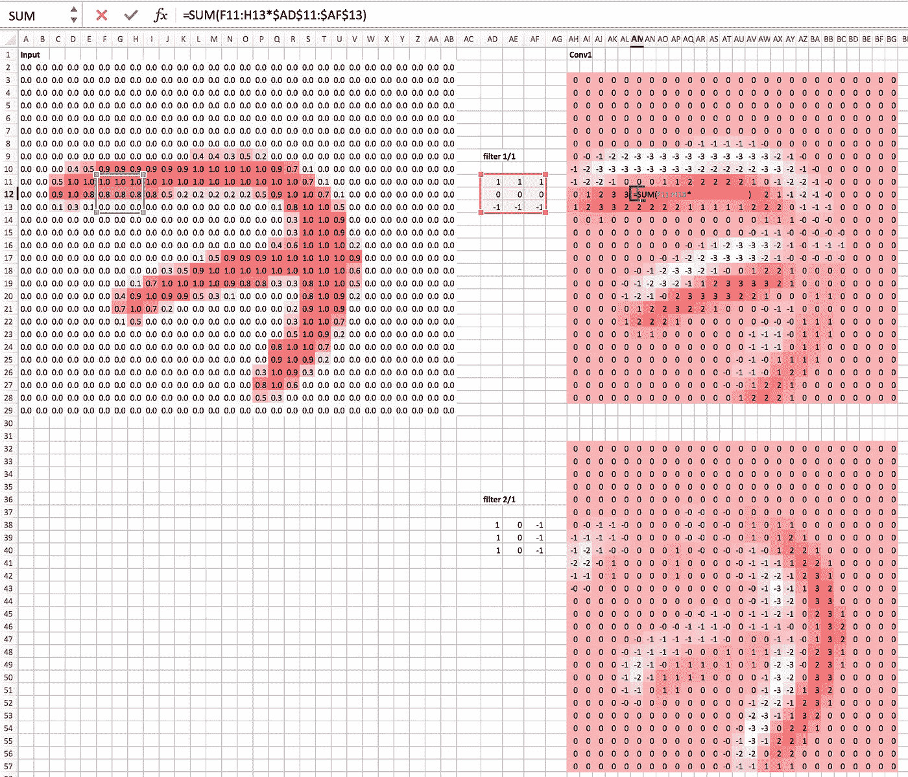
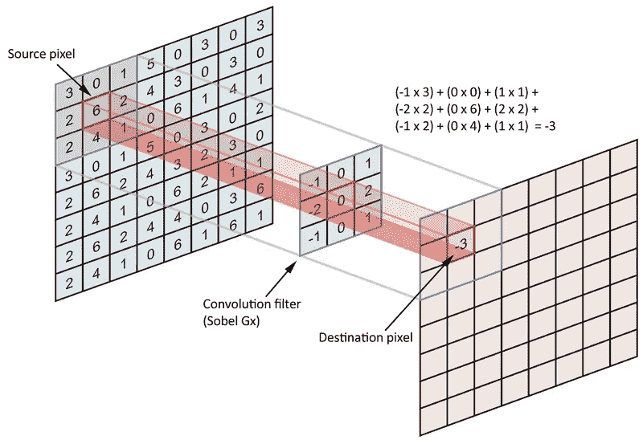
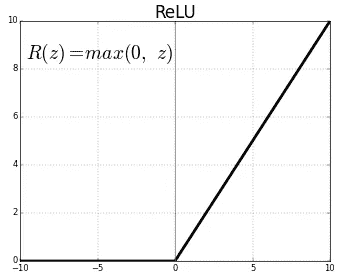
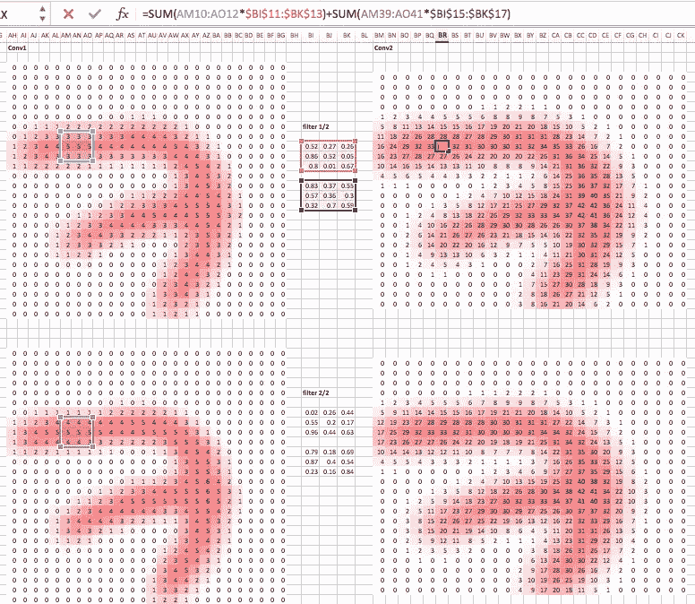
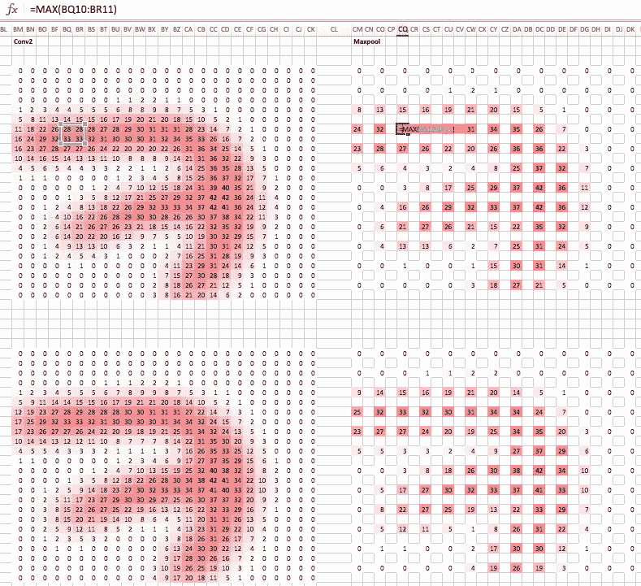
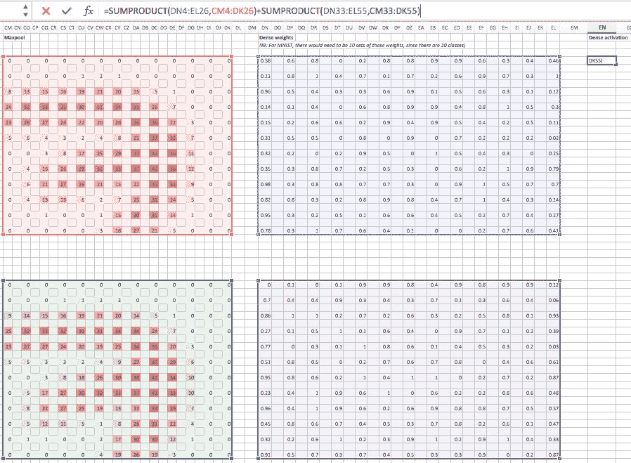

# 使用 Excel 了解神经网络

> 原文：<https://towardsdatascience.com/understanding-convolutions-using-excel-886ca0a964b7?source=collection_archive---------1----------------------->

## 熟悉深度学习的 TL: DR 方法

为了简化卷积神经网络的概念，我将尝试解释在开发您的深度学习模型时会发生什么。要了解更多信息，我建议在网上搜索，因为这里有大量的信息(比如这个[视频](https://www.youtube.com/watch?v=Oqm9vsf_hvU&feature=youtu.be))。这个解释来源于 [fast.ai](https://github.com/fastai/fastai/tree/master/courses/dl1/excel) 库。

这张简单神经网络的图片基本上代表了这个例子中发生的事情。

Simple Neural Network

## 输入层

7 号图像数据来自 [MNIST](http://yann.lecun.com/exdb/mnist/) 数据库，我们假设您使用[预训练模型](https://medium.com/p/dfdcaf559cba/edit)进行分类。

You can see the 7 by the larger numbers in the data

## 隐藏层 1

隐藏图层是对输入进行转换，以便从输出图层的数据中识别更复杂的要素，从而做出更好的评估。

两个过滤器将代表不同的形状-第一个过滤器设计用于检测水平边缘，第二个过滤器检测垂直边缘。这个 3x3 滤波器被称为[卷积核](http://setosa.io/ev/image-kernels/)。针对输入中的水平边缘激活滤波器 1。Conv1 显示了对输入的 3x3 部分进行处理并乘以卷积内核后两者的激活情况。下面的一张图给了你一个更好的想法。

*虽然这在 2d 数组中表示，但它们应该作为张量[堆叠在一起](https://en.wikipedia.org/wiki/Tensor)。其中每个矩阵代表张量中的一个切片。这些本质上都是正在发生的行操作([线性代数](/linear-algebra-cheat-sheet-for-deep-learning-cd67aba4526c))。

=SUM(F11:H13*$AD$11:$AF$13)是发生的卷积。

该求和将导致输入中特定 3×3 点的激活数为 3。

This this would represent a single layer.

## 激活功能

接下来，我们使用非线性单元，通过使用 [RELU](https://medium.com/the-theory-of-everything/understanding-activation-functions-in-neural-networks-9491262884e0) 作为我们的激活函数来消除负面影响。接下来我们可以看到底片在下一张图中消失了。

## **隐藏第二层**

接下来，我们做另一个卷积。Conv2 将是下一个隐藏层。这将对 Conv1 中的两个矩阵进行加权，取其和积。这里的卷积核将表示一个 2X3X3 张量。

使用 RELU 后，我们现在已经创建了我们的第二层。

Layer 1 and 2

## 最大池化

通过只取 Conv2 中 2x2 部分的最大值，Max pooling 将达到高度和宽度分辨率的一半。在 Maxpool 矩阵中，我们可以看到 Conv2 的 2x2 部分的最大值，即 33。池的计算速度比卷积快。同样，它给了你一些平移不变性。

## 输出层

接下来，我们通过在 Maxpool 中获取所有激活并给它们一个权重来构建我们的全连接层。这是通过做一个矩阵乘积来实现的。在 excel 中，我们将获取激活和权重的和积。因此，与之前解析卷积层中的每个部分不同，全连接层(密集层)将对卷积层提取并由最大池层缩减采样的特征执行分类。

这个例子只代表一个类，也就是一个数字。我们还得把剩下的数字分类。