# 了解 Scikit 中的数据科学分类指标-了解 Python

> 原文：<https://towardsdatascience.com/understanding-data-science-classification-metrics-in-scikit-learn-in-python-3bc336865019?source=collection_archive---------0----------------------->

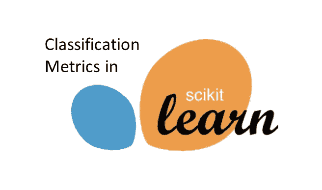

在本教程中，我们将浏览 Python 的 scikit 中的一些分类指标——从头开始学习并编写我们自己的函数，以理解其中一些函数背后的数学原理。

数据科学中预测建模的一个主要领域是分类。分类包括试图预测总体中某个特定样本来自哪个类别。例如，如果我们试图预测某个特定的患者是否会再次住院，两个可能的类别是住院(阳性)和未住院(阴性)。然后，分类模型会尝试预测每个患者是否会住院。换句话说，分类只是试图预测来自总体的特定样本应该放在哪个桶中(预测正对预测负),如下所示。

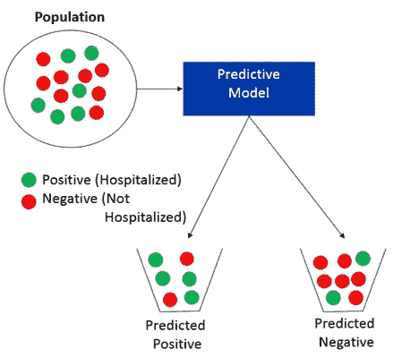

当您训练您的分类预测模型时，您会想要评估它有多好。有趣的是，有许多不同的方法来评估性能。大多数使用 Python 进行预测建模的数据科学家都使用名为 scikit-learn 的 Python 包。Scikit-learn 包含许多用于分析模型性能的内置函数。在本教程中，我们将遍历其中一些指标，并从头开始编写我们自己的函数，以理解其中一些指标背后的数学原理。如果你更喜欢阅读性能指标，请点击这里查看我在[的上一篇文章。](/data-science-performance-metrics-for-everyone-4d68f4859eef)

本教程将涵盖来自`sklearn.metrics`的以下指标:

*   困惑 _ 矩阵
*   准确性 _ 得分
*   回忆 _ 分数
*   精度分数
*   f1 _ 分数
*   roc _ 曲线
*   roc_auc_score

## G 开始了

关于样本数据集和 jupyter 笔记本，请访问我的 github [这里](https://github.com/andrewwlong/classification_metrics_sklearn)。假设有两个类，我们将从头开始编写自己的函数。请注意，您需要填写标记为`# your code here`的部分

让我们加载一个样本数据集，它具有实际标签(actual_label)和两个模型的预测概率(model_RF 和 model_LR)。这里的概率是第一类的概率。

```
import pandas as pd
df = pd.read_csv('data.csv')
df.head()
```

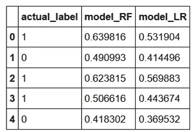

在大多数数据科学项目中，您将定义一个阈值来定义哪些预测概率被标记为预测正与预测负。现在让我们假设阈值是 0.5。让我们添加两个额外的列，将概率转换为预测标签。

```
thresh = 0.5
df['predicted_RF'] = (df.model_RF >= 0.5).astype('int')
df['predicted_LR'] = (df.model_LR >= 0.5).astype('int')
df.head()
```

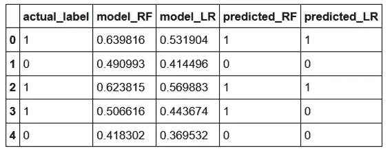

## 困惑 _ 矩阵

给定一个实际标签和一个预测标签，我们可以做的第一件事是将样本分成 4 个桶:

*   真正值-实际值= 1，预测值= 1
*   假阳性-实际= 0，预测= 1
*   假阴性-实际= 1，预测= 0
*   真负值-实际值= 0，预测值= 0

这些桶可以用下面的图像表示(原始源[https://en . Wikipedia . org/wiki/Precision _ and _ recall #/media/File:Precision recall . SVG](https://en.wikipedia.org/wiki/Precision_and_recall#/media/File:Precisionrecall.svg))，我们将在下面的许多计算中引用这个图像。

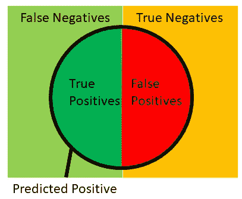

这些存储桶也可以使用如下所示的混淆矩阵来显示:


我们可以从 scikit-learn 获得混淆矩阵(作为 2x2 数组),它将实际标签和预测标签作为输入

```
from sklearn.metrics import confusion_matrixconfusion_matrix(df.actual_label.values, df.predicted_RF.values)
```

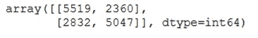

其中有 5047 个真阳性，2360 个假阳性，2832 个假阴性和 5519 个真阴性。让我们定义自己的函数来验证`confusion_matrix`。注意，第一个我填了，另外 3 个你需要填。

```
def find_TP(y_true, y_pred):
    # counts the number of true positives (y_true = 1, y_pred = 1)
    return sum((y_true == 1) & (y_pred == 1))
def find_FN(y_true, y_pred):
    # counts the number of false negatives (y_true = 1, y_pred = 0)
    return # your code here
def find_FP(y_true, y_pred):
    # counts the number of false positives (y_true = 0, y_pred = 1)
    return # your code here
def find_TN(y_true, y_pred):
    # counts the number of true negatives (y_true = 0, y_pred = 0)
    return # your code here
```

您可以检查您的结果是否与

```
print('TP:',find_TP(df.actual_label.values, df.predicted_RF.values))
print('FN:',find_FN(df.actual_label.values, df.predicted_RF.values))
print('FP:',find_FP(df.actual_label.values, df.predicted_RF.values))
print('TN:',find_TN(df.actual_label.values, df.predicted_RF.values))
```

让我们写一个函数来计算这四个参数，然后再写一个函数来复制`confusion_matrix`

```
import numpy as np
def find_conf_matrix_values(y_true,y_pred):
    # calculate TP, FN, FP, TN
    TP = find_TP(y_true,y_pred)
    FN = find_FN(y_true,y_pred)
    FP = find_FP(y_true,y_pred)
    TN = find_TN(y_true,y_pred)
    return TP,FN,FP,TN
def my_confusion_matrix(y_true, y_pred):
    TP,FN,FP,TN = find_conf_matrix_values(y_true,y_pred)
    return np.array([[TN,FP],[FN,TP]])
```

检查您的结果是否与匹配

```
my_confusion_matrix(df.actual_label.values, df.predicted_RF.values)
```

不要手动比较，让我们使用 Python 的内置`assert` 和 numpy 的`array_equal` 函数来验证我们的函数工作正常

```
assert  np.array_equal(my_confusion_matrix(df.actual_label.values, df.predicted_RF.values), confusion_matrix(df.actual_label.values, df.predicted_RF.values) ), 'my_confusion_matrix() is not correct for RF'assert  np.array_equal(my_confusion_matrix(df.actual_label.values, df.predicted_LR.values),confusion_matrix(df.actual_label.values, df.predicted_LR.values) ), 'my_confusion_matrix() is not correct for LR'
```

给定这四个桶(TP，FP，FN，TN)，我们可以计算许多其他性能指标。

## 准确性 _ 得分

最常见的分类指标是准确度，即预测正确的样本比例，如下所示:

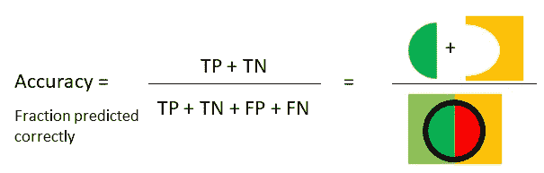

我们可以从 scikit-learn 获得准确度分数，它将实际标签和预测标签作为输入

```
from sklearn.metrics import accuracy_scoreaccuracy_score(df.actual_label.values, df.predicted_RF.values)
```

你的答案应该是 0。38660 . 68868686861

使用上面的公式，定义你自己的复制`accuracy_score`的函数。

```
def my_accuracy_score(y_true, y_pred):
    # calculates the fraction of samples predicted correctly
    TP,FN,FP,TN = find_conf_matrix_values(y_true,y_pred)  
    return # your code hereassert my_accuracy_score(df.actual_label.values, df.predicted_RF.values) == accuracy_score(df.actual_label.values, df.predicted_RF.values), 'my_accuracy_score failed on RF'
assert my_accuracy_score(df.actual_label.values, df.predicted_LR.values) == accuracy_score(df.actual_label.values, df.predicted_LR.values), 'my_accuracy_score failed on LR'
print('Accuracy RF: %.3f'%(my_accuracy_score(df.actual_label.values, df.predicted_RF.values)))
print('Accuracy LR: %.3f'%(my_accuracy_score(df.actual_label.values, df.predicted_LR.values)))
```

使用精确度作为性能度量，RF 模型比 LR 模型(0.62)更精确(0.67)。那么我们是否应该就此打住，说 RF 模型是最好的模型呢？不要！准确性并不总是评估分类模型的最佳指标。例如，假设我们试图预测一件 100 次中只有 1 次发生的事情。我们可以建立一个模型，通过说事件从未发生，获得 99%的准确性。然而，我们抓住了 0%我们关心的事件。这里的 0%度量是另一个称为召回的性能度量。

## 回忆 _ 分数

回忆(也称为敏感度)是您正确预测的阳性事件的比例，如下所示:

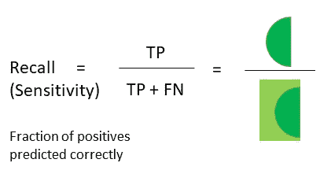

我们可以从 scikit-learn 获得准确度分数，它将实际标签和预测标签作为输入

```
from sklearn.metrics import recall_scorerecall_score(df.actual_label.values, df.predicted_RF.values)
```

使用上面的公式定义您自己的复制`recall_score`的函数。

```
def my_recall_score(y_true, y_pred):
    # calculates the fraction of positive samples predicted correctly
    TP,FN,FP,TN = find_conf_matrix_values(y_true,y_pred)  
    return # your code hereassert my_recall_score(df.actual_label.values, df.predicted_RF.values) == recall_score(df.actual_label.values, df.predicted_RF.values), 'my_accuracy_score failed on RF'
assert my_recall_score(df.actual_label.values, df.predicted_LR.values) == recall_score(df.actual_label.values, df.predicted_LR.values), 'my_accuracy_score failed on LR'
print('Recall RF: %.3f'%(my_recall_score(df.actual_label.values, df.predicted_RF.values)))
print('Recall LR: %.3f'%(my_recall_score(df.actual_label.values, df.predicted_LR.values)))
```

提高召回率的一种方法是通过降低预测阳性的阈值来增加您定义为预测阳性的样本数量。不幸的是，这也会增加误报的数量。另一个称为精度的性能指标考虑到了这一点。

## 精度分数

精度是预测的阳性事件中实际为阳性的部分，如下所示:

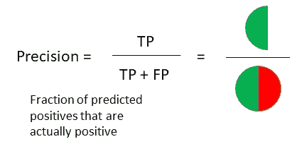

我们可以从 scikit-learn 获得准确度分数，它将实际标签和预测标签作为输入

```
from sklearn.metrics import precision_scoreprecision_score(df.actual_label.values, df.predicted_RF.values)
```

使用上面的公式，定义您自己的复制`precision_score`的函数。

```
def my_precision_score(y_true, y_pred):
    # calculates the fraction of predicted positives samples that are actually positive
    TP,FN,FP,TN = find_conf_matrix_values(y_true,y_pred)  
    return # your code hereassert my_precision_score(df.actual_label.values, df.predicted_RF.values) == precision_score(df.actual_label.values, df.predicted_RF.values), 'my_accuracy_score failed on RF'
assert my_precision_score(df.actual_label.values, df.predicted_LR.values) == precision_score(df.actual_label.values, df.predicted_LR.values), 'my_accuracy_score failed on LR'
print('Precision RF: %.3f'%(my_precision_score(df.actual_label.values, df.predicted_RF.values)))
print('Precision LR: %.3f'%(my_precision_score(df.actual_label.values, df.predicted_LR.values)))
```

在这种情况下，看起来 RF 模型在召回率和精确度上都更好。但是，如果一个模型更擅长回忆，而另一个模型更擅长精确，你会怎么做。一些数据科学家使用的一种方法叫做 F1 分数。

## f1 _ 分数

f1 分数是召回率和精确度的调和平均值，分数越高，模型越好。f1 分数使用以下公式计算:

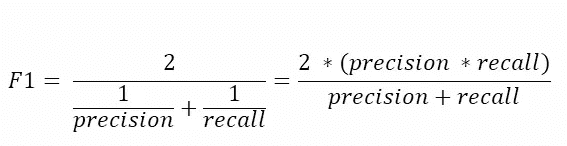

我们可以从 scikit-learn 获得 f1 分数，它将实际标签和预测标签作为输入

```
from sklearn.metrics import f1_scoref1_score(df.actual_label.values, df.predicted_RF.values)
```

使用上面的公式，定义您自己的复制`f1_score`的函数。

```
def my_f1_score(y_true, y_pred):
    # calculates the F1 score
    recall = my_recall_score(y_true,y_pred)  
    precision = my_precision_score(y_true,y_pred)  
    return # your code hereassert my_f1_score(df.actual_label.values, df.predicted_RF.values) == f1_score(df.actual_label.values, df.predicted_RF.values), 'my_accuracy_score failed on RF'
assert my_f1_score(df.actual_label.values, df.predicted_LR.values) == f1_score(df.actual_label.values, df.predicted_LR.values), 'my_accuracy_score failed on LR'
print('F1 RF: %.3f'%(my_f1_score(df.actual_label.values, df.predicted_RF.values)))
print('F1 LR: %.3f'%(my_f1_score(df.actual_label.values, df.predicted_LR.values)))
```

到目前为止，我们假设我们定义了 0.5 的阈值来选择哪些样本被预测为阳性。如果我们改变这个阈值，性能指标将会改变。如下图所示:

```
print('scores with threshold = 0.5')
print('Accuracy RF: %.3f'%(my_accuracy_score(df.actual_label.values, df.predicted_RF.values)))
print('Recall RF: %.3f'%(my_recall_score(df.actual_label.values, df.predicted_RF.values)))
print('Precision RF: %.3f'%(my_precision_score(df.actual_label.values, df.predicted_RF.values)))
print('F1 RF: %.3f'%(my_f1_score(df.actual_label.values, df.predicted_RF.values)))
print(' ')
print('scores with threshold = 0.25')
print('Accuracy RF: %.3f'%(my_accuracy_score(df.actual_label.values, (df.model_RF >= 0.25).astype('int').values)))
print('Recall RF: %.3f'%(my_recall_score(df.actual_label.values, (df.model_RF >= 0.25).astype('int').values)))
print('Precision RF: %.3f'%(my_precision_score(df.actual_label.values, (df.model_RF >= 0.25).astype('int').values)))
print('F1 RF: %.3f'%(my_f1_score(df.actual_label.values, (df.model_RF >= 0.25).astype('int').values)))
```

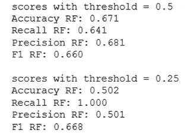

如果我们没有选择阈值，我们如何评估一个模型？一种非常常用的方法是使用受试者工作特性(ROC)曲线。

## roc 曲线和 roc AUC 分数

ROC 曲线非常有助于理解真阳性率和假阳性率之间的平衡。Sci-kit learn 内置了 ROC 曲线和分析这些曲线的功能。这些函数(`roc_curve`和`roc_auc_score`)的输入是实际标签和预测概率(不是预测标签)。`roc_curve`和`roc_auc_score`都是复杂的函数，所以我们不会让你从头开始写这些函数。相反，我们将向您展示如何使用 sci-kit learn 的功能，并解释其中的关键点。让我们从使用`roc_curve`制作 ROC 图开始。

```
from sklearn.metrics import roc_curvefpr_RF, tpr_RF, thresholds_RF = roc_curve(df.actual_label.values, df.model_RF.values)
fpr_LR, tpr_LR, thresholds_LR = roc_curve(df.actual_label.values, df.model_LR.values)
```

`roc_curve`函数返回三个列表:

*   阈值=按降序排列的所有唯一预测概率
*   fpr =每个阈值的假阳性率(FP / (FP + TN))
*   tpr =每个阈值的真实阳性率(TP / (TP + FN))

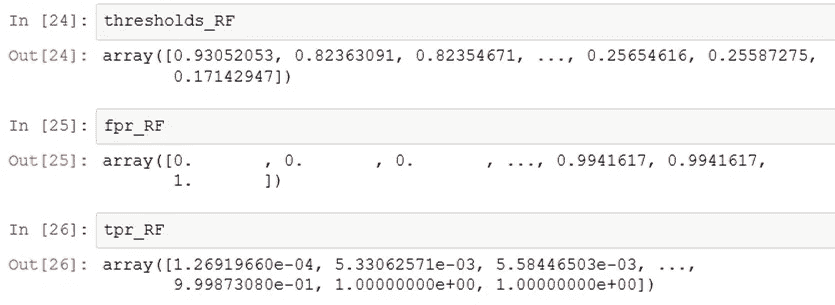

我们可以为每个模型绘制 ROC 曲线，如下所示。

```
import matplotlib.pyplot as pltplt.plot(fpr_RF, tpr_RF,'r-',label = 'RF')
plt.plot(fpr_LR,tpr_LR,'b-', label= 'LR')
plt.plot([0,1],[0,1],'k-',label='random')
plt.plot([0,0,1,1],[0,1,1,1],'g-',label='perfect')
plt.legend()
plt.xlabel('False Positive Rate')
plt.ylabel('True Positive Rate')
plt.show()
```

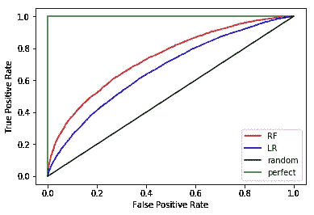

从这个图中我们可以观察到一些东西:

*   随机猜测标签的模型将导致黑线，并且您希望有一个在这条黑线上方有曲线的模型
*   离黑线越远的 ROC 越好，所以 RF(红色)比 LR(蓝色)好看
*   虽然不能直接看到，但高阈值会在左下角产生一个点，低阈值会在右上角产生一个点。这意味着，随着门槛的降低，你会以更高的 FPR 为代价获得更高的 TPR

为了分析性能，我们将使用曲线下面积指标。

```
from sklearn.metrics import roc_auc_scoreauc_RF = roc_auc_score(df.actual_label.values, df.model_RF.values)
auc_LR = roc_auc_score(df.actual_label.values, df.model_LR.values)print('AUC RF:%.3f'% auc_RF)
print('AUC LR:%.3f'% auc_LR)
```

如您所见，RF 模型的曲线下面积(AUC = 0.738)优于 LR (AUC = 0.666)。当我绘制 ROC 曲线时，我喜欢将 AUC 添加到图例中，如下所示。

```
import matplotlib.pyplot as plt
plt.plot(fpr_RF, tpr_RF,'r-',label = 'RF AUC: %.3f'%auc_RF)
plt.plot(fpr_LR,tpr_LR,'b-', label= 'LR AUC: %.3f'%auc_LR)
plt.plot([0,1],[0,1],'k-',label='random')
plt.plot([0,0,1,1],[0,1,1,1],'g-',label='perfect')
plt.legend()
plt.xlabel('False Positive Rate')
plt.ylabel('True Positive Rate')
plt.show()
```

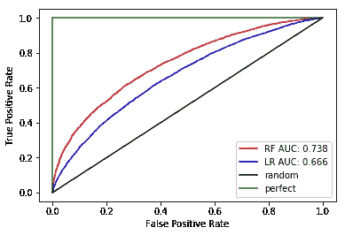

总体而言，在这个玩具示例中，RF 型号在所有性能指标上都胜出。

## 结论

在预测分析中，在两个模型之间做出决定时，选择一个性能指标非常重要。正如您在这里看到的，有许多选项可供选择(准确度、召回率、精确度、f1 分数、AUC 等)。最终，您应该使用最适合当前业务问题的性能指标。许多数据科学家更喜欢使用 AUC 来分析每个模型的性能，因为它不需要选择阈值，有助于平衡真阳性率和假阳性率。

如果您对如何改进本教程有任何建议，请留下您的评论。