# 理解描述性统计

> 原文：<https://towardsdatascience.com/understanding-descriptive-statistics-c9c2b0641291?source=collection_archive---------0----------------------->

Descriptive Statistics [Image 1] (Image courtesy: My Photoshopped Collection)

统计学是数学的一个分支，处理数据的收集、解释、组织和解释。

最初，当我们获得数据时，我们不是应用花哨的算法并做出一些预测，而是首先尝试通过应用统计技术来阅读和理解数据。通过这样做，我们能够了解数据的分布类型。

**本博客旨在回答以下问题**:

1.什么是描述性统计？

2.描述性统计的类型？

3.集中趋势的度量(平均值、中值、众数)

4.扩散/分散的度量(标准偏差、平均偏差、方差、百分位数、四分位数、四分位数间距)

5.什么是偏斜度？

6.什么是峰度？

7.什么是相关性？

今天，让我们一劳永逸地了解一下描述性统计。我们开始吧，

# 什么是描述性 S **统计学？**

描述性统计包括总结和组织数据，以便于理解。与推断统计学不同，描述统计学试图描述数据，但并不试图从样本中推断出总体。这里，我们通常描述样本中的数据。这通常意味着描述统计学不同于推断统计学，它不是在概率论的基础上发展起来的。

# **描述性统计的类型？**

描述性统计分为两类。集中趋势的度量和可变性(传播)的度量。

# **集中趋势的度量**

集中趋势是指有一个数字可以最好地概括整个测量集合，这个数字在某种程度上是集合的“中心”。

## **平均值/平均值**

平均值是数据的中心趋势，即一个数字，整个数据围绕这个数字展开。在某种程度上，它是一个单一的数字，可以估计整个数据集的价值。

让我们计算有 8 个整数的数据集的平均值。

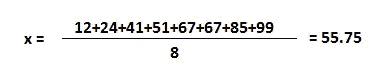

Image 2

## **中位数**

中位数是将数据分成两个相等部分的值，即当数据按**升序或降序**排列时，其右侧的项数与左侧的项数相同。

**注意**:如果你按降序排列数据，不会影响中位数，但 IQR 会是负数。我们将在本博客稍后讨论 IQR。

如果项数是奇数，中值将是中间项

如果若干项是偶数，则中值将是中间两项的平均值。

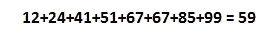

Image 3

中位数是 59，它将一组数字分成相等的两部分。由于集合中有偶数，所以答案是中间数 51 和 67 的平均值。

**注:**当值为等差数列时(连续项之间的差为常数。这是 2 英镑。)，则**中值总是等于平均值**。

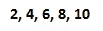

Image 4

这 5 个数字的平均数是 6，所以是中位数。

## **模式**

众数是在数据集中出现次数最多的词，即出现频率最高的词。

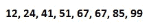

Image 5

在这个数据集中，模式是 67，因为它比其余的值多，即两倍。

但是可能有一个数据集根本没有模式，因为所有的值都出现相同的次数。如果两个值同时出现并且多于其余的值，则数据集为**双峰**。如果三个值同时出现并且多于其余值，则数据集为**三模态**，对于 n 个模式，数据集为**多模态**。

# 扩散/分散的度量

分布的度量指的是数据内部的可变性。

## **标准偏差**

标准差是每个数量和平均值之间的平均距离的度量。也就是说，数据是如何从平均值展开的。低标准偏差表示数据点倾向于接近数据集的平均值，而高标准偏差表示数据点分布在更宽的值范围内。

有些情况下，我们必须在样本或总体标准差之间做出选择。

当我们被要求找出人口的某一部分，人口的一部分的标准差时；然后我们用样本标准差。

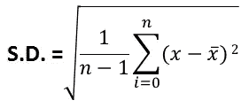

Image 6

其中 x̅是样本的平均值。

但是当我们必须处理整个人口时，我们使用人口标准差。

Image 7

其中是总体均值。

虽然样本是总体的一部分，但它们的标准差公式应该是相同的，但事实并非如此。要了解更多信息，请参考此[链接](https://math.stackexchange.com/questions/15098/sample-standard-deviation-vs-population-standard-deviation?utm_medium=organic&utm_source=google_rich_qa&utm_campaign=google_rich_qa)

众所周知，在描述统计学中，我们通常处理样本中的数据，而不是总体中的数据。因此，如果我们使用以前的数据集，并替换示例公式中的值，

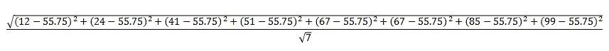

Image 8

答案是 29.62。

## **平均偏差/平均绝对偏差**

它是一组值中每个值之间的绝对差值的平均值，也是该组中所有值的平均值。

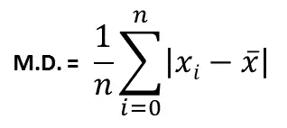

Mean Deviation [Image 9] (Image courtesy: [M](http://cathjayasuriya.blogspot.sg/2011/02/learning-from-ants.html)y Photoshopped Collection)

所以如果我们使用之前的数据集，并替换这些值，

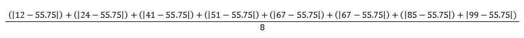

Image 10

答案是 23.75。

## **差异**

方差是每个数量和平均值之间平均距离的平方。也就是说它是标准差的平方。

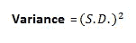

Image 11

答案是 877.34。

## **范围**

范围是描述统计学中最简单的技术之一。它是最低值和最高值之差。

Image 12

范围是 99–12 = 87

## **百分位数**

百分位数是一种表示数据集中数值位置的方法。要计算百分位数，数据集中的值应该始终按升序排列。

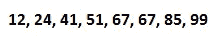

Image 13

中位数 59 在 8 个值中有 4 个值比它本身小。也可以这么说:在数据集中，59 是第 50 百分位，因为总项的 50%小于 59。一般情况下，如果 **k** 为**第 n 个**百分位，则暗示总项数的 **n%** 小于 **k** 。

## **四分位数**

在统计和概率中，四分位数是将数据分成四个部分的值，前提是数据按**升序排序。**

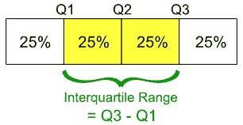

Quartiles [Image 14] (Image courtesy: [https://statsmethods.wordpress.com/2013/05/09/iqr/](https://statsmethods.wordpress.com/2013/05/09/iqr/))

有三个四分位值。第一个四分位值在 25 个百分点。第二个四分位数是 50 个百分点，第三个四分位数是 75 个百分点。第二个四分位数(Q2)是整个数据的中位数。第一个四分位数(Q1)是数据上半部分的中位数。第三个四分位数(Q3)是数据下半部分的中间值。

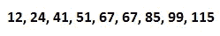

所以在这里，通过类比，

Q2 = 67:是整个数据的 50%并且是中间值。

Q1 = 41:是数据的 25 个百分点。

Q3 = 85:是日期的 75%。

**四分位距(IQR)** = Q3 - Q1 = 85 - 41 = 44

**注:**如果按降序排列数据，IQR 将为 **-44** 。大小相同，只是符号不同。如果你的数据是降序排列的，那么负 IQR 是可以的。只是我们从较大的值中否定较小的值，我们更喜欢升序排列(Q3 - Q1)。

# **偏斜度**

偏斜度是实值随机变量关于其均值的概率分布的不对称性的度量。偏斜值可以是正的或负的，也可以是未定义的。

在完美的正态分布中，曲线两边的尾部是彼此的镜像。

当分布向左倾斜时，曲线左侧的尾部比右侧的尾部长，并且平均值小于众数。这种情况也叫负偏度。

当分布向右倾斜时，曲线右侧的尾部比左侧的尾部长，均值大于众数。这种情况也叫正偏度。

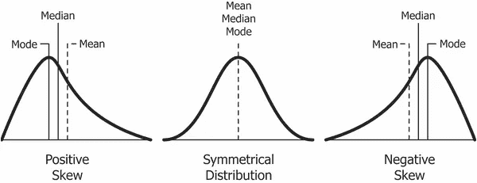

Skewness [Image 16] (Image courtesy: [https://www.safaribooksonline.com/library/view/clojure-for-data/9781784397180/ch01s13.html](https://www.safaribooksonline.com/library/view/clojure-for-data/9781784397180/ch01s13.html))

**偏度系数如何确定？**

要计算样本的偏态系数，有两种方法:

1]皮尔逊第一偏度系数(众数偏度)

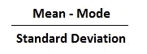

Image 17

2]皮尔逊第二偏度系数(中位数偏度)

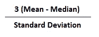

Image 18

*释义*

*   偏斜的方向由符号给出。零表示完全没有偏斜。
*   负值意味着分布是负偏态的。正值意味着分布是正偏的。
*   该系数将样本分布与正态分布进行比较。该值越大，分布与正态分布的差异就越大。

示例问题:使用皮尔逊系数#1 和#2 来找出具有以下特征的数据的偏斜度:

*   平均值= 50。
*   中位数= 56。
*   模式= 60。
*   标准偏差= 8.5。

皮尔逊第一偏度系数:-1.17。

皮尔逊第二偏度系数:-2.117。

**注**:皮尔逊的第一个偏度系数使用了模式。因此，如果值的频率非常低，那么它不会给出集中趋势的稳定度量。例如，这两组数据中的模式都是 9:

1, 2, 3, 4, 4, 5, 6, 7, 8, 9.

在第一组数据中，该模式只出现了两次。因此，使用皮尔逊的第一偏斜系数并不是一个好主意。但是在第二盘，

1, 2, 3, 4, 4, 4, 4, 4, 4, 4, 4, 5, 6, 7, 8, 9, 10, 12, 12, 13.

模式 4 出现 8 次。因此，皮尔逊的第二偏度系数将可能给你一个合理的结果。

# 峭度

峰度测量的确切解释过去一直有争议，但现在已经确定了。是关于离群值的存在。峰度是数据相对于正态分布是重尾(大量异常值)还是轻尾(缺少异常值)的度量。

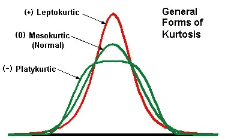

Kurtosis [Image 19] (Image courtesy: [https://mvpprograms.com/help/mvpstats/distributions/SkewnessKurtosis](https://mvpprograms.com/help/mvpstats/distributions/SkewnessKurtosis))

峰度有三种类型

**中层大气**

中间峭度是具有与正态分布峭度相似的峭度的分布，正态分布峭度为零。

**薄谷开来**

分布是峰度大于中峰度分布的分布。这种分布的尾部又厚又重。如果分布曲线比中峰曲线更尖，则称之为细峰曲线。

**鸭嘴兽**

分布是峰度小于中峰度分布的分布。这种分布的尾部更薄。如果一条分布曲线的峰值小于一条中 kurtic 曲线，则称之为 Platykurtic 曲线。

> 偏度和峰度**之间的主要**差异在于，偏度指的是对称程度，而峰度指的是**分布中异常值**的存在程度。****

# 相互关系

相关性是一种统计技术，可以显示变量对是否相关以及相关程度如何。

Correlation [Image 20] (Image courtesy: [http://www.statisticshowto.com/what-is-correlation/](http://www.statisticshowto.com/what-is-correlation/))

相关的主要结果称为**相关系数**(或“r”)。范围从-1.0 到+1.0。r 越接近+1 或-1，这两个变量的关系就越密切。

如果 r 接近 0，说明变量之间没有关系。如果 r 为正，这意味着随着一个变量变大，另一个也变大。如果 r 为负，这意味着一个变大，另一个变小(通常称为“逆”相关)。

我希望我已经让你对什么是描述性统计有了一些了解。这是一些基本统计技术的基本运行，可以帮助您从长远角度理解数据科学。

感谢阅读。

如果你喜欢这篇文章，给这篇文章一些掌声会对你有所帮助👏。我随时欢迎你的问题和建议。你可以在脸书、推特、Linkedin 上分享这个，这样有需要的人可能会偶然发现这个。

您可以通过以下方式联系到我:

领英:[https://www.linkedin.com/in/narkhedesarang/](https://www.linkedin.com/in/narkhedesarang/)

推特:【https://twitter.com/narkhede_sarang 

github:【https://github.com/TheSarang 